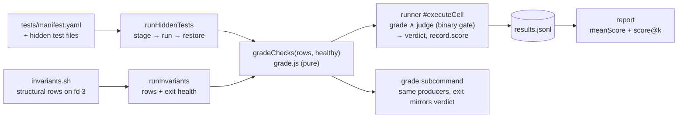

# Design 2240-a — Scored Benchmark Tasks

Implements spec 2240. Check rows are the single authoritative grading
channel, with two producers kept structurally apart: a **hidden-test engine**
in libharness executes a declarative per-task manifest (stage each hidden
test into the agent CWD, run it, one row per test, restore the tree), and
the **invariants script** shrinks to structural checks emitted as rows. A
pure derivation turns the merged rows plus grader health into a verdict and
a score in [0, 1]; an unhealthy grader can never mint marks. Clean break:
every hook in `benchmarks/` and the test fixtures migrates in this change.

## Architecture



Grading is one pure function with two callers (runner, `grade` subcommand);
records are self-describing — `report` never re-derives scores from details.

## The row contract (normative)

Single home for row and grading semantics; components reference, not
restate. Every row is a check by default. Roles, checked in order:

1. **Diagnostic** — `weight` is exactly `0`. Free-form; never graded.
2. **Gate** — `gate` is exactly `true` and no positive `weight` is present.
   Requires a boolean `pass`. Any failing gate → `gatesPass` false.
3. **Scored** — everything else. `weight` must be absent (defaults to 1) or a
   finite number > 0; `pass` must be a boolean.
   `score = Σ weight(passing) / Σ weight(all scored)`.
4. **Malformed** — a row that fits no role: missing or non-boolean `pass` on
   a graded row, non-boolean `gate`, invalid `weight`, `gate: true` alongside
   a positive `weight`, or an fd-3 line that fails to parse as JSON. Counts
   as a **failing scored check** (own weight when valid and positive, else
   unit weight 1) and increments `malformed`: dropping a defect could mint
   full marks; failing the whole run would zero completed work.

The runner stamps each row's provenance (`source: "tests" | "invariants"`)
before grading — display metadata, never a grading input.

Derived predicates:

- `healthy` — the invariants script exited 0 AND the hidden-test engine did
  not throw. Unhealthy → verdict `fail`, score 0, whatever the rows say.
- `fullMarks` — integer count predicate: `malformed === 0` and every scored
  check passes. Never a float comparison, so fractional weights carry no
  equality hazard. Zero scored checks → binary task; `score` is `null` and
  no `score` field appears anywhere.
- **Grade verdict** = `healthy ∧ gatesPass ∧ fullMarks` (vacuously true parts
  when no gate or scored rows exist — a row-less healthy cell still passes,
  preserving today's no-op-hook behavior).
- **Effective record score** (scored tasks only) =
  `healthy ∧ gatesPass ∧ judgePass ? score : 0`. Full marks does not zero
  it — a fractional score with verdict `fail` is the point.
- Invariants hooks never manage exit codes for checks; they end `exit 0`
  unconditionally. Early `exit 0` after a failing gate row is the documented
  dependency pattern.

## The hidden test suite (normative)

A task opts in with `tasks/<task>/tests/` — a sibling of `hooks/`, never
copied into the agent CWD (only `workdir/` and `specs/` seed the CWD).

```yaml
# tests/manifest.yaml
command: ["node", "--test"]   # required argv prefix; the staged path is appended
cwd: app                      # optional (default "."): command CWD, relative to agent CWD
target: test                  # optional (default "."): staging dir, relative to cwd
timeout: 120                  # optional per-check seconds; a timeout is a failing row
support: [feature-helpers.js] # optional: staged for the whole pass, never graded
checks:                       # required, ≥ 1; fields mirror the row contract
  - file: todo.test.js        # relative to tests/; symlinks resolved at stage time
    name: baseline-tests      # optional; defaults to the file stem
    gate: true
  - file: filter-case-insensitive.test.js   # default: scored at weight 1
```

Validated eagerly in `loadTaskFamily` (authoring errors fail before agent
spend): parseable YAML, non-empty `command` and `checks`, every `file` and
`support` entry a regular file under `tests/`, `gate` xor positive `weight`
per check, no `..` in `cwd`/`target`/`file`.

Engine execution, per check in manifest order: back up a collided target
file → copy the (symlink-resolved) file to `<cwd>/<target>/<file>` → spawn
`command + [<target>/<file>]` in `<AGENT_CWD>/<cwd>` under `buildHookEnv` →
emit `{test, pass: exit === 0, gate?/weight?, message?}` (message carries the
exit status and a trimmed stderr tail on failure) → unstage and restore.
`support` files stage before the first check and unstage after the last. A
stage or spawn failure (e.g. the agent never created `app/`) is a *failing*
row — agent fault, not grader fault; the engine itself throwing is grader
fault and lands in `healthy`. Restoration means the judge sees the workdir
exactly as the agent left it.

## Components

| Component | Where | Responsibility |
| --- | --- | --- |
| Manifest discovery + validation | `benchmark/task-family.js` | `paths.tests` + parsed manifest on the Task when `tests/manifest.yaml` exists; eager validation per § hidden suite. Adds the `yaml` dependency (zod for the shape). |
| Hidden-test engine | new `benchmark/hidden-tests.js` | `runHiddenTests(task, ctx, runtime)` → `{details}` per § hidden suite; `{details: []}` when the task has no suite. |
| Invariants collector | `benchmark/invariants.js` | Loses its verdict: returns `{details, exitCode, stderr?}`. Unparseable fd-3 lines stay in `details` as `parseError` rows and grade as malformed. |
| Grading | new `benchmark/grade.js` | Pure `gradeChecks(details, healthy)` → `{verdict, gatesPass, score, fullMarks, malformed}` (`score` null for binary). Sole home of the arithmetic. |
| Cell composition | `benchmark/runner.js` `#executeCell` | Order: agent → invariants collector → hidden-test engine → stamp provenance, merge rows, grade → judge. Cell verdict `grade.verdict ∧ judge`; effective score per § contract; `malformedChecks` when > 0. Preflight-failure records never reach grading and stay score-free (zeros realize in aggregation). |
| Record schema | `benchmark/result.js` | `invariants` shape drops `verdict`; new `grade: {verdict, gatesPass, score?, malformed?}` — schema-optional so pre-break ledgers still render, though the runner always writes it; optional `hiddenTests: {details}` (present iff the task has a suite); optional top-level `score` (0–1) and `malformedChecks` (≥ 1); preflight branch pins them `undefined`. |
| Judge templating | `benchmark/judge.js` | `{{GRADE_RESULT}}` — grade object + merged rows — replaces `{{INVARIANTS_RESULT}}`. |
| `grade` subcommand | `commands/benchmark-grade.js` (replaces `benchmark-invariants.js`) | Runs both producers against `--run-dir` with the same derivation; process exits 0 iff `grade.verdict === "pass"` (no judge here; judge-zeroing does not apply). |
| Report | `benchmark/report.js` | Group scored iff ≥ 1 record carries `score`; per scored task `meanScore` + `scoreAtK[k]` (§ Estimator); a score-less record in a scored group contributes its verdict as the degenerate score (pass = 1, fail = 0). Rendering: score and `score@k` columns only when the report has a scored task (binary rows render `—`); the checks table merges both producers with a Source column when any row carries `source: "tests"`; `malformedChecks` renders a warning. |
| `fit-trace assert --gate/--weight` | `commands/assert.js` + `bin/fit-trace.js` | `--weight` validates finite ≥ 0; `--gate` adds `gate: true`; combining with a positive weight is an error. **Emit-then-fail:** an invalid grading flag emits a failing row before the nonzero exit, so a typo shrinks the score, never the denominator. |
| Hook migration | `benchmarks/*/tasks/*/hooks/invariants.sh`, libharness fixtures | § Migration. One helper — `check() { fit-trace assert "$@" >&"$RESULTS_FD" \|\| true; }` — structural checks only, `exit 0` at the end. |
| Leading example | `benchmarks/kata-skills/tasks/implement-feature/tests/` | Manifest: pristine baseline as the gate check (a symlink to the family workdir suite kills the drift pair), five per-file feature checks scored at weight 1, shared helpers as `support`. `invariants.sh` and `hooks/feature.test.js` deleted; `preflight.sh` and the scope judge unchanged. |
| Docs | `fit-benchmark` SKILL.md, `references/{authoring,cli}.md`, Run a Benchmark guide, `benchmarks/README.md` | Rows-authoritative contract, roles table, exit-code demotion, `tests/` manifest layout, hidden-test-vs-structural-check guidance. |

## Key Decisions

| Decision | Choice | Rejected alternative |
| --- | --- | --- |
| Grading channel | Single: the rows, with roles as row fields | Dual channel (weights beside an authoritative exit code): semantics split across a data and a process channel, coupled by a documentation-only contract where one wrong helper zeroes every partial run. |
| Hidden-test execution | Harness engine driven by a declarative manifest | Hook-authored shell (status quo and this design's first draft): every coding task re-implements staging, execution, exit-code plumbing, and pristine-baseline restoration; tangles structural and behavioral checking in one script; each copy can silently mis-grade. |
| Suite location | `tests/` sibling of `hooks/` | Inside `hooks/` — conflates executable hook scripts with data files. Inside `workdir/` — would seed into the agent CWD and leak the suite. |
| Check granularity | One process per manifest check; the exit status is the row | Parsing one suite's reporter output (TAP) — couples the engine to reporter formats; per-case granularity is expressed as per-case files instead. |
| Workdir restoration | Engine backs up collisions, unstages after grading | Leaving staged files — the judge sees non-agent files and may flag them as scope creep (the prior draft's open risk, now closed structurally). |
| Manifest validation timing | Eager, in `loadTaskFamily` | At grade time — an authoring typo burns a full agent run before surfacing. |
| Exit code / engine health | Demoted to grader health: unhealthy → fail, score 0 | Ignored entirely — a grader that crashes after one passing row would score 1.0; health is the one completion signal a crash cannot fake. |
| Default weight | Absent `weight` = scored at 1; diagnostics opt out with `weight: 0` | Opt-in weights — leaves most emitted evidence ungraded and requires the dual-channel contract to gate anything. |
| Where the score is computed | At record time, one pure function | At report time from `details` — every consumer re-implements weighting; ledgers stop being self-describing. |
| Verdict for scored cells | `pass` requires health ∧ gates ∧ full marks ∧ judge | Gates-only verdict — pass@k saturates on partially-solved tasks and `run`'s exit code goes green on partial capability. |
| Score-less records in a scored group | Degenerate verdict score: pass = 1, fail = 0 | Skipping them inflates the mean exactly when the agent fails hardest. |
| Best-of-k statistic | Exact expected-max via order statistics (§ Estimator) | Mean only hides best-case capability; Monte Carlo is nondeterministic for the same ledger. |
| Subcommand | `invariants` becomes `grade`, running both producers | Keeping the name — it would either lie about scope or leave the primary grading path (the hidden suite) unvalidatable without an agent run. |
| Compatibility | None: clean break, all hooks and judge templates migrate in-change | A shim honoring exit-code verdicts — permanent dual semantics for nine hooks and four fixtures we own. |

## Estimator

`scoreAtK` generalizes pass@k to values in [0, 1]: the expected **maximum**
score over k runs drawn without replacement from the task's n runs. With
scores sorted ascending `s₍₁₎ … s₍ₙ₎`:

```text
score@k = Σ_{i=k..n}  s₍ᵢ₎ · C(i−1, k−1) / C(n, k)
```

Each term weights `s₍ᵢ₎` by the probability it is the k-subset's maximum.
Binary scores reduce exactly to HumanEval pass@k, computed with the same
BigInt binomial helper; `k > n` yields the same `{error: "k > n"}` value, so
the two estimators expose one idiom.

## Interfaces

```js
// benchmark/grade.js — pure; sole home of the arithmetic
gradeChecks(details, healthy)
// → {verdict, gatesPass, score: number|null, fullMarks, malformed}

// benchmark/hidden-tests.js
runHiddenTests(task, ctx, runtime)  // → {details: object[]}

// InvariantsResult — collector only
{ details, exitCode, stderr? }

// ResultRecord (happy branch); grade-subcommand record is
// { taskId, grade, invariants, hiddenTests?, exitCode }
{ …existing, grade: {verdict, gatesPass, score?, malformed?},
  hiddenTests?: {details}, score?: number, malformedChecks?: number }

// report JSON — additive, scored tasks only
task: { …existing, meanScore?: number, scoreAtK?: Record<k, number|{error}> }
```

## Migration

All hooks move in this change: drop `FAIL` bookkeeping, end with `exit 0`,
mark presence/sanity/anti-tamper checks `--gate`, leave content checks as
default-weight scored rows, keep early `exit 0` after a failing dependency
gate. All nine `judge.task.md` files rename the template variable.

| Task | Gate rows | Scored rows |
| --- | --- | --- |
| coaligned/author-job | jtbd-present | 6 tag/section checks |
| coaligned/bootstrap-repo | 3 presence checks | 6 content checks |
| fit-wiki/cli-fix (also rewrites `{"id","verdict"}` rows to `test`/`pass`) | summary-intact, memory-intact (anti-tamper) | audit-passes |
| kata/coordinate-finding | issue-present, change-present | 3 linkage checks |
| kata/design-feature | file-present, under-200-lines (review Blocker) | has-decisions, names-tradeoff |
| kata/implement-feature (all via `tests/manifest.yaml`; hook deleted) | baseline-tests (pristine suite) | 5 per-file hidden feature checks |
| kata/plan-feature | file-present | 4 structure checks |
| kata/product-issue-triage | issue-present | 3 triage-evidence checks |
| kata/spec-feature | file-present, no-how-leak (constraint) | 3 section checks + cites-jtbd |
| fixtures pass/fail/repo-state/preflight-broken | role per existing single check | — |
| fixture `scored` (new) | — | 2-check `tests/` manifest exercising the engine end-to-end |

Pre-migration ledgers still render — records carry their verdicts — but no
score comparison may span the semantics break; the first post-break run
starts a fresh baseline.

— Staff Engineer 🛠️
