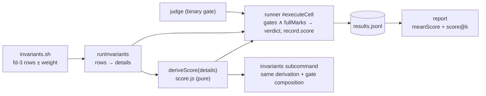

# Design 2240-a — Scored Benchmark Tasks

Implements spec 2240. A task becomes **scored** when its `invariants.sh` emits
weighted check rows on the results fd; a pure derivation turns those rows into
a score in [0, 1], the runner composes it with the existing gates, the record
carries it, and `report` aggregates it. Judged tasks — every task that emits no
weighted row — flow through unchanged code paths and produce byte-identical
records. Nothing new declares a task's shape (no file, manifest field, or
flag); the rows are the declaration.

## Architecture



Score derivation is one pure function with two callers (runner and the
`invariants` subcommand), so the arithmetic exists once and records are
self-describing — `report` reads `score` off the record, never re-deriving it
from details.

## The scored-row convention (normative)

The rules in this section are the single home for the row and scoring
semantics; the component rows below reference them rather than restating.

A details row is a **scored check** iff it carries a numeric `weight > 0`:

```json
{"test": "filter-case-insensitive", "pass": false, "weight": 1}
```

- `score = Σ weight(passing scored checks) / Σ weight(all scored checks)`.
- **Full marks** is the count predicate *every scored check passes*, exposed as
  a `fullMarks` boolean on the derivation result. The verdict never compares
  float sums, so fractional weights carry no equality hazard.
- **A `weight` key declares scored intent; malformed intent fails.** Any row
  carrying a `weight` key is a scored check. If the weight is invalid (not a
  finite number > 0) or `pass` is missing or non-boolean, the row counts as a
  *failing* scored check — an invalid weight contributes at the unit weight 1,
  a valid one at its own value, in the denominator only — and the derivation's
  `malformed` count records it. Silently dropping either defect could mint
  full marks from a broken hook. Rows the fd-3 parser already marks
  `parseError` carry no keys to inspect and stay diagnostic.
- Zero scored checks → the task is judged; derivation returns `null` and no
  `score` field appears anywhere.
- Rows without `weight` remain what they are today: diagnostic detail. A
  scored task may mix both — gate diagnostics unweighted, graded checks
  weighted.
- **Scored checks never couple to the gate.** The hook's gate checks keep the
  documented `assert() { … || FAIL=1; }` pattern; scored checks use a variant
  that discards the per-check exit status (`|| true`), because the exit code
  reports gate conditions only (spec requirement 3). The authoring reference
  documents both helpers side by side.

## Components

| Component | Where | Responsibility |
| --- | --- | --- |
| `deriveScore(details)` | new `benchmark/score.js` | Pure: apply § convention, return `{score, fullMarks, malformed}` or `null`. Sole home of the arithmetic and the full-marks predicate. |
| Verdict + score composition | `benchmark/runner.js` `#executeCell` | Effective score: `null` when derivation is `null`; `0` when the invariants exit code or the judge gate fails; the derived score otherwise. Verdict: `pass` iff every gate passes ∧ (derivation is `null` ∨ `fullMarks`). Preflight-failure records never reach this path and stay exactly as today (no invariants, no score); their zero is realized in aggregation per spec requirement 4. |
| Record schema | `benchmark/result.js` | Optional `score` (number, 0–1) and optional `malformedChecks` (integer, present only when > 0) on the happy record and on the invariants record, so the report reads both off the record without re-deriving from details. Preflight records are unchanged. |
| `invariants` subcommand | `commands/benchmark-invariants.js` | Same derivation and the same gate composition as `run` (invariants exit code ≠ 0 → record score 0), so hook authoring iterates against the real contract. The record's existing `exitCode` field keeps mirroring the script's exit; the CLI *process* exits non-zero when the gate fails or `fullMarks` is false — the invariants-gate ∧ full-marks portion of `run`'s cell verdict (no judge runs here). |
| Report aggregation | `benchmark/report.js` | A task group is scored when ≥ 1 record carries `score`. Per scored task: `meanScore` and `scoreAtK[k]` (§ Estimator). A record without `score` in a scored group contributes its verdict as the degenerate score — pass = 1, fail = 0 — so a preflight failure drags the mean down and a pre-conversion passing cell does not (its old verdict already asserted full marks). |
| Report rendering | `benchmark/report.js` | Text: the pass@k table gains `score` and `score@k` columns only when the report contains a scored task (judged rows render `—`); the per-task runs table gains a `Score` column under the same condition; records with `malformedChecks` render a warning in the task detail. JSON: fields appear on scored tasks only. |
| `fit-trace assert --weight` | `commands/assert.js` + the CLI definition in `bin/fit-trace.js` | Optional flag; validates a positive number; adds `weight` to the emitted row. Keeps the documented authoring contract able to author scored checks without hand-written JSON. |
| Leading example | `benchmarks/kata-skills/tasks/implement-feature/hooks/` | Gate: app present + the **baseline** suite green, run against pristine baseline tests restored from `$HOOKS_DIR` first (the agent-editable copy in `app/test/` cannot vouch for itself; the same restore-from-hooks move the hidden test already uses). The `hooks/` copy duplicates the family `workdir/` baseline test — an accepted drift pair, since `$FAMILY_DIR` is absent under the `invariants` subcommand; the family README names the pair. Score: the hidden feature suite split into one test file per scored check; each runs as its own `node --test` invocation and its exit status becomes one `weight: 1` row — the process-exit analog of the assert helper, with no reporter parsing. Judge (scope discipline) unchanged. Family README rows updated. |
| Docs | `fit-benchmark` SKILL.md, `references/authoring.md`, `references/cli.md`, Run a Benchmark guide, `benchmarks/README.md` | Scored vs judged shapes, the row convention, the exit-code contract and gate/score helper split, gate-protection semantics, report columns, and when to author which shape. |

## Key Decisions

| Decision | Choice | Rejected alternative |
| --- | --- | --- |
| How a task declares itself scored | Row-level `weight` on fd-3 check rows | A `{"score": 0.8}` summary row — every hook reimplements the arithmetic, rounding drifts across families, and per-check evidence is lost. A manifest/flag — configuration that can contradict what the rows actually contain. |
| Verdict for scored cells | `pass` requires gates ∧ full marks | Gates-only verdict — pass@k saturates on partially-solved tasks and `run`'s exit code goes green on partial capability, breaking CI semantics. |
| Gate failure vs score | A failed invariants/judge gate forces record score 0; row-less failures resolve at aggregation | Reporting the raw score alongside a failed gate — a cell that hacked the scaffold or flunked the scope judge could mint high scores into the mean, which is the gaming vector the gates exist to close. |
| Malformed scored rows | Count as failing scored checks + surfaced warning (§ convention) | Silently ignoring them — see the convention's rationale. Failing the whole hook — turns a diagnostic-quality issue into a gate failure, zeroing runs that mechanically completed work. |
| Where the score is computed | At record time, one pure function, two callers | At report time from `details` — every downstream consumer re-implements weighting, and ledgers stop being self-describing. |
| Score-less records in a scored group | Degenerate verdict score: pass = 1, fail = 0 | Skipping them — inflates the mean exactly when the agent fails hardest (preflight failures vanish from the denominator). Counting all as 0 — deflates pre-conversion passing cells that the Compatibility section promises merge cleanly. |
| Best-of-k statistic | Exact expected-max via order statistics (§ Estimator) | Mean only — hides best-case capability and is asymmetric with pass@k. Monte Carlo — nondeterministic reports for the same ledger. |
| Leading example | Convert `implement-feature`; emit rows directly from per-file `node --test` exit codes | A new synthetic task — duplicates fixture maintenance and cannot demonstrate the gate + score + judge composition authors must copy. Parsing one suite's TAP output — couples the hook to reporter format and test-name escaping. |
| Weight authoring surface | Extend `fit-trace assert`; document the direct-emission pattern for process-exit checks | Raw `echo` JSON as the only path — leaves the documented assertion contract unable to author the new shape for file/content checks, forcing authors off the recommended path. |

## Estimator

`scoreAtK` generalizes pass@k to values in [0, 1]: the expected **maximum**
score over k runs drawn without replacement from the task's n runs. With scores
sorted ascending `s₍₁₎ … s₍ₙ₎`:

```text
score@k = Σ_{i=k..n}  s₍ᵢ₎ · C(i−1, k−1) / C(n, k)
```

Each term weights `s₍ᵢ₎` by the probability it is the maximum of the k-subset.
Binary scores reduce exactly to the HumanEval pass@k value, computed with the
same BigInt binomial helper. `k > n` yields the same `{error: "k > n"}` value
the existing pass@k field carries, so the two estimators expose one idiom.

## Interfaces

```js
// benchmark/score.js
deriveScore(details) // → {score: number, fullMarks: boolean, malformed: number} | null

// ResultRecord (happy branch) — additive
{ …existing, score?: number, malformedChecks?: number }  // absent on judged tasks

// InvariantsRecord — additive
{ taskId, invariants, exitCode, score?: number, malformedChecks?: number }

// report JSON — additive, scored tasks only
task: { …existing, meanScore?: number, scoreAtK?: Record<k, number|{error: string}> }
```

## Compatibility

Judged tasks and existing ledgers are untouched: no weighted rows → `null`
derivation → no `score` field → no report columns. The schema changes are
additive optional fields, so old records validate, and mixed old/new shard
merges aggregate under the degenerate-score rule above. The judge template
contract, hook environment, sharding, and the composite action are unchanged —
the new report columns flow through the existing step-summary path.

— Staff Engineer 🛠️
