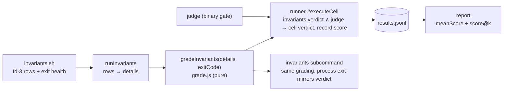

# Design 2240-a — Scored Benchmark Tasks

Implements spec 2240. The NDJSON rows on the results fd are the single
authoritative grading channel: every row is a check, its role (gate, scored,
diagnostic) rides on the row itself, and a pure derivation turns the rows plus
the script's exit health into a verdict and a score in [0, 1]. The exit code
carries no verdict meaning — nonzero means "the grader crashed", which fails
the run so a dead hook can never mint marks. Clean break: every hook in
`benchmarks/` and the test fixtures migrates in this change; no dual-channel
compatibility mode exists.

## Architecture



Grading is one pure function with one caller (`runInvariants`), so the
arithmetic exists once and records are self-describing — `report` reads
`score` off the record, never re-deriving it from details.

## The row contract (normative)

The rules in this section are the single home for the row and grading
semantics; the component rows below reference them rather than restating.

Every parsed row is a check by default. Roles, checked in order:

1. **Diagnostic** — `weight` is exactly `0`. Free-form; never graded.
2. **Gate** — `gate` is exactly `true` and no positive `weight` is present.
   Requires a boolean `pass`. Any failing gate → `gatesPass` false.
3. **Scored** — everything else. `weight` must be absent (defaults to 1) or a
   finite number > 0; `pass` must be a boolean.
   `score = Σ weight(passing) / Σ weight(all scored)`.
4. **Malformed** — a row that fits no role: missing or non-boolean `pass` on a
   graded row, non-boolean `gate`, invalid `weight` (negative, non-finite,
   non-numeric), `gate: true` alongside a positive `weight`, or an fd-3 line
   that fails to parse as JSON. A malformed row counts as a **failing scored
   check** — at its own weight when it carries a valid positive one, else at
   unit weight 1 — and increments the derivation's `malformed` count.
   Silently dropping a defect could mint full marks from a broken hook;
   failing the whole run would zero work that mechanically completed.

Derived predicates:

- `healthy` — the script exited 0. Unhealthy → verdict `fail`, score 0,
  whatever the rows say (spec requirement 3).
- `fullMarks` — integer count predicate: `malformed === 0` and every scored
  check passes. The verdict never compares float sums, so fractional weights
  carry no equality hazard.
- Zero scored checks → the task is binary; `score` is `null` and no `score`
  field appears anywhere.
- **Invariants verdict** = `healthy ∧ gatesPass ∧ fullMarks` (vacuously true
  parts when no gate or scored rows exist — a row-less exit-0 hook still
  passes, preserving today's no-op-hook behavior).
- **Effective record score** (scored tasks only) =
  `healthy ∧ gatesPass ∧ judgePass ? score : 0`. Full marks does not zero it —
  a fractional score with verdict `fail` is the point.
- Hooks never manage exit codes for checks; they end `exit 0`. Early
  `exit 0` after emitting a failing gate row is the documented
  dependency-chain pattern (nothing downstream can be asserted).

## Components

| Component | Where | Responsibility |
| --- | --- | --- |
| `gradeInvariants(details, exitCode)` | new `benchmark/grade.js` | Pure: apply § row contract, return `{verdict, gatesPass, score, fullMarks, malformed}` (`score` null for binary tasks). Sole home of the arithmetic. |
| Invariants result | `benchmark/invariants.js` | Verdict comes from `gradeInvariants` (today: `exitCode === 0`). The result carries `verdict`, `details`, `exitCode` (diagnostic mirror), and the grade fields `gatesPass`, `score?`, `malformed?`. Unparseable fd-3 lines stop being `parseError` diagnostics and enter grading as malformed rows. |
| Cell composition | `benchmark/runner.js` `#executeCell` | Cell verdict: `invariants.verdict ∧ judge` (unchanged shape). Record score per § contract's effective-score rule; `malformedChecks` when > 0. Preflight-failure records never reach the hook and stay score-free; their zero is realized in aggregation (spec requirement 9). |
| Record schema | `benchmark/result.js` | Optional `score` (number, 0–1) and `malformedChecks` (integer ≥ 1) on the happy record and the invariants record; preflight branch pins both `undefined`. |
| `invariants` subcommand | `commands/benchmark-invariants.js` | Same grading via `runInvariants`; the CLI process exits 0 iff the invariants verdict is `pass`, so hook authoring iterates against the real contract without agent runs. The record's `exitCode` field keeps mirroring the script. |
| Report aggregation | `benchmark/report.js` | A task group is scored when ≥ 1 record carries `score`. Per scored task: `meanScore` and `scoreAtK[k]` (§ Estimator). A record without `score` in a scored group contributes its verdict as the degenerate score — pass = 1, fail = 0 — so a preflight failure drags the mean down instead of vanishing from the denominator. |
| Report rendering | `benchmark/report.js` | Text: the pass@k table gains `score` and `score@k` columns only when the report contains a scored task (binary rows render `—`); the per-task runs table gains a `Score` column under the same condition; records with `malformedChecks` render a warning in the task detail. JSON: fields appear on scored tasks only. |
| `fit-trace assert --gate/--weight` | `commands/assert.js` + the CLI definition in `bin/fit-trace.js` | `--weight` validates a finite number > 0 and adds `weight`; `--gate` adds `gate: true`; combining them is an error. **Emit-then-fail:** an invalid grading flag emits a *failing* row (`{"test": …, "pass": false, "message": …}`) before the nonzero exit, so a typo shrinks the score, never the denominator. |
| Hook migration | `benchmarks/*/tasks/*/hooks/invariants.sh`, libharness `test/fixtures/` | § Migration. One helper — `check() { fit-trace assert "$@" >&"$RESULTS_FD" \|\| true; }` — no `FAIL` bookkeeping, `exit 0` at the end. |
| Leading example | `benchmarks/kata-skills/tasks/implement-feature/hooks/` | Gate row: the **pristine baseline** suite restored from `$HOOKS_DIR` and run alone (the agent-editable copy cannot vouch for itself). Scored rows: the hidden feature suite split into one test file per check; each `node --test` invocation's exit status becomes one weight-1 row. Judge (scope discipline) unchanged. |
| Docs | `fit-benchmark` SKILL.md, `references/authoring.md`, `references/cli.md`, Run a Benchmark guide, `benchmarks/README.md` | Rows-authoritative contract, roles table, exit-code demotion, gate-vs-scored authoring guidance, report columns. |

## Key Decisions

| Decision | Choice | Rejected alternative |
| --- | --- | --- |
| Grading channel | Single: the rows, with roles as row fields | Dual channel (weights beside an authoritative exit code — this design's first draft): grading semantics split across a data and a process channel, coupled by a documentation-only contract where one wrong helper zeroes every partial run. |
| Exit code | Demoted to script health: nonzero → run fails, score 0 | Ignored entirely — a hook that crashes after one passing row would score 1.0; the exit code is the one completion signal a crash cannot fake. A terminal sentinel row — more protocol for the same guarantee. |
| Gate semantics | A row role (`gate: true`), multiplicative: fail → score 0 | Encoding gates as huge weights — additive weights cannot express "this failing must zero everything", and the attempt reintroduces the distinction it removes, worse. |
| Default weight | Absent `weight` = scored at 1; diagnostics opt out with `weight: 0` | Opt-in weights (rows without `weight` stay decorative) — leaves most emitted evidence ungraded and requires the dual-channel contract to gate anything. |
| Malformed rows | Failing scored check + surfaced count (§ contract) | Silently ignoring them — mints full marks from broken hooks. Failing the whole run — turns a diagnostic-quality issue into a total zero for mechanically completed work. |
| Unparseable fd-3 lines | Malformed (graded), no longer `parseError` diagnostics | Keeping them diagnostic — under a rows-authoritative contract, a garbled line may be a lost check; skipping it silently shrinks the denominator. |
| Where the score is computed | At record time, one pure function, called inside `runInvariants` | At report time from `details` — every downstream consumer re-implements weighting, and ledgers stop being self-describing. |
| Verdict for scored cells | `pass` requires health ∧ gates ∧ full marks ∧ judge | Gates-only verdict — pass@k saturates on partially-solved tasks and `run`'s exit code goes green on partial capability, breaking CI semantics. |
| Score-less records in a scored group | Degenerate verdict score: pass = 1, fail = 0 | Skipping them — inflates the mean exactly when the agent fails hardest (preflight failures vanish from the denominator). |
| Best-of-k statistic | Exact expected-max via order statistics (§ Estimator) | Mean only — hides best-case capability and is asymmetric with pass@k. Monte Carlo — nondeterministic reports for the same ledger. |
| Compatibility | None: clean break, all hooks migrate in-change | A shim honoring exit-code verdicts for row-less hooks — permanent dual semantics, and the only consumers are our own nine hooks plus four fixtures. |
| Leading example | Convert `implement-feature`; emit rows directly from per-file `node --test` exit codes | A new synthetic task — duplicates fixture maintenance and cannot demonstrate the gate + score + judge composition authors must copy. Parsing one suite's TAP output — couples the hook to reporter format. |

## Estimator

`scoreAtK` generalizes pass@k to values in [0, 1]: the expected **maximum**
score over k runs drawn without replacement from the task's n runs. With scores
sorted ascending `s₍₁₎ … s₍ₙ₎`:

```text
score@k = Σ_{i=k..n}  s₍ᵢ₎ · C(i−1, k−1) / C(n, k)
```

Each term weights `s₍ᵢ₎` by the probability it is the maximum of the k-subset.
Binary scores reduce exactly to the HumanEval pass@k value, computed with the
same BigInt binomial helper. `k > n` yields the same `{error: "k > n"}` value
the existing pass@k field carries, so the two estimators expose one idiom.

## Interfaces

```js
// benchmark/grade.js
gradeInvariants(details, exitCode)
// → {verdict: "pass"|"fail", gatesPass: boolean,
//    score: number|null, fullMarks: boolean, malformed: number}

// InvariantsResult — verdict now row-derived; grade fields added
{ verdict, details, exitCode, gatesPass, score?: number, malformed?: number, stderr? }

// ResultRecord (happy branch) — additive
{ …existing, score?: number, malformedChecks?: number }  // absent on binary tasks

// report JSON — additive, scored tasks only
task: { …existing, meanScore?: number, scoreAtK?: Record<k, number|{error: string}> }
```

## Migration

All nine family hooks and four fixture hooks move in this change. The common
mechanical rewrite: drop `FAIL` bookkeeping, end with `exit 0`, mark
presence/sanity checks `--gate`, leave content checks as default-weight scored
rows, keep early `exit 0` after a failing dependency gate.

| Hook | Gate rows | Scored rows |
| --- | --- | --- |
| coaligned/author-job | jtbd-present | 6 tag/section checks |
| coaligned/bootstrap-repo | 3 presence checks | 6 content checks |
| fit-wiki/cli-fix (also rewrites `{"id","verdict"}` rows to `test`/`pass`) | summary-intact, memory-intact (anti-tamper) | audit-passes |
| kata/coordinate-finding | issue-present, change-present | 3 linkage checks |
| kata/design-feature | file-present, under-200-lines (review Blocker) | has-decisions, names-tradeoff |
| kata/implement-feature | app-present, baseline-tests (pristine restore) | 5 per-file hidden feature checks |
| kata/plan-feature | file-present | 4 structure checks |
| kata/product-issue-triage | issue-present | 3 triage-evidence checks |
| kata/spec-feature | file-present, no-how-leak (constraint) | 3 section checks + cites-jtbd |
| fixtures pass/fail/repo-state/preflight-broken | role per existing single check | — |

Pre-migration ledgers still render — records carry their verdicts — but no
score comparison may span the semantics break; the first post-break run
starts a fresh baseline.

— Staff Engineer 🛠️
