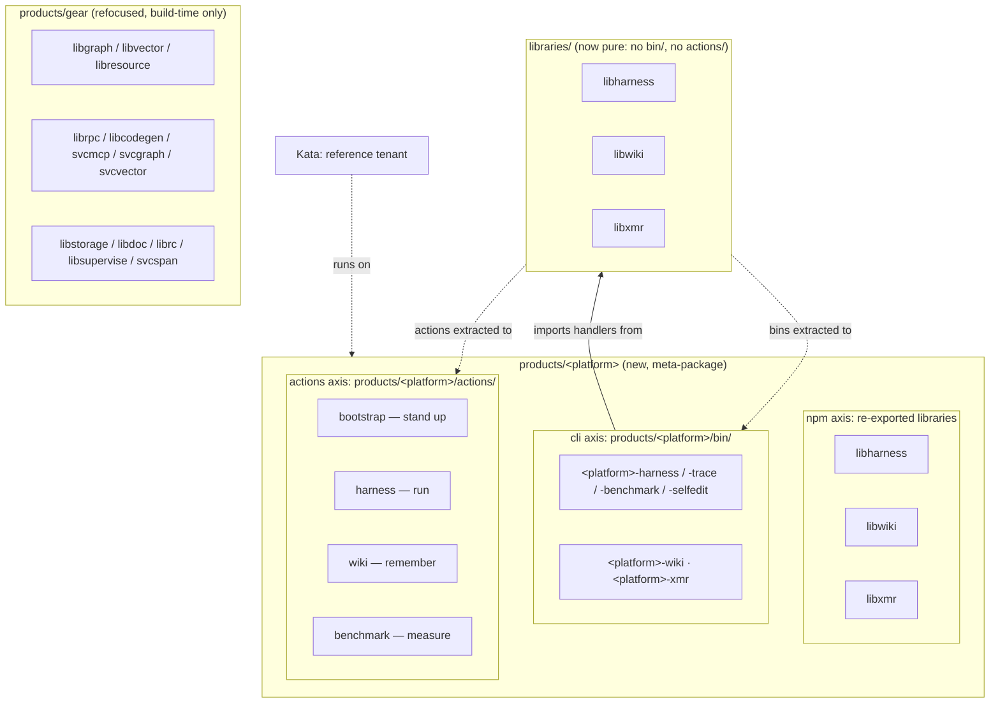

# Design 2250 — An agent-runtime platform product

Packages the agent-runtime substrate as a Secondary meta-product (`PLATFORM`,
name deferred) split cleanly out of Gear along one line: **`PLATFORM` ships what
you run; Gear ships what you import.** The product has three concrete surfaces —
an npm meta-package that re-exports the three runtime *libraries*, a CLI surface
(`products/<platform>/bin/`) that owns the thin command wiring renamed to the
product's family (`<platform>-harness`, …), and a GitHub Actions surface
(`products/<platform>/actions/`) that owns the composite actions which execute
the coding agent in CI. Extracting the actions and the bins leaves `libharness`,
`libwiki`, and `libxmr` as pure libraries; `svcspan` stays in Gear.

## Restated problem

The bootstrap layer plus `fit-harness`/`fit-trace`/`fit-wiki`/`fit-xmr` already
work and are published, but no product frames them. Their libraries are
re-exported by Gear (a build-time primitives meta-package), their CLIs are thin
`bin/` entry points owned by the libraries themselves, the actions that run
them hang off library directories, and `bootstrap` is filed as CI plumbing under
`.github/`. The design gives the substrate one product home — an npm axis, a
CLI axis, and an actions axis — and sharpens Gear to a single audience.

## Architecture

Two meta-products, one boundary. `PLATFORM` re-exports the three runtime
libraries, owns their CLIs, and owns the run actions; Gear keeps the build-time
set (including `svcspan`). The libraries stay on disk under `libraries/`; only
their `bin/` entry points and `actions/` subdirectories move into the product.



The runtime loop the product narrates, on all axes: **stand up** (bootstrap
action) → **run** (harness action / `<platform>-harness`) → **see**
(`<platform>-trace`, reading NDJSON) → **remember** (wiki action /
`<platform>-wiki`) → **measure** (benchmark action / `<platform>-xmr`).

## Components

| Component | Where | Responsibility |
| --- | --- | --- |
| Platform package | `products/<platform>/package.json` (new) | Meta-package: `description`, one Big Hire `jobs` entry (`user` `Teams Using Agents`), `dependencies` = the three runtime libraries, `bin` = the six renamed entry points. No `src/`, and — like Gear — no hand-authored `README.md`. |
| Platform bins | `products/<platform>/bin/<platform>-*.js` (moved) | The six thin entry points relocated from `libraries/libharness/bin/` (harness, trace, benchmark, selfedit), `libraries/libwiki/bin/` (wiki), and `libraries/libxmr/bin/` (xmr), renamed to the product family. Each keeps its definition-and-dispatch wiring; its `../src/…` imports become package imports. |
| Platform actions | `products/<platform>/actions/{bootstrap,harness,wiki,benchmark}/` (moved) | The composite actions that execute the runtime in CI, relocated from `.github/actions/bootstrap/`, `libraries/libharness/actions/{harness,benchmark}/`, and `libraries/libwiki/actions/wiki/`. |
| Overview page | `websites/fit/<platform>/index.md` (new) | The "stand up and operate an agent team" story by persona; presents the CLIs and the CI actions as one loop; Getting Started names the bring-up layer. `layout: product`. |
| Platform skill | `.claude/skills/<product skill>/SKILL.md` (new) | When to hire the platform; how the capabilities compose into the loop. CLI-parity `## Documentation` blocks live on each capability CLI's own (renamed) skill; the product skill narrates the loop across them. |
| Library purification | `libraries/libharness/`, `libraries/libwiki/`, `libraries/libxmr/` | The `actions/` subdirectories, `bin/` directories, and `bin` fields are removed; each library exports the command modules its former bins need and becomes import-only. |
| CLI consumer repoint | installer, run actions, skills, launchers | The bootstrap installer bundle list and the `harness`/`wiki`/`benchmark` action steps invoke the renamed bins; the CLI-named skills rename with their CLIs; the launcher set is recomputed by the `public-cli-set` invariant (new-name launchers in, old `fit-*` launchers out). |
| Publish workflow repoint | `.github/workflows/publish-actions.yml` | Matrix `prefix:` for `bootstrap`/`harness`/`benchmark`/`wiki` repointed under `products/<platform>/actions/`; `paths:` filter updated. `repo:` sibling names unchanged. |
| Gear package edit | `products/gear/package.json` | Remove the three runtime library deps; remove the operate-time ("chart agent metrics") promise from `jobs.littleHire`. Keep `svcspan`. |
| Kata framing | `KATA.md`, overview page | Name Kata as the reference tenant; no `products/kata/` change. Update the `sibling-composite-actions` enum / action-home prose to the new homes. |
| Generated context + counts | `JTBD.md`, `products/README.md`, `CLAUDE.md` | Regenerate the catalog/JTBD blocks via the context command; hand-edit the `products/README.md` intro count and `CLAUDE.md` § Secondary Products (neither is generated). |

## Interfaces

- **The boundary predicate** — a capability belongs to `PLATFORM` iff you *run*
  it to operate a team (the harness/wiki/xmr CLIs and the bootstrap/harness/
  wiki/benchmark actions); it stays in Gear iff you *import* it to build an
  agent (graph, vector, resource, rpc, codegen, svcmcp, storage, doc, rc,
  supervise, and `svcspan`). Applied once, it partitions the substrate with no
  package or action in both.
- **The UI/implementation seam** — a product bin owns argv parsing, the CLI
  definition, and dispatch; everything it dispatches to is a command handler
  exported by a runtime library. The product never contains a handler; a
  library never declares a `bin`. Package exports are the seam: each library
  adds export entries for the command modules its former bins imported from
  `../src/`.
- **The rename flows through the launcher invariant** — the public-CLI set is
  computed (invoked names in docs/skills/actions ∩ workspace bins), so
  renaming the bins recomputes the launcher list mechanically: new-name
  launchers appear, and a left-behind `fit-*` launcher fails CI. No alias
  survives by construction.
- **`svcspan` is import-time, not run-time** — `fit-trace` reads NDJSON emitted
  by `fit-harness`; it has no dependency on `svcspan`. `svcspan` is an OTel
  gRPC ingestion service whose product consumer is Guide. It therefore stays in
  Gear's build-time set and is explicitly excluded from the runtime subset.
- **Action move is a source repoint, not a republish** — the subtree-split maps
  a monorepo `prefix:` to a **sibling repo name**. Moving a `prefix:` from
  `libraries/libharness/actions/harness` to
  `products/<platform>/actions/harness` changes the source path and the `paths:`
  filter only; the `harness` sibling repo and every downstream
  `uses: forwardimpact/harness@v…` pin are untouched. Kata's vendored
  `action.yml` files pin the sibling repos by name, so they are unaffected too.
- **Package-granular npm split** — library membership is expressed only in each
  meta-product's `dependencies`, and a whole library moves as a unit. All four
  `libharness` command surfaces (harness, trace, benchmark, selfedit) become
  product bins, which is correct — benchmarking and self-edit are part of
  proving and running an agent team, not build-time primitives.
- **Shared foundation is out of scope** — `libtelemetry`, `libutil`, and similar
  cross-cutting packages are not in the runtime subset. Wherever Gear re-exports
  them today is left as-is; `PLATFORM` does not claim them.
- **Name indirection** — every new path carries the deferred name. The design is
  correct for any chosen slug; implementation substitutes the resolved name into
  `<platform>` across the new/edited surfaces at once.

## Key Decisions

| Decision | Choice | Rejected alternative |
| --- | --- | --- |
| Product tier | Secondary meta-package mirroring Gear/Kata (re-export list + JTBD + page + skill) — plus per-capability bins under `bin/` and an actions surface like `products/kata/actions/`. | A Primary product with one umbrella `fit-<platform>` CLI — collapses four distinct command surfaces into subcommands and invents an aggregate with nothing of its own to do. |
| CLI ownership | The product owns the thin bin wiring; libraries keep handlers and components and drop `bin` entirely. | Leave the bins in the libraries and only re-export them — keeps four freestanding `fit-*` brands and leaves libraries shipping user interface, the same mis-filing the actions move fixes. |
| Command family | Rename the bins to `<platform>-<capability>`, resolved with the product name. | Keep the `fit-harness`… names under the product — preserves the incoherent freestanding brands and hides the product from the command line, forfeiting the coherence the split buys. |
| Rename compat | Clean break: no alias bins; launchers recomputed; every internal invoker repointed in the same change. | Alias bins for a transition window — repo policy is clean break (cf. the `svcspan` rename), and aliases would keep the old names alive in the public-CLI invariant. |
| Split mechanism | Clean break: runtime library deps move out of Gear into `PLATFORM`; run actions move out of the library dirs into `PLATFORM`; no cross-listing. | Cross-list the runtime packages in both products — leaves two products claiming the same capability, the exact blur being removed (spec SC6). |
| Boundary line | `run` vs `import` (operate a team vs build an agent), applied to both libraries and actions. | Split by layer (libs vs services) or by "agent-ish vs not" — neither yields a clean single-audience cut. |
| `svcspan` | Excluded from `PLATFORM`; stays a Gear build-time dep (it is Guide's OTel collector, not `fit-trace`'s source). | Include `svcspan` on the strength of its blurb ("prove agent changes") — but `fit-trace` reads local NDJSON and never touches `svcspan`, so it fails the run predicate. |
| Run-action home | Move `bootstrap`/`harness`/`benchmark`/`wiki` into `products/<platform>/actions/`; repoint the split `prefix:` only. | Leave them under `.github/` and the library dirs and only narrate them — keeps the run surface scattered and leaves `libharness`/`libwiki` shipping CI actions. |
| `bootstrap` placement | Move it into the product with the other run actions, accepting that most CI workflows consume it as the base FIT environment. That base environment *is* the platform's stand-up step; every CI job is a tenant of it. | Keep `bootstrap` under `.github/` as neutral infra — leaves the "stand up" step of the loop outside the product and the actions surface incomplete. |
| JTBD binding | New distinct job *Stand Up and Operate an Agent Team* under `Teams Using Agents`; Kata's existing job untouched. | Re-point Kata's job to `PLATFORM` — erases Kata's ownership of its own hire; or two `user`s on one job — the schema allows one `user` per entry. |
| Kata relationship | Document Kata as the reference tenant; move no code. | Build a fresh demo tenant to prove genericity — the spec already treats Kata as living proof; a second tenant is unbuilt scope. |
| Naming | Defer; carry `<platform>` placeholder through every surface. | Pick a name now — the user reserved naming for a later iteration. |
| Boundary cases | `libdoc`, `librc`, `libsupervise`, `svcspan` stay in Gear; `libterrain` and `svcpathway` deferred, untouched. | Pull `fit-doc`/`fit-terrain` into the platform now — doc fails the run-the-team test; terrain is Map-entangled (spec Scope-out). |

## Data flow

```mermaid
sequenceDiagram
  participant Author as this change
  participant Plat as products/&lt;platform&gt;
  participant Libs as libraries/{libharness,libwiki}
  participant Gear as products/gear
  participant CI as publish-actions.yml
  participant Ctx as context command + hand edits
  Author->>Plat: add package.json (deps = 3 runtime libs, bin = 6 CLIs), page, skill
  Author->>Libs: git mv bin/* into products/<platform>/bin/ as <platform>-*; drop bin fields; export command modules
  Author->>Libs: git mv actions/* into products/<platform>/actions/ (+ .github bootstrap)
  Author->>CI: repoint matrix prefix + paths (repo names unchanged)
  Author->>CI: repoint installer bundle + action steps to renamed CLIs; recompute launchers
  Author->>Gear: remove 3 runtime libs; drop operate-time clause; keep svcspan
  Author->>Plat: name Kata as reference tenant (KATA.md + page)
  Author->>Ctx: run context:fix (regenerates JTBD + catalog blocks)
  Author->>Ctx: hand-edit README intro count + CLAUDE § Secondary + action-home prose
  Ctx-->>Author: bun run check passes → boundary is single-home (SC1–SC10, SC14)
```

## Success criteria coverage

| # | Met by |
| --- | --- |
| 1 | Platform `package.json` deps = the three runtime libraries, nothing else (no `svcspan`). |
| 2 | Platform `bin` map = the six `<platform>-*` entry points under `products/<platform>/bin/`; no product `src/`. |
| 3 | Library `bin` fields and `bin/` dirs removed; handlers stay under each library's `src/`, reached via package exports. |
| 4 | Installer bundle, action steps, skills, and docs invoke the new names; launcher set recomputed by the `public-cli-set` invariant. |
| 5 | Gear `package.json` edit removes all three runtime libraries. |
| 6 | Clean-break split (no cross-listing) → each runtime library in exactly one product. |
| 7 | `svcspan` stays a Gear dep, absent from the platform deps. |
| 8 | Gear `jobs.littleHire` edit removes the operate-time clause. |
| 9 | `git mv` of the four action sources into `products/<platform>/actions/`; `libharness`/`libwiki` `actions/` and `.github/actions/bootstrap/` removed. |
| 10 | `publish-actions.yml` matrix repointed (prefix + paths), sibling `repo:` names unchanged. |
| 11 | Platform `jobs` array carries one `Teams Using Agents` Big Hire with a goal distinct from Kata's. |
| 12 | New overview page + skill name the bring-up layer, reference the four renamed run-loop CLIs, and present the CI actions as the same loop. |
| 13 | Kata framed as reference tenant in `KATA.md`/page; no `products/kata/` diff. |
| 14 | `context:fix` regenerates JTBD + catalog; hand edits fix the intro count, `CLAUDE.md`, and action-home prose; `bun run check` passes. |
| 15 | Spec § Deferred decisions present; name/terrain/svcpathway untouched. |

## Clean break and scope

The change adds one product and edits one, and regroups the run surface — bins
and actions — under the product. Gear loses the three runtime library deps
outright — no shim, no deprecation alias — and keeps `svcspan`. The six old
`fit-*` command names are removed, not aliased; the launcher set follows by
recomputation. No library component moves on disk (only the `bin/` entry
points and `actions/` subdirectories do), the sibling action repos keep their
names and pins, and `products/kata/` gains no code. The product name,
`fit-terrain`'s home, and the `svcpathway` mis-filing stay out of scope per
the spec, each recorded as a deferred decision rather than resolved.
