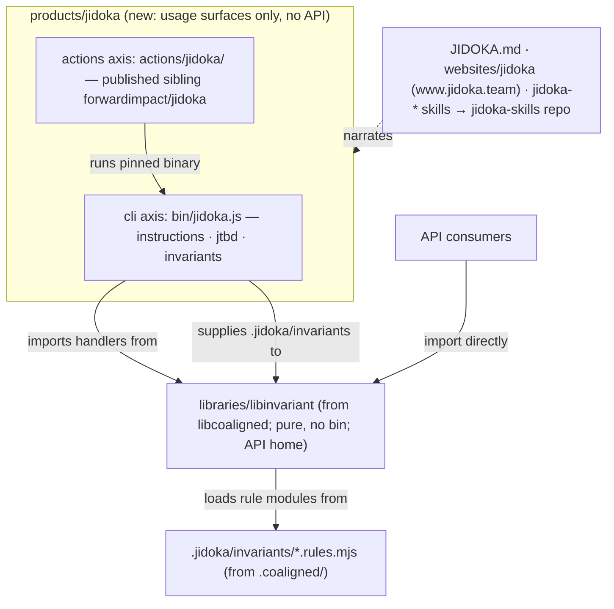

# Design 2260 — Reframe Co-Aligned as the Jidoka product

Applies the spec-2250 boundary to the check suite: **Jidoka ships what you run;
the library ships what you import.** The library generalizes to
`@forwardimpact/libinvariant` (pure import target, no `bin`, no brand-named
discovery default); a new Secondary product `products/jidoka/` consumes it and
exposes exactly two usage surfaces — the `jidoka` CLI (the thin wiring moved
from the library) and a published `jidoka` composite action (the relocated
`coaligned-check`). Every brand surface renames in the same clean break — the
launcher retires without a successor because the bare npm name is squatted — and
a release train makes the rename real for CI and external consumers.

## Restated problem

The check suite works and is distributed, but the `coaligned` CLI is a
library-owned `bin`, the CI action is unpublished local glue under
`.github/actions/`, the library's brand name hides a generic invariant kit, and
the brand names the aspiration (co-alignment) rather than the mechanism (jidoka:
built-in quality that stops the line). No product or JTBD entry frames what a
team hires.

## Architecture

One product, one library, one boundary. The product owns the run surfaces; the
renamed library keeps every handler and component and stays the API home. The
design assumes the post-2250 tree (shared surfaces: installer, launcher
invariant, action matrix, `CLAUDE.md` enums); identifiers are re-verified at
plan time per the standing rename interaction note.



## Components

| Component                      | Where                                                                                                 | Responsibility                                                                                                                                                                                                                                                                                                                                                                                                                                                                                                                                                                                                                                               |
| ------------------------------ | ----------------------------------------------------------------------------------------------------- | ------------------------------------------------------------------------------------------------------------------------------------------------------------------------------------------------------------------------------------------------------------------------------------------------------------------------------------------------------------------------------------------------------------------------------------------------------------------------------------------------------------------------------------------------------------------------------------------------------------------------------------------------------------ |
| Jidoka package                 | `products/jidoka/package.json` (new)                                                                  | Consumer package: `description`, the spec's one Big Hire `jobs` entry, `bin` = `jidoka`, `dependencies` = `libinvariant` plus the wiring foundations the bin imports (`libcli`, `libpreflight`, `libutil`). No `src/`, no `main`, no `exports` (nothing imports the package — there is no launcher); like Gear and Gemba, no hand-authored `README.md`. Versions the skill pack, seeded **above the retained tag floor** — the renamed `jidoka-skills` sibling keeps its `v0.1.x` tags from `libcoaligned`-era publishes and the pack publisher skips existing tags, so the package starts at `0.2.0`.                                                       |
| Jidoka bin                     | `products/jidoka/bin/jidoka.js` (moved)                                                               | The library's single bin relocated and renamed. It is already pure definition-and-dispatch importing the library's root export (`../src/index.js`), so the move repoints that import to `@forwardimpact/libinvariant`, renames command tokens (definition `name`, help text, standard-document mentions), and takes ownership of the discovery convention: the bin supplies `.jidoka/invariants` to the library's finder/loader. Subcommand set unchanged.                                                                                                                                                                                                   |
| Jidoka action                  | `products/jidoka/actions/jidoka/` (moved)                                                             | `coaligned-check` relocated and renamed; still runs the bare pinned binary from PATH, now `jidoka`. Gains a `README.md` for the sibling, published by a new `publish-actions.yml` matrix entry (`prefix: products/jidoka/actions/jidoka`, `repo: jidoka`); internal workflows repoint to the local path.                                                                                                                                                                                                                                                                                                                                                     |
| Library rename                 | `libraries/libinvariant/` (from `libcoaligned/`)                                                      | `git mv`; package name, keywords, and README rename; `bin` field, `bin/` dir, and the bin-subpath export removed; root export (`.` → `./src/index.js`) otherwise unchanged. The branded `INVARIANTS_DIR` default is removed: `findInvariantsRoot`/`loadRuleModules` take the directory from the caller (the parameter already exists), so the generic library carries no brand-named path. Handler and component tests stay; bin-surface golden tests move to `products/jidoka/test/` and regenerate from actual output (replay via the capture script's token transform is an optional cross-check). Library jobs entry keeps its goal; name tokens update. |
| Config directory               | `.jidoka/invariants/` (from `.coaligned/invariants/`)                                                 | `git mv` of the 18 rule modules and their 8 allow/deny/registry data files (26 files), contents unchanged except self-referential name tokens (rule prose, path lists) updated by the codemod.                                                                                                                                                                                                                                                                                                                                                                                                                                                               |
| Standard rebrand               | `JIDOKA.md` (from `COALIGNED.md`)                                                                     | Same eight layers, layer rules, and length caps; framing rewritten around jidoka alongside the existing JTBD and Checklist Manifesto groundings; adds the downstream migration note (`.coaligned/` → `.jidoka/`, CLI and pack renames — an unmigrated repo gets a hard `rules directory not found` error naming the expected location, the loader's existing stop-the-line behavior). `MONOREPO.md`, `CLAUDE.md`, `CONTRIBUTING.md` references follow.                                                                                                                                                                                                       |
| Website                        | `websites/jidoka/` (from `coaligned/`), `website-jidoka.yaml`                                         | Dir and caller workflow rename; CNAME → `www.jidoka.team`; hero/story reframed to the Toyota concept with the same layer-stack visual language; `websites/CLAUDE.md` row updates.                                                                                                                                                                                                                                                                                                                                                                                                                                                                            |
| Skills                         | `.claude/skills/jidoka-{setup,audit,invariant,jtbd,layer}/`                                           | `git mv` the five dirs; frontmatter, body, and cross-links reframed; setup skills instruct `npx @forwardimpact/jidoka` (scoped — the bare name has no launcher); every other reference (`kata-*` skills, `monorepo-setup`, agent references, `CONTRIBUTING.md`, the living templates under `references/` such as the bionova-apps set) repoints. No sixth umbrella skill.                                                                                                                                                                                                                                                                                    |
| Pack repoint                   | `.github/workflows/publish-skills.yml`                                                                | Leg becomes `prefix: jidoka`, `repo: jidoka-skills`, `version-file: products/jidoka/package.json`; trigger paths and pack prose follow. The sibling rename itself is release-train step 1, executed pre-merge.                                                                                                                                                                                                                                                                                                                                                                                                                                               |
| Launcher retirement + scanners | `launchers/coaligned/`; `public-cli-set`, `skill-genericity` rule modules; `.claude/skills/CLAUDE.md` | The launcher directory is deleted with no successor; `PUBLISHED_NON_FIT_CLIS` drops `coaligned` and gains nothing; the skill-lint npx/bare-invoke allowances swap `coaligned` for `jidoka` and admit the scoped `npx @forwardimpact/jidoka` form.                                                                                                                                                                                                                                                                                                                                                                                                            |
| Distribution wiring            | `build/cli-manifest.json`, installer, `publish-npm.yml`                                               | Manifest entry `coaligned` → `jidoka` (bundle `gear` unchanged); installer default-tools list and gear-binary predicate rename; `publish-npm.yml`'s build-kit import moves to `@forwardimpact/libinvariant` and the invariants directory it passes to `.jidoka/invariants`.                                                                                                                                                                                                                                                                                                                                                                                  |
| Eval lane                      | `eval-jidoka.yml` (from `eval-coaligned.yml`), `benchmarks/jidoka-skills/` (from `coaligned-skills/`) | Workflow renames (name, concurrency group, `family:` path); the family's `apm.yml` dependency becomes `forwardimpact/jidoka-skills`, its task hooks grep `jidoka invariants`/`.jidoka/invariants`, and judge/task prose follows. The pass@k series restarts under the new family name.                                                                                                                                                                                                                                                                                                                                                                       |
| Catalogs + counts              | `JTBD.md`, `products/README.md`, `libraries/README.md`, `CLAUDE.md`                                   | Context command regenerates jobs and catalog blocks; hand edits fix product counts, § Secondary Products, § Distribution Model pack list, and the `sibling-composite-actions` enum (gains `jidoka`).                                                                                                                                                                                                                                                                                                                                                                                                                                                         |
| Release train                  | `release-engineer`; step 1 pre-merge                                                                  | Spec § Release train order: sibling ops **before the merge** (rename `coaligned-skills` → `jidoka-skills`, create `forwardimpact/jidoka`, so the merge-triggered publishes target existing repos) → npm cuts (`libinvariant`, `jidoka`, gear binary release) → bootstrap re-tag → repin PR → deprecations → website/DNS cutover.                                                                                                                                                                                                                                                                                                                             |

## Interfaces

- **The boundary predicate** — you _run_ `jidoka` (CLI, action, pinned binary)
  to enforce the architecture; you _import_ `libinvariant` to build checks. The
  product never contains a handler; the library never declares a `bin`.
- **The root-export seam** — unlike 2250's six bins importing sibling `src/`
  modules, this bin already consumes the library's public root export, so the
  package boundary is the existing `index.js` surface. With no launcher, no
  package imports the product at all; `npx @forwardimpact/jidoka` executes the
  declared `bin` directly.
- **The discovery contract** — the directory is caller wiring, not a library
  constant: the `jidoka` bin and CI callers pass `.jidoka/invariants` into the
  finder/loader, keeping `libinvariant` brand-free (full string-level debranding
  of handler help text is not attempted — those tokens rename with the codemod).
  The rename is a breaking library release; `JIDOKA.md` and the pack README
  carry the one-line migration (`git mv .coaligned .jidoka`, reinstall the pack,
  swap the CLI name), and a missed migration fails loudly via the loader's
  existing missing-directory error.
- **Action publication is additive** — a new matrix entry and sibling repo; no
  existing `prefix:`/`repo:` pair changes, so no downstream `uses:` pin moves.
  Internal consumption stays local-path (`./products/jidoka/actions/jidoka`);
  external adopters gain `forwardimpact/jidoka@v1`.
- **The rename window** — sibling repos pre-exist the merge (train step 1), so
  merge-triggered pack and action publishes land; the remaining window is the
  pinned bootstrap installing the `coaligned` binary while merged surfaces
  invoke `jidoka` (the renamed action fails on PATH lookup until the repin).
  Mitigation is ordering, not aliasing: same-day release train, scheduled
  workflows paused if the window stretches (2250 precedent).
- **2250 interaction points** — installer (post-2250 home under the platform
  product's bootstrap action), launcher invariant, `CLAUDE.md` enums, and the
  action matrix are all edited by both changes; this design lands second, after
  2250's train, and re-verifies those identifiers at plan time.

## Key Decisions

| Decision          | Choice                                                                                                                                                                 | Rejected alternative                                                                                                                                                                                                                                                        |
| ----------------- | ---------------------------------------------------------------------------------------------------------------------------------------------------------------------- | --------------------------------------------------------------------------------------------------------------------------------------------------------------------------------------------------------------------------------------------------------------------------- |
| Product tier      | Secondary product shipping usage surfaces only (bin + action + JTBD + standard/website narrative).                                                                     | Re-export `libinvariant` Gear-style — recreates the meta-package blur 2250 removed; APIs stay library-direct.                                                                                                                                                               |
| Library name      | `libinvariant` — names the generic capability (rule-module runner, instruction/JTBD checks as invariants over a repo).                                                 | `libjidoka` — re-couples the implementation to a brand, repeating the `libcoaligned` mistake one name later.                                                                                                                                                                |
| CLI shape         | One `jidoka` bin with the existing three subcommands.                                                                                                                  | Per-capability bins (`jidoka-instructions`, …) gemba-style — the subcommands share one definition and audience; splitting invents surfaces with nothing of their own.                                                                                                       |
| Config directory  | `.jidoka/invariants/`, supplied by the product wiring — the brand rename reaches the one path every consuming repo carries while the generic library stays brand-free. | Keep `.coaligned/` (dead brand living downstream forever); unbranded `.invariants/` (same migration cost, decoupled from the product that documents it); keep the branded constant in the library (re-couples `libinvariant` to a brand — the coupling the rename removes). |
| Launcher          | Retire without successor; published invocations use `npx @forwardimpact/jidoka` or the bare installed binary.                                                          | Publish under an alternate bare name (`jidoka-cli` — a second brand token to un-teach later); dispute the squatted `jidoka` now (outside the repo's control; deferred to the owner).                                                                                        |
| Standard identity | Full rebrand: `JIDOKA.md`, "Jidoka Instruction Architecture".                                                                                                          | Keep the Co-Aligned name for the standard and rename only tooling — two brands for one product, the exact legibility problem being fixed.                                                                                                                                   |
| Action name       | Bare `jidoka`, matching sibling convention (`harness`, `wiki`, `bootstrap`).                                                                                           | `jidoka-check` — redundant suffix; the product name is the check.                                                                                                                                                                                                           |
| Pack versioning   | `version-file: products/jidoka/package.json`, seeded at `0.2.0` above the sibling's retained `v0.1.x` tag floor.                                                       | Keep the library as version source (a library versioning a product surface is the mis-filing being removed); seed at `0.1.0` (the publisher skips the existing tag and the first publish silently no-ops).                                                                  |
| Skill set         | Rename the five skills; no umbrella skill; docs home is `JIDOKA.md` + the standalone site.                                                                             | Add a `jidoka` product skill — duplicates `jidoka-setup`'s when-to-hire story.                                                                                                                                                                                              |
| Eval family       | Rename workflow and family dir; update pack dependency and hooks; restart the pass@k series.                                                                           | Keep `benchmarks/coaligned-skills` for series continuity (2250's `fit-wiki` precedent) — this family installs the renamed pack by name and exercises the renamed skills, so keeping it ships a permanently broken eval.                                                     |
| Domain            | `www.jidoka.team` CNAME; DNS provisioning and old-domain disposition owned by the release train.                                                                       | Keep `www.coaligned.team` — brand mismatch in the product's front door.                                                                                                                                                                                                     |
| Rename compat     | Clean break: no alias bin, launcher, skill, or directory; npm deprecations only.                                                                                       | Transition aliases — repo policy is clean break (2200/2110/2250 precedents).                                                                                                                                                                                                |
| Sequencing        | After spec 2250's monorepo merge and release train.                                                                                                                    | Parallel execution — guaranteed conflicts on installer, invariant, enum, and matrix files for no schedule gain.                                                                                                                                                             |
| Binary vehicle    | Keep the `jidoka` binary in the gear bundle; add it to the follow-up issue 2250's plan files in its Part 4.                                                            | Mint a jidoka release pipeline now — out of the spec's boundary, third pipeline for one binary.                                                                                                                                                                             |

## Data flow

```mermaid
sequenceDiagram
  participant RE as release train
  participant Author as monorepo PR
  participant Prod as products/jidoka
  participant Lib as libraries/libinvariant
  participant Brand as JIDOKA.md · websites/jidoka · skills
  participant CI as workflows
  RE->>RE: step 1 (pre-merge): rename coaligned-skills → jidoka-skills; create forwardimpact/jidoka
  Author->>Lib: git mv libcoaligned → libinvariant; drop bin + branded discovery default
  Author->>Prod: package.json (bin jidoka, jobs entry, version 0.2.0) + moved bin + moved action
  Author->>Author: git mv .coaligned → .jidoka (18 modules + 8 data files)
  Author->>Brand: rebrand standard (+ migration note), site (CNAME jidoka.team), five skills
  Author->>CI: repoint check-context/publish-npm/publish-skills; add jidoka to publish-actions matrix; retire launcher; rename eval lane
  Author->>Author: context:fix + counts; bun run check / test green → merge
  RE->>RE: npm cuts → gear binary → bootstrap re-tag → repin PR → deprecations → DNS cutover
```

## Success criteria coverage

| #   | Met by                                                                                                                                                    |
| --- | --------------------------------------------------------------------------------------------------------------------------------------------------------- |
| 1   | Jidoka package: deps = `libinvariant` + wiring foundations; no `main`/`exports`/`src/`.                                                                   |
| 2   | `bin` maps `jidoka` → `products/jidoka/bin/jidoka.js`; wiring-only bin; subcommands unchanged.                                                            |
| 3   | Library `git mv` + package rename; `bin` field/dir removed; handlers stay in `src/`.                                                                      |
| 4   | `.coaligned/` → `.jidoka/` move; branded default removed from the library; the bin and CI wiring supply the directory; codemod over path references.      |
| 5   | Repo-wide `rg` gate with the spec's named remainders (train-held pins, migration note; historical trees excluded).                                        |
| 6   | Action `git mv` + rename; local `uses:` repoints; new publish matrix entry `repo: jidoka`.                                                                |
| 7   | `publish-skills.yml` leg edit (prefix, repo, version-file, paths, prose).                                                                                 |
| 8   | Five skill dirs `git mv` + reframe; cross-reference codemod across packs, agents, docs, `references/` templates.                                          |
| 9   | `COALIGNED.md` → `JIDOKA.md` rewrite with migration note; `MONOREPO.md`/`CLAUDE.md`/`CONTRIBUTING.md` repoints; framing confirmed by PR editorial review. |
| 10  | Site dir + caller workflow rename; CNAME `www.jidoka.team`; `websites/CLAUDE.md` row; content confirmed by PR editorial review.                           |
| 11  | Launcher dir deleted, no successor; `PUBLISHED_NON_FIT_CLIS` drops `coaligned`; scoped/bare invocations in published surfaces; invariant suite green.     |
| 12  | `build/cli-manifest.json` entry rename (bundle `gear`); installer tool list + predicate.                                                                  |
| 13  | One `jobs` entry carrying the spec's full switching framing; regenerated `JTBD.md`.                                                                       |
| 14  | Eval workflow + family rename; pack dependency, hooks, judge/task prose updated.                                                                          |
| 15  | `context:fix` + hand-edited counts/enums; `bun run check` green.                                                                                          |
| 16  | Release-train steps 1–6 per spec table (step 1 pre-merge), `release-engineer`-executed, verified by `npm view` / release assets / repin CI.               |
| 17  | § Deferred decisions untouched in the diff (domain/DNS disposition, bare-name reclaim).                                                                   |

## Clean break and scope

Check behavior is byte-compatible aside from name tokens and the caller-supplied
discovery directory; rule modules keep their contracts; downstream migration is
documented in the standard and executed by consumers, failing loudly when
skipped. The gear bundle keeps carrying the binary (recorded in 2250's follow-up
issue), `MONOREPO.md` keeps its own name, and the old npm names are deprecated,
never unpublished.
