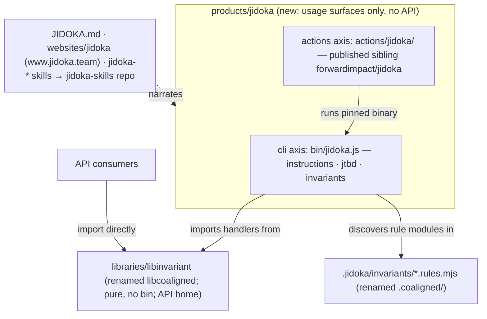

# Design 2260 — Reframe Co-Aligned as the Jidoka product

Applies the spec-2250 boundary to the check suite: **Jidoka ships what you run;
the library ships what you import.** The library generalizes to
`@forwardimpact/libinvariant` (pure import target, no `bin`); a new Secondary
product `products/jidoka/` consumes it and exposes exactly two usage surfaces —
the `jidoka` CLI (the thin wiring moved from the library) and a published
`jidoka` composite action (the relocated `coaligned-check`). Every brand surface
— standard document, website, skills, pack repo, config directory, launcher,
binary — renames in the same clean break, and a release train makes the rename
real for CI and external consumers.

## Restated problem

The check suite works and is distributed, but the `coaligned` CLI is a
library-owned `bin`, the CI action is unpublished local glue under
`.github/actions/`, the library's brand name hides a generic invariant kit, and
the brand names the aspiration (co-alignment) rather than the mechanism (jidoka:
built-in quality that stops the line). No product or JTBD entry frames what a
team hires.

## Architecture

One product, one library, one boundary. The product owns the run surfaces; the
renamed library keeps every handler and component and stays the API home. The
design assumes the post-2250 tree (shared surfaces: installer, launcher
invariant, action matrix, `CLAUDE.md` enums); identifiers are re-verified at
plan time per the standing rename interaction note.



## Components

| Component           | Where                                                                         | Responsibility                                                                                                                                                                                                                                                                                                                                                                                                            |
| ------------------- | ----------------------------------------------------------------------------- | ------------------------------------------------------------------------------------------------------------------------------------------------------------------------------------------------------------------------------------------------------------------------------------------------------------------------------------------------------------------------------------------------------------------------- |
| Jidoka package      | `products/jidoka/package.json` (new)                                          | Consumer package: `description`, one Big Hire `jobs` entry (`user` `Teams Using Agents`, goal _Build Quality Into Agent Instructions_), `bin` = `jidoka`, `dependencies` = `libinvariant` plus the wiring foundations the bin imports (`libcli`, `libpreflight`, `libutil`). No `src/`, no `main`, no importable exports; like Gear and Gemba, no hand-authored `README.md`. Versions the skill pack.                     |
| Jidoka bin          | `products/jidoka/bin/jidoka.js` (moved)                                       | The library's single bin relocated and renamed. It is already pure definition-and-dispatch importing the library's root export (`../src/index.js`), so the move only repoints that import to `@forwardimpact/libinvariant` and renames command tokens (definition `name`, help text, standard-document mentions). Subcommand set unchanged.                                                                               |
| Jidoka action       | `products/jidoka/actions/jidoka/` (moved)                                     | `coaligned-check` relocated and renamed; still runs the bare pinned binary from PATH, now `jidoka`. Gains a `README.md` for the sibling, published by a new `publish-actions.yml` matrix entry (`prefix: products/jidoka/actions/jidoka`, `repo: jidoka`); internal workflows repoint to the local path.                                                                                                                  |
| Library rename      | `libraries/libinvariant/` (from `libcoaligned/`)                              | `git mv`; package name, keywords, and README rename; `bin` field and `bin/` dir removed; root export (`.` → `./src/index.js`) unchanged — no new subpath exports needed. Discovery constant `INVARIANTS_DIR` → `.jidoka/invariants`. Handler and component tests stay; bin-surface golden tests move to `products/jidoka/test/` and regenerate from actual output. Library jobs entry keeps its goal; name tokens update. |
| Config directory    | `.jidoka/invariants/` (from `.coaligned/invariants/`)                         | `git mv` of the 26 rule modules and their allow/deny/registry data files, contents unchanged except self-referential name tokens (rule prose, path lists) updated by the codemod.                                                                                                                                                                                                                                         |
| Standard rebrand    | `JIDOKA.md` (from `COALIGNED.md`)                                             | Same eight layers, layer rules, and length caps; framing rewritten around jidoka (built-in quality, stop the line, never pass a defect downstream) alongside the existing JTBD and Checklist Manifesto groundings; adds the downstream migration note (`.coaligned/` → `.jidoka/`, CLI and pack renames). `MONOREPO.md`, `CLAUDE.md`, `CONTRIBUTING.md` references follow.                                                |
| Website             | `websites/jidoka/` (from `coaligned/`), `website-jidoka.yaml`                 | Dir and caller workflow rename; CNAME → `www.jidoka.team`; hero/story reframed to the Toyota concept with the same layer-stack visual language; `websites/CLAUDE.md` row updates.                                                                                                                                                                                                                                         |
| Skills              | `.claude/skills/jidoka-{setup,audit,invariant,jtbd,layer}/`                   | `git mv` the five dirs; frontmatter, body, and cross-links reframed; every other pack's references (`kata-*`, `monorepo-setup`, agent references, `CONTRIBUTING.md`) repoint. No sixth umbrella skill.                                                                                                                                                                                                                    |
| Pack repoint        | `.github/workflows/publish-skills.yml`                                        | Leg becomes `prefix: jidoka`, `repo: jidoka-skills`, `version-file: products/jidoka/package.json`; trigger paths and pack prose follow. The sibling repo rename itself is a release-train step.                                                                                                                                                                                                                           |
| Scanner updates     | `public-cli-set`, `skill-genericity` rule modules; `.claude/skills/CLAUDE.md` | `PUBLISHED_NON_FIT_CLIS`: `coaligned` → `jidoka`; npx-prefix and bare-invoke allowances swap the token; launcher `launchers/jidoka/` replaces `launchers/coaligned/` with the canonical two-line bin importing `@forwardimpact/jidoka/bin/jidoka.js`.                                                                                                                                                                     |
| Distribution wiring | `cli-manifest.json`, installer, `publish-npm.yml`                             | Manifest entry `coaligned` → `jidoka` (bundle `gear` unchanged); installer default-tools list and gear-binary predicate rename; `publish-npm.yml`'s build-kit import moves to `@forwardimpact/libinvariant` and its invariants path to `.jidoka/invariants`.                                                                                                                                                              |
| Catalogs + counts   | `JTBD.md`, `products/README.md`, `libraries/README.md`, `CLAUDE.md`           | Context command regenerates jobs and catalog blocks; hand edits fix product counts, § Secondary Products, § Distribution Model pack list, and the `sibling-composite-actions` enum (gains `jidoka`).                                                                                                                                                                                                                      |
| Release train       | Executed by `release-engineer` post-merge                                     | Spec § Release train order: sibling ops (rename `coaligned-skills` → `jidoka-skills`, create `jidoka`) → npm cuts (`libinvariant`, `jidoka` + launcher, gear binary release) → bootstrap re-tag → repin PR → deprecations → website/DNS cutover.                                                                                                                                                                          |

## Interfaces

- **The boundary predicate** — you _run_ `jidoka` (CLI, action, pinned binary)
  to enforce the architecture; you _import_ `libinvariant` to build checks. The
  product never contains a handler; the library never declares a `bin`.
- **The root-export seam** — unlike 2250's six bins importing sibling `src/`
  modules, this bin already consumes the library's public root export, so the
  package boundary is the existing `index.js` surface; the library's exports map
  is untouched except for dropping the bin subpath, and the launcher's import is
  satisfied by the invariant's no-`exports`/bin-subpath rule landed with 2250.
- **The discovery contract** — `INVARIANTS_DIR` is the library's published
  constant; consuming repos resolve `<root>/.jidoka/invariants` through the same
  finder. The rename is a breaking library release; `JIDOKA.md` and the pack
  README carry the one-line migration (`git mv .coaligned .jidoka`, reinstall
  the pack, swap the CLI name).
- **Action publication is additive** — a new matrix entry and sibling repo; no
  existing `prefix:`/`repo:` pair changes, so no downstream `uses:` pin moves.
  Internal consumption stays local-path (`./products/jidoka/actions/jidoka`);
  external adopters gain `forwardimpact/jidoka@v1`.
- **The rename window** — between the monorepo merge and the repin, pinned
  bootstrap installs the `coaligned` binary while merged surfaces invoke
  `jidoka`; the renamed action would fail on PATH lookup. Mitigation is
  ordering, not aliasing: same-day release train, scheduled workflows paused if
  the window stretches (2250 precedent). |
- **2250 interaction points** — installer (post-2250 home under the platform
  product's bootstrap action), launcher invariant, `CLAUDE.md` enums, and the
  action matrix are all edited by both changes; this design lands second and
  re-verifies those identifiers at plan time.

## Key Decisions

| Decision          | Choice                                                                                                                 | Rejected alternative                                                                                                                                                                        |
| ----------------- | ---------------------------------------------------------------------------------------------------------------------- | ------------------------------------------------------------------------------------------------------------------------------------------------------------------------------------------- |
| Product tier      | Secondary product shipping usage surfaces only (bin + action + JTBD + standard/website narrative).                     | Re-export `libinvariant` Gear-style — recreates the meta-package blur 2250 removed; APIs stay library-direct.                                                                               |
| Library name      | `libinvariant` — names the generic capability (rule-module runner, instruction/JTBD checks as invariants over a repo). | `libjidoka` — re-couples the implementation to a brand, repeating the `libcoaligned` mistake one name later.                                                                                |
| CLI shape         | One `jidoka` bin with the existing three subcommands.                                                                  | Per-capability bins (`jidoka-instructions`, …) gemba-style — the subcommands share one definition and audience; splitting invents surfaces with nothing of their own.                       |
| Config directory  | `.jidoka/invariants/` — the brand rename reaches the one path every consuming repo carries.                            | Keep `.coaligned/` (dead brand living downstream forever) or unbranded `.invariants/` (decouples the directory from the product that documents it, for the same downstream migration cost). |
| Standard identity | Full rebrand: `JIDOKA.md`, "Jidoka Instruction Architecture".                                                          | Keep the Co-Aligned name for the standard and rename only tooling — two brands for one product, the exact legibility problem being fixed.                                                   |
| Action name       | Bare `jidoka`, matching sibling convention (`harness`, `wiki`, `bootstrap`).                                           | `jidoka-check` — redundant suffix; the product name is the check.                                                                                                                           |
| Pack versioning   | `version-file: products/jidoka/package.json` — the product versions its pack, as Gear versions `fit-skills`.           | Keep the library as version source — a library versioning a product surface is the mis-filing being removed.                                                                                |
| Skill set         | Rename the five skills; no umbrella skill.                                                                             | Add a `jidoka` product skill — duplicates `jidoka-setup`'s when-to-hire story.                                                                                                              |
| Domain            | `www.jidoka.team` CNAME; DNS provisioning and old-domain disposition owned by the release train.                       | Keep `www.coaligned.team` — brand mismatch in the product's front door.                                                                                                                     |
| Rename compat     | Clean break: no alias bin, launcher, skill, or directory; npm deprecations only.                                       | Transition aliases — repo policy is clean break (2200/2110/2250 precedents), and aliases would survive in the launcher invariant.                                                           |
| Sequencing        | After spec 2250's monorepo merge; written against that tree.                                                           | Parallel execution — guaranteed conflicts on installer, invariant, enum, and matrix files for no schedule gain.                                                                             |
| Binary vehicle    | Keep the `jidoka` binary in the gear bundle; join 2250's distribution follow-up.                                       | Mint a jidoka release pipeline now — out of the spec's boundary, third pipeline for one binary.                                                                                             |

## Data flow

```mermaid
sequenceDiagram
  participant Author as monorepo PR
  participant Prod as products/jidoka
  participant Lib as libraries/libinvariant
  participant Brand as JIDOKA.md · websites/jidoka · skills
  participant CI as workflows
  participant RE as release train
  Author->>Lib: git mv libcoaligned → libinvariant; drop bin; INVARIANTS_DIR → .jidoka/invariants
  Author->>Prod: package.json (bin jidoka, jobs entry) + moved bin + moved action
  Author->>Author: git mv .coaligned → .jidoka (rule modules unchanged)
  Author->>Brand: rebrand standard, site (CNAME jidoka.team), five skills
  Author->>CI: repoint check-context/publish-npm/publish-skills; add jidoka to publish-actions matrix; launcher + scanners
  Author->>Author: context:fix + counts; bun run check / test green
  RE->>RE: sibling ops → npm cuts → gear binary → bootstrap re-tag → repin PR → deprecations → DNS cutover
```

## Success criteria coverage

| #   | Met by                                                                                                                   |
| --- | ------------------------------------------------------------------------------------------------------------------------ |
| 1   | Jidoka package: deps = `libinvariant` + wiring foundations; no `main`/importable exports/`src/`.                         |
| 2   | `bin` maps `jidoka` → `products/jidoka/bin/jidoka.js`; wiring-only bin; subcommands unchanged.                           |
| 3   | Library `git mv` + package rename; `bin` field/dir removed; handlers stay in `src/`.                                     |
| 4   | `INVARIANTS_DIR` constant + `.coaligned/` → `.jidoka/` move + codemod over path references.                              |
| 5   | Family-scoped `rg` gates with keep-list (specs/wiki/benchmarks/CHANGELOGs, release-train-held pins).                     |
| 6   | Action `git mv` + rename; local `uses:` repoints; new publish matrix entry `repo: jidoka`.                               |
| 7   | `publish-skills.yml` leg edit (prefix, repo, version-file, paths, prose).                                                |
| 8   | Five skill dirs `git mv` + reframe; cross-reference codemod across packs, agents, docs.                                  |
| 9   | `COALIGNED.md` → `JIDOKA.md` rewrite; `MONOREPO.md`/`CLAUDE.md`/`CONTRIBUTING.md` repoints.                              |
| 10  | Site dir + caller workflow rename; CNAME `www.jidoka.team`; `websites/CLAUDE.md` row.                                    |
| 11  | Launcher dir swap + `PUBLISHED_NON_FIT_CLIS` rename; invariant suite green.                                              |
| 12  | `cli-manifest.json` entry rename (bundle `gear`); installer tool list + predicate.                                       |
| 13  | One `jobs` entry, `Teams Using Agents` / _Build Quality Into Agent Instructions_; regenerated `JTBD.md`.                 |
| 14  | `context:fix` + hand-edited counts/enums; `bun run check` green.                                                         |
| 15  | Release-train steps 1–6 per spec table, `release-engineer`-executed, verified by `npm view` / release assets / repin CI. |
| 16  | § Deferred decisions untouched in the diff (domain disposition, npm availability check at plan time).                    |

## Clean break and scope

The change renames one library, adds one product, moves one bin and one action,
and rebrands every named surface — standard, website, skills, pack, launcher,
config directory, binary — with nothing aliased and nothing left dual-homed.
Check behavior is byte-compatible aside from name tokens; rule modules keep
their contracts; downstream migration is documented in the standard and executed
by consumers. The gear bundle keeps carrying the binary (recorded follow-up),
`MONOREPO.md` keeps its own name, and the old npm names are deprecated, never
unpublished.
