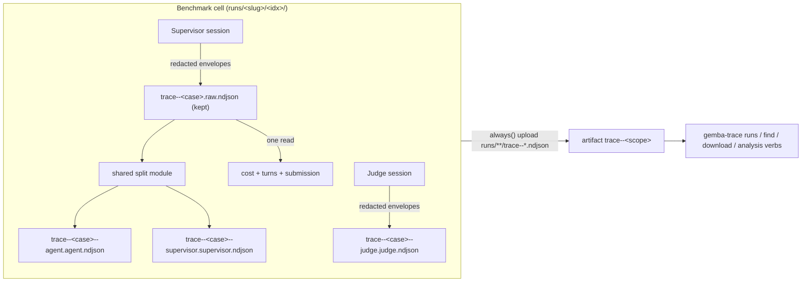

# Design 2270-a — Benchmark Trace Parity

Architecture for [spec.md](spec.md): the benchmark stops owning trace policy.
Capture, naming, splitting, and artifact upload follow the harness contract,
with cell identity taking the place of the matrix case.

## Architecture

One trace pipeline, two drivers. The harness action drives it per workflow
run; the benchmark runner drives it per cell. Both converge on the same three
contracts: the file-naming convention, the shared split implementation, and
the `trace--*` workflow-artifact shape that `gemba-trace` discovery reads.

## Components

| Component | Location | Change |
| --- | --- | --- |
| Shared split module | `libraries/libharness/src/trace-split.js` (new) | Owns bucket parsing, source-to-role classification, and convention naming, extracted from `commands/trace.js`. Both consumers call it. |
| `gemba-trace split` command | `libraries/libharness/src/commands/trace.js` | Keeps CLI concerns only (`--mode` validation, arg handling); delegates splitting to the shared module. |
| Benchmark private splitter | `libraries/libharness/src/benchmark/trace-split.js` | **Deleted.** |
| Benchmark runner | `libraries/libharness/src/benchmark/runner.js` | Writes the combined stream to `trace--<case>.raw.ndjson`; removes the unlink; one post-session read derives cost, turns, and submission; calls the shared split module. |
| Workdir manager | `libraries/libharness/src/benchmark/workdir.js` | Allocates convention-named trace paths from the cell's case identity; exposes `rawTracePath`. |
| Task family loader | `libraries/libharness/src/benchmark/task-family.js` | Rejects task ids containing `--` at load (case-identity delimiter). |
| Result record | `libraries/libharness/src/benchmark/result.js` | Trace-path fields become run-output-relative; adds required `rawTracePath` to both branches. |
| Judge adapter | `libraries/libharness/src/benchmark/judge.js` | Unchanged mechanics; writes to the convention-named judge path. |
| Discovery | `libraries/libharness/src/trace-github.js` | `listRuns` default pattern gains eval workflows; `downloadTrace` lists extracted members recursively; participant matching keys on basenames. |
| Benchmark action | `products/gemba/actions/benchmark/action.yml` | `trace` input, `trace-dir` output, `always()` trace-artifact upload step. |
| Reusable workflow | `products/gemba/actions/benchmark/.github/workflows/benchmark.yml` | Forwards a `trace` input (default on) to the action; no other change. |

## Key Decisions

| # | Decision | Choice | Rejected alternative |
| --- | --- | --- | --- |
| 1 | Case identity | `<taskId with "/"→"__">-r<runIndex>`; family load rejects task ids containing `--` | Shard- or family-qualified case: redundant — shards partition one grid, so (task, runIndex) is already grid- and shard-unique. Silently sanitizing `--` in ids: corrupts identity round-trip between record and filename. |
| 2 | Judge lane | Participant `judge`, role `judge`: `trace--<case>--judge.judge.ndjson`, written directly by the judge session | Classifying the judge under the `agent` role: hides which lane judged, and `find <run> judge` could not resolve it by name. Identity parsing accepts any role token, so no parser change is needed. |
| 3 | Judge file content | Keep the judge's enveloped `{source:"judge", seq, event}` stream as-is | Unwrapping to match split-lane shape: needs a second write pass; `TraceCollector.addLine` unwraps envelopes transparently, so both shapes are already native `gemba-trace` input. |
| 4 | Split module home | New top-level `libharness/src/trace-split.js` | Importing from `commands/trace.js`: a runtime library importing a CLI command module inverts layering. A new package: both consumers live in libharness. |
| 5 | Turns/submission survival | One post-session read of the preserved raw file yields `sumTraceCost` + turns (orchestrator summary) + submission (last agent assistant text) | A summary callback inside the shared splitter: re-entangles splitting with summarization — the exact coupling that caused the original divergence. |
| 6 | Record trace paths | Run-output-relative (`runs/<slug>/<idx>/trace--…`); new required `rawTracePath` | Absolute paths: the dead-runner defect itself. Dropping the fields: breaks requirement 8 — a record must locate its cell's traces inside a downloaded artifact. |
| 7 | Artifact granularity | One `trace--<scope>` artifact per shard, members keeping their `runs/<slug>/<idx>/` paths | Per-cell artifacts: grid × runs artifacts per run, noisy in the API and the UI; the dispatch-host shape (one artifact, convention-named members) is already what discovery supports. |
| 8 | Nested artifact members | `downloadTrace` lists extracted files recursively (paths relative to the extract dir); participant matching keys on basenames | Flattening trace files into a staging dir before upload: loses the `runs/<slug>/<idx>/` structure the record's relative paths point into (requirement 8). |
| 9 | `runs` default pattern | `"kata|agent|eval"` — eval workflows list by default | A benchmark-specific flag or pattern override: the spec forbids benchmark-specific invocation shapes. |

## Contracts

### File naming (per cell, under `runs/<slug>/<runIndex>/`)

| File | Content |
| --- | --- |
| `trace--<case>.raw.ndjson` | Combined redacted envelope stream (agent, supervisor, orchestrator). Preserved for the life of the run output. |
| `trace--<case>--agent.agent.ndjson` | Unwrapped agent events (shared split output). |
| `trace--<case>--supervisor.supervisor.ndjson` | Unwrapped supervisor events (shared split output; orchestrator events stay raw-only, as on the harness path). |
| `trace--<case>--judge.judge.ndjson` | Judge session's enveloped stream, written through the judge's redactor. |

`case = <taskId slug>-r<runIndex>` (slug: `/` → `__`). The case string never
contains `--`, so `parseIdentity` and `participantInNames` resolve case and
participant from every name above with no parser change.

### Shared split module

`splitTraceFile(runtime, { input, caseId, outputDir })` → writes one
`trace--<caseId>--<source>.<role>.ndjson` per valid envelope source and
returns the written paths. Classification is the current CLI policy, moved
verbatim: structural sources (`agent`, `supervisor`, `facilitator`) use their
own name as participant and role; other valid sources classify as role
`agent` with the source as participant; orchestrator events and invalid
source names are dropped. The CLI command validates `--mode` (UX-only — the
splitter is mode-independent) and delegates.

### Benchmark action surface

| Surface | Contract |
| --- | --- |
| `trace` input | Default `"true"`. Gates the artifact-upload step and the trace outputs only. Capture is unconditional in the runner — cost and judge depend on it. |
| `trace-dir` output | Absolute path of `<output>/runs`; every trace file of the run sits beneath it at `<slug>/<idx>/trace--*`. Empty when `trace` is disabled. Mirrors the harness action's `trace-dir` at the contract level. |
| Trace artifact | Uploaded under `always()`, path `<output>/runs/**/trace--*.ndjson`. Name: `trace--<artifact-name>` unsharded, `trace--<artifact-name>-shard-<shard-index>` sharded — collision-safe across shards and across matrix callers that set distinct `artifact-name`s. Run mode only. |

The reusable workflow forwards `trace` to each shard's action invocation, so
eval workflows mint trace artifacts with no caller-side steps.

### Records and judge template

Record fields `agentTracePath`, `supervisorTracePath`, `judgeTracePath`, and
the new `rawTracePath` carry paths relative to the run output directory —
valid inside a downloaded artifact and on the runner alike. The workdir
handle keeps absolute paths for runtime consumers; the runner derives the
relative form when assembling the record. `{{AGENT_TRACE_PATH}}` in the judge
template resolves to the absolute convention-named agent lane at runtime, so
templates change only if they hard-code old filenames (none do — they use the
placeholder).

### Discovery and analysis

`runs`, `find`, and `download` work on eval runs through the existing
dispatch-host path: `trace--` artifact-name prefix plus member-filename
matching. The only changes are the default workflow pattern (decision 9) and
recursive member listing (decision 8). File-consuming verbs need no change:
split lanes are unwrapped events, raw and judge files are enveloped streams,
and `loadTrace` already accepts both.

## Clean break (removed)

- `libraries/libharness/src/benchmark/trace-split.js` and its
  `splitAndSummarize` interface — the second split implementation.
- The `.combined.ndjson` temp name and the read-once-then-unlink behaviour.
- Bare per-cell filenames `agent.ndjson`, `supervisor.ndjson`,
  `judge.ndjson` — removed from workdir allocation, tests, goldens, skills,
  and the run-benchmark guide; no aliases.
- Absolute trace paths in result records.

## Redaction

No new machinery. The preserved raw file is the supervisor's already-redacted
output stream; the judge lane is written through the judge's redactor.
Redaction pipeline tests extend to assert both preserved files pass through
the existing redactor (spec requirement 9).

## Tests and documentation

Runner and workdir tests move to convention names; split unit tests cover the
benchmark (supervise-shape) input through the shared module; identity-parsing
tests cover emitted names across tasks × run indexes × shards; an action-level
assertion reads `trace-dir` and lists convention-named files beneath it.
`gemba-benchmark` and `gemba-trace` skills, the Prove Agent Changes guides
(run-benchmark, run-eval, trace-analysis), and the benchmark action README
document the eval trace contract: what a run preserves, the artifact shape,
and the download-then-analyze flow. Help-text goldens refresh where the
`runs` description changes.
