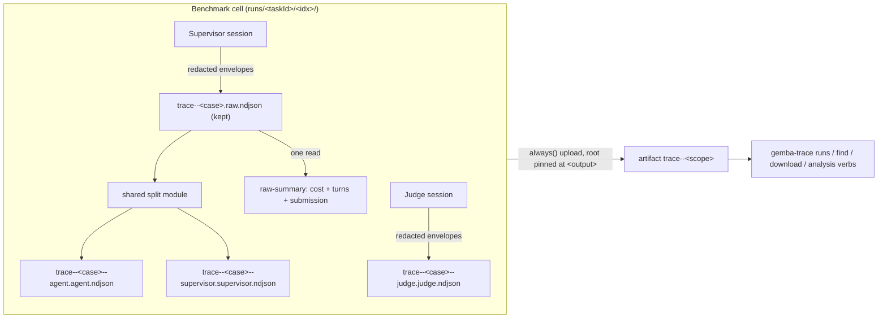

# Design 2270-a — Benchmark Trace Parity

Architecture for [spec.md](spec.md): the benchmark stops owning trace policy.
Capture, naming, splitting, and artifact upload follow the harness contract,
with cell identity taking the place of the matrix case.

## Architecture

One trace pipeline, two drivers. The harness action drives it per workflow
run; the benchmark runner drives it per cell. Both converge on three shared
contracts: the identity grammar (one module), the split implementation (one
module), and the `trace--*` workflow-artifact shape `gemba-trace` discovery
reads.

## Components

| Component | Location | Change |
| --- | --- | --- |
| Trace identity module | `libraries/libharness/src/trace-identity.js` (new) | Single owner of the identity grammar: builds case ids and lane filenames, and parses them back — `parseIdentity` moves here from `trace-multi.js`, `participantInNames` from `trace-github.js`; both re-import. |
| Shared split module | `libraries/libharness/src/trace-split.js` (new) | Owns bucket parsing and source-to-role classification, extracted from `commands/trace.js`; async streaming over `runtime.fs` (the runner's idiom); an ensured-sources option creates empty lanes for sources that emitted nothing. |
| `gemba-trace split` command | `libraries/libharness/src/commands/trace.js` | Keeps CLI concerns only (`--mode` validation, args); awaits the shared module. |
| Benchmark private splitter | `libraries/libharness/src/benchmark/trace-split.js` | **Deleted.** |
| Raw-trace summary | `libraries/libharness/src/benchmark/raw-summary.js` (new) | One-pass read of the preserved raw trace: cost via `sumTraceCost`, turns (orchestrator summary), submission (last agent assistant text). |
| Benchmark runner | `libraries/libharness/src/benchmark/runner.js` | Streams the session to `trace--<case>.raw.ndjson`; no unlink; calls the shared split (agent+supervisor ensured), then raw-summary. |
| Workdir manager | `libraries/libharness/src/benchmark/workdir.js` | Allocates convention-named trace paths from the identity module; exposes `rawTracePath`. |
| Task family loader | `libraries/libharness/src/benchmark/task-family.js` | Rejects task ids containing `--` or with a leading/trailing `-` at load (case-grammar integrity). |
| Result record | `libraries/libharness/src/benchmark/result.js` | Trace-path fields become run-output-relative and are present only when the file exists; adds `rawTracePath`. |
| Judge adapter | `libraries/libharness/src/benchmark/judge.js` | Writes to the convention-named judge path; docblock drops the `agent.ndjson` reference. |
| Discovery | `libraries/libharness/src/trace-github.js` | `listRuns` default pattern gains eval/benchmark workflows; `downloadTrace` lists extracted members recursively; `findByKey` resolves keys by identity segment; `download` auto-converts only single-member artifacts. |
| Benchmark action | `products/gemba/actions/benchmark/action.yml` | `trace` input, `trace-dir` output, manifest-anchored `always()` trace-artifact upload. |
| Reusable workflow | `products/gemba/actions/benchmark/.github/workflows/benchmark.yml` | Forwards a `trace` input (default on) to the action; no other change. |

## Key Decisions

| # | Decision | Choice | Rejected alternative |
| --- | --- | --- | --- |
| 1 | Case identity | `<taskId>-r<runIndex>`, built by the identity module; family load rejects ids containing `--` or edge hyphens, so the `--` delimiter and the terminal `-r<digits>` suffix parse unambiguously | A `/`→`__` slug mapping: task ids are single directory names (`task-family.js` discovery), so the rule can never fire. Shard- or family-qualified case: redundant — shards partition one grid, so (task, runIndex) is already grid- and shard-unique. |
| 2 | Identity grammar home | One module builds and parses case ids and lane filenames; workdir, split, and discovery all import it | Leaving construction in workdir, validation in task-family, and parsing in trace-multi/trace-github: three files agreeing by convention is the drifted-copies pattern this spec retires. |
| 3 | Judge lane | Participant `judge`, role `judge`: `trace--<case>--judge.judge.ndjson`, written directly by the judge session; `judge` joins the splitter's structural-role set so direct write and split classification are one rule | Classifying the judge under the `agent` role: hides which lane judged in every filename, and leaves the splitter emitting `judge.agent.ndjson` for judge-source envelopes — two role rules for one participant. |
| 4 | Judge file content | Keep the judge's enveloped `{source:"judge", seq, event}` stream as-is (deliberate exception: every other `.<role>.ndjson` lane is unwrapped) | Unwrapping to match split-lane shape: needs a second write pass; `TraceCollector.addLine` unwraps envelopes transparently, so both shapes are already native `gemba-trace` input. |
| 5 | Split module home | New top-level `libharness/src/trace-split.js` | Importing from `commands/trace.js`: a runtime library importing a CLI command module inverts layering. A new package: both consumers live in libharness. |
| 6 | Turns/submission survival | Named module `benchmark/raw-summary.js`: one post-session read of the preserved raw file | A summary callback inside the shared splitter: re-entangles splitting with summarization — the exact coupling that caused the original divergence. Inlining in `runner.js`: the runner is already the largest benchmark module. |
| 7 | Record trace paths | Run-output-relative; each field present only when its file exists (raw + ensured agent/supervisor lanes on executed cells; judge lane on judged cells; none on preflight failure) | Absolute paths: the dead-runner defect itself. Always-required fields (today's shape): preflight and judgeless records would reference files that never exist, failing spec criterion 8. |
| 8 | Artifact granularity | One `trace--<scope>` artifact per shard; a manifest file written at the run-output root joins the upload set, pinning the archive root to `<output>` so members extract as `runs/<taskId>/<idx>/trace--*` — exactly the record's relative paths | Per-cell artifacts: grid × runs artifacts per run, noisy in API and UI. Glob-only upload: `upload-artifact` v4 roots the archive at the matched files' common ancestor, stripping `runs/` (or all structure for a single-cell shard), breaking record-path resolution. |
| 9 | Nested artifact members | `downloadTrace` lists extracted files recursively (paths relative to the extract dir); name matching keys on basenames | Flattening trace files into a staging dir before upload: loses the `runs/<taskId>/<idx>/` structure the record's relative paths point into (requirement 8). |
| 10 | Eval-run lane addressing | The `find`/`download` key resolves against member identity: exact basename, case segment, or participant segment (via the identity module); when several members match, the verb errors listing the matches so the caller narrows the key — mirroring the existing multi-artifact disambiguation | First-match on participant (today's `findByKey`): every eval cell emits the same `agent`/`supervisor`/`judge` participants, so it silently returns an arbitrary cell's lane. A benchmark-specific selector flag: the spec forbids benchmark-specific invocation shapes. |
| 11 | `runs` default pattern | `"kata|agent|eval|benchmark"` — covers the eval workflows and benchmark-named callers; listing stays a name heuristic, while `find`/`download` stay run-id-keyed and name-independent | A benchmark-specific pattern override: same spec prohibition as decision 10. |

## Contracts

### File naming (per cell, under `runs/<taskId>/<runIndex>/`)

| File | Content |
| --- | --- |
| `trace--<case>.raw.ndjson` | Combined redacted envelope stream (agent, supervisor, orchestrator). Preserved for the life of the run output. |
| `trace--<case>--agent.agent.ndjson` | Unwrapped agent events (shared split output; created empty if the source emitted nothing). |
| `trace--<case>--supervisor.supervisor.ndjson` | Unwrapped supervisor events (ditto; orchestrator events stay raw-only, as on the harness path). |
| `trace--<case>--judge.judge.ndjson` | Judge session's enveloped stream (decision 4), written through the judge's redactor; exists only on judged cells. |

Split filenames resolve case and participant through the identity module with
no grammar change. The raw file carries case-only identity through the
existing basename fallback — the same behaviour a harness raw trace has
today (spec requirement 7).

### Benchmark action surface

| Surface | Contract |
| --- | --- |
| `trace` input | Default `"true"`. Gates the artifact-upload step and the trace outputs only. Capture is unconditional in the runner — cost and judge depend on it. (Deliberate asymmetry with the harness action's same-named input, which disables capture; there, nothing downstream needs the trace.) |
| `trace-dir` output | Absolute path of `<output>/runs`; every trace file of the run sits beneath it at `<taskId>/<idx>/trace--*`. Empty when `trace` is disabled. Mirrors the harness action's `trace-dir` at the contract level. |
| Trace artifact | Uploaded under `always()`, run mode only. Upload set: the exact-depth glob `<output>/runs/*/*/trace--*.ndjson` — never `**`, so files an agent plants inside its `cwd/` can't enter the evidence — plus `<output>/trace-manifest.txt`, the root anchor listing every member (its name misses the `trace--` prefix, so name-based matching ignores it). |
| Artifact name | `trace--<artifact-name>` unsharded, `trace--<artifact-name>-shard-<shard-index>` sharded — collision-safe across shards and across matrix callers. The action fails fast if `artifact-name` contains `--` (delimiter integrity for name-based matching). The results artifact keeps its existing `benchmark-shard-<i>` scheme — pre-existing, out of scope; recorded here so the divergence is deliberate. |

The reusable workflow forwards `trace` to each shard's action invocation, so
eval workflows mint trace artifacts with no caller-side steps.

### Records and judge template

Record fields `rawTracePath`, `agentTracePath`, `supervisorTracePath`, and
`judgeTracePath` carry paths relative to the run output directory — valid on
the runner and inside a downloaded artifact alike (decision 8 makes the
extracted tree match). Presence follows decision 7. The workdir handle keeps
absolute paths for runtime consumers; the runner derives the relative form
when assembling the record. `{{AGENT_TRACE_PATH}}` in the judge template
resolves to the absolute convention-named agent lane at runtime (the lane is
ensured, so the path always exists when the judge runs); templates use the
placeholder, so none change.

### Discovery and analysis

`runs`, `find`, and `download` work on eval runs through the existing
dispatch-host path — `trace--` artifact-name prefix plus member-name
matching — with decisions 9–11 applied. `download`'s structured-JSON
auto-convert applies only when the artifact carries exactly one `.ndjson`
member; multi-member eval artifacts skip it rather than converting an
arbitrary lane. File-consuming verbs need no change: split lanes are
unwrapped events, raw and judge files are enveloped streams, and `loadTrace`
already accepts both.

## Clean break (removed)

- `libraries/libharness/src/benchmark/trace-split.js` and its
  `splitAndSummarize` interface — the second split implementation.
- The `.combined.ndjson` temp name and the read-once-then-unlink behaviour.
- Bare per-cell filenames `agent.ndjson`, `supervisor.ndjson`,
  `judge.ndjson` — removed from workdir allocation, docblocks, tests,
  goldens, skills, and the run-benchmark guide; no aliases.
- Absolute trace paths in result records.
- `parseIdentity` and `participantInNames` as module-local policy in
  `trace-multi.js` / `trace-github.js` — both move to the identity module.

## Redaction

No new machinery. The preserved raw file is the supervisor's already-redacted
output stream; the judge lane is written through the judge's redactor.
Redaction pipeline tests extend to assert both preserved files pass through
the existing redactor (spec requirement 9).

## Tests and documentation

Coverage contracts: runner integration (preserved convention-named files per
cell), shared-split units over the benchmark shape, identity round-trip units
(build → parse across tasks × run indexes × shards, including the rejected id
forms), record validation asserting referenced files exist, an action-level
assertion reading `trace-dir` and listing convention-named files beneath it,
and redaction assertions per § Redaction. Documentation: `gemba-benchmark`
and `gemba-trace` skills, the Prove Agent Changes guides (run-benchmark,
run-eval, trace-analysis), and the benchmark action README state the eval
trace contract — what a run preserves, the artifact shape, and the
download-then-analyze flow.
