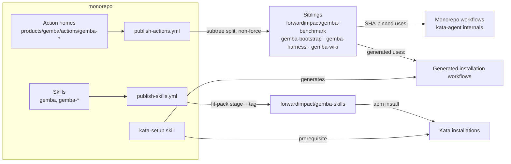

# Design 2280-a: Gemba-Prefixed Distribution

Spec 2280 renames the four Gemba actions to `gemba-*`, publishes the platform
skills as a `gemba-skills` sibling pack, and updates kata-setup to teach both.
This design fixes the components, interfaces, and rollout. It changes no
runtime behavior. Every action and skill keeps its contents; only names,
publish targets, and references move.

## Component map

## Components

| Component | Where | Change |
| --------- | ----- | ------ |
| Action homes | `products/gemba/actions/` | Four directories rename to `gemba-benchmark`, `gemba-bootstrap`, `gemba-harness`, `gemba-wiki`. The self- and cross-references inside the four homes (READMEs, action metadata, the benchmark reusable workflow) repoint to the `gemba-*` names, and each home stays the byte-faithful mirror of its sibling repo root. |
| Action publish workflow | `publish-actions.yml` | The four matrix entries pair each renamed prefix with its renamed repo. The `paths:` filter follows. Kata and Jidoka entries are untouched. |
| Sibling action repos | GitHub org | Operator renames the four repos in place. Redirects, tags, and commit SHAs survive, so existing pins resolve throughout. |
| Split lineage | A new runbook part in this spec's plan | The prefix rename changes the split lineage, so each renamed sibling gets one sanctioned re-seed force push, then publishes stay non-force. The plan carries its own runbook part; the spec 2140 runbook is the immutable precedent, not the home. |
| Skill-pack publish workflow | `publish-skills.yml` | The fit leg stages prefix `fit` alone, and the fit-skills README notes where the gemba skills moved. A new leg publishes `gemba-skills`: prefix `gemba`, version file `products/gemba/package.json` (also added to the workflow's `paths:` trigger), agents off, README and apm text describing the platform. |
| Pack sibling | `forwardimpact/gemba-skills` | Operator creates it with an initial commit, so the pack action's plain `git push` has a branch to land on. The first publish run stages the pack and tags it at the Gemba package version. |
| Reference consumers | `.github/workflows/`, `products/kata/actions/`, `products/jidoka/actions/` | Every `uses:` line repoints to the renamed sibling: SHA pins keep their SHA, tag pins keep their tag. The Jidoka action's metadata and README prose references follow. |
| kata-setup skill | `.claude/skills/kata-setup/` | Prerequisites add `apm install forwardimpact/gemba-skills`. The dispatch template, ref-resolution instructions, and placeholder tokens use the `gemba-*` names. |
| monorepo-setup skill | `.claude/skills/monorepo-setup/` | The pack install line adds `forwardimpact/gemba-skills`. |
| Product docs and skills | Gemba overview page, `gemba` skill, `gemba-benchmark` skill, benchmark CI guide | Action tables, `uses:` examples, and Getting Started name the `gemba-*` actions and the pack install. |
| CLI documentation parity | benchmark CLI definition + golden help output | The `documentation` entry's link text follows the renamed action, keeping the skill-to-CLI parity rule intact. |
| Enum and contributor docs | `.github/CLAUDE.md`, CLAUDE.md, KATA.md | The action table in `.github/CLAUDE.md` is the `sibling-composite-actions` enum source. It renames first; the fences reseed from it. The Distribution Model adds `gemba-skills` and remaps Gemba to it. |
| Repo-local paths | session hook, justfile, binaries publish workflow, split-and-push docstring, `.github/CLAUDE.md` | Installer invocations and path prose follow the home renames, including the split-and-push example prefix and the `.github/CLAUDE.md` bootstrap path. The installer file name stays `fit-install.sh`. |

## Interfaces

- **Action publish matrix rows** (shape per row, four rows):
  `prefix: products/gemba/actions/gemba-<name>` → `repo: gemba-<name>`.
- **Pack leg** (one new matrix entry): `prefix: gemba`, `repo: gemba-skills`,
  `version-file: products/gemba/package.json`, `sync-agents: "false"`. The
  workflow's `paths:` trigger gains `products/gemba/package.json`, so a Gemba
  version bump alone republishes and retags the pack.
- **kata-setup placeholders:** `{{KATA_AGENT_REF}}` stays.
  `{{FIT_BOOTSTRAP_REF}}`, `{{FIT_HARNESS_REF}}`, `{{FIT_WIKI_REF}}` become
  `{{GEMBA_BOOTSTRAP_REF}}`, `{{GEMBA_HARNESS_REF}}`, `{{GEMBA_WIKI_REF}}`.
- **Install command:** `apm install forwardimpact/gemba-skills`.

## Key decisions

| Decision | Choice | Rejected alternative and why |
| -------- | ------ | ---------------------------- |
| Sibling transition | Rename the repos in place | Create new repos and archive the old ones. That severs every existing SHA pin and tag, splits history across two repos, and doubles the org list. |
| Lineage after the prefix move | One sanctioned re-seed per renamed sibling | Keep the old prefix paths to preserve lineage. That breaks the home-mirrors-sibling rule (MONOREPO.md) and leaves the action homes unrenamed, which the spec requires. |
| Pack version source | The Gemba product package version | Keep Gear's version. It stamps platform skills with another product's version; jidoka-skills already versions by its product package. |
| Pack contents | Skills only, agents off | Sync agents into the pack. No gemba agent profiles exist; kata-skills stays the agents carrier. |
| Placeholder tokens | `{{GEMBA_*_REF}}` | Keep `{{FIT_*_REF}}`. The token names lie about the repos they resolve. |
| Enum propagation | Edit the md-table source, reseed the fences with the invariant tooling | Hand-edit each fence. The enumeration-drift invariant owns the fences; hand edits drift. |
| Old-name guard | Absence sweeps with hidden-file semantics (`--hidden`, `.git` excluded), immutable records excluded | Repo-wide rewrite including `specs/**` and changelogs. That rewrites history records. A sweep without `--hidden` misses `.github/**` and `.claude/**`, the largest consumer surfaces. |

## Rollout sequence

1. **Operator, before merge.** Rename the four sibling repos on GitHub. Create
   `forwardimpact/gemba-skills` with an initial commit. Verify the publishing
   App's installation covers all five repos.
2. **Merge.** The combined monorepo change lands on `main`: homes renamed,
   matrices repointed, skills and docs updated, fences reseeded.
3. **Operator, after merge.** Re-seed each renamed action prefix once with the
   same pinned split binary and a force push to the renamed sibling's `main`.
   Pre-rename tags keep the old commits reachable, so existing SHA pins
   resolve before, during, and after.
4. **Steady state.** Push-triggered publishes run non-force. The first
   `publish-skills.yml` run stages `gemba-skills` and tags it. The next
   release cut lays new version tags on the new lineage and moves only `v1`;
   the existing version tags stay on the old lineage as its anchors.
   Dependabot then carries new-lineage SHAs to consumers.

Two transient failure windows exist, both visible, scoped to the renamed legs
(`fail-fast: false`), and harmless because consumers keep resolving their
pinned old-lineage refs. Between steps 1 and 2, a `main` push that touches the
old action paths mints App tokens for repo names that no longer exist, so
those legs fail at the mint. Between steps 2 and 3, the split of each renamed
prefix produces a new lineage, so those legs fail as non-fast-forward until
the re-seed lands. Step 3 clears both.

## Clean break

This design removes:

- The four bare-name entries and path filters in the action publish matrix.
- The `fit gemba` two-prefix pack leg and its repeated-prefix bootstrap note.
- The `{{FIT_*_REF}}` placeholder tokens.
- The "Gemba — `fit-skills`" mapping and every authored
  `forwardimpact/{benchmark,bootstrap,harness,wiki}` reference.

The sibling repos are renamed, not duplicated. The redirects that keep old
pins resolving are GitHub-native. This design adds no shim it must maintain.
