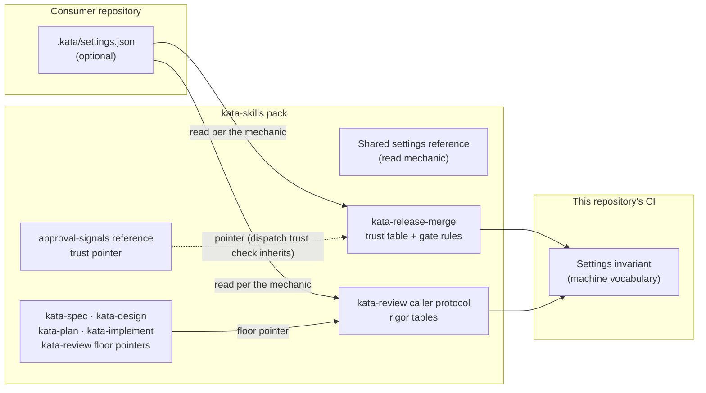

# Design 2290-a: Kata Settings File

Spec 2290 introduces `.kata/settings.json`, a repository-owned selector over
policy options the skills define. This design fixes the components, the key
vocabulary, the read mechanic, and the enforcement. It adds no runtime code.
The agent reads the file because the skill text says to, and an installation
without the file is untouched.

## Component map

The invariant validates the settings file only inside this repository, where
one may exist for the monorepo's own installation. Consumer files are governed
by the read mechanic's degradation rules alone.

## Components

| Component | Where | Role |
| --------- | ----- | ---- |
| Settings file | `.kata/settings.json` at the consumer repository root | One flat JSON object. Holds only selectors: identifiers from the owning tables, integers, or string lists. Optional. |
| Shared settings reference | New shared agent reference, shipped with the pack beside the other agent references | The single home for the read mechanic (§ Read mechanic). It points at the merge-gate skill for the gate-side rules; it does not restate them. |
| Trust options table and gate rules | `kata-release-merge` (its trust step is already the canonical trust home per the approval-signals reference) | Defines the `trustSource` rows and the companion parameters. The trust checklist item, the trust step, and the comment-gate step resolve the trusted set through the selected row. New checklist items carry the default-branch read, the fail-closed rule, and the `.kata/`-diff rule. |
| Trust pointer conversions | `kata-release-merge` references (comment gate, re-ping owner table, comment templates) and the approval-signals agent reference | Each restated trust-count literal becomes a pointer to the trust table. Templates name the configured trust source. The dispatch-side trust check inherits the configured source through the approval-signals pointer. |
| Rigor options tables | `kata-review` caller protocol (already owns panel composition) | Defines the `reviewPanel` profile rows and the `reviewBlockingSeverity` vocabulary. The panel-rationale reference explains profile intent instead of restating fixed sizes. |
| Floor pointers | `kata-review` severity-vocabulary caller obligation; both floor restatements (exit checklist and panel step) in `kata-spec`, `kata-design`, `kata-plan`, `kata-implement` | Each points at the caller protocol's configured floor. |
| Settings invariant | `.jidoka/invariants/` rule module in this repository | Holds the machine-readable key vocabulary, validates the settings file when present, and checks each options table against the vocabulary. The table-agreement check reuses the enumeration-drift pattern. |
| Setup and orientation | `kata-setup` output note; one KATA.md paragraph | Name the optional file and point at the owning tables. Neither restates a vocabulary. |

## Key vocabulary (the interface)

| Key | Type | Vocabulary | Default |
| --- | ---- | ---------- | ------- |
| `trustSource` | identifier | `top-contributors`, `allowlist` | `top-contributors` |
| `trustContributorCount` | integer ≥ 1 | — | `7` |
| `trustAllowlist` | string list | tracker logins | `[]` |
| `reviewPanel` | identifier | `light`, `standard`, `thorough` | `standard` |
| `reviewBlockingSeverity` | identifier | `blocker`, `high`, `medium`, `low` | `medium` |

One key never changes another key's meaning. The two trust parameters each
apply under one `trustSource` row (`trustContributorCount` under
`top-contributors`, `trustAllowlist` under `allowlist`); an inapplicable key
is ignored, and the owning table says so per row. Two fixed points sit outside
the vocabulary: the CI app identity stays trusted by definition under every
`trustSource`, and `allowlist` with an empty `trustAllowlist` therefore
trusts no human. The owning table documents that fail-closed edge.

Panel profile rows (owned by the caller protocol; sizes per panel):

| Profile | Spec panels | Design/plan panels | Implementation panels |
| ------- | ----------- | ------------------ | --------------------- |
| `light` | product 1 + technical 1 | technical 1 + devex 1 | technical 1 + devex 1 |
| `standard` (default) | product 3 + technical 3 | technical 3 + devex 3 | technical 5 + devex 3 |
| `thorough` | product 5 + technical 5 | technical 5 + devex 5 | technical 5 + devex 5 |

The consensus threshold stays ≥⌈N/2⌉ for any panel size. The severity floor
means: address every confirmed consensus finding at the floor severity or
above. `medium` reproduces today's blocker/high/medium rule.

## Read mechanic

The shared reference owns these rules. Skills read `.kata/settings.json` from
the repository root at invocation.

- **Absent file or absent key.** Select the marked default.
- **Unreadable configuration.** A file that fails to parse, or a known key
  with an out-of-vocabulary or out-of-range value, splits by consumer class.
  A non-gate skill selects the marked default and reports the problem on its
  coordination surface (a PR comment when the run owns one, the session
  output otherwise). The merge gate fails closed: trust-gated merges block
  with the named reason `settings unreadable`, owned by a trusted human.
- **Unknown key.** No effect. Reported like an unreadable value.

The gate-side rules live in the merge-gate skill, and the reference points at
them:

- The gate reads the file from the default branch (the committed trunk
  state), never from a PR head or a worktree that contains PR content.
- A diff that touches `.kata/` merges only on a trusted human's explicit
  signal on that change, pinned to the approved head, per the existing
  approval-signal classes. No agent-originated approval qualifies, whatever
  the PR's type or phase.

## Key decisions

| Decision | Choice | Rejected alternative and why |
| -------- | ------ | ---------------------------- |
| Loader | The agent reads the file per skill text | A harness or library loader. It couples published skills to one runtime, breaks standalone IDE use, and adds a moving part every consumer must run. |
| File shape | Flat keys, scalar or string-list values | Grouped objects with named references (trust groups, per-gate overrides). Model-side joins and polymorphic shapes degrade instruction-following, and no code resolver exists to absorb them. |
| Panel configuration | Named profiles | Per-caller numeric keys. Free numerics create untested combinations and let one typo run a 9-reviewer panel; a profile row is one lookup with reviewed contents. |
| Vocabulary home | The owning skill's options table | Semantics in the JSON file or a schema document. Two homes drift; the table is the layer agents already load. |
| Absent configuration | Defaults equal current behavior | Fail-loud on a missing optional file. That turns absence into an outage; every existing installation must keep working unchanged. |
| Invalid explicit configuration at the gate | Fail closed | Degrade to defaults. An unreadable allowlist that silently widens trust back to the contributor ranking is a trust escalation, the reverse of the file's intent. |
| Enforcement | Invariant holds the machine vocabulary and checks the tables against it | A standalone JSON Schema shipped in the pack. Nothing runs it in a consumer repo; the invariant reuses the repository's existing stop-the-line channel. |
| Gate read source | Default branch | Working tree. A PR that edits `.kata/settings.json` could weaken the trust gate that judges the same PR. |

## Clean break

This design removes every fixed policy literal outside the owning tables:

- **Trust.** The top-seven literals in the merge-gate skill (trust checklist
  item, trust step, comment-gate step) and in its references (comment gate,
  re-ping owner table, the two comment templates), plus the approval-signals
  trust sentence. Each survives only as the trust table's marked default row
  or a pointer to it.
- **Rigor.** The fixed panel sizes in the caller protocol and the size
  literals in the panel-rationale reference, both subsumed by the profile
  table. The blocker/high/medium floor restatements: two in each of the four
  phase skills and one in the review skill's caller obligation, each replaced
  by a pointer to the configured floor.

No environment variable, no fallback mechanism, and no second read path
exists. The pack ships one mechanic in one reference.
