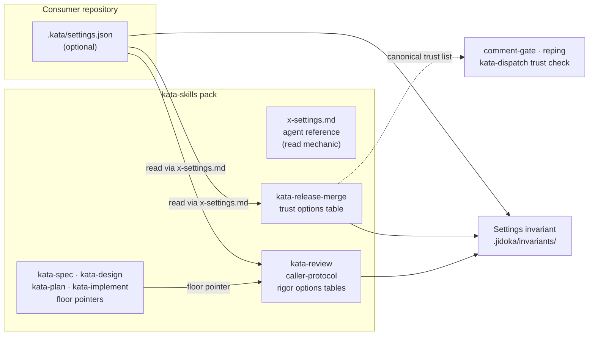

# Design 2290-a: Kata Settings File

Spec 2290 introduces `.kata/settings.json`, a repository-owned selector over
policy options the skills define. This design fixes the components, the key
vocabulary, the read mechanic, and the enforcement. It adds no runtime code.
The agent reads the file because the skill text says to. Every default
reproduces current behavior, so an installation without the file is untouched.

## Component map

## Components

| Component | Where | Role |
| --------- | ----- | ---- |
| Settings file | `.kata/settings.json` at the consumer repository root | One flat JSON object. Holds only selectors: identifiers from the owning tables, integers, or string lists. Optional; absence selects every default. |
| Settings mechanic reference | New shared agent reference (`x-settings.md`), shipped with the pack beside the other agent references | The single home for the read mechanic: file location, absent-file and absent-key semantics, unparseable-file semantics, the defaults-equal-current-behavior principle, and the rule that a key no table defines has no effect and is surfaced as a finding. |
| Trust options table | `kata-release-merge` (its trust step is already the canonical trust home per the approval-signals reference) | Defines `trustSource` rows and the `trustContributorCount` / `trustAllowlist` parameters. The gate resolves the trusted set through the selected row. |
| Rigor options tables | `kata-review` `references/caller-protocol.md` (already owns panel composition) | Defines `reviewPanel` profile rows and the `reviewBlockingSeverity` vocabulary. |
| Phase-skill floor pointers | `kata-spec`, `kata-design`, `kata-plan`, `kata-implement` | Each replaces its restated blocker/high/medium sentence with a pointer to the caller protocol's configured floor. |
| Settings invariant | `.jidoka/invariants/` rule module in this repository | Parses the settings file when present, rejects unknown keys and out-of-vocabulary values, and checks each options table against the machine-readable vocabulary the rule holds. |
| Setup and orientation | `kata-setup` output note; one KATA.md paragraph | Name the optional file and point at the owning tables. Neither restates a vocabulary. |

## Key vocabulary (the interface)

| Key | Type | Vocabulary | Default |
| --- | ---- | ---------- | ------- |
| `trustSource` | identifier | `top-contributors`, `allowlist` | `top-contributors` |
| `trustContributorCount` | integer ≥ 1 | — | `7` |
| `trustAllowlist` | string list | tracker logins | `[]` |
| `reviewPanel` | identifier | `light`, `standard`, `thorough` | `standard` |
| `reviewBlockingSeverity` | identifier | `blocker`, `high`, `medium`, `low` | `medium` |

Each key is independently meaningful. `trustContributorCount` applies only
under `top-contributors`; `trustAllowlist` applies only under `allowlist`; an
inapplicable key is ignored. The owning table documents this per row.

Panel profile rows (owned by the caller protocol; sizes per panel):

| Profile | Spec panels | Design/plan panels | Implementation panels |
| ------- | ----------- | ------------------ | --------------------- |
| `light` | product 1 + technical 1 | technical 1 + devex 1 | technical 1 + devex 1 |
| `standard` (default) | product 3 + technical 3 | technical 3 + devex 3 | technical 5 + devex 3 |
| `thorough` | product 5 + technical 5 | technical 5 + devex 5 | technical 5 + devex 5 |

The consensus threshold stays ≥⌈N/2⌉ for any panel size. The severity floor
means: address every confirmed consensus finding at the floor severity or
above. `medium` reproduces today's blocker/high/medium rule.

## Read mechanic

- Skills read `.kata/settings.json` from the repository root at invocation.
- An absent file, an absent key, or an unparseable file selects the marked
  defaults. An unparseable file is additionally surfaced as a finding.
- **Gate exception.** `kata-release-merge` reads the file from the default
  branch (the committed state on the trunk), never from a PR head or a
  worktree that contains PR content. All other skills read the working tree.
- A diff that touches `.kata/` is trust-sensitive at the gate: it merges only
  on the strictest human signal, the same treatment agent-instruction paths
  receive on the experiment path.

## Key decisions

| Decision | Choice | Rejected alternative and why |
| -------- | ------ | ---------------------------- |
| Loader | The agent reads the file per skill text | A harness or library loader. It couples published skills to one runtime, breaks standalone IDE use, and adds a moving part every consumer must run. |
| File shape | Flat keys, scalar or string-list values | Grouped objects with named references (trust groups, per-gate overrides). Model-side joins and polymorphic shapes degrade instruction-following, and no code resolver exists to absorb them. |
| Panel configuration | Named profiles | Per-caller numeric keys. Free numerics create untested combinations and let one typo run a 9-reviewer panel; a profile row is one lookup with reviewed contents. |
| Vocabulary home | The owning skill's options table | Semantics in the JSON file or a schema document. Two homes drift; the table is the layer agents already load. |
| Failure posture | Defaults equal current behavior | Fail-loud on any read problem. A hard failure turns a missing optional file into an outage; degrading to the known-safe posture keeps every existing installation working unchanged. |
| Enforcement | Invariant holds the machine vocabulary and checks the tables against it | A standalone JSON Schema shipped in the pack. Nothing runs it in a consumer repo; the invariant reuses the repository's existing stop-the-line channel, the same pattern the enumeration-drift rules use for fence agreement. |
| Gate read source | Default branch | Working tree. A PR that edits `.kata/settings.json` could weaken the trust gate that judges the same PR. |

## Clean break

This design removes:

- The fixed top-seven literal in the merge gate's trust step. It survives only
  as the marked default row of the trust table.
- The fixed panel sizes in the caller protocol. They survive only as the
  `standard` profile row.
- The restated blocker/high/medium floor sentences in the four phase skills.
  Each becomes a pointer to the configured floor.

No environment variable, no fallback mechanism, and no second read path
exists. The pack ships one mechanic in one reference.

## Consumer-side validation

Consumer repositories run no invariant from this repository. Their protection
is layered: defaults absorb every read failure, the mechanic reference tells
the agent to ignore and surface unknown keys, and the gate pins `.kata/`
changes behind the strictest human signal. The invariant here protects the
canonical pack: it stops a vocabulary and its owning table from drifting
apart before a sync ships the drift to every installation.
