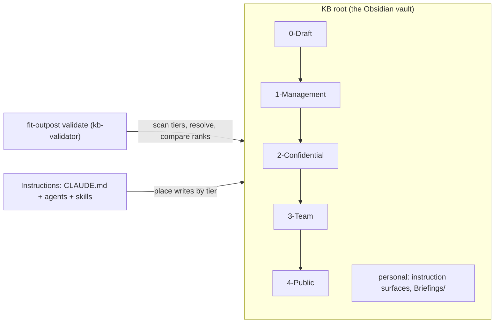

# Design 2310-a: Outpost Tiered Knowledge

Applies spec 2310 to the Outpost product. The knowledge base becomes an
ordered set of numbered tier directories at the vault root. The `Knowledge/`
wrapper and the personal `Drafts/` directory disappear, and `0-Draft/`
becomes the standard draft home. The tier order becomes a one-way link rule.
The whole instruction system (root CLAUDE.md, six agent profiles, every
skill) teaches placement by tier. `fit-outpost validate` gains knowledge
checks for rank uniqueness, link direction and resolution, and legacy-layout
detection. The change is a clean break and ships as the next major version
with a MIGRATION.md.

## Restated problem

One `Knowledge/` directory is one sharing unit with one audience, drafts have
no home in the graph, and a naive folder split leaks restricted titles
through wiki links while dangling for partial recipients. Success means: init
creates the five default tiers at the root, every instruction surface
declares tier placement, the validator reports rank, link, and legacy
violations with file and line, conforming full vaults and suffix subsets
pass, and the `Knowledge/` and `Drafts/` layout is gone from every template
and docs surface.

## Architecture

The KB root is the Obsidian vault. The numbered tier directories at the root
are the knowledge graph and the units of sharing. Tier names alone declare
the order, so any received subset carries its own declaration. Every other
root entry (the instruction surfaces and `Briefings/`) is personal and never
shared.



Arrows between tiers show the only legal link direction (§ Interfaces).
Sharing is cumulative by suffix and starts at tier 1. Tier 1 recipients hold
1–4, tier 2 recipients hold 2–4, tier 3 recipients hold 3–4, and tier 4 alone
can leave the team. `0-Draft/` is in the graph but in no share.

## Components

| Component | Where | Responsibility |
| --------- | ----- | -------------- |
| Tier layout | `<N>-<Label>/` directories at the KB root; default `0-Draft`, `1-Management`, `2-Confidential`, `3-Team`, `4-Public` created by init | The directory name carries the rank (leading integer) and the human label. The tier set is exactly the root directories that match the rank pattern, so a suffix subset is a valid vault. The pattern is therefore reserved: CLAUDE.md and MIGRATION.md instruct that personal root folders must not start with `<digits>-`, because a matching name becomes a tier. Entity subdirectories repeat per tier on demand, exactly as skills create them today. |
| KB validator | New validator module in the Outpost product, wired into the `validate` command | Reads the KB root and collects the tier directories. Flags duplicate ranks. Flags a legacy layout: `Knowledge/` or `Drafts/` at any time; one of the twelve historical entity directories (People, Organizations, Projects, Topics, Candidates, Priorities, Conditions, Roles, Prospects, Erasure, Tasks, Goals) at the root only while the root has no tiers, so a migrated vault may keep personal folders with those names; a target with no tiers at all. Legacy findings name MIGRATION.md. Indexes every file under the tiers (notes and assets such as candidate PDFs), extracts links from each note, and applies the resolution and legality contracts (§ Interfaces). Reports one line per finding and exits non-zero on any finding. Ignores every other root entry. |
| CLI surface | `fit-outpost validate [path]`; `init`; `update` | With a path, `validate` runs the knowledge checks on that one KB root (the vault directory that holds the tiers). A share recipient places received tier directories in their own KB root and passes it; `npx fit-outpost validate <path>` needs no scheduler. Without a path, `validate` runs the existing agent-definition checks and then the knowledge checks on every configured knowledge base; it does not treat the current directory as a target. `init` creates the five default tier directories plus `Briefings/` and no entity subdirectories. `update` installs the rewritten instructions, and installs MIGRATION.md while the KB still carries a legacy layout. |
| Root CLAUDE.md template | `templates/CLAUDE.md` | The one canonical home for the tier system: the root model (tiers are the graph, everything else at the root is personal), the tier table with default contents, the link rule, the placement rule (put each note in the widest tier whose whole audience may read it), the draft-promotion flow (mature in `0-Draft/`, a human moves the note to its tier, validate), the personal-folder naming rule, and the suffix sharing model, which replaces the "KBs are not Git repositories" statement. Operating Context reads Priorities and Conditions from every tier present. The Ethics & Integrity rules stay in force inside every tier. |
| Agent profiles | `templates/.claude/agents/*.md` (all six) | Each profile gains a `## Tiers` section with its read scope and default write tier, and every body path moves to the tier-prefixed form. Write defaults: `postman` writes `0-Draft` (its output is drafts); `concierge` and `librarian` write `3-Team`; `recruiter` and `head-hunter` write `2-Confidential`; `chief-of-staff` declares `none` (its output is personal `Briefings/`). No agent defaults to `1-Management`. |
| Skill set | `templates/.claude/skills/**` (SKILL.md, references, scripts) | Every SKILL.md carries a `Write tier:` declaration (`none` when it writes nothing into the graph) and uses tier-prefixed paths. Composing skills (`draft-emails`, `send-chat`, `doc-create`, `deck-create`, `deck-review`, `candidate-report`, `doc-collab` working copies) write to `0-Draft/`. The draft-status ID ledgers (`Drafts/handled`, `Drafts/ignored`) are agent state and move to the cache state directory. Entity routing follows the spec's default-contents mapping per entity type: general entities go to `3-Team`; Candidates, Prospects, Roles, and Erasure go to `2-Confidential`. `extract-entities` routes each entity type accordingly. `req-forget` sweeps every tier present and keeps its erasure record in `2-Confidential`. `changelog` writes one `CHANGELOG.md` per shared tier (ranks 1 and up); `0-Draft/` keeps none, and the root instruction CHANGELOG.md (`upstream-instructions`) is untouched. The link reference carries the tier-prefixed, vault-absolute link format (`[[3-Team/People/Sarah Chen]]`), which Obsidian resolves directly. Scripts with entity-path arguments (for example the CV bundle splitter) take tier-prefixed paths. |
| Facet overlays | Instruction convention in CLAUDE.md, `extract-entities`, and the `req-*` family | A sensitive facet of an entity lives as an overlay note at the same relative path in a narrower tier (`2-Confidential/People/Jane Doe.md`) and links to the canonical note in the wider tier (`3-Team/People/Jane Doe.md`). The canonical note never links back. Backlinks stay symmetric within a tier only, so the People-side backlinks the `req-*` skills write land on the `2-Confidential` overlay, never on the team note. An overlay duplicates a basename across tiers, so links to overlaid entities must be tier-prefixed; the link reference and MIGRATION.md state this. |
| MIGRATION.md | `templates/MIGRATION.md` | Step-by-step guidelines: create the tier directories at the root, move each note from `Knowledge/` into the widest permissible tier, move draft content from `Drafts/` into `0-Draft/` and the ID ledgers into the cache state directory, delete the empty `Knowledge/` and `Drafts/`, rewrite links to tier-prefixed form, split sensitive facets into overlays, split the old changelog per shared tier, rename personal root folders that match the rank pattern, share suffixes, and finish when `validate` passes. Also states the future-link consequence: a link to a not-yet-created note fails validation, so create the target or defer the link. |
| Docs and published skill | Outpost product page, getting-started guide, knowledge-systems guides, `fit-outpost` skill | Carry the tier table, the root model, the sharing model, and the validate command. `Knowledge/` and `Drafts/` example paths are rewritten. The skill's Documentation list and the CLI `documentation` array stay in parity. |
| Release | kata-release-cut | The shipping release is the next major of the Outpost npm package, and its notes name the break and point to MIGRATION.md. |

## Interfaces

- **Tier rank contract.** The rank of a path is the leading integer of its
  first segment under the KB root (`^[0-9]+-`). A lower rank means a narrower
  audience; rank 0 is the draft tier. Rank derives from the name alone, so
  validation needs no config and works on any suffix subset. Duplicate ranks
  are a finding.
- **Link legality predicate.** A link is legal when
  `rank(target) >= rank(source)`. Rank 0 sources may therefore link to
  everything, and no wider tier links into rank 0. Every target must live
  inside a tier. External URLs are out of scope.
- **Resolution contract** (the single home for the mechanics). Wiki links and
  embeds resolve from the KB root, with a unique-basename fallback. Relative
  markdown links resolve from the source note's directory. Targets may be
  notes or assets. A target that resolves to nothing or to more than one file
  is a finding; in a conforming vault a legal link always resolves inside the
  suffix the reader holds.
- **Finding shape.** Link findings carry
  `{kind, file, line, link, sourceTier, targetTier}` with kinds `unresolved`
  and `narrower-link`. Directory findings carry `{kind, path}` with kinds
  `legacy-layout`, `duplicate-rank`, and `no-tiers`, and name MIGRATION.md
  where migration is the fix. Exit code 0 means no findings; non-zero
  otherwise.
- **Instruction layering.** CLAUDE.md is the single home for the tier
  system's rules. Agent profiles and skills declare their own read scope and
  write tier and point to CLAUDE.md; they never restate the rule set.

## Key decisions

| Decision | Choice | Rejected alternative |
| -------- | ------ | -------------------- |
| Graph location | Tier directories directly at the vault root | A `Knowledge/` wrapper — one more path segment in every link and share for a directory with no audience meaning of its own. |
| Draft home | `0-Draft/` as the rank-0 tier inside the graph | A personal `Drafts/` outside the tier system — unvalidated links, no standard home, no promotion path into the graph. |
| Tier identity | Numbered directory prefix; the tier set is the matching directories present | A tier manifest file — a second source of truth that a partial share can omit. Per-note front matter is excluded by the spec. |
| Briefings | Stay a personal root surface outside the graph | Fold them into `0-Draft/` — a briefing is a finished per-owner deliverable, not work in progress awaiting placement. |
| Agent read scope | Every tier present, narrowable per agent in its `## Tiers` section | A fixed per-agent tier cap — it blinds the priority and briefing reads that justify the tiers (a tier-1 priority must steer the chief-of-staff), and the vault stays local to its owner either way. |
| Root policy | The validator checks tier directories and the legacy markers, and ignores other root entries; the entity-name heuristic applies only to tier-less roots | Police every root entry — the root is personal by doctrine; permanent name reservation — a migrated vault could never hold a personal `Projects/` again. |
| Link rule enforcement | Static validation in the CLI over the files themselves | Share-time scrubbing or reviewer discipline — unenforceable and invisible to agents. |
| Entity taxonomy | Repeated per tier on demand; canonical note in the widest permissible tier; narrower facets as one-way overlays | One canonical entity tree with sensitive fields inline — the sensitive fields would sit in team-wide notes, the leak this spec removes. |
| Tier routing granularity | Per entity type (spec's default-contents mapping) | Per skill — `extract-entities` touches general and recruitment entities, so one per-skill tier would route `Roles/` to two homes. |
| Backlink convention | Symmetric within a tier only; cross-tier references are one-way from the narrower note | Always-symmetric backlinks — the wider note would name the narrower note and leak its existence. |
| Changelog | One `CHANGELOG.md` per shared tier; none in `0-Draft/` | One shared changelog — its entries name narrow-tier notes to the widest audience. |
| Validator home | Extend `fit-outpost validate` with an optional KB-root path; a pure module carries the checks | A new subcommand — a second validation entry point. An Obsidian plugin — per-user install, not scriptable for agents or CI. |
| Link resolution | Per the resolution contract (§ Interfaces) | Full Obsidian "shortest unique path" emulation — setting-dependent and complex. A notes-only index — briefs link candidate PDFs, so conforming vaults would fail. Skipping unresolved links — hides leaks and broken shares. |
| Migration delivery | `update` installs MIGRATION.md while a legacy layout remains, and skips it once the KB conforms | Docs-site-only guidance — the person running `update` never sees it when the break lands. Unconditional install — re-litters migrated vaults. |
| Default write tiers | Per the agent-profile mapping; no agent defaults to `1-Management` | Tier-1 write defaults — scheduled agents would silently mint management-only content the user never placed. |

## Data flow

```mermaid
sequenceDiagram
  participant U as user or agent
  participant CLI as fit-outpost validate
  participant V as kb-validator
  participant KB as KB root
  U->>CLI: validate [path]
  CLI->>CLI: no path: agent-definition checks, then each configured KB
  CLI->>V: knowledge checks (per KB root)
  V->>KB: read root → tier set; legacy, duplicate-rank, no-tiers findings
  V->>KB: index all files under the tiers, extract links per note
  V->>V: resolve targets, compare ranks
  V-->>CLI: findings
  CLI-->>U: report one line per finding; one exit code
```

## Success criteria coverage

| # | Met by |
| - | ------ |
| 1 | CLI surface component: init creates the five tier directories, `Briefings/`, and the bundled files only. |
| 2 | Root CLAUDE.md template component. |
| 3 | Agent profiles component: `## Tiers` section in all six profiles, `none` allowed. |
| 4 | Skill set component: `Write tier:` declaration in every SKILL.md. |
| 5 | KB validator: duplicate-rank, narrower-link, and unresolved findings; non-zero exit. |
| 6 | Tier rank contract: rank from names alone, so full vaults and suffix subsets validate identically. |
| 7 | Legacy detection: `Knowledge/`, `Drafts/`, entity names at tier-less roots, and `no-tiers` targets, each naming MIGRATION.md. |
| 8 | MIGRATION.md component: shipped in templates, installed by `update` on a legacy KB. |
| 9 | Skill set + agent profiles + CLAUDE.md rewrite removes every `Knowledge/` and `Drafts/` path; verified by the spec's `--hidden` `rg` gate with the MIGRATION.md carve-out. |
| 10 | Docs and published skill component, including rewritten example paths. |
| 11 | Skill set component: per-shared-tier changelog. |
| 12 | Implementation lands with product tests for validator, init, and update; the repository check and test commands gate the PR. |
| 13 | Release component: next-major cut per kata-release-cut. |

## Clean break and scope

Removed with no shim: the `Knowledge/` wrapper directory and every reference
to it, the personal `Drafts/` directory (drafts move to `0-Draft/`, the ID
ledgers move to the cache state directory), the un-tiered workspace layout
and the "KBs are not Git repositories" sharing statement in the template
CLAUDE.md, and the single shared changelog convention. `validate` stops being
silent about knowledge content. No compatibility mode reads the old layout; a
legacy KB fails validation and MIGRATION.md is the path forward. Access
enforcement, sync tooling, encryption, and the Outpost trust-boundary
architecture stay untouched per the spec's exclusions.
