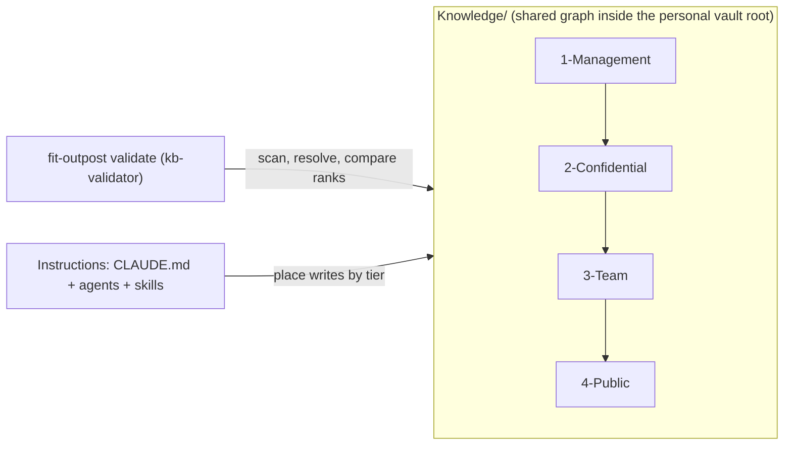

# Design 2310 — Outpost Tiered Knowledge

Applies spec 2310 to the Outpost product: `Knowledge/` becomes an ordered set
of numbered tier directories, the tier order becomes a one-way link rule, the
whole instruction system (root CLAUDE.md, six agent profiles, every
Knowledge-touching skill) teaches placement by tier, and `fit-outpost
validate` gains knowledge checks that enforce tier membership, rank
uniqueness, and link direction. The change is a clean break and ships as the
next major version with a MIGRATION.md.

## Restated problem

One `Knowledge/` directory is one sharing unit with one audience. Teams hold
knowledge with several audiences (management internals, recruitment and
compensation, team-wide notes, outward-shareable content). Obsidian wiki
links carry titles across notes, so a naive folder split leaks restricted
titles into wide audiences and dangles links for partial recipients. Success
means: init creates default tiers, every instruction surface declares tier
placement, the validator reports narrower-tier links and untiered content
with file and line, conforming full vaults and suffix subsets pass, and the
un-tiered layout is gone from every template and docs surface.

## Architecture

The personal KB root stays the Obsidian vault. `Knowledge/` inside it holds
the tiers. Tier names alone declare the order, so any received subset carries
its own declaration.



Arrows inside `Knowledge/` show the only legal link direction: a note links
to its own tier or a wider tier (higher rank number). Sharing is cumulative
by suffix: tier 1 recipients hold 1–4, tier 2 recipients hold 2–4, tier 3
recipients hold 3–4, and tier 4 alone can leave the team. Every shared suffix
is link-closed: all links resolve inside what the recipient received, and no
link in wider content names a narrower tier's note.

## Components

| Component | Where | Responsibility |
| --------- | ----- | -------------- |
| Tier layout | `Knowledge/<N>-<Label>/` directories; default `1-Management`, `2-Confidential`, `3-Team`, `4-Public` created by init | The directory name carries the rank (leading integer) and the human label. The tier set is exactly the numbered directories present, so a suffix subset is a valid vault. Two directories with the same rank are a validation finding. Entity subdirectories repeat per tier on demand, exactly as skills create them today. |
| KB validator | New validator module in the Outpost product, wired into the `validate` command | Walks `Knowledge/`: flags top-level entries that are not tier directories (dotfiles ignored) and duplicate ranks; indexes **every file** under the tiers (notes and assets such as candidate PDFs); extracts wiki links, embeds, and non-URL markdown links from each note; resolves wiki links and embeds from the `Knowledge/` root with a unique-basename fallback, and resolves relative markdown links from the source note's directory; emits a finding per unresolved target and per link whose target rank is lower than its source rank. Reports `file:line — kind — link` and exits non-zero on any finding. `untiered` and `legacy-layout` findings name MIGRATION.md; the legacy check recognizes the template's historical entity set (People, Organizations, Projects, Topics, Candidates, Priorities, Conditions, Roles, Prospects, Erasure, Tasks) directly under `Knowledge/`. |
| CLI surface | `fit-outpost validate [path]`; `init`; `update` | `[path]` names the KB root (the directory that holds `Knowledge/`), defaulting to the current directory, the same convention `update [path]` uses today. A share recipient holds their own KB root and places received tier directories inside their own `Knowledge/`, per the sharing model, so validation always anchors on a KB root; `npx fit-outpost validate` needs no scheduler. Without a path the command also validates every configured knowledge base after the existing agent-definition checks. `init` creates the four default tier directories and no entity subdirectories. `update` installs the rewritten instructions, and installs MIGRATION.md while the KB still carries un-tiered content. |
| Root CLAUDE.md template | `templates/CLAUDE.md` | The one canonical home for the tier system: the tier table with default contents, the link rule, the placement rule (put each note in the widest tier whose whole audience may read it), the suffix sharing model (replacing the "KBs are not Git repositories" statement), and the tier-aware workspace layout. Operating Context reads Priorities and Conditions from every tier present. The Ethics & Integrity rules stay in force inside every tier. |
| Agent profiles | `templates/.claude/agents/*.md` (all six) | Each profile gains a `## Tiers` section: read scope (every tier present in the KB) and a default write tier — `postman`, `concierge`, `librarian` write `3-Team`; `recruiter` and `head-hunter` write `2-Confidential`; `chief-of-staff` declares write tier `none` (its output is personal `Briefings/`). No agent defaults to `1-Management`; tier-1 content is placed by the user or by explicit instruction. |
| Skill set | `templates/.claude/skills/**` (SKILL.md, references, scripts) | Every Knowledge-touching skill carries a `Write tier:` declaration (`none` for read-only skills) and uses tier-prefixed paths. Routing follows the spec's default-contents mapping **per entity type**, not per skill: People, Organizations, Projects, Topics, Priorities, Conditions, and Tasks go to `3-Team`; Candidates, Prospects, Roles, and Erasure go to `2-Confidential`. `extract-entities` therefore writes general entities to `3-Team` and routes its Role and Candidate enrichment to `2-Confidential`. `req-forget` sweeps every tier present and keeps its erasure record in `2-Confidential`. `changelog` writes one `CHANGELOG.md` per tier, each scoped to that tier's notes. The link reference carries the tier-prefixed link format (`[[3-Team/People/Sarah Chen]]`), extending today's graph-absolute convention, which Obsidian resolves by path suffix exactly as it resolves the current prefix-free form. Scripts with entity-path arguments (for example the CV bundle splitter) take tier-prefixed paths. |
| Facet overlays | Instruction convention in CLAUDE.md and `extract-entities` | A sensitive facet of an entity lives as an overlay note at the same relative path in a narrower tier (`2-Confidential/People/Jane Doe.md`) and links to the canonical note in the wider tier (`3-Team/People/Jane Doe.md`). The canonical note never links back. Backlinks stay symmetric within a tier only. |
| MIGRATION.md | `templates/MIGRATION.md` | Step-by-step guidelines: create the tier directories, move each note into the widest permissible tier, rewrite links to tier-prefixed form, split sensitive facets into overlays, split the old changelog, share suffixes, and finish when `validate` passes. Also states the future-link consequence: a link to a not-yet-created note fails validation, so create the target or defer the link. |
| Docs and published skill | Outpost product page, getting-started guide, knowledge-systems guides, `fit-outpost` skill | Carry the tier table, the sharing model, and the validate command; un-tiered example paths are rewritten. The skill's Documentation list and the CLI `documentation` array stay in parity. |
| Release | kata-release-cut | The shipping release is the next major of the Outpost npm package, and its notes name the break and point to MIGRATION.md. |

## Interfaces

- **Tier rank contract.** The rank of a path is the leading integer of its
  first segment under `Knowledge/` (`^[1-9][0-9]*-`). A lower rank means a
  narrower audience. Rank derives from the name alone, so validation needs no
  config and works on any suffix subset. Duplicate ranks are a finding.
- **Link legality predicate.** A link is legal when
  `rank(target) >= rank(source)`. Wiki links, embeds, and relative markdown
  links follow the same predicate; targets may be notes or assets. External
  URLs are out of scope.
- **Finding shape.** `{kind, file, line, link, sourceTier, targetTier}` with
  kinds `untiered`, `legacy-layout`, `duplicate-rank`, `unresolved`, and
  `narrower-link`. Exit code 0 means no findings; non-zero otherwise. An
  `unresolved` finding is a real defect in a conforming vault, because a
  legal link always resolves inside the suffix the reader holds. `untiered`
  and `legacy-layout` findings carry the MIGRATION.md pointer.
- **Instruction layering.** CLAUDE.md is the single home for the tier
  system's rules. Agent profiles and skills declare their own read scope and
  write tier and point to CLAUDE.md; they never restate the rule set.

## Key decisions

| Decision | Choice | Rejected alternative |
| -------- | ------ | -------------------- |
| Tier identity | Numbered directory prefix; the tier set is the directories present | A tier manifest file — a second source of truth that a partial share can omit, breaking suffix validation. Per-note front matter is excluded by the spec. |
| Link rule enforcement | Static validation in the CLI over the files themselves | Share-time scrubbing or reviewer discipline — unenforceable, leaks by default, and invisible to agents. |
| Entity taxonomy | Repeated per tier on demand; canonical note in the widest permissible tier; narrower facets as overlay notes linking one way | One canonical entity tree with sensitive fields inline — the sensitive fields would sit in team-wide notes, which is the leak this spec removes. |
| Tier routing granularity | Per entity type (spec's default-contents mapping) | Per skill — `extract-entities` touches both general and recruitment entities, so a single per-skill tier would route `Roles/` to two different homes. |
| Backlink convention | Symmetric backlinks within a tier only; cross-tier references are one-way from the narrower note | Always-symmetric backlinks — the wider note would name the narrower note and leak its existence. |
| Changelog | One `CHANGELOG.md` per tier | Keep the single `Knowledge/CHANGELOG.md` — its entries name narrow-tier notes to the widest audience. |
| Validator home | Extend `fit-outpost validate` with an optional KB-root path; extraction and comparison live in a pure module | A new subcommand — a second validation entry point for one product. An Obsidian plugin — per-user install, not scriptable for agents or CI. |
| Link resolution | Wiki links and embeds resolve from the `Knowledge/` root with a unique-basename fallback; relative markdown links resolve from the source note's directory; all files under the tiers are index targets; anything ambiguous or missing is a finding | Emulating Obsidian's full "shortest unique path" behavior — setting-dependent and complex. A notes-only index — the templates link candidate PDFs from briefs, so a conforming vault would fail. Silently skipping unresolved links — hides both leaks and broken shares. |
| Untiered content | Any non-tier top-level entry is a finding that names MIGRATION.md | Grandfathering un-tiered notes — backward compatibility is excluded by the spec. |
| Migration delivery | `update` installs MIGRATION.md while un-tiered content remains, and skips it once the KB conforms | Docs-site-only migration guidance — the person running `update` inside a KB never sees the site page at the moment the break lands. Unconditional install — re-litters every migrated vault on every future update. |
| Default write tiers | Per the agent-profile mapping; no agent defaults to `1-Management` | Letting agents default writes into tier 1 — scheduled agents would silently mint management-only content the user never placed. |

## Data flow

```mermaid
sequenceDiagram
  participant U as user or agent
  participant CLI as fit-outpost validate
  participant V as kb-validator
  participant KB as Knowledge/
  U->>CLI: validate [path]
  CLI->>CLI: agent-definition checks (no path given)
  CLI->>V: knowledge checks (per KB root)
  V->>KB: walk top level → tier set, untiered/legacy/duplicate-rank findings
  V->>KB: index all files, extract links per note
  V->>V: resolve targets, compare ranks
  V-->>CLI: findings [{kind, file, line, link, tiers}]
  CLI-->>U: report file:line per finding; one exit code
```

## Success criteria coverage

| # | Met by |
| - | ------ |
| 1 | CLI surface component: init creates the four tier directories only. |
| 2 | Root CLAUDE.md template component: canonical tier table, link rule, placement rule, sharing model. |
| 3 | Agent profiles component: `## Tiers` section in all six profiles, `none` allowed. |
| 4 | Skill set component: `Write tier:` declaration in every Knowledge-touching skill. |
| 5 | KB validator: `narrower-link` findings with file, line, target; non-zero exit. |
| 6 | Tier rank contract: rank from names alone, so full vaults and suffix subsets validate identically. |
| 7 | `legacy-layout` and `untiered` findings name MIGRATION.md. |
| 8 | MIGRATION.md component: shipped in templates, installed by `update` on a legacy KB. |
| 9 | Skill set + agent profiles + CLAUDE.md rewrite removes every un-tiered `Knowledge/` path; verified by the spec's widened `rg` gate. |
| 10 | Docs and published skill component, including rewritten example paths. |
| 11 | Skill set component: per-tier changelog. |
| 12 | Implementation lands with product tests for validator, init, and update; the repository check and test commands gate the PR. |
| 13 | Release component: next-major cut per kata-release-cut. |

## Clean break and scope

Removed with no shim: the un-tiered workspace layout and the "KBs are not
Git repositories" sharing statement in the template CLAUDE.md, every
un-tiered `Knowledge/<Entity>/` path in agent profiles, skills, references,
scripts, and docs pages, and the single shared changelog convention.
`validate` stops being silent about knowledge content. No compatibility mode
reads the old layout; an un-tiered KB fails validation and MIGRATION.md is
the path forward. Access enforcement, sync tooling, encryption, and the
Outpost trust-boundary architecture stay untouched per the spec's
exclusions.
