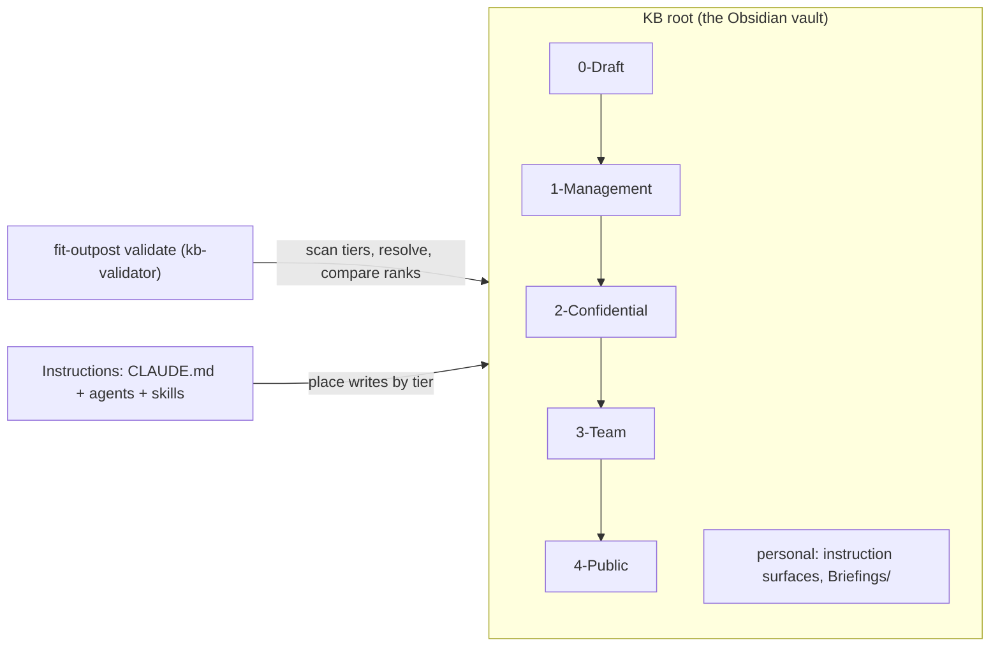

# Design 2310-a: Outpost Tiered Knowledge

Applies spec 2310 to the Outpost product. The knowledge base becomes an
ordered set of numbered tier directories at the vault root. The `Knowledge/`
wrapper and the personal `Drafts/` directory disappear. `0-Draft/` becomes
the owner-only tier for work in progress and permanent owner-only material.
Two actions move content outward: promote (a human moves a note into its
tier) and export (a skill sends a copy through a channel; the note keeps its
tier). The tier order becomes a one-way link rule. Root CLAUDE.md, the six
agent profiles, and every skill teach placement by tier.
`fit-outpost validate` gains knowledge checks: rank grammar and uniqueness,
link direction, resolution, and format, path-string and legacy-layout
detection, machine-readable output, a findings baseline, and frontmatter and
tag conformance backed by a registry file. The change is a clean break and
ships as the next major version with a MIGRATION.md playbook.

## Restated problem

One `Knowledge/` directory is one sharing unit with one audience, drafts
and permanent owner-only material have no home in the graph, a naive
folder split leaks restricted titles through wiki links while dangling for
partial recipients, and notes carry no machine-readable metadata, so tier
folders would also cut every cross-tier view. Success means: init creates
the default tiers, every surface declares placement, the validator reports
each violation kind, and the legacy layout is gone from every surface.

## Architecture

The KB root is the Obsidian vault. The numbered tier directories at the root
are the knowledge graph and the units of sharing. Tier names alone declare
the order, so any received subset carries its own declaration. Every other
root entry (instruction surfaces, `Briefings/`) is personal and never shared.



Arrows between tiers show the only legal link direction (§ Interfaces).
Sharing is cumulative by suffix and starts at tier 1. Tier 1 recipients hold
1–4, tier 2 recipients hold 2–4, tier 3 recipients hold 3–4, and tier 4 alone
can leave the team. `0-Draft/` is in the graph but in no share; it holds
drafts and permanent owner-only notes. A shared tier directory is typically
a symlink into a separately synced folder; the rank derives from the
symlink's own name at the vault root, and validation follows the symlink.

## Components

| Component | Where | Responsibility |
| --------- | ----- | -------------- |
| Tier layout | `<N>-<Label>/` directories at the KB root; default `0-Draft`, `1-Management`, `2-Confidential`, `3-Team`, `4-Public` created by init | The directory name carries the rank and the human label. The rank grammar is one digit followed by a dash (`^[0-9]-`), so a date-prefixed personal folder such as `2026-Archive/` never reads as a tier. The tier set is exactly the root entries that match the grammar, so a suffix subset is a valid vault. A tier entry may be a symlink into a sync target; the rank comes from the link's own name, and the target's basename does not matter. CLAUDE.md and MIGRATION.md instruct that personal root folders must not match the grammar. Entity subdirectories repeat per tier on demand, exactly as skills create them today. |
| KB validator | New validator module in the Outpost product, wired into the `validate` command | Reads the KB root and collects the tier directories, following symlinks. Flags duplicate ranks and out-of-grammar near misses (a two- or three-digit dash prefix reads as a malformed tier attempt; four or more digits read as a date-prefixed personal folder and pass). Flags a legacy layout: `Knowledge/` or `Drafts/` at any time; one of the twelve historical entity directories (People, Organizations, Projects, Topics, Candidates, Priorities, Conditions, Roles, Prospects, Erasure, Tasks, Goals) at the root only while the root has no tiers, so a migrated vault may keep personal folders with those names; a target with no tiers at all. Legacy findings name MIGRATION.md. Indexes every file under the tiers (notes and assets such as candidate PDFs), extracts links and literal path strings from each note, and applies the resolution, legality, and format contracts (§ Interfaces). Reports one line per finding, or JSON on request, downgrades baselined findings to warnings, and exits non-zero on any new finding. Ignores every other root entry. Also runs one frontmatter pass per shared-tier note per the frontmatter and tag contract (§ Interfaces) and reads the registry file when present; registry-dependent checks skip without it, so recipient suffixes still validate. |
| CLI surface | `fit-outpost validate [path] [--json]`; `init`; `update` | With a path, `validate` runs the knowledge checks on that one KB root (the vault directory that holds the tiers). A share recipient places received tier directories in their own KB root and passes it; `npx fit-outpost validate <path>` needs no scheduler. `--json` prints the findings array instead of lines, so migration tooling can consume it. The validator reads a baseline file at the KB root when one exists (§ Interfaces). Without a path, `validate` runs the existing agent-definition checks and then the knowledge checks on every configured knowledge base; it does not treat the current directory as a target. `init` creates the five default tier directories plus `Briefings/`, no entity subdirectories, and no baseline. `init` also installs the default registry file (types with the directory-to-type map, per-type status vocabularies, tag rows with a tier bound and a retrieval intent, and rights values) at the KB root; the registry is a personal surface like the baseline. `update` installs the rewritten instructions, and installs MIGRATION.md while the KB still carries a legacy layout. |
| Root CLAUDE.md template | `templates/CLAUDE.md` | The one canonical home for the tier system: the root model (tiers are the graph, every root entry off the rank grammar is personal), the tier table with default contents, the link rule and link format, the placement rule in exclusion form (put each note in the widest tier that excludes every subject or party who must not read it; when no shared tier excludes them, the note lives in tier 0 permanently), the promote and export actions, the three overlay forms, the entry-routing and aggregate-default write rules, the no-redistribute marker, the personal-folder naming rule, and the suffix sharing model over mounts, which replaces the "KBs are not Git repositories" statement. Operating Context reads Priorities and Conditions from every tier present. The Ethics & Integrity rules stay in force inside every tier. Also the single home for the frontmatter and tag standard: the three-key core (`type`, `created`, `updated`), the conditional keys (`aliases`, `status`, `canonical`, `verified`) with their triggers, the serialization contract (a flat block at line 1, snake_case, ISO dates, quoted vault-absolute property links, the canonical key order), the reserved-key rules, the closed `topic/` tag taxonomy with per-tag tier bounds, the ownership split (agents stamp; humans edit the registry), the coherence recipes (Bases on `type` and `status`, aliases in the switcher, path-keyed graph groups), and the vault settings (absolute link format, same-folder note and attachment defaults). The vocabulary data lives in a registry file at the KB root; CLAUDE.md points to it. |
| Agent profiles | `templates/.claude/agents/*.md` (all six) | Each profile gains a `## Tiers` section with its read scope and default write tier, and every body path moves to the tier-prefixed form. Reports, indexes, and syntheses that draw on narrower-tier sources default to `0-Draft/`; promotion into a shared tier is a human act. Write defaults: `postman` writes `0-Draft` (its output is drafts); `concierge` and `librarian` write `3-Team`; `recruiter` and `head-hunter` write `2-Confidential`; `chief-of-staff` declares `none` (its output is personal `Briefings/`). No agent defaults to `1-Management`. Each `## Tiers` section adds one line: stamp the frontmatter standard per CLAUDE.md on every note written. No schema restatement. |
| Skill set | `templates/.claude/skills/**` (SKILL.md, references, scripts) | Every SKILL.md carries a `Write tier:` declaration (`none` when it writes nothing into the graph) and uses tier-prefixed paths. Composing skills (`draft-emails`, `send-chat`, `doc-create`, `deck-create`, `deck-review`, `candidate-report`, `doc-collab` working copies) write to `0-Draft/`, and sending a body through the existing mail, chat, or hand-over skills is an export: the note keeps its tier and no new channel ships. The draft-status ID ledgers (`Drafts/handled`, `Drafts/ignored`) are agent state and move to the cache state directory. Entry routing sends each dated entry to the note in the entry's own tier (a recruitment fact goes to the tier-2 overlay, never to the tier-3 canonical note). Entity routing follows the spec's default-contents mapping per entity type: general entities go to `3-Team`; Candidates, Prospects, Roles, and Erasure go to `2-Confidential`. `extract-entities` routes each entity type accordingly. `req-forget` sweeps every tier present and keeps its erasure record in `2-Confidential`. `changelog` writes one `CHANGELOG.md` per shared tier (ranks 1 and up); `0-Draft/` keeps none, and the root instruction CHANGELOG.md (`upstream-instructions`) is untouched. The link reference carries the tier-prefixed, vault-absolute link format (`[[3-Team/People/Sarah Chen]]`), which Obsidian resolves directly, and the format contract's bare-basename ban and entity-subdirectory exemption. Scripts with entity-path arguments (for example the CV bundle splitter) take tier-prefixed paths. Every SKILL.md adds one declaration beside `Write tier:`, in the same grammar: `Frontmatter: <type values stamped>` or `Frontmatter: none`. The extract-entities templates emit YAML frontmatter; a lifted `**Key:**` Info line leaves the body (one fact, one place); unmatched bold keys stay prose. The targeted-edit rule extends by one clause: an edit that updates the inline Last-seen line also stamps `updated`. The status-moving skills stamp `status` from the registry vocabulary. |
| Overlays | Instruction convention in CLAUDE.md, `extract-entities`, and the `req-*` family | A sensitive facet of an entity lives as an overlay note in a narrower tier. The overlay declares itself by its one-way link to the canonical note in the wider tier; the canonical note never links back. The same relative path (`2-Confidential/People/Jane Doe.md` over `3-Team/People/Jane Doe.md`) is the default convention, not a requirement, so a cross-entity overlay (a recruitment record as a person's confidential facet) is legal. Three forms: **facet** (the overlay holds the narrower sections), **timeline split** (the canonical log keeps wide-audience dated entries and the overlay holds narrower entries under the same date keys; a narrow-access reader merges the two chronologically), and **inverse stub** (when the canonical content is narrow but widely linked, a wider-tier stub carries only shareable identity facts and the narrow note links down to it). Link inversion is the mechanical move: a wider note's link into a narrower tier moves, with its one-line context, into the narrower note and leaves no tombstone. Backlinks stay symmetric within a tier only, so the People-side backlinks the `req-*` skills write land on the `2-Confidential` overlay, never on the team note. An overlay duplicates a basename across tiers; the tier-prefixed link format disambiguates. The overlay declaration is the `canonical` property: a quoted, tier-prefixed, vault-absolute link to the canonical note. Facet and timeline overlays keep the canonical note's `type`; a cross-entity overlay keeps its own. The overlay carries one audience-labeled alias. The canonical note carries no trace in any property, alias, or tag. A cross-tier duplicate basename in one family directory without `canonical` is the `overlay-undeclared` finding; legitimate duplicates go to the baseline. |
| MIGRATION.md | `templates/MIGRATION.md`; content drafted at `specs/2310-outpost-tiered-knowledge/MIGRATION.md` | The phased, human-gated, agent-executed playbook: eight phases (freeze, inventory, hygiene, move and rewrite, surgical split, convergence, repoint, cutover), each with an exit test; four human gates (the tier map, every tier-1 or tier-0 routing, the findings baseline, the share grants); a copy-first safety model (scheduler stopped, sync paused, work on a version-controlled copy); the deterministic split rules that make different agents produce the same splits; and a ready-to-run multi-agent workflow prompt. A by-design dangle (a scheduled skill mints links ahead of the target) goes to the baseline, not to a fix. The frontmatter backfill rides phases 1, 3, 4, 5, and 6: the census inventories metadata and Gate 1 approves the directory-to-type and status maps; Phase 3 stamps mechanically in the rewrite pass; Phase 4 stamps `canonical` on approved overlays; Phase 5 baselines frontmatter findings; the Phase 6 dry-run exit test also checks conforming frontmatter. |
| Docs and published skill | Outpost product page, getting-started guide, knowledge-systems guides, `fit-outpost` skill | Carry the tier table, the root model, the sharing model, the overlay forms, the export action, the validate command, and the frontmatter and tag standard with the Bases, alias, and graph payoff. `Knowledge/` and `Drafts/` example paths are rewritten. The skill's Documentation list and the CLI `documentation` array stay in parity. |
| Release | kata-release-cut | The shipping release is the next major of the Outpost npm package, and its notes name the break and point to MIGRATION.md. |

## Interfaces

- **Tier rank contract.** The rank of a path is the leading digit of its
  first segment under the KB root; the grammar is one digit followed by a
  dash (`^[0-9]-`). A lower rank means a narrower audience; rank 0 is the
  owner-only tier. Rank derives from the entry's own name alone (for a
  symlink, the link name, never the target's), so validation needs no config
  and works on any suffix subset. Duplicate ranks are a finding; so are
  near-miss prefixes per the validator's heuristic.
- **Link legality predicate.** A link is legal when
  `rank(target) >= rank(source)`. Rank 0 sources may therefore link to
  everything, and no wider tier links into rank 0. Every target must live
  inside a tier. A literal path string in a shared note that names a
  narrower tier or a personal surface is a finding too; this is mechanical
  path detection, not prose understanding. External URLs are out of scope.
- **Link format contract.** Wiki links and embeds in shared tiers (ranks 1
  and up) are tier-prefixed and vault-absolute; a bare-basename wiki link
  there is a finding, because overlays duplicate basenames across tiers.
  Tier-0 notes may use bare basenames. Relative links inside one entity
  subdirectory are exempt, so folder-atomic units move as single units.
- **Resolution contract** (the single home for the mechanics). Wiki links
  and embeds resolve from the KB root, with a unique-basename fallback.
  Relative markdown links resolve from the source note's directory.
  Resolution follows symlinked tiers. Targets may be notes or assets. A
  target that resolves to nothing or to more than one file is a finding; in
  a conforming vault a legal link always resolves inside the suffix the
  reader holds.
- **Finding shape and JSON output.** Link findings carry
  `{kind, file, line, link, sourceTier, targetTier}` with kinds
  `unresolved`, `ambiguous`, `narrower-link`, `bare-basename`, and
  `path-string`. Directory findings carry `{kind, path}` with kinds
  `legacy-layout`, `duplicate-rank`, `out-of-grammar-rank`, and `no-tiers`,
  and name MIGRATION.md where migration is the fix. `--json` emits the
  findings as one JSON array, each finding with a `baselined` boolean.
- **Baseline contract.** A baseline file at the KB root (a personal surface
  the migration commits; `validate` reads it when present) lists finding
  keys. A finding matches its baseline entry on kind, file, and link or
  path, never on line number, so edits elsewhere in a note do not resurface
  a grandfathered finding. Baselined findings report as warnings. Exit code
  0 means no new findings; non-zero otherwise.
- **Frontmatter and tag contract.** Shared-tier notes carry `type`,
  `created`, and `updated`; `aliases`, `status`, `canonical`, and `verified`
  follow validator-decidable triggers; vocabularies come from a registry
  file beside the baseline. Findings `frontmatter-missing`,
  `frontmatter-invalid`, `frontmatter-vocabulary`, and `overlay-undeclared`
  carry `{kind, file, line, property, value}` and baseline on property,
  plus value for vocabulary kinds, in place of link or path. Property wiki
  links are quoted and always vault-absolute (no entity-subdirectory
  exemption) and report through the link kinds above.
- **Instruction layering.** CLAUDE.md is the single rule home. Profiles and
  skills declare read scope and write tier, point to it, and restate nothing.

## Key decisions

| Decision | Choice | Rejected alternative |
| -------- | ------ | -------------------- |
| Graph location | Tier directories directly at the vault root | A `Knowledge/` wrapper — one more path segment in every link and share for a directory with no audience meaning of its own. |
| Draft and owner-only home | `0-Draft/` as the rank-0 tier inside the graph, holding drafts and permanent owner-only material | A personal `Drafts/` outside the tier system — unvalidated links, no standard home, no promotion path. A separate owner tier beside tier 0 — a second never-shared tier with identical rules. |
| Ad-hoc audiences | Export: a skill sends a copy through the existing channels and the note keeps its tier | A shared-tier placement per deliverable — no cumulative suffix expresses one named recipient or a peer panel. A new transport — the drafting and sending skills already own delivery. |
| Tier identity | A one-digit rank prefix; the tier set is the matching directories present | A tier manifest file — a second source of truth that a partial share can omit. Front matter as tier authority is excluded by the spec (coherence metadata is a separate decision row). A multi-digit grammar (`^[0-9]+-`) — date-prefixed personal folders such as `2026-Archive/` would become tiers. |
| Briefings | Stay a personal root surface outside the graph | Fold them into `0-Draft/` — a briefing is a finished per-owner deliverable, not work in progress awaiting placement. |
| Agent read scope | Every tier present, narrowable per agent in its `## Tiers` section | A fixed per-agent tier cap — it blinds the priority and briefing reads that justify the tiers (a tier-1 priority must steer the chief-of-staff), and the vault stays local to its owner either way. |
| Root policy | The validator checks tier directories and the legacy markers, and ignores other root entries; the entity-name heuristic applies only to tier-less roots | Police every root entry — the root is personal by doctrine; permanent name reservation — a migrated vault could never hold a personal `Projects/` again. |
| Link rule enforcement | Static validation in the CLI over the files themselves | Share-time scrubbing or reviewer discipline — unenforceable and invisible to agents. |
| Entity taxonomy | Repeated per tier on demand; canonical note in the widest permissible tier; narrower facets as one-way overlays in three forms, same relative path as default, cross-entity allowed | One canonical entity tree with sensitive fields inline — the sensitive fields would sit in team-wide notes, the leak this spec removes. A same-path requirement — it would outlaw the observed recruitment-record-as-facet case. |
| Tier routing granularity | Per entity type (spec's default-contents mapping), plus entry routing per dated entry | Per skill — `extract-entities` touches general and recruitment entities, so one per-skill tier would route `Roles/` to two homes. |
| Backlink convention | Symmetric within a tier only; cross-tier references are one-way from the narrower note | Always-symmetric backlinks — the wider note would name the narrower note and leak its existence. |
| Changelog | One `CHANGELOG.md` per shared tier; none in `0-Draft/` | One shared changelog — its entries name narrow-tier notes to the widest audience. |
| Validator home | Extend `fit-outpost validate` with an optional KB-root path; a pure module carries the checks | A new subcommand — a second validation entry point. An Obsidian plugin — per-user install, not scriptable for agents or CI. |
| Machine output | A `--json` flag on `validate` | A separate report subcommand — a second entry point for the same checks. |
| Known findings | A checked-in baseline file downgrades known findings to warnings; matching ignores line numbers | Failing on by-design dangles — scheduled skills mint links ahead of their targets, so the gate would never pass. Skipping unresolved links wholesale — hides leaks and broken shares. |
| Link resolution | Per the resolution contract (§ Interfaces) | Full Obsidian "shortest unique path" emulation — setting-dependent and complex. A notes-only index — briefs link candidate PDFs, so conforming vaults would fail. |
| Migration delivery | `update` installs MIGRATION.md while a legacy layout remains, and skips it once the KB conforms | Docs-site-only guidance — the person running `update` never sees it when the break lands. Unconditional install — re-litters migrated vaults. |
| Default write tiers | Per the agent-profile mapping; aggregates default to `0-Draft/`; no agent defaults to `1-Management` | Tier-1 write defaults — scheduled agents would silently mint management-only content the user never placed. |
| Coherence metadata | YAML properties plus registry-gated tags; the path stays the only tier authority; agents stamp in every tier and the validator enforces rank 1 and up | A tier or audience property — it drifts on promote and buys no retrieval (`path:` and `file.path` are native). Free tagging — agents over-generate plausible tags; only a closed registry survives. Per-family status key names — the validator enforces the (`type`, `status`) pair, so one key suffices. |

## Data flow

```mermaid
sequenceDiagram
  participant U as user or agent
  participant CLI as fit-outpost validate
  participant V as kb-validator
  participant KB as KB root
  U->>CLI: validate [path] [--json]
  CLI->>CLI: no path: agent-definition checks, then each configured KB
  CLI->>V: knowledge checks (per KB root)
  V->>KB: read root → tier set (follow symlinks); legacy, rank findings
  V->>KB: index all files under the tiers; extract links and path strings
  V->>V: resolve targets, compare ranks, check format, match baseline
  V-->>CLI: findings (new and baselined)
  CLI-->>U: one line per finding or JSON; non-zero only on new findings
```

## Success criteria coverage

| # | Met by |
| - | ------ |
| 1 | CLI surface component: init creates the five tier directories, `Briefings/`, the registry file, and the bundled files only. |
| 2 | Root CLAUDE.md template component: root model, link rule, exclusion-form placement, promote and export, three overlay forms, write rules, sharing over mounts. |
| 3 | Agent profiles component: `## Tiers` section in all six profiles, `none` allowed, no tier-1 default. |
| 4 | Skill set component: `Write tier:` declaration in every SKILL.md. |
| 5 | KB validator: duplicate-rank, out-of-grammar-rank, narrower-link, unresolved, ambiguous, and bare-basename findings with file, line, and target; non-zero exit. |
| 6 | Link legality predicate: the path-string finding. |
| 7 | Finding shape and baseline contracts: `--json` output; baselined findings warn, new findings fail. |
| 8 | Tier rank and resolution contracts: rank from names alone and symlink following, so full vaults, suffix subsets, and symlinked tiers validate identically. |
| 9 | Legacy detection: `Knowledge/`, `Drafts/`, entity names at tier-less roots, and `no-tiers` targets, each naming MIGRATION.md. |
| 10 | MIGRATION.md component: shipped in templates as the phased playbook, installed by `update` on a legacy KB. |
| 11 | MIGRATION.md convergence phase: the validator loop plus the split rules reach a pass over the seeded legacy fixture, with human input only at the gates. |
| 12 | Skill set + agent profiles + CLAUDE.md rewrite removes every `Knowledge/` and `Drafts/` path; verified by the spec's `--hidden` `rg` gate with the MIGRATION.md carve-out. |
| 13 | Docs and published skill component, including rewritten example paths. |
| 14 | Skill set component: per-shared-tier changelog, discovered inside tier directories only. |
| 15 | Implementation lands with product tests for validator, init, and update; the repository check and test commands gate the PR. |
| 16 | Release component: next-major cut per kata-release-cut. |
| 17 | Root CLAUDE.md template and CLI surface components: the standard's single canonical home plus the installed registry file. |
| 18 | Skill set and agent profiles components: the `Frontmatter:` declaration line and its `rg` gate. |
| 19 | KB validator component and the frontmatter and tag contract: fixtures for the four finding kinds, the baseline keys, and the registry-less run. |
| 20 | Frontmatter and tag contract: property links run through the existing link pipeline and report the existing link kinds. |

## Clean break and scope

Removed with no shim: the `Knowledge/` wrapper directory and every reference
to it, the personal `Drafts/` directory (drafts move to `0-Draft/`, the ID
ledgers move to the cache state directory), the un-tiered workspace layout,
the "KBs are not Git repositories" sharing statement, and the single shared
changelog convention. `validate` stops being silent about knowledge content.
No compatibility mode reads the old layout; a legacy KB fails validation and
MIGRATION.md is the path forward. Access enforcement, sync tooling,
encryption, redaction, per-entity share scoping inside a tier, and the
Outpost trust-boundary architecture stay untouched per the spec's exclusions.
