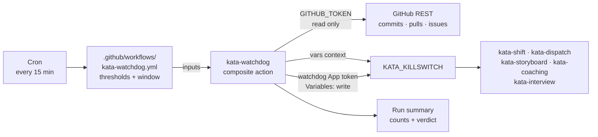
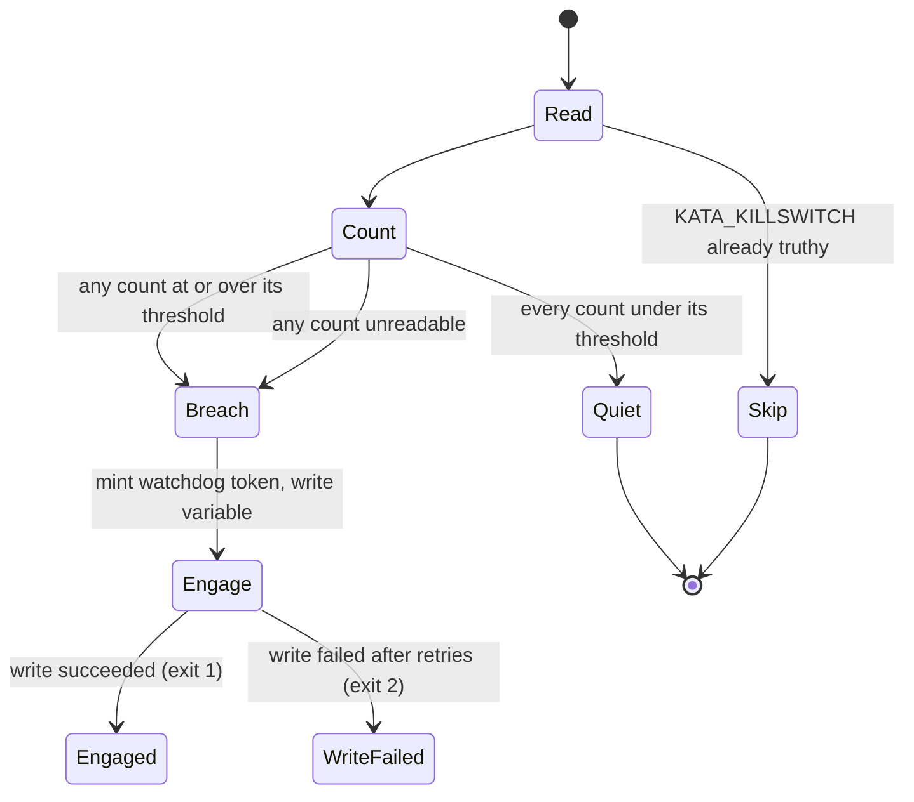

# Design 2330-a: Kata Watchdog Workflow

Spec 2330 adds a deterministic brake on Kata event chains. This design fixes the
components, the two credentials, the decision order, and the failure semantics.
The watchdog runs no agent. It reads no file from the repository tree. Its whole
input is three counts from the GitHub REST API and one variable value.

## Component map

The watchdog is the one arrow into `KATA_KILLSWITCH` that no agent can travel.
The Kata App holds no Variables permission, so no agent session can clear the
switch with the token it runs under.

## Components

| Component | Where | Role |
| --------- | ----- | ---- |
| Watchdog workflow | `.github/workflows/kata-watchdog.yml` | Holds the schedule, the three thresholds, and the window as literal numbers. Grants the run's `GITHUB_TOKEN` read access to contents, issues, and pull requests, and nothing else. Passes `vars.KATA_KILLSWITCH` through. It is a sequence of `uses:` steps with no inline logic. |
| Watchdog action | `products/kata/actions/kata-watchdog/`, published to `forwardimpact/kata-watchdog` by the subtree split | Counts, compares, mints the write token, engages, and writes the run summary. One reviewed home for the logic that every installation runs. |
| Watchdog credential | A second GitHub App. Secrets `KATA_WATCHDOG_APP_ID` and `KATA_WATCHDOG_APP_PRIVATE_KEY` | Repository Metadata read and Variables write. No other permission. Separate from the Kata App by design. |
| Killswitch variable | `KATA_KILLSWITCH` repository Actions variable | Unchanged contract. Truthy is anything other than empty, `0`, `false`, `no`, or `off`. The watchdog is one more writer. |
| Setup template | New `kata-setup` reference beside the other workflow templates | Generates the workflow for a new installation, with the second credential named. |
| Orientation and gates | `KATA.md` § Killswitch, `kata-setup` SKILL.md checklist, `kata-release-merge` trust rule, `enumeration-drift` topic `kata-workflows`, Kata getting-started page | Record the watchdog, its exemption from the killswitch gate, and its trust-sensitive status. |

## Counting interface

Each counter is one unpaginated request. `per_page=100` sets a ceiling far above
every threshold, so a full page already proves a breach and pagination never
runs.

| Counter | Request | Count |
| ------- | ------- | ----- |
| Commits | `GET /repos/{repo}/commits?since={cutoff}&per_page=100` | Length of the array |
| Pull requests | `GET /repos/{repo}/pulls?state=all&sort=created&direction=desc&per_page=100` | Items whose `created_at` is at or after the cutoff |
| Issues | `GET /repos/{repo}/issues?state=all&sort=created&direction=desc&per_page=100` | Items whose `created_at` is at or after the cutoff and that carry no `pull_request` key |

`cutoff` is the run start minus the window. The window is 60 minutes and the
schedule interval is 15 minutes, so four consecutive runs observe any single
breach. A run that GitHub delays or drops loses no breach, because each run
recomputes the whole window instead of a per-tick delta.

Each request retries up to three times with a 2-second and then a 4-second
pause. A request that still fails yields no count.

## Decision order

The watchdog reads the current killswitch state from the `vars` context, not
from the API. The workflow already receives that value, so the read needs no
permission and no request. An organization-level truthy value therefore also
suppresses the write, which is the correct idempotence. A repository variable
overrides an organization variable, so the write always wins when it runs.

The write is create-or-update: `PATCH` the variable, and `POST` it on a 404.

The value the watchdog writes is one field-separated string, for example
`watchdog:issues:31/20:2026-09-02T15:20:00Z`. It names the writer, the breached
counter, the count, the threshold, and the time. Every such value is truthy
under the existing rule.

## Failure semantics

| Condition | Watchdog result | Why |
| --------- | --------------- | --- |
| Killswitch already truthy | Skip, exit 0 | The line is already stopped. A rewrite would destroy a human's reason string. |
| Every count under threshold | Exit 0 | Normal operation. |
| Any count at or over threshold | Engage, exit 1 | The deterministic contract. |
| Any count unreadable after retries | Engage, exit 1, reason names the counter | Doubt stops the line. A human clears an early stop in seconds. A silent watchdog costs a night of tokens. |
| Token mint or variable write fails | Exit 2, no state change | The next run in 15 minutes recomputes the same window, finds the same breach, and retries. |

Exit 1 and exit 2 both make the run red. GitHub's scheduled-run failure
notification then reaches the account that last changed the schedule. The run
summary always carries the three counts and the verdict, including on a quiet
run, so an operator reads the current activity level from any run.

## Key decisions

| Decision | Choice | Rejected alternative and why |
| -------- | ------ | ---------------------------- |
| Brake mechanism | Write `KATA_KILLSWITCH` | Disable each workflow through the Actions API. That needs no second credential, but it fragments one documented control into N enablement states a human must reverse one at a time, and it leaves the killswitch record blank. |
| Write credential | A second App with Variables write only | Add Variables write to the Kata App. Every agent session runs under that App's token, so an agent could clear the switch that stops it. That defeats the mechanism. |
| Write credential | A second App | A fine-grained personal access token. It is long-lived, it needs rotation, and it ties the brake to one person's account. |
| Killswitch read | The `vars` context | An API read. It needs another permission and another request, and it can fail on the one path that must not fail. |
| Logic home | A published composite action | Inline bash in the workflow. The repository forbids inline walls in workflows, and every installation would carry its own drifting copy. |
| Measured signal | Repository artifacts: commits, pull requests, issues | Token spend or agent turns. Those are internal to the run that is misbehaving. External evidence survives a harness that reports its own cost wrongly, and each LLM platform already carries its own spend cap. |
| Actor filter | None. Count every author | Count only Kata App activity. A filter adds a judgment the watchdog must make and gives sprawl a place to hide. Total churn is the evidence. |
| Unreadable count | Engage | Skip the counter and continue. A watchdog that goes quiet under an API failure is worst at the moment it matters. |
| Threshold home | Literal numbers in the workflow file | `.kata/settings.json`. That file configures agent-read skills. The watchdog must not depend on repository content it could be asked to reread. |
| Threshold home | Literal numbers in the workflow file | Repository variables. The variable surface is what the watchdog defends. A brake whose limits live where the sprawl can reach is not a brake. |
| Clearing | Human only | Auto-clear after a quiet window. That lets a chain resume and the pair oscillate, and it hides the cause. |
| Killswitch gate | The watchdog does not gate on it | Gate like every other `kata-*` workflow. The watchdog would then stop itself the moment it fires, and no later run would confirm the state. |
| Commit counter scope | Default branch | Every branch. That needs a clone or one request per branch, which is the opposite of simple. Agent branches reach the default branch through pull requests, and the pull-request counter covers them. |
| Schedule and window | 15 minutes, 60-minute window | Equal cadence and window. A delayed or dropped run would then leave a gap in which a breach passes unobserved. |
| Run visibility | Non-zero exit on engagement | Exit 0 with a summary only. A green run raises no notification, and the operator learns of the stop from the halted team instead of from the watchdog. |

## Surfaces the change touches

| Surface | Edit |
| ------- | ---- |
| `KATA.md` § Killswitch | The watchdog engages the variable automatically. Name the three counters and the exemption. |
| `KATA.md` and `CLAUDE.md` sibling-action enums | Seven composite actions become eight. Both enum fences and the `.github/CLAUDE.md` table gain `kata-watchdog`. |
| `.jidoka/invariants/enumeration-drift.topics.yml` | Add `kata-watchdog.yml` to the `kata-workflows` topic exclude list, beside `kata-interview.yml`. The watchdog belongs to no PDSA phase. |
| `kata-setup` SKILL.md | Carve the watchdog out of the "every generated workflow gates on the killswitch" checklist item. Name the watchdog in the setup report. |
| `kata-setup` `github-app.md` | A second permission table for the watchdog App, and its two secrets. |
| `kata-release-merge` SKILL.md | The trust-sensitive path rule names the watchdog workflow beside `.kata/`. |
| `.github/dependabot.yml` and `publish-actions.yml` | The new sibling joins the SHA-bump group and the subtree split. |
| Kata getting-started page | One paragraph: the watchdog exists, it counts, it engages, a human clears. |

## Clean break

The design removes no existing path, because the killswitch contract is the
path it uses. It adds no second brake and no fallback. One variable stops the
team, and the watchdog is one more writer of that variable. No environment
variable, no repository file, and no agent decision sits between a breach and
the write.
