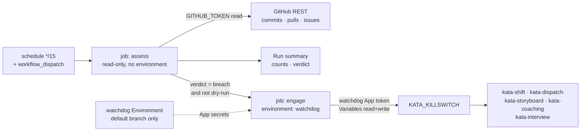
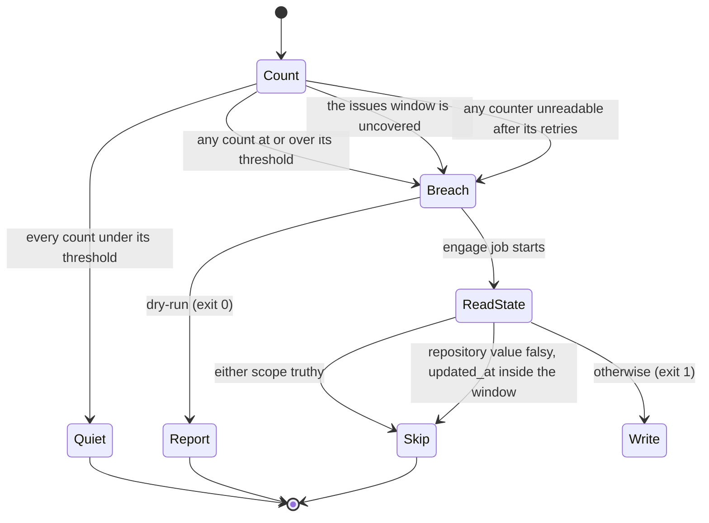

# Design 2330-a: Repository Activity Watchdog

Spec 2330 adds a deterministic brake on Kata event chains. This design fixes the
components, the split between measurement and engagement, the credential
containment, and the failure semantics. The watchdog runs no agent. Its whole
input is three counts from the GitHub REST API and two variable records.

## Component map

Both jobs run the same composite action in different modes. Measurement holds no
write credential at all, so a quiet run and a dry run need no secret and execute
from any branch.

## Components

| Component | Where | Role |
| --------- | ----- | ---- |
| Watchdog workflow | `.github/workflows/watchdog.yml` | The `schedule` and `workflow_dispatch` triggers, the three thresholds and the 60-minute window as literal numbers, the manual inputs (`dry-run`, plus dry-run-only `override-*` and `simulate`), and the two jobs. `assess` grants `GITHUB_TOKEN` read access to contents, issues, and pull requests and nothing else. `engage` declares `environment: watchdog` at job level and `needs: assess`, with `if:` on the assess verdict. Both jobs set `timeout-minutes: 5`. Each job is a sequence of `uses:` steps. |
| Watchdog action | `.github/actions/watchdog/` — `action.yml`, `watchdog.sh`, `README.md` | Each job runs `actions/checkout` with `sparse-checkout: .github/actions/watchdog` and `fetch-depth: 1`, then this action. The action mints the App token in `engage` mode and runs `watchdog.sh`. Every threshold input is required and default-free, so the numbers live only in the workflow. It pins `actions/create-github-app-token` by SHA, as the workflows do. |
| Logic script | `.github/actions/watchdog/watchdog.sh` | Reads state, counts, compares, builds the reason, writes the summary, and performs the one write. It takes its inputs from the environment and its HTTP responses from a seam the tests replace, so `tests/watchdog.test.js` drives every branch against fixture payloads. |
| Watchdog credential | A second GitHub App. `WATCHDOG_APP_ID` and `WATCHDOG_APP_PRIVATE_KEY` in the `watchdog` Actions Environment, restricted to the default branch | Repository Metadata read and Variables read and write. No other permission. The README documents the boundary, as `.github/actions/macos-signing/README.md` does for the signing material. |
| Killswitch variable | `KATA_KILLSWITCH` Actions variable | Unchanged contract. The truthy predicate is the one `products/kata/actions/kata-agent/action.yml` already defines. The watchdog is one more writer of the repository-scoped variable. |

## Interfaces

| Step | Job | Request |
| ---- | --- | ------- |
| Commits | assess | `GET /repos/{repo}/commits?sha={default_branch}&since={cutoff}&per_page=100` |
| Pull requests | assess | `GET /repos/{repo}/pulls?state=all&sort=created&direction=desc&per_page=100` |
| Issues | assess | `GET /repos/{repo}/issues?state=all&sort=created&direction=desc&per_page=100` |
| Read repository state | engage | `GET /repos/{repo}/actions/variables/KATA_KILLSWITCH` for `value` and `updated_at`. A 404 reads as falsy with no timestamp. |
| Read organization state | engage | `GET /repos/{repo}/actions/organization-variables` |
| Engage | engage | `PATCH /repos/{repo}/actions/variables/KATA_KILLSWITCH`, and `POST /repos/{repo}/actions/variables` when the variable does not exist |

`cutoff` is the run start minus 60 minutes. Pull requests and issues are counted
by `created_at` against the cutoff, and issues discard items that carry a
`pull_request` key. Each request makes five attempts, with 2, 4, 8, and
16-second pauses between them, so a transient failure does not reach the
fail-safe.

**Window coverage.** The issues endpoint returns pull requests the counter
discards, so a full first page can hold fewer than 100 issues and still hide
older ones inside the window. The issues counter therefore treats a full first
page whose oldest item is still inside the window as an uncovered window, which
is a breach. The other two counters need no such rule: commits are filtered
server-side by `since`, and pull requests are undiscarded, so for both a full
page is itself a count of 100 and already a breach. Pagination never runs.

**Committer dates.** The commits counter filters on committer date. A push that
rewrites 25 or more committer dates on the default branch therefore trips it.
The repository squash-merges, so this is a force-push case, and a false stop
there is the intended fail-safe behaviour rather than a defect.

## Decision order

Counting always runs first, so every run summary carries the three counts. An
operator deciding whether to clear reads the current activity level from the
latest run, including while the switch is already engaged.

The second Skip branch is the resume path. A human clears the switch by writing
a falsy value rather than deleting the variable, which leaves an `updated_at`
the watchdog reads. The watchdog then stays quiet for one window while the burst
that caused the stop drains out of it. The README states this, because deleting
the variable gives no timestamp and no quiet window.

The written value is pipe-separated, because an ISO timestamp contains colons.
It names every breached counter, not the first, in the shape
`watchdog|issues=31/25|commits=27/25|2026-09-02T15:20:00Z`.
An unreadable or uncovered counter appears
as `issues=unreadable` or `issues=uncovered` in the same position, and outranks
a threshold breach on the same counter. Every such value is truthy.

## Failure semantics

| Condition | Result | Why |
| --------- | ------ | --- |
| Every count under threshold | Quiet, exit 0, no engage job | Normal operation. |
| Any count at or over threshold | Engage, exit 1 | The deterministic contract. |
| Issues window uncovered, or any counter unreadable after five attempts | Engage, exit 1, reason names the counter | Doubt stops the line. An unnecessary stop costs idle agent time. A silent watchdog costs an unbounded token spend. |
| Killswitch already truthy at either scope | Skip, exit 0 | The line is already stopped. A rewrite would destroy a human's reason string. |
| Killswitch cleared inside the window | Skip, exit 0 | The resume path. Without it the next run re-engages on the same drained burst. |
| Token mint or variable write fails | Exit 1, no state change, summary names the failure | The next run in 15 minutes recomputes the same window and retries. |

The engage job exits non-zero on every outcome except Skip, so an engagement and
a failed write both show red in the Actions list. This is the one fail-open
path: an expired credential leaves the brake absent. It fails red on every run
rather than going quiet, which is why the summary distinguishes a write failure
from an engagement.

## Key decisions

| Decision | Choice | Rejected alternative and why |
| -------- | ------ | ---------------------------- |
| Brake mechanism | Write `KATA_KILLSWITCH` | Disable each workflow through the Actions API. That needs no second credential, but it fragments one documented control into N enablement states a human must reverse one at a time, and it leaves the killswitch record blank. |
| Job shape | Separate read-only `assess` and privileged `engage` | One job holding the Environment. Every quiet run would then carry the write credential, and no run could execute from a branch, which leaves the engage and fail-safe criteria testable only by landing a change on the default branch. |
| Write credential | A second App, its secrets in a default-branch Environment | Variables write on the Kata App, or the same App key as a repository secret. Either lets an agent's own token, or a workflow an agent pushes to a branch, clear the switch that stops it. A fine-grained personal access token is long-lived and ties the brake to one person's account. |
| Containment claim | Two controls, and a named residual | The Environment alone. A deployment-branch policy restricts which branch may claim the Environment, not which workflow, so a workflow already on the default branch could claim it. The merge gate is the second control, and the repository's branch-protection gap is the residual. |
| Logic home | A local composite action, with the logic in a script the test suite drives | A published sibling action, which puts a repository, an App grant, a subtree split, and a SHA pin in the critical path of the brake. An inline wall in the workflow, which `.github/CLAUDE.md` § Local composite actions forbids and which no test could reach. |
| Workflow name | `watchdog.yml` | `kata-watchdog.yml`. That name enters the `kata-*` glob, so it would force an exclusion in the `kata-workflows` enumeration topic and make the killswitch sentence in `KATA.md` ambiguous. The watchdog runs no agent, so it is repository CI, not a Kata surface. |
| Concurrency | No concurrency group | A named group. `.github/workflows/kata-dispatch.yml` documents that a newly pending run in a group cancels the previously pending one, so a group could drop a watchdog run silently. The action is short and idempotent, so an overlap is harmless. |
| Killswitch read | Both scopes, through the API, in the engage job | The `vars` context, or the repository scope alone. `vars` carries no `updated_at` and binds at job start. Reading only the repository scope lets a repository variable the watchdog created outlive a human's organization-scope clear. |
| Resume | Quiet for one window after a human clears | Nothing, or a stored high-water mark. Without the rule the next run re-engages on a burst that is still inside the window, and the human cannot resume at all. Stored state is a file an agent could reach. |
| Measured signal | Repository artifacts: commits, pull requests, issues | Token spend or agent turns. Those are internal to the run that is misbehaving. External evidence survives a harness that reports its own cost wrongly, and each LLM platform already carries its own spend cap. |
| Actor filter | None. Count every author | Count only Kata App activity. A filter adds a judgment the watchdog must make and gives sprawl a place to hide. The thresholds clear the known scheduled batches instead. |
| Unreadable or uncovered count | Engage, after five attempts | Skip the counter and continue. A watchdog that goes quiet under an API failure is worst at the moment it matters. Three attempts over six seconds absorbed too little of a real API incident. |
| Threshold home | Literal numbers in the workflow, with default-free action inputs | `.kata/settings.json`, repository variables, or action defaults. The first is agent-read repository content. The second lives on the surface the watchdog defends. The third puts the numbers in two files. |
| Reason string | Names every breached counter | Names the first. A run where two counters breach would then record half the evidence a human needs to judge the stop. |
| Verification lever | Fixture-driven tests, plus a `dry-run` mode for a live rehearsal | A live test run. That writes a truthy value and halts every Kata surface until a human clears it, which makes the two most load-bearing criteria untestable without an outage. |

## Surfaces the change touches

| Surface | Edit |
| ------- | ---- |
| `KATA.md` § Killswitch | This repository also runs `watchdog.yml`, which sets the variable automatically on a commit, pull-request, or issue-rate breach, and which does not gate on the variable itself. The paragraph is prose, outside the enumerated workflow table, as the `kata-interview` mention already is. |
| `.github/CLAUDE.md` § Local composite actions | One `watchdog` row. The `sibling-composite-actions` enumeration is untouched, because the action is local. |
| `kata-release-merge` SKILL.md | Both homes of the `.kata/` rule, the checklist item and the § Settings diffs prose, gain the two watchdog paths. The prose lead-in becomes "Guardrail diffs", because a workflow is not a settings file. |
| `kata-security-update` SKILL.md | The same two paths. Dependabot bumps the action's pinned dependency under the `/.github/actions/*` glob, and those pull requests route to this skill rather than the merge gate. |
| `websites/kata/docs/continuous-improvement/index.md`, `.../getting-started/index.md` | Qualify "every workflow" as "every Kata workflow", matching the two homes that already carry the qualifier. |
| `.github/actions/watchdog/README.md` | The App and its two permissions, the Environment boundary, the thresholds and their grounding, and the clear-by-writing-a-falsy-value rule. |

## Clean break

The design removes no existing path, because the killswitch contract is the path
it uses. It adds no second brake and no fallback. One variable stops the team,
and the watchdog is one more writer of that variable. No environment variable,
no repository data file, and no agent decision sits between a breach and the
write.
