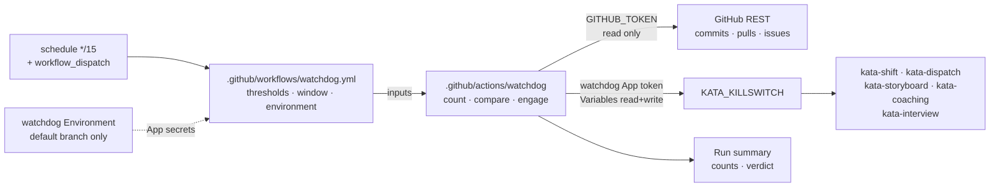
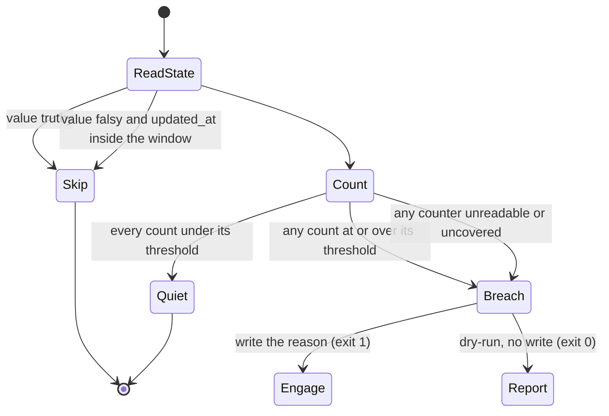

# Design 2330-a: Repository Activity Watchdog

Spec 2330 adds a deterministic brake on Kata event chains. This design fixes the
components, the credential containment, the decision order, and the failure
semantics. The watchdog runs no agent. Its whole input is three counts from the
GitHub REST API and one variable record.

## Component map

The watchdog is the one arrow into `KATA_KILLSWITCH` that no agent can travel.
The Kata App holds no Variables permission, and the watchdog App secrets sit in
an Environment that only a default-branch job can read, so neither an agent's
own token nor a workflow an agent pushes to a branch reaches the switch.

## Components

| Component | Where | Role |
| --------- | ----- | ---- |
| Watchdog workflow | `.github/workflows/watchdog.yml` | Holds the `schedule` and `workflow_dispatch` triggers, the three thresholds, the 60-minute window, `concurrency: watchdog` with `cancel-in-progress: false`, `timeout-minutes: 5`, and `environment: watchdog`. Grants `GITHUB_TOKEN` read access to contents, issues, and pull requests, and nothing else. It is a sequence of `uses:` steps with no inline logic. |
| Watchdog action | `.github/actions/watchdog/` (`action.yml` plus `README.md`) | Reads the variable, counts, compares, engages, and writes the run summary. Inputs: `app-id`, `app-private-key`, `window-minutes`, `max-commits`, `max-pull-requests`, `max-issues`, `dry-run`. It mints the write token itself, as `kata-agent` does. |
| Watchdog credential | A second GitHub App. Secrets `WATCHDOG_APP_ID` and `WATCHDOG_APP_PRIVATE_KEY` in the `watchdog` Actions Environment, restricted to the default branch | Repository Metadata read and Variables read and write. No other permission. The README documents the boundary, as `.github/actions/macos-signing/README.md` does for the signing material. |
| Killswitch variable | `KATA_KILLSWITCH` repository Actions variable | Unchanged contract. Truthy is anything other than empty, `0`, `false`, `no`, or `off`. The watchdog is one more writer. |
| Orientation and gates | `KATA.md` § Killswitch, `.github/CLAUDE.md` local-action table, `kata-release-merge` trust rule (checklist item and § Settings diffs prose) | Record the automatic writer, the new local action, and the trust-sensitive paths. |

## Interfaces

The workflow reads the variable through the API, not through the `vars` context,
because the resume rule needs the record's `updated_at` and because a `vars`
value binds at job start and would go stale across the counting requests.

| Step | Request | Result |
| ---- | ------- | ------ |
| Read state | `GET /repos/{repo}/actions/variables/KATA_KILLSWITCH` | `value` and `updated_at`. A 404 means unset, which reads as falsy with no timestamp. |
| Commits | `GET /repos/{repo}/commits?sha={default_branch}&since={cutoff}&per_page=100` | Length of the array |
| Pull requests | `GET /repos/{repo}/pulls?state=all&sort=created&direction=desc&per_page=100` | Items whose `created_at` is at or after the cutoff |
| Issues | `GET /repos/{repo}/issues?state=all&sort=created&direction=desc&per_page=100` | Items whose `created_at` is at or after the cutoff and that carry no `pull_request` key |
| Engage | `PATCH /repos/{repo}/actions/variables/KATA_KILLSWITCH`, and `POST /repos/{repo}/actions/variables` on a 404 | The reason string |

`cutoff` is the run start minus 60 minutes. Each request makes three attempts in
total, with a 2-second pause after the first and a 4-second pause after the
second.

**Window coverage.** One page of 100 is far above every threshold, but the
issues and pull-requests endpoints return items the counter discards, so a full
page does not prove a breach on its own. The action therefore applies one
uniform rule to all three counters: a first page that holds 100 items whose
oldest item is still inside the window leaves the window uncovered. An uncovered
window is a breach, exactly as an unreadable one is. Pagination never runs.

**Committer dates.** The commits counter filters on committer date. A push that
rewrites 20 or more committer dates on the default branch therefore trips it.
The repository squash-merges, so this is a force-push case, and a false stop
there is the intended fail-safe behaviour rather than a defect.

## Decision order

The second Skip branch is the resume path. A human clears the switch by writing
a falsy value rather than deleting the variable, which leaves an `updated_at`
the watchdog reads. The watchdog then stays quiet for one window while the burst
that caused the stop drains out of it.

Counting runs before the Skip decision is reported, so every run summary carries
the counts it obtained. An operator who is deciding whether to clear reads the
current activity level from the latest run.

The value the watchdog writes is one field-separated string. A threshold breach
writes `watchdog:issues:31/25:2026-09-02T15:20:00Z`. A read failure writes
`watchdog:issues:unreadable:2026-09-02T15:20:00Z`, and an uncovered window
writes `uncovered` in the same position. Every such value is truthy under the
existing rule.

## Failure semantics

| Condition | Result | Why |
| --------- | ------ | --- |
| Killswitch already truthy | Skip, exit 0 | The line is already stopped. A rewrite would destroy a human's reason string. |
| Killswitch cleared inside the window | Skip, exit 0 | The resume path. Without it the next run re-engages on the same drained burst. |
| Every count under threshold | Exit 0 | Normal operation. |
| Any count at or over threshold | Engage, exit 1 | The deterministic contract. |
| Any counter unreadable or uncovered | Engage, exit 1, reason names the counter | Doubt stops the line. An unnecessary stop costs idle agent time. A silent watchdog costs an unbounded token spend. |
| Token mint or variable write fails | Exit 1, no state change, summary names the failure | The next run in 15 minutes recomputes the same window and retries. |

Every non-quiet outcome exits non-zero, so the run shows red in the Actions
list. That red run and the recorded reason are the whole signal, because spec
2330 excludes a separate alerting channel. A watchdog whose credential expires
therefore fails red on every run rather than going quiet, which is the failure
mode the summary line distinguishes.

## Key decisions

| Decision | Choice | Rejected alternative and why |
| -------- | ------ | ---------------------------- |
| Brake mechanism | Write `KATA_KILLSWITCH` | Disable each workflow through the Actions API. That needs no second credential, but it fragments one documented control into N enablement states a human must reverse one at a time, and it leaves the killswitch record blank. |
| Write credential | A second App, its secrets in a default-branch Environment | Variables write on the Kata App, or the same App key as a repository secret. Either lets an agent's token, or a workflow an agent pushes to a branch, clear the switch that stops it. A fine-grained personal access token is long-lived and ties the brake to one person's account. |
| Logic home | A local composite action under `.github/actions/` | A published sibling action. That adds a repository to create, an App grant, a subtree split, a SHA pin, and a release lineage before the brake can run once, and it makes a threshold change a four-landing operation. An inline wall in the workflow is what `.github/CLAUDE.md` § Local composite actions forbids for a self-contained logic unit. |
| Workflow name | `watchdog.yml` | `kata-watchdog.yml`. That name enters the `kata-*` glob, so it would force an exclusion in the `kata-workflows` enumeration topic and make the "every `kata-*` workflow gates on the killswitch" sentence in `KATA.md` and on three Kata pages ambiguous. The watchdog runs no agent, so it is repository CI, not a Kata surface. |
| Killswitch read | One API read of the variable record | The `vars` context. It carries no `updated_at`, so the resume path would need stored state, and its value binds at job start and goes stale before the write. |
| Resume | Quiet for one window after a human clears | Nothing, or a stored high-water mark. Without the rule the next run re-engages on a burst that is still inside the window, and the human cannot resume at all. Stored state is a file an agent could reach. |
| Measured signal | Repository artifacts: commits, pull requests, issues | Token spend or agent turns. Those are internal to the run that is misbehaving. External evidence survives a harness that reports its own cost wrongly, and each LLM platform already carries its own spend cap. |
| Actor filter | None. Count every author | Count only Kata App activity. A filter adds a judgment the watchdog must make and gives sprawl a place to hide. The thresholds clear the known scheduled batches instead. |
| Unreadable or uncovered count | Engage | Skip the counter and continue. A watchdog that goes quiet under an API failure is worst at the moment it matters. |
| Threshold home | Literal numbers in the workflow file | `.kata/settings.json`, or repository variables. The first is agent-read repository content. The second lives on the surface the watchdog defends, so the sprawl could reach its own limits. |
| Clearing | Human only | Auto-clear after a quiet window. That lets a chain resume and the pair oscillate, and it hides the cause. |
| Exit code | One non-zero code for every non-quiet outcome | Separate codes for engaged and write-failed. GitHub renders both the same red, no consumer reads the difference, and the summary already names which happened. |
| Commit counter scope | Default branch | Every branch. That needs a clone or one request per branch, which is the opposite of simple. Agent branches reach the default branch through pull requests, and the pull-request counter covers them. |
| Verification lever | A `dry-run` input on the manual trigger | A live test run. That writes a truthy value and halts every Kata surface until a human clears it, which makes the two most load-bearing criteria untestable without an outage. |

## Surfaces the change touches

| Surface | Edit |
| ------- | ---- |
| `KATA.md` § Killswitch | This repository also runs `watchdog.yml`, which sets the variable automatically on a commit, pull-request, or issue-rate breach. The watchdog itself does not gate on the variable. The paragraph is prose, outside the enumerated workflow table, as the `kata-interview` mention already is. |
| `.github/CLAUDE.md` § Local composite actions | One `watchdog` row in the local-action table. The `sibling-composite-actions` enumeration is untouched, because the action is local. |
| `.claude/skills/kata-release-merge/SKILL.md` | Both homes of the `.kata/` trust rule, the checklist item and the § Settings diffs prose, gain `.github/workflows/watchdog.yml` and `.github/actions/watchdog/`. The prose reframes the rule as a guardrail-configuration change rather than a settings change only. |
| `.github/actions/watchdog/README.md` | The App, its two permissions, the Environment boundary, the thresholds and their grounding, and the clear-by-writing-a-falsy-value rule. |

Nothing under `products/`, `services/`, or `websites/` changes. The Kata
product's own contract is unchanged, so the three published pages that state it
stay accurate.

## Clean break

The design removes no existing path, because the killswitch contract is the path
it uses. It adds no second brake and no fallback. One variable stops the team,
and the watchdog is one more writer of that variable. No environment variable,
no repository data file, and no agent decision sits between a breach and the
write.
