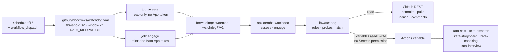
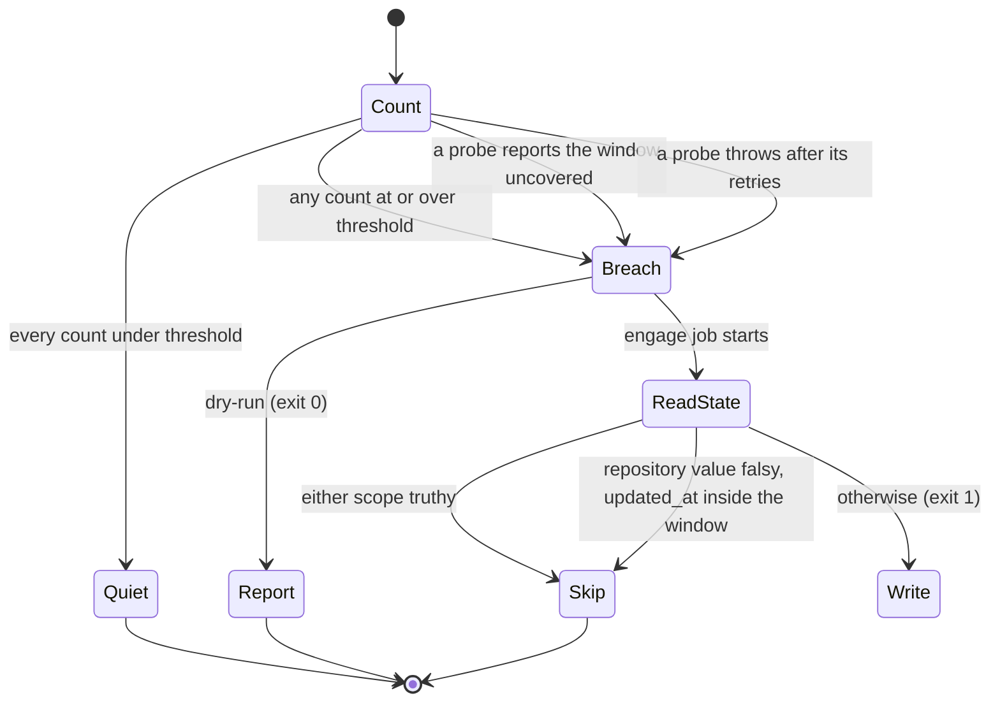

# Design 2330-a: Repository Activity Watchdog

Spec 2330 adds a deterministic brake on Kata event chains. This design fixes
the components, the split between measurement and engagement, the credential
scope, and the failure semantics. The watchdog runs no agent. Its whole input is
four counts from the GitHub REST API and two variable records.

The brake ships as Gemba platform surface, not as repository CI glue. A generic
library holds the guardrail engine, a thin CLI wires that engine to argv, and a
published composite action runs the CLI in CI. The workflow carries the policy
numbers and the variable name, and nothing else. This repository is one tenant
of a generic guardrail, as it is one tenant of the harness.

## Component map

Both jobs run the same action in different modes. Measurement mints no App
token, so a quiet run and a dry run need no secret and run from any branch.
Neither job checks the repository out, so the watchdog reads no repository data.

## Components

| Component | Where | Role |
| --------- | ----- | ---- |
| Guardrail library | `libraries/libwatchdog/` | The engine: rules, probes, the latch policy, the reason grammar, and the run-summary renderer. Import-only, host-agnostic, and tenant-neutral. It names no variable, no threshold, and no repository. |
| Watchdog CLI | `products/gemba/bin/gemba-watchdog.js` | The seventh `gemba-*` command. A `libcli` definition, two handlers imported from the library, and the exit-code wiring. It holds no counting, comparison, or reason logic. |
| Watchdog action | `products/gemba/actions/gemba-watchdog/` — `action.yml`, `README.md`, `LICENSE` | Published to `forwardimpact/gemba-watchdog` by the subtree split, and pinned by SHA on `uses:`. It mints the App token in `engage` mode, then runs the CLI through `npx` at a pinned exact version. The README documents the credential scope, the threshold grounding, the clearing rule, and the containment residual. |
| Watchdog workflow | `.github/workflows/watchdog.yml` | The `schedule` and `workflow_dispatch` triggers, the threshold of 32 and the 2-hour window as literal numbers, the variable name `KATA_KILLSWITCH`, the manual inputs (`dry-run`, plus dry-run-only `override-threshold` and `simulate`), and the two jobs. `assess` grants `GITHUB_TOKEN` read access to contents, issues, and pull requests and nothing else. `engage` sets `needs: assess` with `if:` on the assess verdict. Both jobs set `timeout-minutes: 5`. Each job is a sequence of `uses:` steps. |
| Credential | The existing Kata App, through `secrets.KATA_APP_ID` and `secrets.KATA_APP_PRIVATE_KEY` | The App gains `Variables: read & write` and holds no `Secrets` permission. The killswitch is an Actions variable in every workflow, action, and setup template today, which is what lets one permission cover the brake without opening secret access. |
| Killswitch variable | `KATA_KILLSWITCH` Actions variable | Unchanged contract. The watchdog is one more writer of the repository-scoped variable. |

## Library surface

`libwatchdog` exposes four seams: rule, probe, latch, and policy. A future
guardrail adds a rule set and a probe. A future brake adds a latch. Neither one
touches the engine or the CLI.

| Seam | Module | Contract |
| ---- | ------ | -------- |
| Rule | `src/rule.js` | `{ id, threshold }` plus the probe that measures it. |
| Probe | `src/sources/github-activity.js` | `async ({ fetch, repo, token, cutoff }) => { count, covered }`. Four probes: default-branch commits, pull requests, issues, conversation comments. A probe throws when it cannot read. |
| Engine | `src/evaluate.js` | `(rules, { clock, retry }) => verdict`. It runs every probe, retries each one, compares each count, and reports every breach. |
| Latch | `src/latches/actions-variable.js` | `read() => { value, updatedAt }` and `write(value)`. A 404 reads as falsy with no timestamp. |
| Policy | `src/latch.js` | `(verdict, state, { windowMs }) => "engage" \| "skip"`. The already-engaged rule and the resume rule live here. |
| Value grammar | `src/reason.js`, `src/truthy.js` | Encodes and decodes the pipe-separated reason. Exports the `""`/`0`/`false`/`no`/`off` predicate as one function. |
| Summary | `src/summary.js` | The markdown block the CLI writes to `$GITHUB_STEP_SUMMARY`. |
| Commands | `src/commands/assess.js`, `src/commands/engage.js` | The two `libcli` handlers the CLI imports. |

The catalog holds no shared GitHub REST client today, so `libwatchdog` carries a
thin request helper over an injected `fetch`. Backoff reuses `libutil`'s `Retry`
with its injectable sleep, and time comes from `runtime.clock`. Those three
seams let `libraries/libwatchdog/test/` drive every branch against fixtures.

## Interfaces

| Step | Command | Request |
| ---- | ------- | ------- |
| Commits | assess | `GET /repos/{repo}/commits?sha={default_branch}&since={cutoff}&per_page=100` |
| Pull requests | assess | `GET /repos/{repo}/pulls?state=all&sort=created&direction=desc&per_page=100` |
| Issues | assess | `GET /repos/{repo}/issues?state=all&sort=created&direction=desc&per_page=100` |
| Comments | assess | `GET /repos/{repo}/issues/comments?since={cutoff}&sort=created&direction=desc&per_page=100` |
| Read repository state | engage | `GET /repos/{repo}/actions/variables/{name}` for `value` and `updated_at` |
| Read organization state | engage | `GET /repos/{repo}/actions/organization-variables` |
| Engage | engage | `PATCH /repos/{repo}/actions/variables/{name}`, and `POST /repos/{repo}/actions/variables` when the variable does not exist |

| Command | Inputs | Effects | Exit |
| ------- | ------ | ------- | ---- |
| `assess` | `GH_TOKEN`, `--repo`, `--threshold`, `--window-hours`, and the dry-run-only `--simulate` | The run summary, and `verdict` plus `reason` on `$GITHUB_OUTPUT` | 0 on every outcome, so the engage job decides |
| `engage` | `GH_TOKEN`, `--repo`, `--variable`, `--reason`, `--window-hours`, `--dry-run` | The variable, and the run summary | 0 on skip and on dry run, 1 on engagement and on a failed write |

`--repo` falls back to `$GITHUB_REPOSITORY` and `--variable` is required, so the
CLI names no tenant. `--format json` renders either verdict for a local
rehearsal. `cutoff` is the run start minus the window. Pull requests, issues,
and comments count by `created_at` against the cutoff, and issues discard items
that carry a `pull_request` key. The comments endpoint covers the
`issue_comment` trigger surface and returns no inline review comments, which
the spec excludes. Each request makes five attempts, with 2, 4, 8, and
16-second pauses, so a transient failure does not reach the fail-safe.

**Window coverage.** Two probes discard items the endpoint returns. The issues
endpoint returns pull requests, and the comments endpoint filters on `updated`
rather than `created`, so a full first page can hold fewer than 32 qualifying
items and still hide older ones inside the window. Both probes therefore report
`covered: false` when a full first page still ends inside the window, which is
a breach. The other two need no such rule. Commits filter server-side by
`since`, and pull requests are undiscarded, so for both a full page is itself a
count of 100 and already a breach. Pagination never runs. The commits probe
filters on committer date, so a force-push that rewrites 32 or more committer
dates trips it, and that false stop is the intended fail-safe behaviour.

## Decision order

Counting always runs first, so every run summary carries the four counts. An
operator deciding whether to clear reads the current activity level from the
latest run, even while the switch is already engaged. The summary also records
the killswitch's current value, which is how an unexplained clear becomes
visible within 15 minutes.

The second Skip branch is the resume path. A human clears the switch by writing
a falsy value rather than deleting the variable, which leaves an `updated_at`
the watchdog reads. The watchdog then stays quiet for one window while the
burst drains out of it. The README states this, because deleting the variable
gives no timestamp and no quiet window.

The written value is pipe-separated, because an ISO timestamp contains colons.
It names every breached counter and not the first, so a two-counter breach
records the whole evidence:
`watchdog|issues=47/32|comments=38/32|2026-09-02T16:49:00Z`. An unreadable or
uncovered counter takes that position as `issues=unreadable` or
`issues=uncovered`, and outranks a threshold breach. Every value is truthy.

## Failure semantics

| Condition | Result | Why |
| --------- | ------ | --- |
| Every count under threshold | Quiet, exit 0, no engage job | Normal operation. |
| Any count at or over threshold | Engage, exit 1 | The deterministic contract. |
| A probe reports the window uncovered, or throws after five attempts | Engage, exit 1, reason names the counter | Doubt stops the line. An unnecessary stop costs idle agent time. A silent watchdog costs an unbounded token spend. |
| Killswitch already truthy at either scope, or cleared inside the window | Skip, exit 0 | The line is already stopped, and a rewrite would destroy a human's reason string. The second case is the resume path: without it the next run re-engages on the same drained burst. |
| Token mint or variable write fails | Exit 1, no state change, summary names the failure | The next run in 15 minutes recomputes the same window and retries. |
| The registry cannot serve the pinned CLI | Exit 1, no counts, no state change | The delivery hop the published CLI adds. It fails red rather than going quiet. |

Every outcome except Quiet, Skip, and a dry run exits non-zero, so an
engagement and a failed write both show red in the Actions list. Two paths fail
open and leave the brake absent: an expired credential, and an unreachable
registry. Both fail red every 15 minutes, and the summary tells them apart.

## Key decisions

| Decision | Choice | Rejected alternative and why |
| -------- | ------ | ---------------------------- |
| Logic home | A generic library, a thin CLI, and a published action | A shell script inside a local `.github/actions/` composite action. That leaves the brake's logic in a language with no test seam for time or transport, unavailable to any other repository, and outside the platform whose job is to run agent teams. |
| Library scope | A guardrail engine with rule, probe, latch, and policy seams | Watchdog-specific code with the four GitHub probes inlined. The next guardrail would then re-solve retries, coverage, the reason grammar, and the resume window. The seams are the reason the library exists. |
| Tenant neutrality | `--variable` is required, and the thresholds are inputs | A `KATA_KILLSWITCH` default in the library or the action. Gemba is the platform and Kata is one tenant. A default would add a third tenant-named default to a platform that documents having two. |
| CLI delivery | `npx gemba-watchdog@<exact version>`, pinned in the action | A SHA-verified binary through `gemba-bootstrap`. That checks the repository out, installs a workspace, and reads repository content, which the spec forbids. `fit-install.sh` alone still adds an install step and a second pin to a run that must stay short. |
| Action distribution | A published sibling, pinned by SHA in this repository | A local `.github/actions/watchdog`. That keeps the subtree split and the registry out of the critical path, and it also keeps the brake unavailable to the installations that run the same event chains. The pinned SHA and the pinned CLI version are the gate that makes the two extra hops safe. |
| Brake mechanism | Write the killswitch variable | Disable each workflow through the Actions API. That fragments one documented control into N enablement states a human must reverse one at a time, and it leaves the killswitch record blank. |
| Credential | The existing Kata App, gaining `Variables: read & write` and no `Secrets` permission | A second App with its key in a default-branch Actions Environment. That makes the containment a permission boundary an agent cannot cross, at the cost of a second App to register, install, and rotate. The operator chose one credential. Because the killswitch is a variable and not a secret, the brake needs no secret access. |
| Containment | A gate and a stated residual | A claim that no agent can reach the switch. Agent sessions run under the same App token, so that claim would be false. The controls are the skill rule, the trust-sensitive review rule on all four new paths, and the value the watchdog records on every run. |
| Job shape | Separate read-only `assess` and token-minting `engage` | One job. Every quiet run would then mint the write token, and a dry run could not run from a branch, which leaves the engage and fail-safe criteria testable only by landing a change on the default branch. |
| Workflow name | `watchdog.yml` | `kata-watchdog.yml`. That name enters the `kata-*` glob, so it would force an exclusion in the `kata-workflows` enumeration topic and make the killswitch sentence in `KATA.md` ambiguous. The workflow runs no agent, so it is repository CI, not a Kata surface. |
| Killswitch read | Both scopes, through the API, in the engage command | The `vars` context, or the repository scope alone. `vars` carries no `updated_at` and binds at job start. Reading only the repository scope lets a repository variable the watchdog created outlive a human's organization-scope clear. |
| Threshold home | Literal numbers in the workflow, with default-free action inputs | `.kata/settings.json`, repository variables, or action defaults. The first is agent-read repository content. The second lives on the surface the watchdog defends. The third puts the numbers in two files. The `cli-version` pin is the one input the action defaults, because it is a pin and not a policy. |
| Verification lever | Fixture-driven library tests, plus a `dry-run` mode for a live rehearsal | A live test run. That writes a truthy value and halts every Kata surface until a human clears it, which makes the two most load-bearing criteria untestable without an outage. |

## Surfaces the change touches

| Surface | Edit |
| ------- | ---- |
| `libraries/libwatchdog/` | New library: `package.json` with `description`, `keywords`, and Little Hire `jobs`; `README.md`; `src/`; `test/`. |
| `products/gemba/package.json` | The `bin` map, the `@forwardimpact/libwatchdog` dependency, and the command list in the description. |
| `launchers/gemba-watchdog/` | The launcher the `public-cli-set` invariant computes. `SIBLING_ACTION_CLIS` needs no entry, because the guide invokes the CLI. |
| `.claude/skills/gemba-watchdog/SKILL.md`, `.claude/skills/gemba/SKILL.md` | The new skill is the third progressive-documentation artifact, and its `## Documentation` list matches the CLI `documentation` array. The composing skill gains the guard step, and its command count moves from six to seven. |
| `websites/gemba/docs/guard-activity/index.md`, `websites/gemba/docs/index.md` | New task guide: the four counters, the threshold and window, the latch contract, the clearing rule, the CI wiring, and the exit codes. The docs index gains one card for it, under a `Guard an Agent Team` job heading. |
| `websites/gemba/index.md`, `websites/gemba/llms.txt` | The loop gains a sixth step, `Guard`. The command count moves from five to six, and the action count from four to five. |
| `.github/workflows/watchdog.yml` | New workflow, as § Components describes. |
| `.github/CLAUDE.md` and the generated tables | The § Third-party actions table gains the `gemba-watchdog` row, and § Local composite actions gains nothing, because the action is published. `bunx jidoka invariants --seed enumeration-drift` reseeds the `sibling-composite-actions` fences in `CLAUDE.md`, `KATA.md`, and `.github/CLAUDE.md`, where the count moves from seven to eight. `bun run context:fix` regenerates `libraries/README.md` and the library count in `websites/fit/gear/index.md`. |
| `kata-setup` `github-app.md` and SKILL.md | The permission table gains `Variables: read & write`, with the reason: the killswitch is a variable, and the App holds no `Secrets` permission. The setup report names the permission. |
| Agent skills that write to GitHub | One rule: no agent writes `KATA_KILLSWITCH`. Only a human clears it, and only the watchdog sets it. |
| `KATA.md` § Killswitch, `websites/kata/docs/continuous-improvement/index.md`, `.../getting-started/index.md` | `KATA.md` states that this repository also runs `watchdog.yml`, which sets the variable automatically on a commit, pull-request, issue, or comment-rate breach, and which does not gate on the variable itself. The two Kata pages qualify "every workflow" as "every Kata workflow", matching the two homes that already carry the qualifier. |
| `kata-release-merge` and `kata-security-update` SKILL.md | The trust-sensitive rule that covers `.kata/` gains four paths: the workflow, the action directory, the CLI bin, and the library. `kata-release-cut` needs no rule, because the pinned `cli-version` decides what CI runs. |

## Clean break

The design removes no existing path, because the killswitch contract is the
path it uses. It adds no second brake, no second credential, and no fallback.
One variable stops the team, and the watchdog is one more writer of it. The
truthy predicate gains one home in `libwatchdog` and no fifth shell copy, so the
spec's exclusion on consolidating the four existing copies still stands. No
repository data and no agent decision sits between a breach and the write.
