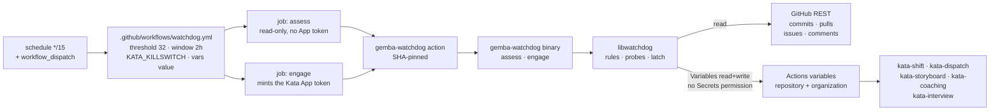
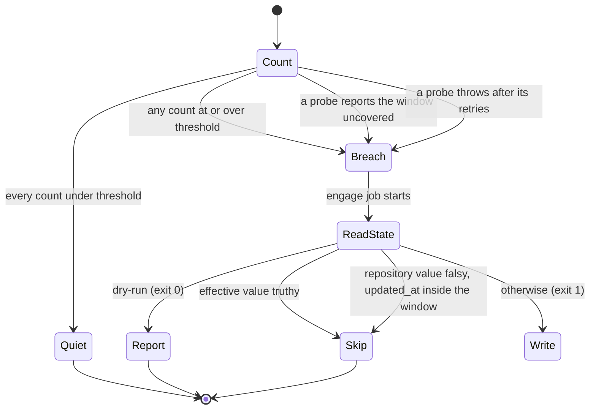

# Design 2330-a: Repository Activity Watchdog

Spec 2330 adds a deterministic brake on Kata event chains. This design fixes the
components, the measurement and engagement split, the credential scope, and the
failure semantics. The watchdog runs no agent. Its whole input is four counts
from the GitHub REST API and two variable records. The brake ships as Gemba
platform surface, so a generic library holds the engine, a thin CLI wires it to
argv, and a published action runs it in CI. This repository is one tenant of a
generic guardrail, as it is one tenant of the harness.

## Component map

Both jobs run the same action in different modes. Measurement mints no App token
and neither job checks the repository out, so a quiet run needs no secret and
the watchdog reads no repository data.

## Components

| Component | Where | Role |
| --------- | ----- | ---- |
| Guardrail library | `libraries/libwatchdog/` | The engine: rules, probes, the latch, the latch policy, the reason grammar, and the run-summary renderer. Import-only, host-agnostic, and tenant-neutral. It names no variable, no threshold, and no repository. |
| Watchdog CLI | `products/gemba/bin/gemba-watchdog.js` | The seventh `gemba-*` command. A `libcli` definition, two handlers imported from the library, and the exit-code wiring. It holds no counting, comparison, or reason logic. |
| Watchdog action | `products/gemba/actions/gemba-watchdog/` | Published to `forwardimpact/gemba-watchdog` by the subtree split, and pinned by SHA on `uses:`. It installs the CLI binary, mints the App token in `engage` mode, and runs the command. It takes the App id and key as `inputs:`, because a composite action cannot read `secrets.*`. |
| Watchdog workflow | `.github/workflows/watchdog.yml` | The two triggers, the threshold of 32 and the 2-hour window as literal numbers, the variable name, `vars.KATA_KILLSWITCH` for the summary, `github.event.repository.default_branch`, one `dry-run` input, and two jobs. `assess` grants `GITHUB_TOKEN` read access to contents, issues, and pull requests, declares its `verdict` and `reason` job outputs, and holds no other permission. `engage` sets `permissions: {}`, `needs: assess`, and an `if:` on the assess verdict. Both jobs set `timeout-minutes: 5`. |
| Credential | The existing Kata App, as `secrets.KATA_APP_ID` and `secrets.KATA_APP_PRIVATE_KEY` | The App gains `Variables: read & write` at repository scope and read access at organization scope, and holds no `Secrets` permission, so the credential that halts the team can never reach a secret. An operator makes this grant in the App settings. No repository surface can make it, and the brake is inert until a human does. |

## Library surface

`libwatchdog` exposes four seams: rule, probe, latch, and policy. A future
guardrail adds a rule set and a probe, and a future brake adds a latch. Neither
touches the engine or the CLI.

| Seam | Module | Contract |
| ---- | ------ | -------- |
| Rule | `src/rule.js` | `{ id, threshold, probe }`. |
| Probe | `src/sources/github-activity.js` | `async ({ request, repo, defaultBranch, cutoff }) => { count, covered }`. Four probes: default-branch commits, pull requests, issues, conversation comments. A probe throws when it cannot read. |
| Engine | `src/evaluate.js` | `(rules, { request, repo, defaultBranch, clock, windowMs }) => verdict`. It derives `cutoff`, runs every probe, catches each throw, compares each count, and reports every breach. |
| Latch | `src/latches/actions-variable.js` | `read() => { scope, value, updatedAt }` and `write(value)`. It reads the repository variable, then pages the organization listing. A 404 on the repository variable reads as absent. |
| Policy | `src/latch.js` | `(verdict, state, { windowMs }) => "engage" \| "skip"`. The already-stopped rule and the resume rule live here. |
| Value grammar | `src/reason.js`, `src/truthy.js` | Encodes and decodes the pipe-separated reason. Exports the truthy predicate, which lowercases before it tests `""`/`0`/`false`/`no`/`off`, so it agrees with the four shell readers. |
| Transport | `src/request.js` | The retrying request helper the probes and the latch share. |
| Summary | `src/summary.js` | The markdown block the CLI writes to `$GITHUB_STEP_SUMMARY`. |
| Commands | `src/commands/assess.js`, `src/commands/engage.js` | The two `libcli` handlers the CLI imports. |

`libutil`'s `GhClient` wraps GitHub REST over `runtime.subprocess`, which puts
the `gh` binary in the brake's critical path, so `src/request.js` uses `fetch`
and becomes the third such caller after `libharness/src/trace-github.js` and
`libbridge/src/dispatch.js`. Extracting one client from all three would put a
harness refactor inside the brake. It makes five attempts with backoff and
jitter, and treats a 403 carrying a rate-limit body as retryable, because
`Retry` alone covers 429, 499, and 5xx. Injecting `request`, `clock`, and
`windowMs` is what lets the tests reach every branch with no network or clock.

## Interfaces

| Step | Command | Request |
| ---- | ------- | ------- |
| Commits | assess | `GET /repos/{repo}/commits?sha={default_branch}&since={cutoff}&per_page=100`. `since` filters on committer date, so a force-push that rewrites 32 or more of them trips the counter, and that false stop is the intended fail-safe. |
| Pull requests | assess | `GET /repos/{repo}/pulls?state=all&sort=created&direction=desc&per_page=100` |
| Issues | assess | `GET /repos/{repo}/issues?state=all&sort=created&direction=desc&per_page=100` |
| Comments | assess | `GET /repos/{repo}/issues/comments?since={cutoff}&sort=created&direction=desc&per_page=100`, where `since` filters on `updated_at` |
| Read repository state | engage | `GET /repos/{repo}/actions/variables/{name}` for `value` and `updated_at` |
| Read organization state | engage | `GET /repos/{repo}/actions/organization-variables?per_page=30`, paged to the end |
| Engage | engage | `PATCH /repos/{repo}/actions/variables/{name}`, and `POST /repos/{repo}/actions/variables` when the variable is absent |

| Command | Options | Effects | Exit |
| ------- | ------- | ------- | ---- |
| `assess` | `--repo`, `--default-branch`, `--threshold`, `--window-hours`, `--killswitch-value`, `--format` | The run summary, and `verdict` plus `reason` on `$GITHUB_OUTPUT` | 0 on every outcome, so the engage job decides |
| `engage` | `--repo`, `--variable`, `--reason`, `--window-hours`, `--dry-run`, `--format` | The variable, and the run summary | 0 on skip and on dry run, 1 on engagement and on a failed read or write |

`GH_TOKEN` carries the credential. `--repo` falls back to `$GITHUB_REPOSITORY`
and `--variable` is required, so the CLI names no tenant. `--killswitch-value`
is the workflow's `vars` reading, which reports the current value on a quiet run
with no variables permission, and it is wrong for the decision because it
carries no `updated_at`. `--dry-run` reads both scopes and writes nothing.

**Counting.** `cutoff` is the run start minus the window. Pull requests, issues,
and comments count by `created_at` against the cutoff, and issues discard items
carrying a `pull_request` key. The comments endpoint covers the `issue_comment`
trigger surface and returns no inline review comments, which the spec excludes.

**Window coverage.** Only the commits endpoint filters by date server-side. The
other three return the newest 100 items, so each discards older ones and each
can hide older qualifying items behind a full page. All three therefore report
`covered: false` when a full first page still ends inside the window. A page
whose oldest item predates the cutoff covers the window, and that is the
ordinary case here, because this repository holds far more than 100 pull
requests. Coverage and the threshold coincide in practice, because a full page
held inside the window is a count of 100. Pagination runs only for the
organization listing.

## Decision order

Counting always runs first, so every summary carries the four counts, the
killswitch's current value, and the verdict. An operator reads the current
activity level from the latest run even while the switch is engaged, and an
unexplained clear becomes visible within 15 minutes.

**Effective value.** Every `kata-*` gate reads `vars.KATA_KILLSWITCH`, where a
repository variable overrides an organization one, and the policy resolves the
same way. A truthy organization variable under a falsy repository variable
leaves the team running, so that case engages rather than skips.

**Resume.** A human clears the switch by writing a falsy value rather than
deleting the variable, which leaves an `updated_at` the watchdog reads, and the
watchdog then stays quiet for one window while the burst drains. A delete gives
no timestamp and no quiet window, and an organization-scope clear gives none
either. The README states both, and this change corrects the four homes whose
resume instruction reads as a delete.

The written value is pipe-separated, because an ISO timestamp contains colons.
It names every breached counter and not the first, so a two-counter breach
records the whole evidence:
`watchdog|issues=47/32|comments=38/32|2026-09-02T16:49:00Z`. An unreadable or
uncovered counter takes that position and outranks a threshold breach.

## Failure semantics

`assess` always exits 0, so the engage job reaches its own decision.

| Condition | Result | Why |
| --------- | ------ | --- |
| Every count under threshold | assess quiet, no engage job | Normal operation. |
| Any count at or over threshold | engage exits 1 | The deterministic contract. |
| A probe reports the window uncovered, or throws after five attempts | engage exits 1, reason names the counter | Doubt stops the line. An unnecessary stop costs idle agent time, and a silent watchdog costs an unbounded token spend. |
| Effective value truthy, or repository value cleared inside the window | engage skips, exits 0 | The line is already stopped, and a rewrite would destroy a human's reason string. The second case is the resume path. |
| Either variable read fails | engage exits 1 without writing | The watchdog cannot tell an engaged switch from a clear one, so it must not overwrite either. |
| Token mint or variable write fails | engage exits 1, no state change | The next run recomputes the same window and retries. |
| The `assess` job fails or times out | No engage job, run red | Fail-open. The `if:` needs a verdict that never arrived. |
| The binary does not install | Either job red, no counts | Fail-open, and the cost of pinning a released binary. |

Three paths fail open and leave the brake absent: an expired credential, a
failed `assess` job, and a failed install. Each fails red every 15 minutes.

## Key decisions

| Decision | Choice | Rejected alternative and why |
| -------- | ------ | ---------------------------- |
| Logic home | A generic library, a thin CLI, and a published action | A shell script inside a local `.github/actions/` composite action. That leaves the brake's logic in a language with no test seam for time or transport, unavailable to any other repository, and outside the platform whose job is to run agent teams. |
| Library scope | A guardrail engine with rule, probe, latch, and policy seams | Watchdog-specific code with the four GitHub probes inlined. The next guardrail would then re-solve retries, coverage, the reason grammar, and the resume window. |
| Tenant neutrality | `--variable` is required, and the thresholds are options | A `KATA_KILLSWITCH` default in the library or the action. Gemba is the platform and Kata is one tenant. A default would add a third tenant-named default to a platform that documents having two. |
| CLI delivery | The SHA-verified prebuilt binary, through the released `fit-install.sh` and a pinned `gear@v*` tag | `npx gemba-watchdog`. The CLI ships inside `@forwardimpact/gemba`, whose closure reaches `libwiki`, `libharness`, and the Claude Agent SDK, so every 15-minute run would install the whole agent platform inside a 5-minute timeout. It would also be the platform's only npx-delivered action. Running `gemba-bootstrap` instead checks the repository out and installs a workspace, which the spec forbids. |
| Action distribution | A published sibling, pinned by SHA in this repository | A local `.github/actions/watchdog`. That keeps the subtree split and the release out of the critical path, and it also keeps the brake unavailable to the installations that run the same event chains. The SHA pin and the release pin are the gate that makes the extra hops safe. |
| Credential | The existing Kata App, gaining variables access and no `Secrets` permission | A second App with its key in a default-branch Actions Environment. That makes the containment a permission boundary an agent cannot cross, at the cost of a second App to register, install, and rotate. The operator chose one credential, and because the killswitch is a variable, the brake needs no secret access. |
| Job shape | Separate read-only `assess` and token-minting `engage` | One job. Every quiet run would then mint the write token, and the engage and fail-safe paths would be testable only by landing a change on the default branch. |
| Manual inputs | One `dry-run` input | Also `override-threshold` and `simulate`. A threshold override is a second home for a number success criterion 2 requires written once, and both inputs add a branch to the one component that must not misfire. Fixtures cover what they would rehearse. |
| Workflow name | `watchdog.yml` | `kata-watchdog.yml`. That name enters the `kata-*` glob and makes the killswitch sentence in `KATA.md` ambiguous. The `kata-workflows` topic already excludes one file, so the exclusion is cheap, and the naming claim is what matters: the workflow runs no agent, so it is repository CI rather than a Kata surface. |
| Killswitch read | Both scopes through the API in `engage`, and the `vars` context for the summary | The `vars` context for the decision, or the repository scope alone. `vars` carries no `updated_at`. Reading one scope lets a repository variable outlive an organization-scope clear, or hide one. |

## Contracts outside the four components

| Contract | What it needs |
| -------- | ------------- |
| Sibling publication | `publish-actions.yml` carries a per-action `paths:` filter and matrix, and each sibling lineage is seeded once. The action publishes only after both gain an entry and the `forwardimpact/gemba-watchdog` repository exists. |
| Binary publication | `build/cli-manifest.json` lists every compiled CLI with its bundle and targets. The binary exists only after `gemba-watchdog` joins it in the `gear` bundle. |
| Library conventions | `libraries/CLAUDE.md` names the runtime commands and restricts `www.gemba.team` citation to `libharness`, `libwiki`, and `libxmr`. A seventh command and a `libwatchdog` guide on that host make `libwatchdog` the fourth member of both lists. |
| Killswitch operator contract | Four homes carry a resume instruction the rule cannot honour: `KATA.md` and `kata-setup`'s SKILL.md say "unset it", and two `websites/kata/` pages say "clear it", which reads either way. Each becomes "write a falsy value". `kata-agent`'s action prose also claims one variable halts every workflow, alongside the two Kata pages the spec already corrects. |
| Trust-sensitive review | The merge gate carries the `.kata/` rule in two homes and gains the watchdog paths. `kata-security-update` has no such rule today, so this change creates one. Dependabot's `github-actions` scan covers `/` and `/.github/actions/*`, so it never reaches the action's own pins, while its root `bun` scan does cover the library through the workspace. That skill therefore guards the action by review and the library by triage. |
| Rollout order | The sibling seed and matrix entry come first, then the subtree split, then the manifest entry and the binary release. The workflow merges last, because it pins a SHA and a release tag that do not exist before then, and a workflow that lands early fails red every 15 minutes. |
| Documentation the plan enumerates | The guide, skill, and launcher; the Gemba site's sixth loop step, named `Stop` so `gemba-selfedit`'s "Guard the loop" heading stays unambiguous; two count moves in the composing Gemba skill; `KATA.md` § Killswitch; the `kata-setup` App permission table; and the generated fences, which `bunx jidoka invariants --seed enumeration-drift` reseeds for the sibling-action and library counts. |

## Clean break

The design removes no existing path, because the killswitch contract is the path
it uses. It adds no second brake, no second credential, and no fallback. The
truthy predicate gains one home in `libwatchdog` and no fifth shell copy, so the
spec's exclusion on consolidating the four existing copies still stands. No
repository data and no agent decision sits between a breach and the write.
