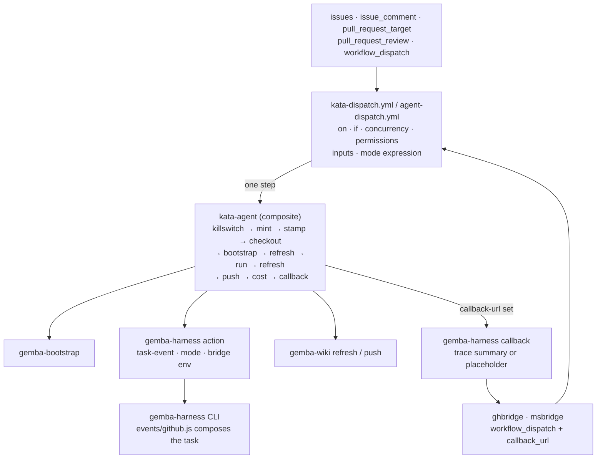
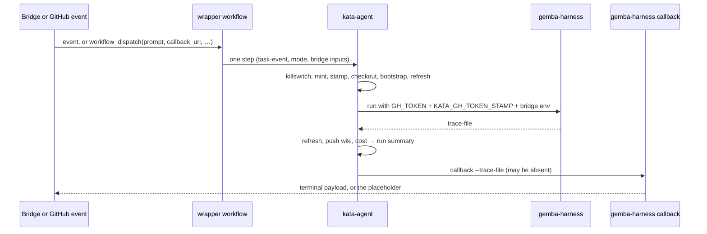

# Design 2340-a: `kata-agent` runs the dispatch

Spec 2340 makes every dispatch workflow one `kata-agent` step. This design
fixes which inputs `kata-agent` gains, where the bridge contract and the token
stamp live, what the wrapper workflow keeps, how the change reaches consumers,
and what it removes. No new component appears. The dispatch path collapses onto
the action the other three Kata workflows already use.

## Component map

## Components

| Component                | Home                                                                | Role after this design                                                                                                                                              |
| ------------------------ | ------------------------------------------------------------------- | ------------------------------------------------------------------------------------------------------------------------------------------------------------------- |
| Dispatch wrapper         | `.github/workflows/kata-dispatch.yml`; a consumer's `agent-dispatch.yml` | Declares what a composite action cannot: triggers, `if:`, concurrency, permissions, dispatch inputs, job timeout. Selects the mode. Calls `kata-agent` once.        |
| `kata-agent` action      | `products/kata/actions/kata-agent/` → `forwardimpact/kata-agent`    | The whole run lifecycle for every mode and every task source: text, file, event. Owns the token stamp and the bridge callback.                                     |
| `gemba-harness` action   | `products/gemba/actions/gemba-harness/`                             | Unchanged. It already accepts `task-event` and reads the bridge env.                                                                                                |
| `gemba-harness callback` | `libraries/libharness/src/commands/callback.js`                     | Posts the terminal payload from the trace. Gains the absent-trace branch.                                                                                           |
| Task composer            | `libraries/libharness/src/events/github.js`                         | Unchanged.                                                                                                                                                          |
| Dispatch template        | `.claude/skills/kata-setup/references/workflow-dispatch.md`         | One literal single-step workflow.                                                                                                                                   |
| Bridges                  | `services/ghbridge`, `services/msbridge`                            | Unchanged callers. Same `workflow_dispatch` inputs, same callback payload.                                                                                          |

## `kata-agent` interface

New inputs. Every existing input and output stays as it is.

| Input            | Default | Forwarded to                                   | Meaning                                                                                                         |
| ---------------- | ------- | ---------------------------------------------- | --------------------------------------------------------------------------------------------------------------- |
| `task-event`     | `""`    | `gemba-harness` `task-event`                   | Path to the native event payload. The CLI enforces exclusivity with `task-text` and `task-file`, as it does today. |
| `callback-url`   | `""`    | harness env `CALLBACK_URL`; the callback step  | Non-empty enables the callback step.                                                                            |
| `correlation-id` | `""`    | harness env `CORRELATION_ID`; the callback step | Echoed in the callback payload.                                                                                 |
| `inbox-url`      | `""`    | harness env `INBOX_URL`                        | Long-poll injection URL for `discuss`.                                                                          |
| `bun-version`    | `""`    | `gemba-bootstrap` `bun-version`                | Empty selects the bootstrap default.                                                                            |

The harness step env gains `KATA_GH_TOKEN_STAMP`, `CALLBACK_URL`,
`CORRELATION_ID`, and `INBOX_URL` beside `GH_TOKEN`, `ANTHROPIC_API_KEY`,
`CLAUDE_CODE_USE_BEDROCK`, and `IS_SANDBOX`. Outputs stay `trace-file`,
`trace-dir`, and `case`.

## Step sequence inside `kata-agent`

| #   | Step                           | Condition                          | Change |
| --- | ------------------------------ | ---------------------------------- | ------ |
| 1   | Kata killswitch                | always first                       |        |
| 2   | Mint installation token        |                                    |        |
| 3   | Stamp installation token       |                                    | new    |
| 4   | Checkout                       |                                    |        |
| 5   | `gemba-bootstrap`              | `bun-version` forwarded            | knob   |
| 6   | Refresh wiki (pre-run)         | `wiki == 'true'`                   |        |
| 7   | Assess and Act (`gemba-harness`) | task from event, text, or file; bridge env | input |
| 8   | Refresh wiki (post-run)        | `always() && wiki == 'true'`       |        |
| 9   | Push wiki changes              | `always() && wiki == 'true'`       |        |
| 10  | Report run cost                | `always()`                         |        |
| 11  | Deliver callback               | `always() && callback-url != ''`   | new    |

The callback runs last. The cost report and the wiki push then complete even
when the callback endpoint is down, and the callback carries the run's final
state.

## Token stamp

The action computes the stamp in the step after the mint, as `kata-dispatch.yml`
does today: `mint` (epoch seconds), `exp = mint + 3600 − 120`, `run`, and
`attempt`. It writes the stamp to the action's `GITHUB_ENV` and sets it on the
harness step env beside `GH_TOKEN`. The stamp and the token then always travel
together, which the auth-anomaly playbook requires. Shift, storyboard, and
coaching gain the stamp with no change to their workflows.

## Callback verb: absent-trace branch

| Trace path                   | Behaviour                                                                                                                       |
| ---------------------------- | ------------------------------------------------------------------------------------------------------------------------------- |
| Present, summary event found | Terminal payload from the trace. Unchanged.                                                                                     |
| Present, no summary event    | `verdict: failed` with the "produced no summary" text. Unchanged.                                                               |
| Empty option, or file absent | `verdict: failed`, a summary that names the missing trace, `cost_usd: 0`, `replies: []`, `last_acted_seq: -1`. Exit zero after the POST. New. |

`--trace-file` becomes optional. The action's callback step is one command with
no file guard. The wire shape has one home. The placeholder the workflow builds
today with `jq` lacks `cost_usd` and `last_acted_seq`, so the move also closes a
drift.

## Wrapper workflow

What stays in `kata-dispatch.yml` and in the template, and why.

| Element                           | Stays because                                                                                                                          |
| --------------------------------- | -------------------------------------------------------------------------------------------------------------------------------------- |
| `on:` block and its comments      | The trigger surface. A composite action has none.                                                                                      |
| `if:` predicate                   | Filters events before a runner starts.                                                                                                 |
| `concurrency`                     | Not declarable in a composite action. Policy unchanged.                                                                                |
| `permissions: contents: write`    | Job-level.                                                                                                                             |
| `workflow_dispatch` inputs        | `prompt`, `callback_url`, `correlation_id`, `discussion_id`, `resume_context`, `inbox_url`. The bridge contract on the trigger side.   |
| `mode:` expression                | `discussion_id != '' && 'discuss' \|\| 'facilitate'`. One line the consumer reads.                                                    |
| Job `timeout-minutes`             | Not declarable in a composite action. Each consumer chooses.                                                                           |

The one step passes the secrets as inputs,
`killswitch: ${{ vars.KATA_KILLSWITCH }}`,
`task-event: ${{ github.event_path }}`, the profiles, the models, and the bridge
inputs mapped from `inputs.*`. On issue and PR events `inputs` is null, so every
bridge input is empty and the callback step skips.

## Data flow

## `kata-setup` changes

| Reference              | Change                                                                                                                                                                                                                                                        |
| ---------------------- | ------------------------------------------------------------------------------------------------------------------------------------------------------------------------------------------------------------------------------------------------------------- |
| `workflow-dispatch.md` | The template block is the complete workflow: `on:`, `if:`, `concurrency`, `permissions`, inputs, and one `kata-agent` step. § Hosted variant becomes the shift delta: `id-token: write`, the OIDC mint step, `installation-token` on the step. Placeholders: `{{AGENT_LIST}}`, `{{MODEL}}`, `{{WIKI}}`, `{{KATA_AGENT_REF}}`. |
| `workflow-shift.md`    | § Inline steps deleted. § Resolving action refs names `kata-agent` only.                                                                                                                                                                                      |
| `SKILL.md`             | DO-CONFIRM loses the two dispatch carve-outs and keeps "The dispatch workflow does no prompt assembly. It passes `task-event`." Step 2 resolves `{{KATA_AGENT_REF}}` only and loses the harness-based exception paragraph.                                     |

## Rollout

The consumer pins a sibling SHA, and each sibling is a projection of this
repository. Three releases stand between the source change and the repin, in
this order:

1. The `libharness` callback change → a `gear@v*` release → `gemba-bootstrap`
   repins `FIT_GEAR_RELEASE` in `fit-install.sh` → a `gemba-bootstrap` release.
2. `kata-agent` repins `gemba-bootstrap` and gains its inputs and steps → a
   `kata-agent` release.
3. `kata-dispatch.yml` and the consumer's `agent-dispatch.yml` repin to that
   `kata-agent` SHA.

The `kata-setup` edits land with step 2 or after it. The template resolves
`{{KATA_AGENT_REF}}` to the highest release tag at generation time, so it is
true only once a release that declares `task-event` exists. The plan sequences
the steps.

## Key decisions

| Decision                     | Chosen                                                            | Rejected                                                        | Why                                                                                                                                                                                         |
| ---------------------------- | ----------------------------------------------------------------- | --------------------------------------------------------------- | ------------------------------------------------------------------------------------------------------------------------------------------------------------------------------------------- |
| Home for `task-event`        | An input on `kata-agent`, forwarded to `gemba-harness`            | A new `kata-dispatch` composite action that wraps `kata-agent`  | An eighth sibling adds a publish matrix entry, a release lineage, a README, and a Dependabot pin, for one input and one gated step. `kata-agent` already owns the lifecycle.                 |
| Home for the bridge callback | `kata-agent` inputs and one gated step                            | A second wrapper step that reads `trace-file`                   | Splits the bridge contract across the action and every consumer's workflow, and leaves the placeholder shell in each. A bridge consumer would re-copy it.                                   |
| Absent-trace placeholder     | `gemba-harness callback` builds it                                | Inline `curl` and `jq` in the action                            | The verb already builds the canonical payload. Two homes for the wire shape drift, and the current copy already lacks two fields. A unit test covers the CLI path.                           |
| Token stamp                  | `kata-agent` stamps after its own mint                            | Keep the stamp step in the wrapper                              | The wrapper no longer mints, so it cannot stamp. Stamping in the action also closes the stampless gap on shift, storyboard, and coaching.                                                    |
| Wiki refresh on dispatch     | Uniform lifecycle: refresh before and after, like every `kata-agent` run | A `refresh` toggle input                                  | One issue listing per refresh. The facilitator reads a current storyboard. A toggle is a knob no consumer asked for.                                                                        |
| Mode selection               | An expression on `mode:` in the workflow                          | `kata-agent` infers `discuss` from a non-empty `discussion-id`  | Storyboard runs `discuss` with no `discussion-id`. Inference couples two inputs and hides the choice from the consumer.                                                                     |
| Bun version                  | A `bun-version` passthrough on `kata-agent`                       | Wait for the `gemba-bootstrap` default bump                     | The reference consumer holds the knob today. The move must not strip it. The passthrough is independent of the upstream bump.                                                               |
| Template form                | One literal single-step block                                     | Comments that point to another reference for a step             | The comments are the defect the spec names.                                                                                                                                                 |

## Removed

- `kata-dispatch.yml`: the killswitch, mint, stamp, checkout, bootstrap,
  harness, cost, wiki push, and callback steps, with their inline shell and the
  `jq` placeholder payload.
- `workflow-dispatch.md`: the six-step body and its three `gemba-*`
  placeholders.
- `workflow-shift.md`: § Inline steps, and the `gemba-*` entries in § Resolving
  action refs.
- `SKILL.md`: the two DO-CONFIRM carve-outs and the Step 2 exception paragraph.

## Test strategy

| Test                            | Asserts                                                                                                                                                                                                                  |
| ------------------------------- | ------------------------------------------------------------------------------------------------------------------------------------------------------------------------------------------------------------------------ |
| `libharness` callback unit test | A present trace posts the trace summary. An absent path posts the placeholder with `verdict: failed` and `cost_usd: 0`, and exits zero. An empty option behaves as absent.                                                |
| Shape test under `tests/`       | `kata-dispatch.yml` has one `uses:` line and it names `forwardimpact/kata-agent@`. `action.yml` declares the five new inputs. The dispatch template block has one `uses:` line. Nothing under `.github/workflows/` names `KATA_GH_TOKEN_STAMP`. |
| Manual acceptance               | One `workflow_dispatch` of `kata-dispatch.yml` with a `callback_url` shows the cost table on the run summary, and the endpoint receives one terminal payload.                                                              |
