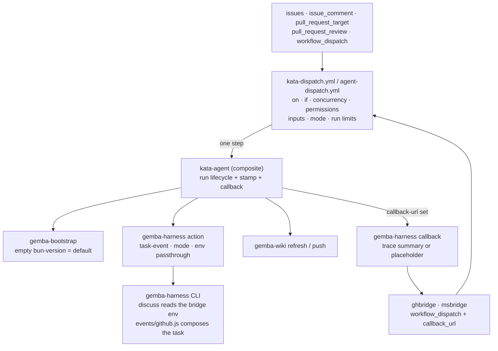
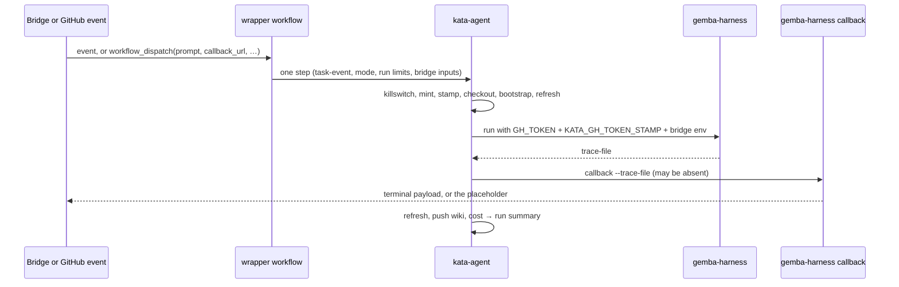

# Design 2340-a: `kata-agent` runs the dispatch

Spec 2340 makes every dispatch workflow one `kata-agent` step. This design
fixes the inputs `kata-agent` gains, the homes of the bridge contract and the
token stamp, what the wrapper keeps, the release chain, and what it removes.
No new component appears.

## Component map

## Components

| Component                | Home                                                                          | Role after this design                                                                                                                                                                                   |
| ------------------------ | ----------------------------------------------------------------------------- | -------------------------------------------------------------------------------------------------------------------------------------------------------------------------------------------------------- |
| Dispatch wrapper         | `.github/workflows/kata-dispatch.yml`; a consumer's `agent-dispatch.yml`      | Declares what a composite action cannot: triggers, `if:`, concurrency, permissions, dispatch inputs, job timeout. Selects the mode and the run limits. Calls `kata-agent` once.                           |
| `kata-agent` action      | `products/kata/actions/kata-agent/` → `forwardimpact/kata-agent`              | The whole run lifecycle for every mode and every task source: text, file, event. Owns the token stamp and the bridge callback. Its README documents the event mode, the bridge inputs, and the stamp.    |
| `gemba-bootstrap` action | `products/gemba/actions/gemba-bootstrap/`                                     | An empty `bun-version` selects its pinned default. The version literal keeps one home.                                                                                                                   |
| `gemba-harness` action   | `products/gemba/actions/gemba-harness/`                                       | Unchanged. It accepts `task-event` and passes the step env through untouched. Its README callback recipe drops the trace-file guard.                                                                     |
| `gemba-harness` CLI      | `libraries/libharness/`; option schema in the `gemba-harness` bin             | `discuss` reads `CALLBACK_URL`, `INBOX_URL`, and `CORRELATION_ID` from the env; `facilitate` ignores them. `callback` gains the absent-trace branch. The task composer is unchanged.                    |
| Dispatch template        | `.claude/skills/kata-setup/references/workflow-dispatch.md`                   | One literal single-step workflow (§ Template contract).                                                                                                                                                  |
| Auth-anomaly playbook    | `.claude/agents/x-auth-anomaly.md`                                            | States that every `kata-agent` surface carries the stamp. § Stampless surfaces names what remains: `kata-interview` and sessions outside Actions.                                                        |
| Actions orientation      | `.github/CLAUDE.md`                                                           | The `kata-agent` row names the event mode.                                                                                                                                                               |
| Bridges                  | `services/ghbridge`, `services/msbridge`                                      | Unchanged callers. Same `workflow_dispatch` inputs, same callback payload.                                                                                                                               |
| `kata-interview` action  | `products/kata/actions/kata-interview/`                                       | Unchanged. It keeps its own lifecycle copy and stays stampless. The spec excludes it. It is the next candidate to fold onto `kata-agent`.                                                                 |

## `kata-agent` interface

The action gains five inputs. Every existing input and output stays as it is.

| Input            | Default | Forwarded to                                    | Meaning                                                                                                             |
| ---------------- | ------- | ----------------------------------------------- | ------------------------------------------------------------------------------------------------------------------- |
| `task-event`     | `""`    | `gemba-harness` `task-event`                    | Path to the native event payload. The CLI enforces exclusivity with `task-text` and `task-file`, as it does today.  |
| `callback-url`   | `""`    | harness env `CALLBACK_URL`; the callback step   | Non-empty enables the callback.                                                                                     |
| `correlation-id` | `""`    | harness env `CORRELATION_ID`; the callback step | Echoed in the callback payload.                                                                                     |
| `inbox-url`      | `""`    | harness env `INBOX_URL`                         | Long-poll injection URL for `discuss`.                                                                              |
| `bun-version`    | `""`    | `gemba-bootstrap` `bun-version`, verbatim       | Empty reaches the bootstrap, which treats empty as its default.                                                     |

The harness step env gains `KATA_GH_TOKEN_STAMP`, `CALLBACK_URL`,
`CORRELATION_ID`, and `INBOX_URL` beside the four it sets today. The callback
step derives the run URL from the `github` context and passes the action's own
`discussion-id`. With `trace: "false"` and a `callback-url`, the callback posts
the no-trace placeholder, so a bridge caller keeps `trace` on. Outputs stay
`trace-file`, `trace-dir`, and `case`.

## Step sequence inside `kata-agent`

| #   | Step                             | Condition                                  | Change |
| --- | -------------------------------- | ------------------------------------------ | ------ |
| 1   | Kata killswitch                  | always first                               |        |
| 2   | Mint installation token          |                                            |        |
| 3   | Stamp installation token         |                                            | new    |
| 4   | Checkout                         |                                            |        |
| 5   | `gemba-bootstrap`                | `bun-version` forwarded                    | input  |
| 6   | Refresh wiki (pre-run)           | `wiki == 'true'`                           |        |
| 7   | Assess and Act (`gemba-harness`) | task from event, text, or file; bridge env | input  |
| 8   | Deliver callback                 | `always() && callback-url != ''`           | new    |
| 9   | Refresh wiki (post-run)          | `always() && wiki == 'true'`               |        |
| 10  | Push wiki changes                | `always() && wiki == 'true'`               |        |
| 11  | Report run cost                  | `always()`                                 |        |

The callback follows the run step directly, so the bridge gets its verdict
before the wiki round-trip and cost still reports last. A failure before the
bootstrap leaves no `gemba-harness` binary on the runner, so no callback posts.
Today's inline placeholder covers that case. The design accepts the gap: the
run is red in Actions, and a bridge-side dispatch timeout is its own change.

## Token stamp

The action computes the stamp in the step after the mint, as
`kata-dispatch.yml` does today: `mint` (epoch seconds),
`exp = mint + 3600 − 120`, `run`, and `attempt`. The stamp is a step output
that the harness step sets on its env beside `GH_TOKEN`. Nothing reaches the
caller's job env. Shift, storyboard, and coaching gain the stamp with no change
to their workflows.

## Callback verb: absent-trace branch

| Trace path                   | Behaviour                                                                                                                  |
| ---------------------------- | -------------------------------------------------------------------------------------------------------------------------- |
| Present, summary event found | Terminal payload from the trace. Unchanged.                                                                                |
| Present, no summary event    | `verdict: failed` with the "produced no summary" text. Unchanged.                                                          |
| Empty option, or file absent | The full terminal shape: `kind`, `correlation_id`, `verdict: failed`, a summary that names the missing trace, `run_url`, `cost_usd: 0`, `replies: []`, `last_acted_seq: -1`, and the `discussion_id` from the option. Exit zero after the POST. New. |

`--trace-file` becomes optional, so the action's callback step carries no file
guard.

## Wrapper workflow

What stays in `kata-dispatch.yml` and in the template, and why.

| Element                              | Stays because                                                                                                                          |
| ------------------------------------ | -------------------------------------------------------------------------------------------------------------------------------------- |
| `on:` block and its comments         | The trigger surface. A composite action has none.                                                                                      |
| `if:` predicate                      | Filters events before a runner starts.                                                                                                 |
| `concurrency`                        | Not declarable in a composite action. Policy unchanged.                                                                                |
| `permissions: contents: write`       | Workflow-level.                                                                                                                        |
| `workflow_dispatch` inputs           | `prompt`, `callback_url`, `correlation_id`, `discussion_id`, `resume_context`, `inbox_url`. The bridge contract on the trigger side.   |
| `mode:` expression                   | `discussion_id != '' && 'discuss' \|\| 'facilitate'`. One line the consumer reads.                                                    |
| Run limits on the step               | `max-turns` and `timeout-minutes` on the `with:` block, as shift does. Dispatch passes 1500 and 300 today against defaults of 200 and 45. |
| Job `timeout-minutes`                | Not declarable in a composite action. Each consumer chooses.                                                                           |

The one step passes the secrets as inputs,
`killswitch: ${{ vars.KATA_KILLSWITCH }}`,
`task-event: ${{ github.event_path }}`, the profiles, the models, the run
limits, and the bridge inputs mapped from `inputs.*`. On issue and PR events
`inputs` is null, so every bridge input is empty and the callback step skips.

## Template contract

The `workflow-dispatch.md` template block is the complete workflow: `on:`,
`if:`, `concurrency`, `permissions`, the six `workflow_dispatch` inputs above,
and one `kata-agent` step. It resolves `{{AGENT_LIST}}`, `{{MODEL}}`,
`{{WIKI}}`, and `{{KATA_AGENT_REF}}`. The hosted delta equals the shift delta:
`id-token: write`, the OIDC mint step, and `installation-token` on the step.
That input does not exist on `kata-agent` yet, which the spec records as the
accepted regression.

## Data flow

## Release dependencies

Each sibling is a projection of this repository, and every consumer pins a
sibling SHA. The `libharness` callback change ships in a `gear` release.
`gemba-bootstrap` pins that gear release and carries the empty-means-default
change. `kata-agent` pins that `gemba-bootstrap` release and gains its inputs
and steps. Both wrappers pin that `kata-agent` release. The template resolves
`{{KATA_AGENT_REF}}` to the highest release tag, so the `kata-setup` edit
depends on the `kata-agent` release too. The plan sequences the cuts.

## Key decisions

| Decision                      | Chosen                                                                    | Rejected                                                                       | Why                                                                                                                                                                                         |
| ----------------------------- | ------------------------------------------------------------------------- | ------------------------------------------------------------------------------ | ------------------------------------------------------------------------------------------------------------------------------------------------------------------------------------------- |
| Home for `task-event`         | An input on `kata-agent`, forwarded to `gemba-harness`                    | A new `kata-dispatch` composite action that wraps `kata-agent`                 | An eighth sibling adds a publish matrix entry, a release lineage, a README, and a Dependabot pin, for one input and one gated step. `kata-agent` already owns the lifecycle.                 |
| Home for the bridge callback  | `kata-agent` inputs and one gated step                                    | A second wrapper step that reads `trace-file`                                  | Splits the bridge contract across the action and every consumer's workflow, and leaves the placeholder shell in each. A bridge consumer would re-copy it.                                   |
| Callback position             | Directly after the run step                                               | Last, after cost and wiki push                                                 | The bridge waits on the wiki round-trip for nothing it uses, and "reports cost last" is the contract the shift templates and the action comments state.                                     |
| Absent-trace placeholder      | `gemba-harness callback` builds it                                        | Inline `curl` and `jq` in the action                                           | The verb already builds the canonical payload. Two homes for the wire shape drift, and the current copy already lacks two fields. A unit test covers the CLI path.                           |
| Token stamp home              | `kata-agent` stamps after its own mint                                    | Keep the stamp step in the wrapper                                             | The wrapper no longer mints, so it cannot stamp. Stamping in the action also closes the stampless gap on shift, storyboard, and coaching.                                                    |
| Stamp transport               | A step output the harness step reads                                      | `GITHUB_ENV`                                                                   | `GITHUB_ENV` is job-wide and leaks past the action boundary. The sibling actions pass intra-action values as step outputs.                                                                   |
| Empty `bun-version`           | `gemba-bootstrap` treats empty as its default                             | A duplicated default literal on `kata-agent`                                   | A composite action cannot omit a `with:` key, so a second literal is the only other route, and a Dependabot SHA bump would not bump it. One home, and it rides the bootstrap release the chain already needs. |
| Wiki refresh on dispatch      | Uniform lifecycle: refresh before and after, like every `kata-agent` run  | A `refresh` toggle input                                                       | One issue listing per refresh. The facilitator reads a current storyboard. Every dispatch run already pushes the wiki, so concurrent pushes are not new.                                     |
| Mode selection                | An expression on `mode:` in the workflow                                  | `kata-agent` infers `discuss` from a non-empty `discussion-id`                 | Storyboard runs `discuss` with no `discussion-id`. Inference couples two inputs and hides the choice from the consumer.                                                                     |
| Template form                 | One literal single-step block                                             | Comments that point to another reference for a step                            | The comments are the defect the spec names.                                                                                                                                                 |
| Shape verification            | The spec's one-time `rg` criteria                                         | A shape test under `tests/`                                                    | CONTRIBUTING § Testing forbids a test that asserts a workflow or action holds a given step or string. The one-line wrapper is self-evident, and the enumeration invariants already guard the file sets. |

## Removed

- `kata-dispatch.yml`: the killswitch, mint, stamp, checkout, bootstrap,
  harness, cost, wiki push, and callback steps, with their inline shell, the
  `jq` placeholder payload, and the `event_name == 'workflow_dispatch'` clause
  on the callback gate.
- The reference consumer's `agent-dispatch.yml`: its seven steps, the
  `bun-version` comment, and the 64 KiB redirect comment.
- `workflow-dispatch.md`: the six-step body, the three `gemba-*` placeholders,
  the three-step hosted delta, and the closing prose that says the workflow
  uses `gemba-harness` so it can pass `task-event`.
- `workflow-shift.md`: § Inline steps, the "add no inline steps" clause, and
  the `gemba-*` entries in § Resolving action refs.
- `SKILL.md`: the dispatch exception sentence in the killswitch DO-CONFIRM item
  and in the Step 2 killswitch paragraph.
- `libharness`: the `--trace-file is required` guard, and the docstrings in the
  callback command and the task composer that name `kata-dispatch.yml` as
  their caller. `gemba-harness` README: the guard on its callback recipe.

## Test strategy

| Test                            | Asserts                                                                                                                                                                                 |
| ------------------------------- | --------------------------------------------------------------------------------------------------------------------------------------------------------------------------------------- |
| `libharness` callback unit test | A present trace posts the trace summary. An absent path posts the full-shape placeholder with `verdict: failed` and `cost_usd: 0`, and exits zero. An empty option behaves as absent.  |
| Manual acceptance               | One `workflow_dispatch` of `kata-dispatch.yml` with a `callback_url` shows the cost table on the run summary, and the endpoint receives one terminal payload.                             |
