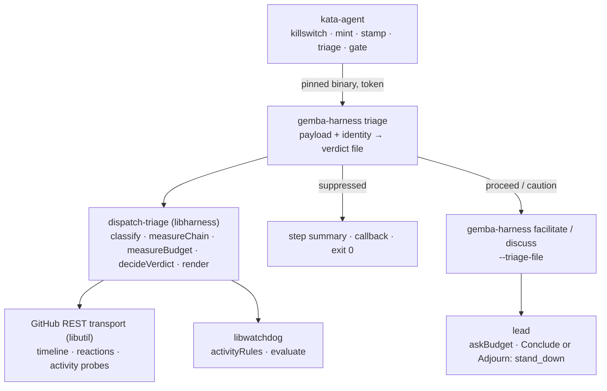
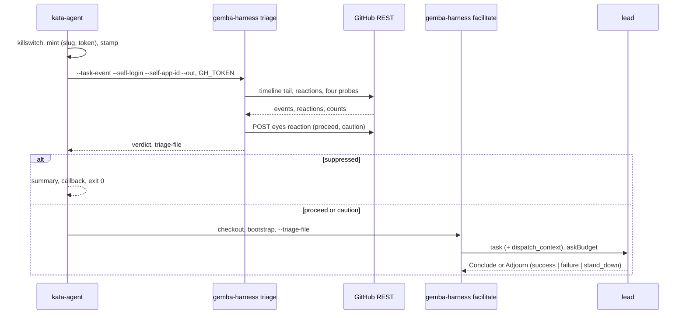

# Design 2350-a: triage before checkout

Spec 2350 puts a deterministic verdict in front of every event-driven run. This
design fixes the components, where they run, the interfaces, the defaults, and
the removals.

## Component map



## Components

| Component | Home | Role after this design |
| --------- | ---- | ---------------------- |
| Dispatch triage | `libraries/libharness/src/dispatch-triage.js` (new) | § Triage functions. |
| Triage verb | `libraries/libharness/src/commands/triage.js` (new); command entry in `products/gemba/bin/gemba-harness.js`; `package.json` export | Reads the payload and the identity. Writes the verdict record as JSON to `--out` and as step outputs through `libwatchdog`'s exported CI helpers. |
| GitHub REST transport | `libraries/libutil` (moved from `libwatchdog/src/request.js`) | One bearer-token `fetch` transport with retry. `libwatchdog` and the triage import it. `trace-github.js` keeps its own read path; that residual duplication is accepted here. |
| Task-input resolver | `commands/task-input.js` | Returns the payload and the event name beside the task and the amendment. |
| Task composer | `events/github.js` | Label templates render `sender`. Gains the artifact accessor: repository, default branch, number, trigger kind, trigger id and timestamp when present, actor login, actor App id. |
| Facilitate and discuss commands | `commands/facilitate.js`, `commands/discuss.js` | Read `--triage-file`. Short-circuit on `suppressed`. Append the block. Set `ctx.askBudget`. |
| Orchestration context and loop | `orchestration-toolkit.js`, `orchestration-loop.js` | `ctx.askBudget` bounds the distinct addressees of the lead's Asks; a broadcast counts every participant; the handler refuses the Ask that would exceed it. The facilitator's `Conclude` and the discuss `Adjourn` accept `stand_down`. The loop counts `stand_down` as a successful exit. The supervisor and judge tools are unchanged. |
| Summary reader | `trace-collector.js` `orchestratorSummary` | The one reader of the last orchestrator summary. `callback.js`, the overview verb, and the cost verb use it. |
| Callback verb | `commands/callback.js` | Gains `--triage-file`. Posts `verdict: "suppressed"` with the reason when no trace exists and the file does. |
| `kata-agent` action | `products/kata/actions/kata-agent/` | § Placement. Inputs `hop-cap`, `dispatch-budget`, `gear-release`, `installer-sha256`. The `app-slug` input is removed. Git identity and triage identity both come from the mint output. |
| `gemba-harness` action | `products/gemba/actions/gemba-harness/` | Inputs `triage-file`, `self-login`, `self-app-id`, `hop-cap`, `dispatch-budget`, forwarded as flags. |
| Watchdog workflow and template | `.github/workflows/watchdog.yml` (spec 2330 part 05 creates it; this design creates it when it lands first); `kata-setup` `references/workflow-watchdog.md` (new) | Tick `*/5`. Threshold 32, window 2. `kata-setup` emits the template. |
| Prose homes | dispatch workflow, `kata-setup` template and skill, watchdog README and guide, coordinate-team guide, `libraries/README.md`, `test/prompts.test.js` | Name the triage, the budget, and the shared runner pool. Drop "recursion guard". |

## Triage functions

| Function | Contract |
| -------- | -------- |
| `classifyActor(login, appId, self)` | `human`, `self`, or `bot`. `self` when the login normalizes to the slug or the App id matches. Normalization strips a `[bot]` suffix and an `app/` prefix. |
| `readArtifact(request, artifact)` | Pages the timeline from the last page backwards until a human event or the page cap. Reads the trigger's reactions. |
| `measureChain(events, trigger, self)` | § Chain record. |
| `measureBudget(request, repo, defaultBranch, budget, windowHours)` | § Budget record. |
| `decideVerdict(chain, budget, limits)` | § Verdict. |
| `renderContextBlock(chain, budget, verdict)` | § Context block. |
| `markTrigger(request, trigger)` | One `eyes` reaction. § Mark. |

## Placement

The triage step sits after the mint and the stamp and before checkout. It
installs the pinned `gemba-harness` binary through the same installer and pin
inputs the watchdog action exposes. Bootstrap's CLI list omits `gemba-harness`,
so one binary and one pin serve the whole job. Checkout, bootstrap, the wiki
refresh, the harness step, and the wiki push gate on the verdict. The callback
step runs regardless and passes the triage file. The cost step gates on the
harness step, because the trace binary arrives with bootstrap. A suppressed run
costs the killswitch, one mint, one binary download, and a few REST reads.

## Chain record

| Field | Definition |
| ----- | ---------- |
| `actor` | Class of the trigger's author. `sender` on label, close, and dispatch events. |
| `artifact` | False for `workflow_dispatch`. No read happens. |
| `hops` | Self utterances after the last human event, counted from the tail. The opening of a self artifact is one. `commented`, `reviewed`, and `merged` count. `labeled` does not. A human `labeled`, `commented`, `reviewed`, `merged`, or `closed` resets. |
| `floor` | True when the page cap stopped the walk before a human event. `hops` is then a lower bound. |
| `superseded` | True for a self comment or review trigger when an utterance newer than the trigger's timestamp exists. Never true for a human trigger or for a label or merge trigger. |
| `minutesSinceHuman` | Age of the last human event. Null when none exists. |
| `alreadySeen` | True when a self comment or self-opened issue trigger carries a reaction by self. |
| `readable` | False when a read threw. |

## Budget record

| Field | Definition |
| ----- | ---------- |
| `counters` | Each of the four watchdog counters: count, covered, breached. |
| `breached` | Any counter at or above the budget. A full uncovered page counts as a breach, because the counted floor already exceeds the budget. |
| `readable` | False when a probe threw. |

## Verdict

Rules apply in order. The first match wins.

| Condition | Verdict | Reason |
| --------- | ------- | ------ |
| `artifact` is false | `proceed` | |
| `actor` is `human` | `proceed` | `unreadable` note in the block when a read threw |
| `actor` is `bot` | `caution` | |
| `alreadySeen` | `suppressed` | `duplicate` |
| `superseded` | `suppressed` | `superseded` |
| `hops ≥ hopCap`, floor or exact | `suppressed` | `hop_cap` |
| chain or budget unreadable, or `floor` under the cap | `suppressed` | `unreadable` |
| budget `breached` | `suppressed` | `budget` |
| otherwise | `caution` | |

## Defaults

The command's flag defaults are the one home. The actions forward empty values.

| Value | Default | Grounding |
| ----- | ------- | --------- |
| `--hop-cap` | 3 | Earliest bot-only handoff in the incident sat at hop 3. Human approval, release-engineer merge, and the recording run fit under it. |
| `--dispatch-budget` | 24 per counter | Three quarters of the latch. 1.6 times the largest legitimate batch. Engaged at 15:01Z on the replay. |
| `--dispatch-window-hours` | 2 | Matches the watchdog's window. |
| Watchdog threshold, window | 32, 2 hours | Unchanged from spec 2330. |
| Watchdog tick | `*/5` | Ten minutes off the detection lag at the incident's rate. |
| `askBudget` on `caution` | 1 | Every incident session asked all four participants. `proceed` leaves it unbounded. |
| Timeline page cap | 5 pages of 100 | Covers the hottest incident artifact. |

## Context block

Appended after the template task and before any amendment. Present on
`caution`, and on `proceed` with a note. Absent on a clean `proceed`.

```text
<dispatch_context>
actor: self (kata-agent-team[bot]) | hops: 2 of 3 | last human: none |
repository activity in 2 h: issues 9/24, pulls 9/24, comments 15/24, commits 0/24
Engage one participant only when the body hands new actionable work to a
different named agent. Otherwise end with verdict stand_down.
</dispatch_context>
```

## Suppressed run

| Home | Content |
| ---- | ------- |
| Step summary | Verdict, reason, chain record, budget record. Written by the triage step. |
| Callback payload | `verdict: "suppressed"`, the reason, `cost_usd: 0`. |
| Trace | None on the action path. The standalone command writes `session_start` and a `summary` with `verdict: "suppressed"` and both records. |

## Mark

| Trigger | Target |
| ------- | ------ |
| Self comment | The comment |
| Self-opened issue | The issue |
| Human trigger, label, review, merge | None |

The triage step writes the mark right after a `proceed` or `caution` verdict,
so the duplicate test and the mark share one moment. A failed write logs one
line and does not stop the run.

## Data flow



## Key decisions

| Decision | Rejected alternative | Why |
| -------- | -------------------- | --- |
| Triage is a step before checkout, on one pinned binary. | Triage inside the harness command after bootstrap. | At the incident's rate, runs that only bootstrapped and stood down would still hold the runner pool. The watchdog action proves a pinned binary needs no bootstrap. |
| The transport moves to `libutil`. | Import `libwatchdog`'s transport, or `GhClient` over the `gh` binary. | Two libraries share one transport and neither depends on the other for I/O. The pre-checkout step has no repository for `gh` to resolve. |
| The budget reuses the watchdog rules and yields. | A separate counter, or engaging the latch from the triage. | One set of probes and one window. Engaging needs a variables write in every run, against the single-writer rule of the killswitch reference. |
| Human triggers skip the chain and budget rules. | Fail closed for all, or supersede human triggers. | A flood produces rate-limit errors. A human signal must never be dropped by a stale queue. |
| Artifact-less events proceed. | Classify the dispatching token. | A bridge dispatch under the App token would read as self and stand down every bridge run. |
| The opening counts as a hop. | Count comments only. | A self artifact with no human touch is one utterance deep. |
| Utterances count. Labels do not. | Count every self event, or group by time gap. | One run applies several labels. A time gap is a heuristic with no ground. |
| Supersession is a verdict for self triggers. | Let the facilitator read the tail. | With a deep queue the payload is hours stale. The newer utterance's run sees the tail. |
| Ask budget of one on `caution`. | Prompt the lead to ask fewer. | The template already said to Ask each addressee. Every session asked four. |
| `stand_down` on the facilitator's Conclude and on Adjourn only. | Widen the shared Conclude schema. | The supervisor and judge verdicts feed benchmark grading. |
| Watchdog threshold and window stay. Tick tightens. | Lower the threshold, or add a runs counter. | 32 detects the incident within ten minutes of a five-minute tick. Comments have no legitimate baseline. A runs counter needs an Actions read scope. |
| `kata-setup` emits the watchdog. | Leave rollout to each installation. | The reference consumer ran with no watchdog. |
| Suppressed exits zero. | Exit non-zero to stand out. | A suppressed run is the design working. The summary and the callback carry the record. |
| The mark is a reaction. | A hidden comment or a label. | A reaction fires no dispatch event and needs no new permission. |

## Removals

| Removed | Replaced by |
| ------- | ----------- |
| The stand-down sentence in the facilitated, discuss, and supervised participant prompts | The rule in the context block, owned by the lead. |
| "recursion guard" prose in the workflow, the template, the skill, the prompt tests, and the libraries catalog | Prose that names the triage, the budget, and the watchdog. |
| The `app-slug` input on `kata-agent` | The mint output. |
| `libwatchdog/src/request.js` | The `libutil` transport. |
| Any `success` verdict that meant "nothing to do" | `stand_down`. |
