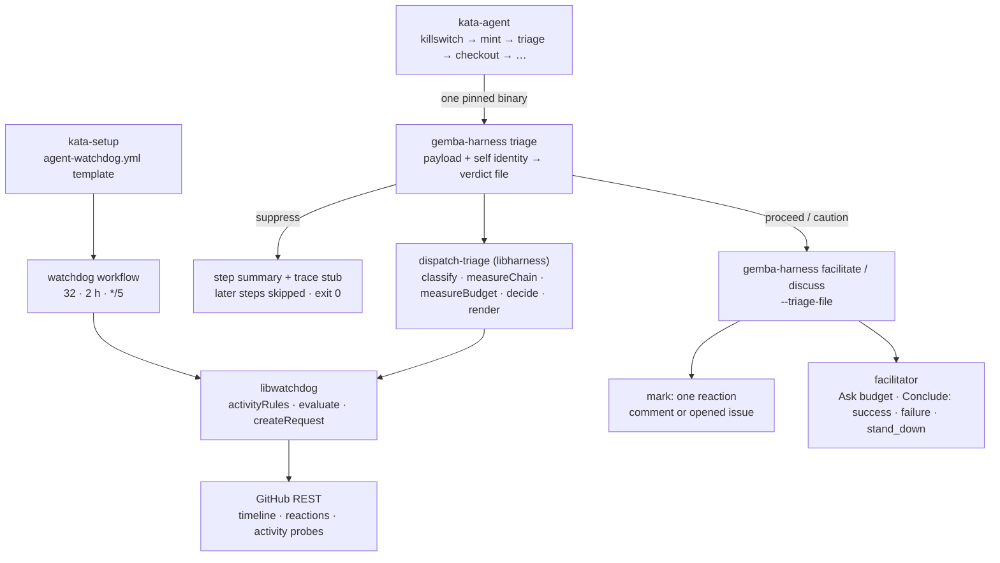
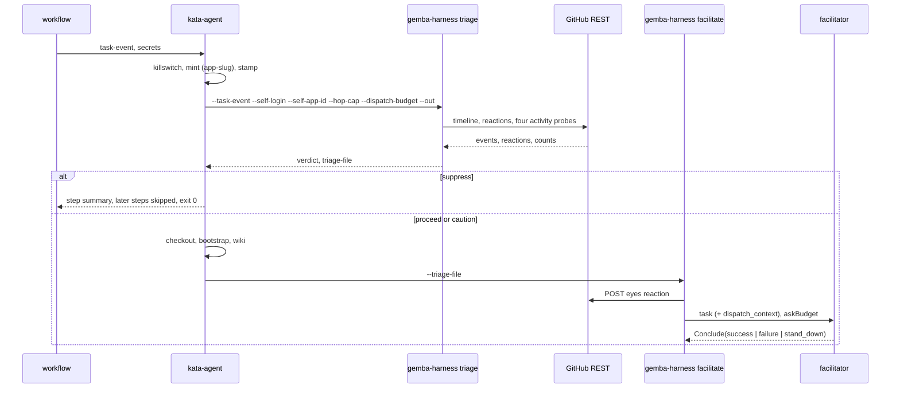

# Design 2350-a: triage before checkout

Spec 2350 puts a deterministic verdict in front of every event-driven run. This
design fixes the components, where they run, the interfaces, the defaults, and
the removals.

## Component map



## Components

| Component | Home | Role after this design |
| --------- | ---- | ---------------------- |
| Dispatch triage | `libraries/libharness/src/dispatch-triage.js` (new) | Pure functions plus two readers. `classifyActor` maps a login and an optional App id to `human`, `self`, or `bot`. `measureChain` folds a timeline into the chain record. `measureBudget` runs the watchdog rules at the budget. `decide` maps both records and the limits to a verdict with a reason. `renderContextBlock` writes the fenced block. `readArtifact` and `readActivity` fetch through the watchdog transport. |
| Triage verb | `libraries/libharness/src/commands/triage.js` (new); `gemba-harness triage` | Reads the payload and the identity. Writes `{verdict, reason, chain, budget, context}` as JSON to `--out` and as step outputs. Exits zero on every verdict. |
| Task-input resolver | `commands/task-input.js` | Returns the payload and the event name beside the task and the amendment. |
| Task composer | `events/github.js` | Label and merge templates render `sender`. Gains the artifact accessor: repository, number, trigger id, trigger kind, actor login, actor App id. |
| Facilitate and discuss commands | `commands/facilitate.js`, `commands/discuss.js` | Read `--triage-file` when given, else run the triage. Short-circuit on `suppress`. Mark. Append the block. Set the Ask budget. |
| Orchestration context | `orchestration-toolkit.js` | `ctx.askBudget` bounds distinct addressees per session. `Conclude` accepts `stand_down`. |
| Trace tooling | `trace-query.js`, `commands/trace.js` | The overview and cost verbs read the last orchestrator summary and print its verdict. |
| `kata-agent` action | `products/kata/actions/kata-agent/` | New triage step and skip condition. Inputs `hop-cap`, `dispatch-budget`. Forwards the mint step's `app-slug` output and the `app-id` input. |
| `gemba-harness` action | `products/gemba/actions/gemba-harness/` | Inputs `triage-file`, `self-login`, `self-app-id`, `hop-cap`, `dispatch-budget`, forwarded as flags. |
| Watchdog workflow and template | `.github/workflows/watchdog.yml`; `kata-setup` `references/workflow-watchdog.md` (new) | Schedule `*/5`. Threshold 32, window 2. `kata-setup` emits the template beside the four agent workflows. |
| Prose homes | dispatch workflow, `kata-setup` template and skill, watchdog README and guide, coordinate-team guide | Name the triage, the budget, and the shared runner pool. |

## Step order inside `kata-agent`

| # | Step | Condition | Change |
| - | ---- | --------- | ------ |
| 1 | Kata killswitch | always first | |
| 2 | Mint installation token | | outputs `app-slug` |
| 3 | Stamp installation token | | |
| 4 | **Triage** | `task-event != ''` | new. Installs the pinned `gemba-harness` binary the way the watchdog action installs its own. Runs `gemba-harness triage`. Writes `verdict` and `triage-file` outputs. On `suppress`, appends the record to the step summary. |
| 5 | Checkout | `verdict != 'suppress'` | condition |
| 6 | `gemba-bootstrap` | same | condition |
| 7 | Refresh wiki (pre-run) | same and `wiki == 'true'` | condition |
| 8 | Assess and Act | same | passes `triage-file` |
| 9 | Deliver callback | `always() && callback-url != ''` | posts the triage verdict when the run was suppressed |
| 10 | Refresh and push wiki | `always() && wiki == 'true' && verdict != 'suppress'` | condition |
| 11 | Report run cost | `always()` | tolerates the absent trace |

A suppressed run costs the killswitch, one mint, one binary download, and a few
REST reads. It never checks out, bootstraps, or starts a model.

## Chain record

| Field | Definition |
| ----- | ---------- |
| `actor` | `human`, `self`, or `bot`. `self` when the login normalizes to the App slug or the App id matches. Normalization strips a `[bot]` suffix and an `app/` prefix. |
| `hops` | Self-authored utterances after the last human-authored event of any kind. The opening of a self-authored artifact is an utterance. `commented`, `reviewed`, and `merged` timeline events are utterances. `labeled` is not. A human `labeled`, `commented`, `reviewed`, `merged`, or `closed` event resets the count. |
| `superseded` | True when a self-authored utterance newer than the trigger exists on the artifact. |
| `stateChanged` | True when a label, commit, merge, or close landed after the previous self utterance. |
| `minutesSinceHuman` | Age of the last human event. Null when none exists. |
| `alreadySeen` | True when the trigger carries a reaction by self. Comment and opened-issue triggers only. |
| `readable` | False when the timeline or the reactions could not be read. |

## Budget record

`measureBudget` calls the watchdog library's `evaluate(activityRules(budget))`
with the watchdog's window. The record carries each counter's count, coverage,
and breach flag. `readable` is false when a probe threw or a counter is
uncovered.

## Verdict

Rules apply in order. The first match wins.

| Condition | Verdict | Reason |
| --------- | ------- | ------ |
| `alreadySeen` | `suppress` | `duplicate` |
| `superseded` | `suppress` | `superseded` |
| `actor` is `self` and chain or budget is unreadable | `suppress` | `unreadable` |
| `actor` is `self` and `hops ≥ hopCap` | `suppress` | `hop_cap` |
| `actor` is `self` and any counter breached the budget | `suppress` | `budget` |
| `actor` is `self` or `bot` | `caution` | |
| `actor` is `human` and something is unreadable | `proceed` | block carries the note |
| `actor` is `human` | `proceed` | |

## Defaults

| Value | Default | Grounding |
| ----- | ------- | --------- |
| `hopCap` | 3 | Earliest bot-only handoff in the incident sat at hop 3. Human approval, release-engineer merge, and the recording run fit under it. |
| `dispatchBudget` | 16 per counter | Half the latch threshold. Engaged at 14:56Z on the incident replay, 19 minutes before the first watchdog tick. Above the largest legitimate batch of 14 issues. |
| Watchdog threshold | 32 per counter | Unchanged. Above every legitimate batch spec 2330 recorded, below every incident counter except commits. |
| Watchdog window | 2 hours | Unchanged. |
| Watchdog schedule | `*/5` | Ten minutes off the detection lag at the incident's rate: 17 issues, 70 comments, 90 runs. |
| Ask budget on `caution` | 1 addressee | Every incident session asked all four participants. `proceed` stays unbounded. |

## Context block

Appended after the template task and before any amendment. Present on
`caution`, and on `proceed` with a note. Absent on a clean `proceed`.

```text
<dispatch_context>
actor: self (kata-agent-team[bot]) | hops: 2 of 3 | last human: none |
repository activity in 2 h: issues 9/16, pulls 9/16, comments 15/16, commits 0/16
Engage one participant only when the body hands new actionable work to a
different named agent. Otherwise call Conclude with verdict stand_down.
</dispatch_context>
```

The rule travels with the numbers. The L0 trailer is unchanged.

## Suppressed run

The triage step writes the record to the step summary. The harness never
starts, so no trace exists. The callback step posts `verdict: "suppressed"`
with the reason when a caller named a callback URL. When the facilitate or
discuss command runs the triage itself and suppresses, it writes two
orchestrator lines, `session_start` and a `summary` with `success: true`,
`verdict: "suppressed"`, the reason, and both records, then exits zero.

## Mark

On `proceed` and `caution` the command posts one `eyes` reaction on the trigger:
the comment for a comment event, the issue for an opened event, nothing for a
label, review, or merge event. The write precedes the runners. A failed write
logs one line and does not stop the run.

## Data flow



## Interfaces

| Surface | Addition |
| ------- | -------- |
| `gemba-harness triage` | `--task-event`, `--self-login`, `--self-app-id`, `--hop-cap`, `--dispatch-budget`, `--out`. Exits zero on every verdict. |
| `gemba-harness facilitate` and `discuss` | `--triage-file`, plus the four triage flags for the standalone path. All apply only with `--task-event`. |
| `gemba-harness` action | `triage-file`, `self-login`, `self-app-id`, `hop-cap`, `dispatch-budget`. |
| `kata-agent` action | `hop-cap` default `"3"`, `dispatch-budget` default `"16"`. Identity derives from the mint output and the `app-id` input. No new secret. Issues write covers the reaction; the App already comments. |
| `Conclude` | `verdict: "success" \| "failure" \| "stand_down"`. `stand_down` counts as a successful exit. |
| Orchestration context | `askBudget`: the maximum number of distinct addressees. The Ask handler refuses the next addressee past the budget with a pointed message. |
| Trace summary | `verdict: "suppressed"`, `reason`, `chain`, `budget`. |
| `kata-setup` | Emits `agent-watchdog.yml` from a new reference, with the placeholders the other templates use. |

## Key decisions

| Decision | Rejected alternative | Why |
| -------- | -------------------- | --- |
| Triage is a step before checkout, on one pinned binary. | Triage inside the harness command after bootstrap. | At the incident's rate, runs that only bootstrapped and stood down would still hold the runner pool. The watchdog action proves a pinned binary needs no bootstrap. |
| The budget reuses the watchdog rules and transport. | A separate counter in `libharness`, or `GhClient` over the `gh` binary. | One set of probes, one window, one transport. The pre-checkout step has no `gh` and no repository. `libharness` gains one dependency on `libwatchdog`. |
| The budget yields. The watchdog latches. | Let the triage step engage the latch. | Engaging needs a variables write. Every dispatch run would then hold the credential that halts the team. The budget needs a read scope only. |
| Self-caused doubt suppresses. Human-caused doubt proceeds. | Fail open for all, or fail closed for all. | A flood produces rate-limit errors. Open for all lets it through. Closed for all stops humans on a transient error. Actor class comes from the payload and needs no read. |
| The opening counts as a hop. | Count comments only. | An artifact the team filed with no human touch is already one self utterance deep. Counting it bounds triage-of-own-findings at the cap. |
| Utterances count. Labels do not. | Count every self event, or group by time gap. | One run applies several labels. A time gap is a heuristic with no ground. |
| Supersession is a verdict. | Let the facilitator read the tail. | With a deep queue the payload is hours stale. The run that the newest utterance queued sees the tail. Code knows this before any model. |
| Ask budget of one on `caution`. | Prompt the facilitator to ask fewer. | The prompt already said to Ask each addressee. Every session asked four. A budget is a tool-surface fact. |
| Watchdog threshold and window stay. Schedule tightens. | Lower the threshold, or add a runs counter. | 32 detects the incident within ten minutes of a five-minute tick. The comments counter has no legitimate baseline to lower against. A runs counter needs an Actions read scope. |
| `kata-setup` emits the watchdog. | Leave rollout to each installation. | The reference consumer ran with no watchdog. A brake that ships as documentation is not installed. |
| Suppressed exits zero. | Exit non-zero to stand out. | A suppressed run is the design working. The summary and the trace carry the record. |
| The mark is a reaction. | A hidden comment or a label. | A reaction fires no dispatch event and needs no new permission. |

## Removals

| Removed | Replaced by |
| ------- | ----------- |
| The stand-down sentence in the participant prompt | The rule in the context block, owned by the facilitator. |
| "recursion guard" prose in the workflow, the template, and the `kata-setup` checklist | Prose that names the triage, the budget, and the watchdog. |
| Artifact author as `AUTHOR` on label and merge tasks | The sender. |
| Any `success` verdict that meant "nothing to do" | `stand_down`. |
