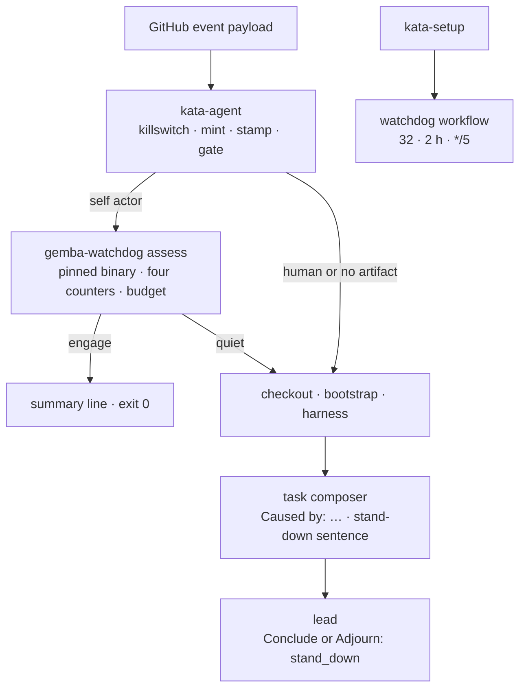
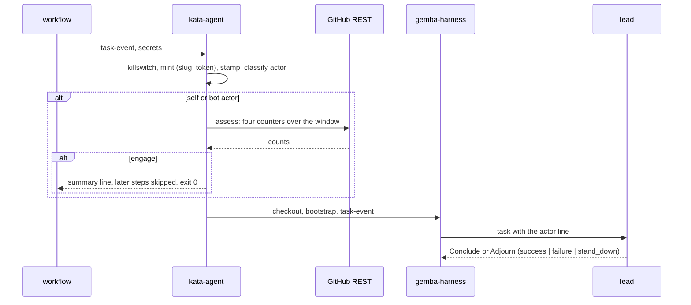

# Design 2350-a: a self-caused gate before checkout

Spec 2350 bounds the runs the team causes for itself. This design fixes the
components, where the gate runs, the interfaces, the defaults, and the
removals. Two appendices carry the evidence and the growth path:
[Appendix A](appendix-a.md) summarizes the research behind the numbers, and
[Appendix B](appendix-b.md) names the measurements that would justify a
tighter bound.

## Component map



## Components

| Component | Home | Role after this design |
| --------- | ---- | ---------------------- |
| The gate | `products/kata/actions/kata-agent/action.yml` | One step after the mint and the stamp. Classifies the actor from the payload against the mint's slug. For a self actor, installs the pinned `gemba-watchdog` binary the way the watchdog action does and runs `assess` at the budget. On `engage`, writes the summary line and sets a `stood-down` output. Every later step gates on that output. |
| Actor classification | `libraries/libharness/src/events/github.js` | `classifyActor(login, slug)` and the payload accessor for the actor: `comment.user` on comments, `review.user` on reviews, `issue.user` on an opened issue, `sender` on labels, merges, and dispatches. The action reads the same fields with the same rule, in shell, for the gate. |
| Task composer | `events/github.js` | Every template opens with the actor line. Self and bot actors add the stand-down sentence. Label templates render the sender. |
| Terminal tools | `orchestration-toolkit.js`, `discuss-tools.js`, `orchestration-loop.js`, `discusser.js` | The facilitator's `Conclude` and the discuss `Adjourn` accept `stand_down`. Both loops count it as a successful exit. The supervisor and judge tools are unchanged. |
| Trace tooling | `trace-collector.js` `orchestratorSummary`, `trace-query.js`, `commands/trace.js` | The one reader of the last orchestrator summary feeds the overview and cost verbs, which print the verdict. |
| `gemba-watchdog` action and CLI | `products/gemba/actions/gemba-watchdog/`, `products/gemba/bin/gemba-watchdog.js` | Unchanged. The gate reuses the installer and the `assess` verb as they are. |
| Watchdog workflow and template | `.github/workflows/watchdog.yml` (spec 2330 part 05 creates it; this design creates it when it lands first); `kata-setup` `references/workflow-watchdog.md` (new) | Tick `*/5`. Threshold 32, window 2. `kata-setup` emits the template beside the four agent workflows. |
| Prose homes | dispatch workflow, `kata-setup` template and skill, watchdog README and guide, coordinate-team guide, `libraries/README.md`, `libharness/test/prompts.test.js` | Name the gate and the watchdog. Drop "recursion guard". |

## The gate

| Step | Rule |
| ---- | ---- |
| Actor | Read the actor login for the trigger class. Normalize by stripping a `[bot]` suffix and an `app/` prefix. `self` when it equals the mint's slug. `human` when the payload's account type is `User`. `bot` otherwise. |
| No artifact | `workflow_dispatch` has no issue or pull request. Run. |
| Human | Run. |
| Self or bot | Install the pinned binary. Run `gemba-watchdog assess --threshold <budget> --window-hours <window> --default-branch <payload default branch>` with the mint's token. |
| Quiet | Run. |
| Engage | Append the assess table and the line `stood down: self-caused run over budget` to the step summary. Set `stood-down=true`. Exit zero. |
| Unreadable | `assess` reports `unreadable` or `uncovered` as a breach. A self actor stands down. Doubt stops the self-caused line only. |

The later steps read the output. Checkout, bootstrap, the wiki refresh, the
harness step, the wiki push, and the cost report run only when `stood-down` is
false. The callback step is unaffected: only artifact events can stand down,
and artifact events carry no callback URL. A stood-down run costs the
killswitch, one mint, one binary download, and four REST reads.

## Actor line

The composer prepends one line to every template:

```text
Caused by: self (kata-agent-team[bot]). Engage nobody unless the body hands
new actionable work to a named agent. Otherwise end with verdict stand_down.
```

```text
Caused by: human (@alice).
```

A `bot` actor gets the self form with its own login. The lead trailer is
unchanged. The three participant prompts lose their stand-down sentence, so
the lead is the only reader of the rule.

## Defaults

The action inputs are the one home. No CLI flag carries these values.

| Input | Default | Grounding |
| ----- | ------- | --------- |
| `dispatch-budget` | 24 | Three quarters of the latch threshold. 1.6 times the largest legitimate batch. Engaged at 15:01Z on the replay. |
| `dispatch-window-hours` | 2 | The watchdog's window. |
| Watchdog threshold, window | 32, 2 hours | Unchanged from spec 2330. |
| Watchdog tick | `*/5` | Ten minutes off the detection lag at the incident's rate. |

## Data flow



## Key decisions

| Decision | Rejected alternative | Why |
| -------- | -------------------- | --- |
| The gate is an action step on the watchdog binary. | A triage module and verb in `libharness`. | The watchdog binary already installs pinned with no checkout and already measures the four counters. A module would add a transport, a verb, a file contract, and a second install. |
| The gate runs before checkout. | Inside the harness command after bootstrap. | At the incident's rate, runs that only bootstrapped and stood down would still hold the runner pool. |
| The gate yields. The watchdog latches. | Engage the latch from the gate. | Engaging needs a variables write in every run, against the single-writer rule of the killswitch reference. |
| Human and artifact-less runs skip the gate. | Gate every run. | A human signal must never be paused by the team's own volume. A bridge dispatch under the App token would read as self. |
| Self-caused doubt stands down. | Fail open. | A flood produces rate-limit errors. Open would let it through. Human runs never reach the rule. |
| The actor is one line in the task. | A context block with counters, or a line in the L0 trailer. | The class is the one fact that changes the decision. The trailer is mechanics only. |
| `stand_down` on the facilitator's Conclude and on Adjourn only. | Widen the shared Conclude schema. | The supervisor and judge verdicts feed benchmark grading. |
| No per-artifact hop cap. | Count self utterances per artifact from the timeline. | The incident was fan-out across artifacts. A slow loop under the budget was not observed. Appendix B names the trigger and the cheap form. |
| No Ask budget on the lead. | Bound the distinct addressees of self-caused runs. | A cost bound, not a sprawl brake. Appendix B names the measurement. |
| No supersession. | Stand down a trigger that is no longer the latest utterance. | The default concurrency policy cancels the older pending run. The template forbids the `queue:` key. |
| Watchdog threshold and window stay. Tick tightens. | Lower the threshold, or add a runs counter. | 32 detects the incident within ten minutes of a five-minute tick. Comments have no legitimate baseline. A runs counter needs an Actions read scope. |
| `kata-setup` emits the watchdog. | Leave rollout to each installation. | The reference consumer ran with no watchdog. |
| Stood-down exits zero. | Exit non-zero to stand out. | A stood-down run is the design working. The summary carries the record. |

## Removals

| Removed | Replaced by |
| ------- | ----------- |
| The stand-down sentence in the facilitated, discuss, and supervised participant prompts | The rule in the actor line, owned by the lead. |
| "recursion guard" prose in the workflow, the template, the skill, the prompt tests, and the libraries catalog | Prose that names the gate and the watchdog. |
| Any `success` verdict that meant "nothing to do" | `stand_down`. |

## Appendices

- [Appendix A: research summary and brake replay](appendix-a.md)
- [Appendix B: growing the guardrails when the data says so](appendix-b.md)
