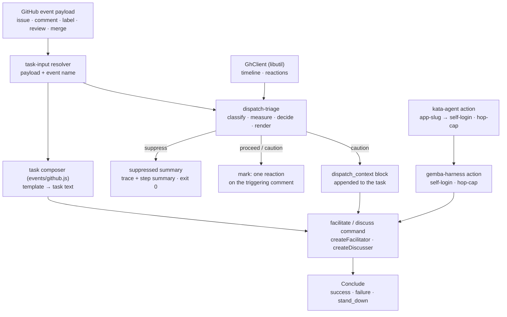
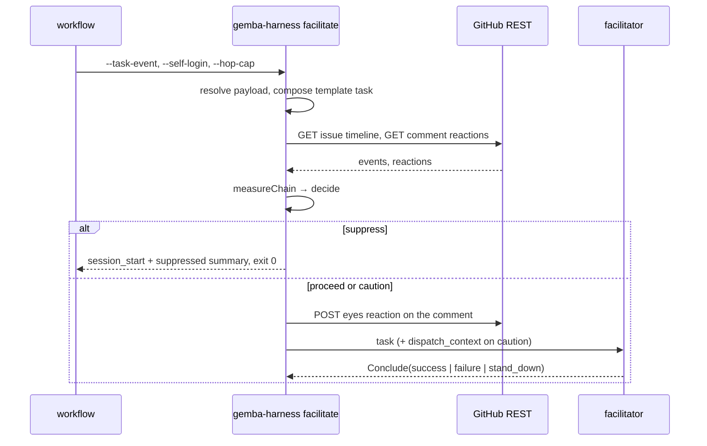

# Design 2350-a: chain triage in the task composer

Spec 2350 puts a deterministic verdict in front of every event-driven run.
This design fixes the components that compute it, where the verdict enters the
run, the interfaces the action and the CLI gain, and what it removes.

## Component map



## Components

| Component | Home | Role after this design |
| --------- | ---- | ---------------------- |
| Dispatch triage | `libraries/libharness/src/dispatch-triage.js` (new) | Four pure functions plus one reader. `classifyActor` maps a login to `human`, `self`, or `bot`. `measureChain` folds a timeline into the chain record. `decide` maps the record and the cap to a verdict. `renderContextBlock` writes the fenced block. `readArtifact` fetches the timeline and the reactions through an injected client. |
| Task-input resolver | `commands/task-input.js` | Returns the payload and the event name beside the task and the amendment, so the commands can hand them to the triage. |
| Task composer | `events/github.js` | Unchanged templates. Gains the artifact accessor the triage uses: repository, number, triggering comment id, and the actor login. |
| Facilitate and discuss commands | `commands/facilitate.js`, `commands/discuss.js` | Run the triage when the task came from an event. Short-circuit on suppress. Mark the comment. Append the block. Then build the orchestrator as today. |
| Terminal tool | `orchestration-toolkit.js` | `Conclude` accepts `stand_down`. The loop treats it as a successful exit. |
| Trace tooling | `trace-usage.js`, `commands/trace.js` | Verdict counters gain `suppressed` and `stand_down` columns. |
| `gemba-harness` action | `products/gemba/actions/gemba-harness/` | Two inputs, `self-login` and `hop-cap`, forwarded as flags on `facilitate` and `discuss`. |
| `kata-agent` action | `products/kata/actions/kata-agent/` | Forwards `<app-slug>[bot]` as `self-login`. Gains `hop-cap` with the calibrated default. |
| Participant prompt | `facilitator.js` | Drops the stand-down sentence. |
| Prose homes | `.github/workflows/kata-dispatch.yml`, `kata-setup` template and skill, the coordinate-team guide | Name the triage where they named the recursion guard. |

## Chain record

`measureChain` reads the artifact timeline in order and produces one record.

| Field | Definition |
| ----- | ---------- |
| `actor` | Class of the triggering event's author: `human`, `self`, or `bot`. |
| `hops` | Count of self-authored utterances after the last human-authored event of any kind. An utterance is a `commented`, `reviewed`, or `merged` timeline event. A label event by self counts as no hop. A label event by a human resets the count. |
| `minutesSinceHuman` | Age of the last human-authored event. Null when no human ever touched the artifact. |
| `stateChanged` | True when a label, a commit, a merge, or a close landed after the previous self-authored utterance. |
| `selfEventsInWindow` | Self-authored utterances inside the last two hours. |
| `alreadySeen` | True when the triggering comment carries a reaction by self. |
| `readable` | False when the timeline or the reactions could not be read. |

Labels do not count as hops because one agent run applies several labels in one
burst. Counting them would put a triage run past the cap before the agent it
routed to ever starts. Utterances are one per run in practice, so they
approximate hops without a timing heuristic.

## Verdict

| Condition | Verdict | Effect |
| --------- | ------- | ------ |
| `alreadySeen` | `suppress` (reason `duplicate`) | No runner starts. |
| `actor` is `self` and `hops ≥ cap` | `suppress` (reason `hop_cap`) | No runner starts. |
| `actor` is `self` and `hops < cap` | `caution` | Mark the comment. Append the block. Run. |
| `actor` is `bot` (not self) | `caution` | Same as above. Another automation is not a human. |
| `actor` is `human` | `proceed` | Mark the comment. Run with the template task only. |
| `readable` is false | `proceed` | Run. The block names the unreadable timeline. |

The cap arrives as `hopCap`. Its default is three. § Calibration grounds it.

## Context block

The block is the last fragment of the task before any amendment. It appears on
`caution` and on an unreadable timeline. It never appears on `proceed`.

```text
<dispatch_context>
actor: self (kata-agent-team[bot]) | hops: 2 of 3 | last human: 47 min ago |
state changed since previous self utterance: no | self utterances in 2h: 4
Engage a participant only when the body hands new actionable work to a
different named agent. Otherwise call Conclude with verdict stand_down.
</dispatch_context>
```

The rule travels with the numbers. The L0 trailer stays as it is, so a
human-caused run pays no prompt cost and the mechanics layer gains no policy.

## Suppressed run

The command writes two orchestrator lines and stops: `session_start`, then a
`summary` with `success: true`, `verdict: "suppressed"`, the reason, and the
chain record. It appends the same fields to the step summary. It exits zero.
The callback verb passes `suppressed` through like any other verdict, so a
bridge caller learns the run stood down.

## Mark

On `proceed` and `caution`, and only when the trigger is a comment, the
command posts one `eyes` reaction on that comment through the client. The
write happens before the runners start, so a run that later fails still leaves
its mark. A failed write logs one line and does not stop the run.

## Data flow



## Interfaces

| Surface | Addition |
| ------- | -------- |
| `gemba-harness facilitate` and `discuss` | `--self-login <login>` and `--hop-cap <n>`. Both apply only with `--task-event`. |
| `gemba-harness` action | `self-login` and `hop-cap` inputs, forwarded verbatim. |
| `kata-agent` action | `hop-cap` input, default `"3"`. `self-login` derives from the existing `app-slug` input. No new secret, no new permission. The App already comments, so it may react. |
| `Conclude` | `verdict: "success" \| "failure" \| "stand_down"`. |
| Trace summary | `verdict: "suppressed"` plus `reason` and `chain`. |

## Calibration

The plan measures `hops` with `measureChain` over recorded artifacts before it
fixes the default. Two corpora: the handoffs the wiki cites as correctly routed
in W18 and W19, and the September burst spec 2330 recorded. The default cap
sits above the largest legitimate depth and below the burst's typical depth.
The design carries three as the working value, because the legitimate pipeline
runs one or two self utterances between human touches: a human approval resets
the chain, the release engineer merges, and dispatch records the approval.

## Key decisions

| Decision | Rejected alternative | Why |
| -------- | -------------------- | --- |
| The triage runs inside the harness command. | A composite step in `kata-agent` before checkout. | The step would need the CLI and a token before the bootstrap installs either. The command already holds both. |
| Utterances count as hops. Labels do not. | Count every self-authored event, or group events by time gap. | A label burst inflates the depth past the cap on the first agent hop. A time gap is a heuristic with a tunable that nobody can ground. |
| `GhClient` from `libutil` is the transport. | A fetch transport in `libharness`, or an import of `libwatchdog`'s request helper. | The runner has `gh` and the token. `GhClient` rides the injected runtime and has a mock. The watchdog helper exists because the watchdog runs with no toolchain. |
| Unreadable fails open with a note. | Fail closed like the watchdog. | Two closed brakes stop the team on every transient error. The watchdog already covers the volume a hidden chain produces. |
| The rule lives in the block. | A line in the L0 trailer. | The trailer is mechanics only. The rule applies only when the block exists. Human-caused runs pay nothing. |
| The mark is a reaction. | A hidden comment marker, or a label. | A reaction fires no dispatch event and needs no new permission. A comment fires a run. A label fires a run when it matches the routing prefixes. |
| Suppressed exits zero. | Exit non-zero to stand out. | A suppressed run is the design working. Red runs train operators to ignore red. The trace and the step summary carry the record. |
| `stand_down` is a `Conclude` verdict. | A separate tool. | One terminal tool keeps the surface table honest. The verdict is what trace tooling needs. |
| The window is a library constant of two hours. | A `--window-hours` option. | The field informs the facilitator. It drives no verdict. A knob with no consequence is noise. |

## Removals

| Removed | Replaced by |
| ------- | ----------- |
| The stand-down sentence in the participant prompt | The rule in the context block, owned by the facilitator. |
| "recursion guard" prose in the workflow, the template, and the `kata-setup` DO-CONFIRM item | Prose that names the triage and its inputs. |
| Any `success` verdict that meant "nothing to do" | `stand_down`. |
