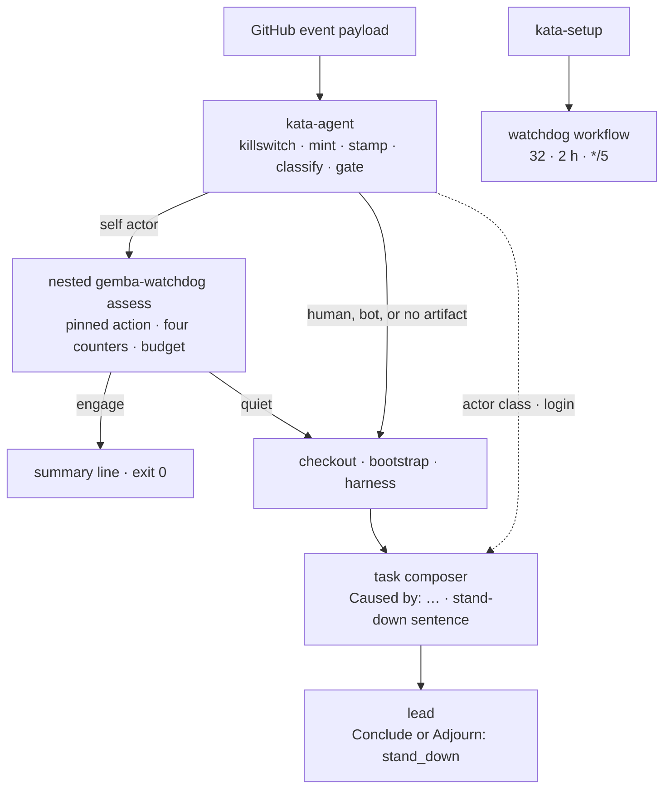
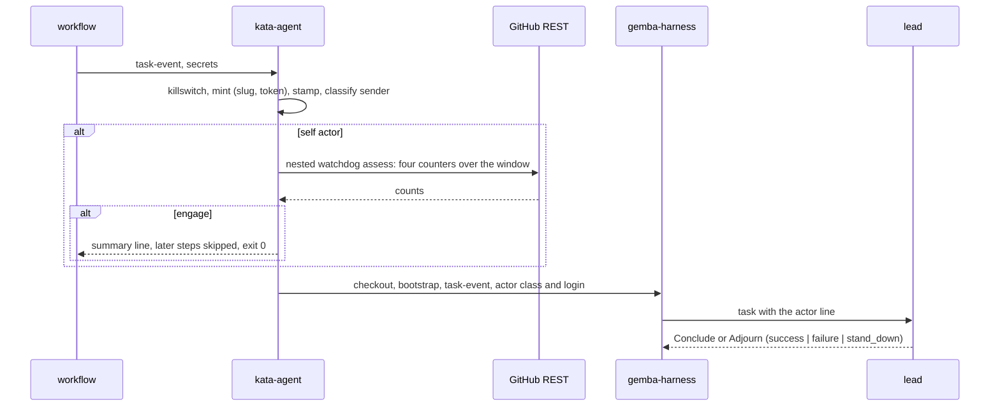

# Design 2350-a: a self-caused gate before checkout

Spec 2350 bounds the runs the team causes for itself. This design fixes the
components, where the gate runs, the interfaces, the defaults, and the
removals. Two appendices carry the evidence and the growth path:
[Appendix A](appendix-a.md) summarizes the research behind the numbers, and
[Appendix B](appendix-b.md) names the measurements that would justify a
tighter bound.

## Component map



## Components

| Component | Home | Role after this design |
| --------- | ---- | ---------------------- |
| The gate | `products/kata/actions/kata-agent/action.yml` | Three steps after the mint and the stamp. The classify step reads `sender.login` and `sender.type` from the `task-event` payload, normalizes the login, compares it with the mint's `app-slug` output, and emits `actor-class` (`human`, `self`, `bot`) and `actor-login`. It skips when `task-event` is empty or the payload names no issue and no pull request. The assess step nests the pinned `gemba-watchdog` action in `assess` mode at the budget, for a self actor only. The verdict step reads its `verdict` output: on `engage` it appends the stand-down line to the step summary and sets `stood-down=true`. Every later step gates on that output. |
| Actor hand-off | `kata-agent` action.yml, the harness step env | The action passes `actor-class` and `actor-login` to the harness step as `KATA_ACTOR_CLASS` and `KATA_ACTOR_LOGIN`, beside `GH_TOKEN` and the stamp. The composer renders them and classifies nothing. The actor rule has one home: the classify step. |
| Task composer | `libraries/libharness/src/events/github.js`, `commands/task-input.js` | `task-input.js` reads the two variables from the environment, as it reads `GITHUB_EVENT_NAME`. Every event template opens with the actor line. Self and bot actors add the stand-down sentence. Absent variables render no line, so a local `--task-event` run is unchanged. `workflow_dispatch` composes no template and gets no line. Label templates render the sender. |
| Terminal tools | `orchestration-toolkit.js`, `discuss-tools.js`, `orchestration-loop.js`, `discusser.js` | The facilitator's `Conclude` and the discuss `Adjourn` accept `stand_down`. Both loops count it as a successful exit. The supervisor and judge tools are unchanged. |
| Trace tooling | `trace-collector.js` `orchestratorSummary`, `trace-query.js`, `commands/trace.js` | The one reader of the last orchestrator summary feeds the overview and cost verbs, which print the verdict. |
| `gemba-watchdog` action and CLI | `products/gemba/actions/gemba-watchdog/`, `products/gemba/bin/gemba-watchdog.js` | Unchanged. The gate nests the action in `assess` mode as it is. |
| Action test workflow | `.github/workflows/check-kata-agent.yml` (new) | Runs the action against fixture payloads under the repository's App secrets. Six sender fixtures cover the three App login spellings, a human, Dependabot, and GitHub Actions. A self fixture with the budget forced to 1 over a year-long window stands down before checkout. A human fixture reaches the harness step. A payload with no artifact reaches it with no assess request. |
| Watchdog workflow and template | `.github/workflows/watchdog.yml` (spec 2330 part 05 creates it; this design creates it when it lands first); `kata-setup` `references/workflow-watchdog.md` (new) | Tick `*/5`. Threshold 32, window 2. `kata-setup` emits the template beside the four agent workflows. |
| Prose homes | dispatch workflow, `kata-setup` template and skill, `kata-agent` README (inputs table and lifecycle), watchdog README and guide, coordinate-team guide, `libraries/libwatchdog/package.json` `competesWith` (then `jidoka jtbd --fix` regenerates `libraries/README.md`), `libharness/test/prompts.test.js` | Name the gate and the watchdog. Drop "recursion guard". |

## The gate

| Step | Rule |
| ---- | ---- |
| No event | `task-event` is empty: a `task-text` or `task-file` run. Skip the gate. Run. |
| No artifact | The payload names no issue and no pull request, as on `workflow_dispatch`. Run. |
| Actor | Read `sender.login` and `sender.type`. `sender` names the acting account on every trigger class. Normalize the login by stripping a `[bot]` suffix and an `app/` prefix. `self` when it equals the mint's `app-slug` output. `human` when the type is `User`. `bot` otherwise. Emit both outputs. |
| Human or bot | Run. For a bot, the actor line carries the stand-down sentence. |
| Self | Run the nested `gemba-watchdog` action with `mode: assess`, `threshold` at the budget, `window-hours` at the window, and `token` from the mint. Its default-branch input reads the payload. |
| Quiet | Run. |
| Engage | The assess step has written its table to the step summary. Append the line `stood down: self-caused run over budget`. Set `stood-down=true`. Exit zero. |
| Unreadable | `assess` reports `unreadable` and `uncovered` as `engage`. A self actor stands down. Doubt stops the self-caused line only. |

The later steps read the output. Checkout, bootstrap, the wiki refresh, the
harness step, the wiki push, and the cost report run only when `stood-down` is
false. The callback step is unaffected: only artifact events can stand down,
and artifact events carry no callback URL. A stood-down run costs the
killswitch, one mint, one binary download, and four REST reads.

## Actor line

The composer prepends one line to every event template from
`KATA_ACTOR_CLASS` and `KATA_ACTOR_LOGIN`:

```text
Caused by: self (@kata-agent-team[bot]). Engage nobody unless the body hands
new actionable work to a named agent. Otherwise end with verdict stand_down.
```

```text
Caused by: human (@alice).
```

A `bot` actor gets the self form with its own login. The lead trailer is
unchanged. The three participant prompts lose their stand-down sentence, so
the lead is the only reader of the rule.

## Defaults

The action inputs are the one home. No CLI flag carries these values.

| Input | Default | Grounding |
| ----- | ------- | --------- |
| `dispatch-budget` | 24 | Three quarters of the latch threshold. 1.6 times the largest legitimate batch. Engaged at 15:01Z on the replay. |
| `dispatch-window-hours` | 2 | Equal to the watchdog's window. The two values live in separate homes, the action input and the workflow env, and coincide by choice. |
| Watchdog threshold, window | 32, 2 hours | Unchanged from spec 2330. |
| Watchdog tick | `*/5` | Ten minutes off the detection lag at the incident's rate. |

## Data flow



## Key decisions

| Decision | Rejected alternative | Why |
| -------- | -------------------- | --- |
| The gate nests the pinned `gemba-watchdog` action in `assess` mode. | A copied installer and a direct `assess` call in `kata-agent`, or a triage module and verb in `libharness`. | The nested action already installs the SHA-verified binary with no checkout, measures the four counters, and yields `verdict`. A copy gives the release pin and the channel assertion a second home. A module adds a transport, a verb, a file contract, and a second install. |
| The gate runs before checkout. | Inside the harness command after bootstrap. | At the incident's rate, runs that only bootstrapped and stood down would still hold the runner pool. |
| The gate yields. The watchdog latches. | Engage the latch from the gate. | Engaging needs a variables write in every run, against the single-writer rule of the killswitch reference. |
| The classify step is the one home of the actor rule. The composer renders the class it is handed. | `classifyActor(login, slug)` in `libharness`, with the slug passed to the harness. | The gate runs before checkout, so a library rule would need a shell copy. One rule, one home, one fixture set in the test workflow. |
| The actor comes from `sender` on every trigger class. | A per-class accessor: `comment.user`, `review.user`, `issue.user`. | `sender` names the acting account on every webhook payload, so the gate needs no event name and a fixture needs no trigger context. |
| Human, bot, and artifact-less runs skip the gate. | Gate every run, or gate bot actors with self. | A human signal must never be paused by the team's own volume. The spec bounds self-caused volume, and another bot's event is not the team's output. The actor line already tells the lead to stand down on it. A bridge dispatch under the App token would read as self. |
| Self-caused doubt stands down. | Fail open. | A flood produces rate-limit errors. Open would let it through. Human runs never reach the rule. |
| The actor is one line in the task. | A context block with counters, or a line in the L0 trailer. | The class is the one fact that changes the decision. The trailer is mechanics only. |
| `stand_down` on the facilitator's Conclude and on Adjourn only. | Widen the shared Conclude schema. | The supervisor and judge verdicts feed benchmark grading. |
| No per-artifact hop cap. | Count self utterances per artifact from the timeline. | The incident was fan-out across artifacts. A slow loop under the budget was not observed. Appendix B names the trigger and the cheap form. |
| No Ask budget on the lead. | Bound the distinct addressees of self-caused runs. | A cost bound, not a sprawl brake. Appendix B names the measurement. |
| No supersession. | Stand down a trigger that is no longer the latest utterance. | The default concurrency policy cancels the older pending run. The template forbids the `queue:` key. |
| Watchdog threshold and window stay. Tick tightens. | Lower the threshold, or add a runs counter. | 32 detects the incident within ten minutes of a five-minute tick. Comments have no legitimate baseline. A runs counter needs an Actions read scope. |
| `kata-setup` emits the watchdog. | Leave rollout to each installation. | The reference consumer ran with no watchdog. |
| Stood-down exits zero. | Exit non-zero to stand out. | A stood-down run is the design working. The summary carries the record. |

## Removals

| Removed | Replaced by |
| ------- | ----------- |
| The stand-down sentence in the facilitated, discuss, and supervised participant prompts | The rule in the actor line, owned by the lead. |
| The `app-slug` input on `kata-agent` (default `kata-agent-team`), in the action and its README | The mint's `app-slug` output, passed to `gemba-bootstrap` for the git identity and read by the classify step. |
| "recursion guard" prose in the workflow, the template, the skill, the prompt tests, and the `libwatchdog` jobs block | Prose that names the gate and the watchdog. `libraries/README.md` regenerates from the jobs block. |
| Any `success` verdict that meant "nothing to do" | `stand_down`. |

## Appendices

- [Appendix A: research summary and brake replay](appendix-a.md)
- [Appendix B: growing the guardrails when the data says so](appendix-b.md)
