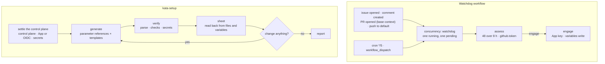
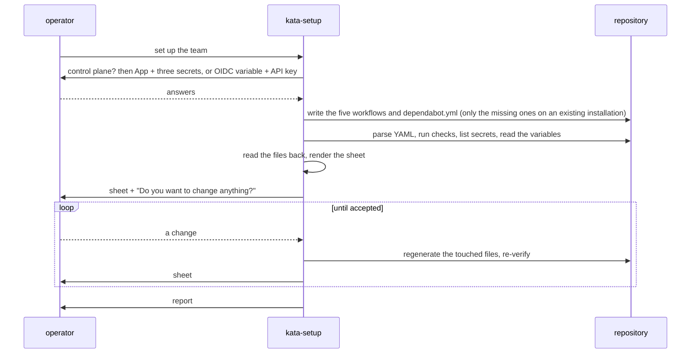

# Design 2360-a: event ticks, an 8-hour window, and a parameter sheet

Spec 2360 sizes the watchdog for the tick GitHub delivers and turns `kata-setup`
into a defaults-first procedure with one review at the end. This design fixes
the watchdog workflow shape, the setup components and their interfaces, the
sheet, and the removals. It changes no action and no CLI logic.

## Component map

## Components

| Component            | Home                                                                                                                    | Role after this design                                                                                                                                                                                                                                                                                                                                                                                                                                                                                       |
| -------------------- | ----------------------------------------------------------------------------------------------------------------------- | ------------------------------------------------------------------------------------------------------------------------------------------------------------------------------------------------------------------------------------------------------------------------------------------------------------------------------------------------------------------------------------------------------------------------------------------------------------------------------------------------------------ |
| Watchdog workflow    | `.github/workflows/watchdog.yml`                                                                                        | Six triggers, one concurrency group, two numbers and the variable name in `env`, the same two jobs. Event runs and scheduled runs are identical past the trigger.                                                                                                                                                                                                                                                                                                                                            |
| Watchdog template    | `kata-setup` `references/workflow-watchdog.md` (new here and in design 2350-a; whichever lands second edits it)         | The workflow minus its comments, with `{{GEMBA_WATCHDOG_REF}}`, `{{WATCHDOG_THRESHOLD}}`, `{{WATCHDOG_WINDOW_HOURS}}`, and `{{DEFAULT_BRANCH}}` placeholders. A `## Template (Hosted)` delta, in the style of the other three templates: drop the engage job and the App inputs, add one step that fails the run when the verdict is `engage`. About 65 YAML lines and 90 in all, under the 128 cap.                                                                                                         |
| Parameter references | `kata-setup` `references/parameters-agents.md` and `references/parameters-guard.md` (new)                               | Agents: one table each for the shift, dispatch, storyboard, and coaching files. Guard: the watchdog, Dependabot, and variables tables. Columns: Parameter, Default, Home as `file · key`, Why in eight words or fewer. The one home of every default and the row shape of the sheet. The placeholder name is the key in upper snake case. Why cells carry no date, spec number, or monorepo name.                                                                                                            |
| Dependabot template  | `kata-setup` `references/dependabot.md` (new)                                                                           | The snippet that lives inline in the procedure today, with the interval as a placeholder.                                                                                                                                                                                                                                                                                                                                                                                                                    |
| Setup procedure      | `kata-setup` `SKILL.md`                                                                                                 | Settle the control plane, generate, verify, sheet, loop, report. The interview, the dispatch question, and their checklist items leave. New text: the control-plane step, the timezone rule, the existing-installation rule, the sheet and loop rules, the hosted watchdog line.                                                                                                                                                                                                                             |
| Existing templates   | `references/workflow-shift.md`, `workflow-dispatch.md`, `workflow-facilitate.md`, `schedules.md`                        | Same shape. Every literal default becomes a placeholder: the model examples, the dispatch turn cap and timeout. Each per-template placeholder table becomes a pointer to the parameter references. `schedules.md` keeps only the zone cron tables, which are lookup data, and gains a UTC block; its roster list moves to the agents reference. The ref-resolution rule names "the action's repository" instead of one repository. The `--hosted` and "question 8" pointers become "the control-plane step". |
| Prose homes          | Guide, action README, CLI help examples, `gemba-watchdog` skill, `KATA.md`, getting-started page, daily-storyboard page | The new numbers, the delivered-gap rule, the event ticks, the defaults-first flow, and Variables in the getting-started App permission paragraph. The README drops its YAML copy and links the guide's, so three copies remain: the tenant workflow, the template, and the guide. The guide's copy is the template with example values, held to the same diff.                                                                                                                                               |

## The watchdog workflow

| Element     | Value                                                                                                                                                                             | Note                                                                                                                                  |
| ----------- | --------------------------------------------------------------------------------------------------------------------------------------------------------------------------------- | ------------------------------------------------------------------------------------------------------------------------------------- |
| Triggers    | `schedule: */5`, `workflow_dispatch`, `issues: [opened]`, `issue_comment: [created]`, `pull_request_target: [opened]` with `branches: [<default>]`, `push: branches: [<default>]` | The four events are the four counters' own. See the key decision on `pull_request_target`.                                            |
| Concurrency | `group: watchdog`, `cancel-in-progress: false`                                                                                                                                    | One running and one pending. A new event replaces the pending tick, which can drop a queued manual dry-run rehearsal; re-dispatch it. |
| `env`       | `WATCHDOG_THRESHOLD: "48"`, `WATCHDOG_WINDOW_HOURS: "8"`, `WATCHDOG_VARIABLE`                                                                                                     | The numbers are written once. The variable name also appears as the `vars` literal, by spec 2330's design. Both jobs read them.       |
| `assess`    | `github.token`, `default-branch` literal, `killswitch-value` from the `vars` literal                                                                                              | Unchanged from spec 2330 part 05. The monorepo keeps `main`; the template resolves `{{DEFAULT_BRANCH}}` in both places.               |
| `engage`    | `needs: assess`, `if: verdict == 'engage'`, App id and key                                                                                                                        | Unchanged.                                                                                                                            |
| Permissions | `permissions: {}` at the top, read scopes on `assess` only                                                                                                                        | Unchanged.                                                                                                                            |

The workflow reads nothing from the event payload, so the trigger class cannot
change the measurement.

## The setup procedure

| Step                     | Rule                                                                                                                                                                                                                                                                                                                                                                                                                                                               |
| ------------------------ | ------------------------------------------------------------------------------------------------------------------------------------------------------------------------------------------------------------------------------------------------------------------------------------------------------------------------------------------------------------------------------------------------------------------------------------------------------------------ |
| Settle the control plane | Hosted or self-hosted, skipped when the task prompt says. Self-hosted: the App exists and is installed, or a walk through `github-app.md`, then the three secrets per `gh secret list`. Hosted: the `FIT_OIDC_URL` variable and the API-key secret. Nothing else is asked before generation.                                                                                                                                                                       |
| Generate                 | Seed a working copy of the defaults from the parameter references. On an existing installation, overwrite that copy with the values read from the files that exist. Resolve every placeholder from the copy. Resolve both action refs by SHA per the generalized rule. Write every file the mode allows that the repository lacks.                                                                                                                                 |
| Timezone                 | Take the majority UTC offset of recent human-authored default-branch commits, so bot commits at `+00:00` do not vote. Map it to the listed zone with the nearest offset; a tie goes to the earlier-listed zone. No human commits: UTC. The sheet names the zone and the offset it came from. The sample size and the bot rule are the plan's.                                                                                                                      |
| Verify                   | Every generated file parses. The repository's checks pass on a clean checkout. The secrets and the named profiles resolve. Unchanged from today.                                                                                                                                                                                                                                                                                                                   |
| Sheet                    | Read each workflow file and the repository variables. Render one table per file, plus one for variables, with the columns Parameter, Value, Home, Why. Why comes from the parameter references. Home is `file · key`, or `variable · name`; a value with two keys names both. The killswitch row shows absent or the value and its timestamp; setup never writes it. In hosted mode the watchdog row adds: "engage unavailable: the engage job needs the App key". |
| Loop                     | Ask one question. Apply each named change to the working copy, regenerate only the files whose rows changed, re-verify, re-render. A change that names no row is answered with the sheet. End when the operator accepts.                                                                                                                                                                                                                                           |
| Report                   | The next steps as today, minus "adjust schedules after the first runs", plus: observe the delivered tick gap and the counts on the watchdog summaries, then change the sheet.                                                                                                                                                                                                                                                                                      |

A roster change regenerates the shift matrix, the dispatch participant list, and
the storyboard participant list, because all three carry the roster.

## The sheet

| File                   | Rows                                                                                                     |
| ---------------------- | -------------------------------------------------------------------------------------------------------- |
| `agent-shift.yml`      | Shift starts in local time and UTC; roster in order; model; wiki; action pin                             |
| `agent-dispatch.yml`   | Trigger classes; lead; participants; model; wiki; turn cap; timeout; concurrency policy; action pin      |
| `agent-storyboard.yml` | Cron in local time; lead; participants; model; wiki                                                      |
| `agent-coaching.yml`   | Manual only; lead; model; wiki                                                                           |
| `watchdog.yml`         | Threshold; window; cron; event triggers; default branch; latch variable; engage availability; action pin |
| `dependabot.yml`       | Ecosystem; interval                                                                                      |
| Variables              | `KATA_KILLSWITCH` state; `FIT_OIDC_URL` in hosted mode                                                   |

For every fixed default, the Default cell of the parameter references and the
Value cell of a fresh sheet are equal by construction, and the procedure states
that as its own check. Derived rows are checked against their derivation: the
crons against the inferred zone's table, the pins against the resolved tag, the
variables against the repository.

## Key decisions

| Decision                                                                       | Rejected alternative                                                            | Why                                                                                                                                                                                                                                                                                                                   |
| ------------------------------------------------------------------------------ | ------------------------------------------------------------------------------- | --------------------------------------------------------------------------------------------------------------------------------------------------------------------------------------------------------------------------------------------------------------------------------------------------------------------- |
| Window 8 hours.                                                                | 6 hours, or 12 hours.                                                           | 6 covers every observed gap with 5 % margin against an undocumented delay. 12 holds three shifts, so the threshold must rise and more escapes before it.                                                                                                                                                              |
| Threshold 48, one number.                                                      | 32 unchanged, 64, or per-counter thresholds.                                    | 32 leaves 1.2 times headroom over two shifts and a storyboard. 64 catches the monorepo's own six-hour burst three hours later. Per-counter thresholds wait for a comments baseline per spec 2350 appendix B.                                                                                                          |
| Event ticks beside the schedule.                                               | Schedule only, or `workflow_run` on the agent workflows.                        | The schedule is delivered hours late. `workflow_run` fires per agent run, which is less often than per artifact and never for a human flood.                                                                                                                                                                          |
| `pull_request_target` on the default branch, not `pull_request`.               | `pull_request: [opened]`, or `pull_request_target` on every base.               | `pull_request` runs the head's workflow file without secrets on a fork and with secrets on a same-repository branch, so a branch could run an edited watchdog. The base context needs no first-contributor approval and checks nothing out, and the branch filter keeps a non-default base from running its own copy. |
| One concurrency group, in-progress kept.                                       | No group, or cancel in progress.                                                | No group lets a flood queue hundreds of ticks. Cancelling can drop an engage write.                                                                                                                                                                                                                                   |
| The cron goes to `*/5` in this design when it lands first.                     | Keep `*/15`.                                                                    | Spec 2350 fixes `*/5` and it costs nothing. The schedule records the latch value and covers runner-token events.                                                                                                                                                                                                      |
| The gate's window stays 2 hours.                                               | Follow the watchdog to 8.                                                       | The gate runs at run start. Nothing sits between it and the event. Spec item 6 accepts the rate inversion.                                                                                                                                                                                                            |
| Setup never writes the killswitch.                                             | Write `0` at setup.                                                             | The resume rule reads a falsy value inside the window as a fresh clear and silences engage for 8 hours, which covers the reference incident's whole peak. The sheet shows the state instead.                                                                                                                          |
| Two parameter references are the one home of defaults and of the sheet's rows. | Defaults in the procedure, one reference, or a separate sheet reference.        | The sheet must show the numbers generation used. One reference of about 33 rows breaks the 768-word L6 cap, so the tables split by concern. L6 is where a data table belongs.                                                                                                                                         |
| Every template literal becomes a placeholder.                                  | Templates unchanged.                                                            | A literal in a template is a second home, and the loop could not change it.                                                                                                                                                                                                                                           |
| The shift template keeps the action's own turn cap and timeout.                | Add `max-turns` and `timeout-minutes` placeholders to the shift template.       | The spec converts literals; the shift template carries none. Two new inputs would change every generated shift, and the sheet can show the dispatch values where they exist.                                                                                                                                          |
| The sheet is read from the files and variables.                                | Render it from the answers or the working copy.                                 | A misapplied change would render as if applied. Reading the files makes the sheet a check, not a claim.                                                                                                                                                                                                               |
| Existing installations gain missing files, then the sheet.                     | Skip generation when any workflow exists.                                       | An installation set up before this design has no watchdog, and the sheet cannot offer a row for a file that does not exist.                                                                                                                                                                                           |
| One change question after verification.                                        | A confirmation per parameter, or the interview kept for the roster.             | The operator sees a working system before deciding anything. A roster question up front is the interview by another name.                                                                                                                                                                                             |
| Timezone from human commits, fallback UTC.                                     | Ask, default to one zone, or count every commit.                                | Bot commits vote UTC on any repository with agents. UTC is the only honest fallback, so `schedules.md` gains it.                                                                                                                                                                                                      |
| Hosted mode emits assess only and fails red on a breach.                       | Extend the action with a caller-minted token input, or a green assess-only run. | The action's own mint is what down-scopes the write, so the extension is its own spec. A green run on a breach is no signal.                                                                                                                                                                                          |
| The README links the guide's wiring.                                           | Four YAML copies kept in step by hand.                                          | The guide's copy already drifted from the workflow's `vars` form. Three copies remain, and the plan diffs the template against the workflow modulo placeholders.                                                                                                                                                      |

## Removals

| Removed                                                                                                                                                                                                                                                             | Replaced by                                                                                                                                     |
| ------------------------------------------------------------------------------------------------------------------------------------------------------------------------------------------------------------------------------------------------------------------- | ----------------------------------------------------------------------------------------------------------------------------------------------- |
| `kata-setup` Step 1's eight questions and Step 3's dispatch question                                                                                                                                                                                                | The control-plane step, then the parameter references.                                                                                          |
| READ-DO items "Ask which agents to enable", "Confirm the timezone", and the SHA-pin item, which DO-CONFIRM's pin item already covers; DO-CONFIRM items "Cron schedules match the user's requested timezone" and "Agent profiles match the names the user confirmed" | Two DO-CONFIRM items: the sheet's values equal the files, and the watchdog carries the defaults. DO-CONFIRM goes 8 − 2 + 2 = 8 of nine.         |
| "Every generated workflow gates on the killswitch" in the checklist and in Step 2                                                                                                                                                                                   | "Every generated agent workflow gates on the killswitch. The watchdog does not, by design."                                                     |
| The frontmatter promise of "agent selection"                                                                                                                                                                                                                        | "generates a complete default configuration and shows the parameters".                                                                          |
| Literal defaults and placeholder tables in the four templates, the roster list in the schedules reference, and the inline Dependabot snippet                                                                                                                        | Placeholders resolved from the parameter references, and `references/dependabot.md`.                                                            |
| "The window is the run interval times the number of runs you accept missing" and the seven-missed-runs sentence in the guide                                                                                                                                        | "Size the window to the longest gap between the ticks your repository actually receives", with this repository's figures as the worked example. |
| `*/15`, 32, and 2 hours in the workflow, the guide, the README, the CLI help, and the skill                                                                                                                                                                         | `*/5`, 48, and 8 hours.                                                                                                                         |
| The README's YAML copy of the workflow                                                                                                                                                                                                                              | A link to the guide's wiring.                                                                                                                   |
| The "good first answer" table on the getting-started page                                                                                                                                                                                                           | A paragraph on prerequisites, defaults, and the sheet.                                                                                          |

## Contracts outside the components

| Contract                | What it needs                                                                                                                                                                                                                                                                                                                                                                                                                                                                              |
| ----------------------- | ------------------------------------------------------------------------------------------------------------------------------------------------------------------------------------------------------------------------------------------------------------------------------------------------------------------------------------------------------------------------------------------------------------------------------------------------------------------------------------------ |
| Instruction budgets     | `SKILL.md` measures 1219 words and 191 lines against 1280 and 192. The interview (about 320 words), the dispatch question, five checklist items, and the Dependabot snippet leave; about 330 words of step rules and two checklist items arrive. Each reference stays under 768 words and 128 lines: the template at about 90 lines, the two parameter references at about 20 and 13 rows. `github-app.md` at 765 and 126 is untouched. The DO-CONFIRM block stays at eight of nine items. |
| Skill genericity        | The template and the parameter references name no monorepo path, date, or spec. The action ref and the default branch are placeholders. The self-hosted block names the installation's own `KATA_APP_ID` and `KATA_APP_PRIVATE_KEY`; the hosted delta names neither.                                                                                                                                                                                                                       |
| `byok-boundary`         | The invariant scans `references/workflow-*.md` fenced blocks for Anthropic SDK imports and `ANTHROPIC_*` reads. The new template carries none, so it passes without verifying the hosted delta. The plan verifies the hosted delta by rendering it and checking for an App input.                                                                                                                                                                                                          |
| Spec 2350 landing order | Default: this design lands after spec 2350's watchdog and setup parts. The exception amends design 2350-a wherever it fixes 32, 2 hours, `*/5`, "equal to the watchdog's window", and "three quarters": its component map, its template component row, its defaults table, and its key-decision row. Either order is one plan part that touches the workflow, the guide, and the template.                                                                                                 |
| No release              | The action is unchanged. The CLI help change rides the next gear release and nothing pins it. The monorepo workflow keeps its current action SHA.                                                                                                                                                                                                                                                                                                                                          |
| Enumeration             | The workflow file name and the `kata-workflows` topic are unchanged. The sibling-action fences are unchanged.                                                                                                                                                                                                                                                                                                                                                                              |
