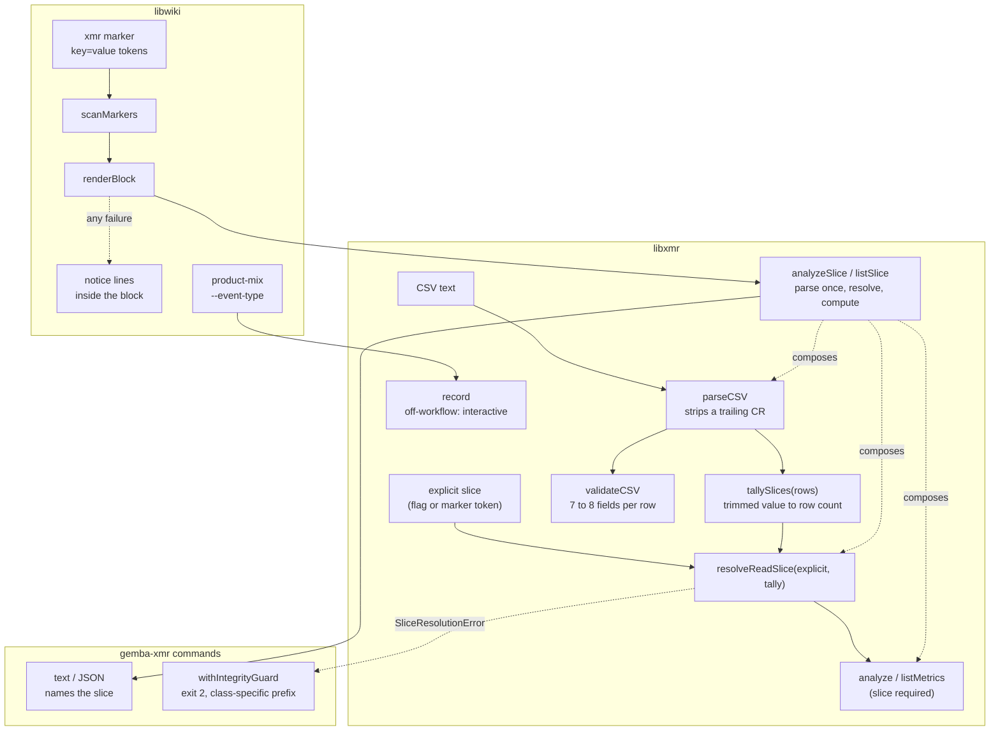
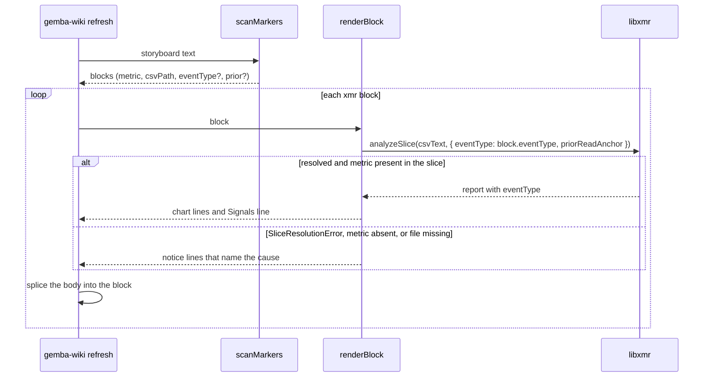

# Design 2370-a: slice resolution at the read seam, a marker token, one writer rule

Spec 2370 removes the built-in `kata-shift` read slice. This design fixes
where the slice resolves, how a storyboard block names its slice, how the two
writers share one rule, and what `validate` checks.

## Component map

## Components

| Component                                     | Home                                                                     | Role after this design                                                                                                                                                                         |
| --------------------------------------------- | ------------------------------------------------------------------------ | ---------------------------------------------------------------------------------------------------------------------------------------------------------------------------------------------- |
| `parseCSV`                                    | `libxmr` CSV module                                                      | Strips one trailing carriage return per line before it splits fields.                                                                                                                         |
| `tallySlices`                                 | `libxmr` slice module (library core, exported from the package root)     | Maps each trimmed `event_type` value to its row count. Rows with an empty value tally under a separate `(none)` key.                                                                           |
| `resolveReadSlice`                            | `libxmr` slice module                                                    | Applies the Resolution rule below to the explicit value and the tally. Returns `{ eventType, label }` or throws `SliceResolutionError`.                                                        |
| `SliceResolutionError`                        | `libxmr` slice module                                                    | Carries the tally and the explicit value. It carries no remedy text. Each seam composes its own.                                                                                               |
| `analyzeSlice`, `listSlice`                   | `libxmr` (library core, exported from the package root)                  | Parse once, tally, resolve, compute. They return the report together with the resolved slice. The four read commands and `renderBlock` call only these.                                        |
| `analyze`, `listMetrics`                      | `libxmr`                                                                 | Both take an options object with a required `eventType` (a value or `*`). An absent slice throws a `TypeError`.                                                                                |
| `withIntegrityGuard`                          | `libxmr` commands                                                        | Maps `CSVIntegrityError` and `SliceResolutionError` to the exit-2 envelope. The prefix names the class: `cannot parse CSV` or `cannot resolve slice for`. The slice message lists the tally and names `--event-type <name>` or `'*'`. |
| `validateCSV`                                 | `libxmr` CSV module                                                      | Rejects a row with fewer than seven or more than eight fields under either header form.                                                                                                        |
| XmR marker grammar                            | `libwiki` constants (one home for the scanner and the audit)             | `<!-- xmr:<metric>:<csv> [key=value]... [notice text] -->`. Known keys: `event_type`, `prior`. Order-free.                                                                                     |
| `scanMarkers`                                 | `libwiki`                                                                | Parses known keys into the block. Warns on a token with an unknown key, so a misspelt token is reported and does not fall back to inference.                                                   |
| `renderBlock`                                 | `libwiki`                                                                | Calls `analyzeSlice` with the marker's slice. Returns chart lines, or notice lines that name the cause: missing file, metric with no rows in the slice (with the tally), or slice resolution (with the tally and the token to add). It never throws for a render failure. |
| `record`                                      | `libxmr` record command                                                  | Resolves the write value as flag, else host workflow filename, else the reserved `interactive`. The refusal for a missing slice goes.                                                          |
| `product-mix`                                 | `libwiki`                                                                | Gains `--event-type`, forwarded to `record` when given. A non-zero `record` exit becomes a non-zero `product-mix` exit with `record`'s message.                                                 |
| Marker-grammar homes                          | `gemba-wiki` skill § Marker contract, `libwiki` README, wiki-operations page, predictable-team guide, kata-session storyboard template and team-storyboard reference, the audit's unbalanced-marker hint | Show the token.                                                                                            |
| Slice-rule homes                              | Gemba XmR analysis page, predictable-team guide, Gemba overview, `gemba-xmr` skill and help examples, `libxmr` README, kata-session participant protocol step 2 and team-storyboard Q2 | State the rule. Examples use a neutral workflow name. The participant instruction carries `--event-type`.             |

## Resolution rule

| Explicit value | Values in the tally        | Result                                      |
| -------------- | -------------------------- | ------------------------------------------- |
| none           | 0                          | `*`, an empty report.                       |
| none           | 1                          | That value.                                 |
| none           | 2 or more                  | `SliceResolutionError`.                     |
| `*`            | any                        | All rows.                                   |
| `x`            | `x` present                | Rows with `x`.                              |
| `x`            | `x` absent, tally non-empty | `SliceResolutionError`.                    |
| `x`            | 0                          | `x`, an empty report.                       |

The `(none)` key never counts as a value for the "0", "1", or "2 or more"
rows. It appears in every listed tally, for example
`agent-storyboard (4), agent-dispatch (8), (none) (1)`.

## Data flow: one storyboard refresh

## Key decisions

| Decision                       | Choice                                                                                                                     | Rejected                                                                                                                              | Why                                                                                                                                                                                                                                                 |
| ------------------------------ | -------------------------------------------------------------------------------------------------------------------------- | ------------------------------------------------------------------------------------------------------------------------------------- | --------------------------------------------------------------------------------------------------------------------------------------------------------------------------------------------------------------------------------------------------- |
| Where the slice resolves       | In library core, behind one composed entry point per read shape. Commands and the renderer call the composed function.    | Inference inside `analyze()`. A resolver in the command layer that libwiki imports by path.                                           | A hidden inference inside the library is the same class of defect as the hidden literal. A command-layer resolver is not on the package's public surface, and libwiki depends on the package root.                                              |
| Inference rule                 | A sole value is used. Several values require an explicit choice.                                                           | Default to `*`. Use the value with most rows. Point the literal at another name. Derive the read slice from `$GITHUB_WORKFLOW_REF`. | `*` merges work shapes, which is the contamination spec 1540 exists to prevent. Most-rows is silent and moves over time. Another literal relocates the blind spot. The storyboard workflow is not the slice it renders.                               |
| Zero-match and ambiguous reads | Errors that carry the tally.                                                                                               | A stderr warning with an empty result.                                                                                                | The installation read stdout for a month. A failed measurement must fail.                                                                                                                                                                           |
| Value identity                 | The parser strips a trailing carriage return. The tally trims the value. An empty value is `(none)` and never a slice.    | Tally the raw cell.                                                                                                                   | Live files hold `kata-shift` beside `kata-shift` with a carriage return, and rows with an empty value. A raw tally reports a single-slice file as ambiguous.                                                                                        |
| Where a block names its slice  | A token on the xmr marker.                                                                                                 | A `--event-type` flag on `refresh`.                                                                                                   | One board renders files whose rows come from different workflows. The installation's `kata-archive` file alone carries three values. A refresh-wide flag cannot serve them, and it would be a second home for a per-block choice.                    |
| Token grammar                  | Order-free `key=value` tokens after the CSV path. Unknown keys warn.                                                       | A fixed position between the path and `prior=`. Silent fallback on an unrecognised token.                                             | The current grammar swallows any trailing text. A misplaced or misspelt token would fall back to inference, and on a multi-slice file the notice would ask for a token that is already there.                                                       |
| Token key                      | `event_type`                                                                                                               | `slice`, `type`                                                                                                                       | It names the CSV column it filters. One vocabulary across column, flag, and marker.                                                                                                                                                                 |
| Block render failures          | Every failure renders notice lines inside the block. `BlockRenderError` goes.                                              | Keep `csv-not-found` and `metric-not-found` as stderr logs that leave the block as found.                                             | The defect was invisibility. The reader who can act sees the board, not the stderr of a CI step. A metric that exists only in another slice is the same invisibility, so one rule covers all three causes.                                          |
| Installation-wide default      | None.                                                                                                                      | A `.kata/settings.json` key. An environment variable.                                                                                 | Gemba does not read Kata's settings (spec 2290). An environment variable reintroduces an invisible default. The per-block token is the real unit of choice.                                                                                          |
| Writer rule for `product-mix`  | Forward `--event-type` when given. Otherwise `record` applies its own rule. Propagate `record`'s failure as a failure.    | Keep the literal. Copy the workflow-name parser into `product-mix`. Keep the warn-and-succeed path.                                   | The literal made `product-mix` the only stream the default saw, by accident. A copied parser is a second home. Warn-and-succeed with no row is the silent empty the spec removes.                                                                    |
| Off-workflow write value       | The reserved value `interactive`, written by `record` when no flag and no host workflow exist.                              | Refuse the row (today). Reuse `local`. Derive a name from the user or host.                                                           | A mandatory value with no honest answer produces invented names. `local` is `host_run` vocabulary and would blur the two columns. A user or host name is neither a workflow nor a stable set.                                                        |
| `validate` field count         | Seven or eight fields per row under either header.                                                                         | Match the header's count exactly. Repair in place.                                                                                    | `record` appends eight fields to a legacy seven-column file and never rewrites the header. An exact match would reject rows the CLI wrote. `validate` reports. It never edits.                                                                      |
| Library API shape              | `analyze` and `listMetrics` take one options object with a required `eventType`.                                           | Keep `listMetrics` positional. Keep a default of `*`.                                                                                 | One shape for both. A forgotten caller fails loud at the seam instead of merging silently.                                                                                                                                                          |
| Error envelope                 | `SliceResolutionError` through `withIntegrityGuard`, exit 2, with a class-specific prefix.                                 | A new exit code. Reuse the parse prefix verbatim.                                                                                     | It is a usage failure of the same kind as a structural CSV error. The prefix must not call a clean file unparseable.                                                                                                                                |
| Remedy text                    | The error carries the tally only. The command guard names the flag. `renderBlock` names the token.                         | One message that names both remedies.                                                                                                 | A platform library must not carry a consumer's marker grammar. Each reader sees the remedy for the surface in front of them.                                                                                                                        |

## Removals

| Removed                                                                                                                | Home                                                            |
| ---------------------------------------------------------------------------------------------------------------------- | --------------------------------------------------------------- |
| The `DEFAULT_SHIFT_TYPE` constant and its export                                                                       | `libxmr` constants and index                                    |
| The `EVENT_TYPE_COLUMN` export, which has no importer                                                                  | `libxmr` constants and index                                    |
| The command-layer `resolveSlice` module                                                                                | `libxmr` commands                                               |
| The default parameters on `analyze()` and `listMetrics()`                                                              | `libxmr`                                                        |
| `BlockRenderError` and the refresh catch that logs it                                                                  | `libwiki` block renderer and refresh command                    |
| The `kata-shift` literal in the `product-mix` argument list                                                            | `libwiki`                                                       |
| The `kata-shift.yml` example in the write path's `$GITHUB_WORKFLOW_REF` comment (a neutral name replaces it)           | `libxmr` record command                                         |
| The "requires `--event-type` or `$GITHUB_WORKFLOW_REF`" refusal and its test                                           | `libxmr` record command and tests                               |
| The `--event-type kata-shift` help example (a neutral name replaces it)                                                | `products/gemba` bin and help golden                            |
| "Reads default to the `kata-shift` slice" and "default: `kata-shift`" in the `--event-type` row                        | `gemba-xmr` skill                                               |
| The "pass `--event-type` on every read" caveat, and the XmR half of the "two defaults still refer to that tenant" sentence | Gemba XmR analysis page, predictable-team guide, Gemba overview |
| Tests that call `analyze` or `listMetrics` without a slice, and tests that assert the default slice                    | `libxmr` tests, `libwiki` tests                                 |

## Contracts outside the components

- The write-time rule becomes: `--event-type`, else the host workflow
  filename, else `interactive`. Other `record` refusals (no skill, no metric,
  no value, unknown route) are unchanged.
- The CSV schema and both header forms are unchanged.
- The marker close tag is unchanged. The audit's balance check reads the open
  regex from the same constant, so the token cannot drift between the scanner
  and the audit.
- `chart` keeps its "no metrics found" exit. After this design it fires only
  on a header-only file.
- The required slice is a breaking change to the `libxmr` API. `libxmr` takes
  a major bump. `libwiki` and `gemba` move their ranges in the same release
  train, so no published `gemba-wiki` resolves a renderer and a library from
  different sides of the change.

## Risks

| Risk                                                                                                      | Mitigation                                                                                                              |
| --------------------------------------------------------------------------------------------------------- | ----------------------------------------------------------------------------------------------------------------------- |
| A marker over a multi-slice file renders a notice until a participant adds the token.                     | Intended. The notice names the token. The storyboard template seeds it.                                                 |
| A script that runs `gemba-xmr analyze <csv>` on a multi-slice file with no flag now exits 2.             | The kata-session participant instruction gains `--event-type`. The error names the fix.                                 |
| A local `gemba-wiki product-mix` with no flag and no host workflow now writes `interactive` instead of `kata-shift`. | Intended. The `product_share` marker names its slice, so the board reads the CI stream.                             |
| A missing CSV now replaces a block's prior chart with a notice.                                           | Intended. The board shows the current state of its sources.                                                             |
| Test and snapshot churn: single-argument `analyze` calls, the help example, and new envelope cases.      | One pass in the implementation. The read snapshots over a single-slice fixture are byte-identical after inference.      |
