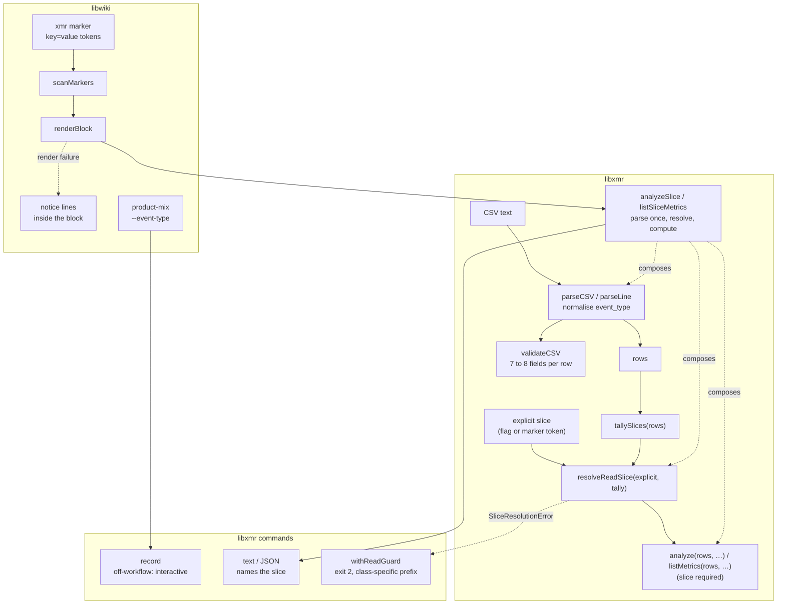
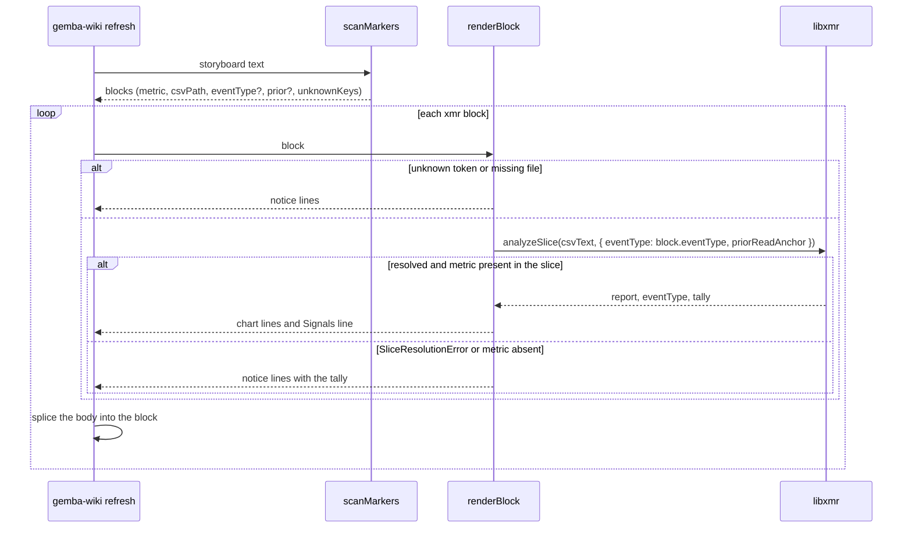

# Design 2370-a: slice resolution at the read seam, a marker token, one writer rule

Spec 2370 removes the built-in `kata-shift` read slice and gives this
repository the workflow names its installations have. This design fixes where
the slice resolves, how a storyboard block names its slice, how the two writers
share one rule, what `validate` checks, and how the rename and its history
rewrite land.

## Component map

## Components

| Component                     | Home                                                                     | Role after this design                                                                                                                                                                                                       |
| ----------------------------- | ------------------------------------------------------------------------ | ---------------------------------------------------------------------------------------------------------------------------------------------------------------------------------------------------------------------------- |
| `parseCSV`, `parseLine`       | `libxmr` CSV module                                                      | Normalise the `event_type` cell once: strip a trailing carriage return from the line and surrounding whitespace from the value. Every later component reads the normalised value. `validateCSV` splits lines through the same path. |
| `tallySlices`                 | `libxmr` slice module (library core)                                     | Returns `{ counts, empty }`: each value with its row count, and the count of rows with an empty value kept apart, so no sentinel key sits beside real values.                                                                |
| `resolveReadSlice`            | `libxmr` slice module                                                    | Applies spec § Slice resolution to the explicit value and the tally. Returns the resolved value, `*` for a header-only file with no explicit value, or throws `SliceResolutionError`. Neither it nor `tallySlices` is a package-root export; the composed functions and the error class are. |
| `SliceResolutionError`        | `libxmr` slice module (package-root export)                              | Carries the tally and the explicit value. No remedy text.                                                                                                                                                                    |
| `analyzeSlice`, `listSliceMetrics` | `libxmr` (package-root exports)                                     | Parse once, tally, resolve, compute. `analyzeSlice` forwards the partition options (`priorReadAnchor`, `route`, `routesEligibleIncludes`); `listSliceMetrics` takes the slice only. Both return the resolved slice and the tally with their result. The four read commands, `record`'s summary, and `renderBlock` call only these. |
| `analyze`, `listMetrics`      | `libxmr`                                                                 | Take parsed rows and one options object with a required `eventType` (a value or `*`). An absent slice throws a `TypeError`. The commands print `*` as `* (all rows)` through one formatter in the commands module. |
| `withReadGuard`               | `libxmr` commands (renames `withIntegrityGuard`)                         | Maps `CSVIntegrityError` and `SliceResolutionError` to the exit-2 envelope. The prefix names the class: `cannot parse CSV` or `cannot resolve slice for`. The slice message lists the tally and names `--event-type <name>` or `'*'`. |
| `validateCSV`                 | `libxmr` CSV module                                                      | Rejects a row with fewer than seven or more than eight fields under either header form.                                                                                                                                      |
| `record`                      | `libxmr` record command                                                  | Resolves the write value as flag, else host workflow filename, else the reserved `interactive`.                                                                                                                              |
| XmR marker grammar            | `libwiki` constants (one home for the scanner and the audit)             | `<!-- xmr:<metric>:<csv> [key=value]... [notice text] -->`. Tokens are the `key=value` words that directly follow the CSV path; the first word without `=` starts the notice text. Known keys: `event_type`, `prior`. A known key with a value the renderer cannot use renders a notice, as an unknown key does. |
| `scanMarkers`                 | `libwiki`                                                                | Parses known keys into the block and validates their values (`prior` is a date). Records an unknown key or an unusable value on the block.                                                                                  |
| `renderBlock`                 | `libwiki`                                                                | Calls `analyzeSlice` with the marker's slice. Returns chart lines, or notice lines that name the cause: unknown token, missing file, metric with no rows in the slice (with the tally), or slice resolution (with the tally and the token to add). `CSVIntegrityError` propagates. |
| `product-mix`                 | `libwiki`                                                                | Gains `--event-type`, forwarded to `record` when given. A non-zero `record` exit becomes a non-zero `product-mix` exit with `record`'s message. The no-labeled-PR and failed-query exits are unchanged.                        |
| Marker-grammar homes          | `gemba-wiki` skill § Marker contract, `libwiki` README (also the `renderBlock` contract), wiki-operations page, predictable-team guide, Kata daily-storyboard page, kata-session storyboard template and team-storyboard reference | Show the `key=value` grammar with both keys.                                                                       |
| Slice-rule homes              | Gemba XmR analysis page, predictable-team guide, Gemba overview, `gemba-xmr` skill (rule, `interactive` as reserved, help examples), `libxmr` README, kata-session participant protocol step 2 and team-storyboard Q2, kata-implement route-decision reference, product-manager profile `product-mix` step, wiki-operations page (`product-mix --event-type`) | State the rule. Examples use a neutral workflow name. Every read example in the CLI help and every published `analyze` invocation names a slice. The product manager's `product-mix` step names `agent-shift` for the `product_share` stream, the slice the P11 rewrite gives its pinned rows. |
| This repository's agent workflows | `.github/workflows`                                                  | `kata-shift.yml`, `kata-dispatch.yml`, `kata-storyboard.yml`, and `kata-coaching.yml` become `agent-shift.yml`, `agent-dispatch.yml`, `agent-storyboard.yml`, and `agent-coaching.yml`, with the templates' display names and, on the three that have one, `agent-*` concurrency groups. Other content is unchanged. `kata-interview.yml` and `curate-wiki.yml` keep their names. |
| Bridge dispatch target        | `libbridge`, `services/ghbridge`, `services/msbridge`, the ghbridge README | `dispatchWorkflow` carries the dispatch workflow file name `agent-dispatch.yml` as the value it uses when a caller passes none; `Dispatcher` makes the parameter optional and drops its own required-check. Both services pass none, so their constants go. The library's comments name the role, the README names the file, and the bridge tests take the new name. |
| Workflow enumeration          | `.jidoka/invariants` enumeration topics, KATA.md                         | The topic becomes `agent-workflows` with the glob `agent-*.yml` and no exclusion. The ids in the KATA.md fence are edited in place.                                                                                                                                                              |
| Names in the pack and this repository's prose | `kata-spec`, `kata-design`, `kata-plan`, `kata-release-merge` and its references, the release-engineer profile, the work-trackers reference, the root CLAUDE.md, `design/kata`, the trace-discovery reference, the `kata-agent` and `kata-interview` actions, KATA.md, `.github/CLAUDE.md`, the comments in `watchdog.yml`, `package-macos.yml`, the signing action's README, and the trace reader | Name the dispatch workflow by its role and the agent workflows by what they are. In a file at its word cap the role name is the one word `dispatch`. The trace-discovery reference, which lists runs by display name, names `Agent: Dispatch`. The killswitch statements cover the agent workflows and the interview workflow. The genericity invariant's workflow rule covers the bare old basenames as well as the `.yml` form, which gates the skills and shared references; the profiles, the root file, and the actions stay under the one-shot check. |
| History rewrite               | This wiki's metrics CSVs under either header form                        | A one-off edit with no library code: the cell under the `event_type` header whose trimmed value is an old basename takes the new one, and rows outside the schema's field range stay. It runs with `KATA_KILLSWITCH` set and no run in flight, so no writer appends while it works, and it lands as one `push --paths` over the metrics files. The publish's secret and budget gates run over the commit as for any push. |

## Data flow: one storyboard refresh

## Key decisions

| Decision                       | Choice                                                                                                                   | Rejected                                                                                                                              | Why                                                                                                                                                                                                                                                 |
| ------------------------------ | ------------------------------------------------------------------------------------------------------------------------ | ------------------------------------------------------------------------------------------------------------------------------------- | --------------------------------------------------------------------------------------------------------------------------------------------------------------------------------------------------------------------------------------------------- |
| Where the slice resolves       | In library core, behind one composed entry point per read shape. Commands and the renderer call the composed function.  | Inference inside `analyze()`. A resolver in the command layer that libwiki imports by path.                                           | A hidden inference inside the library is the same class of defect as the hidden literal. A command-layer resolver is not on the package's public surface, and libwiki depends on the package root.                                              |
| Inference rule                 | A sole value is used. Several values require an explicit choice.                                                         | Default to `*`. Use the value with most rows. Point the literal at another name. Derive the read slice from `$GITHUB_WORKFLOW_REF`. | `*` merges work shapes, which is the contamination spec 1540 exists to prevent. Most-rows is silent and moves over time. Another literal relocates the blind spot. The storyboard workflow is not the slice it renders.                               |
| Zero-match and ambiguous reads | Errors that carry the tally.                                                                                             | A stderr warning with an empty result.                                                                                                | The installation read stdout for a month. A failed measurement must fail.                                                                                                                                                                           |
| Value normalisation            | Once, in the parser. The tally and the row filter read the same normalised value.                                        | Trim in the tally only. Tally the raw cell.                                                                                           | A trim in one place and a raw comparison in another lets a value tally as the sole slice and then drop out of the read. A raw tally reports a single-workflow file as two slices.                                                                   |
| Empty values in the tally      | A separate `empty` count beside the value counts. It never counts as a value, and a file with only empty values fails a no-flag read. | Treat an all-empty file as header-only. A sentinel key such as `(none)` in the same map.                                   | Header-only has no rows to hide. An all-empty file has rows, and a silent read of them is the class the spec removes. A sentinel key is a new literal every consumer must exclude.                                                                 |
| Where a block names its slice  | A token on the xmr marker.                                                                                               | A `--event-type` flag on `refresh`.                                                                                                   | One board renders files whose rows come from different workflows. This repository's `staff-engineer` file alone carries four values. A refresh-wide flag cannot serve them, and it would be a second home for a per-block choice.                    |
| Token grammar                  | `key=value` words directly after the CSV path, in any order. An unknown key renders a notice in the block.               | A fixed position for each key. A stderr warning with inference.                                                                       | The current grammar swallows any trailing text, so a misplaced or misspelt token would fall back to inference. A stderr warning is the invisible channel the spec removes.                                                                        |
| Token key                      | `event_type`. Keys name the thing they set. `prior` stays as it is.                                                      | `slice`, `type`. Renaming `prior` to match.                                                                                           | It names the CSV column it filters. One vocabulary across column, flag, and marker. A `prior` rename is outside this spec.                                                                                                                           |
| Block render failures          | Every XmR render failure renders notice lines inside the block. `BlockRenderError` is removed. `CSVIntegrityError` propagates. | Keep `csv-not-found` and `metric-not-found` as stderr logs that leave the block as found. Turn a conflict-marker CSV into a notice. | The defect was invisibility, and the reader who can act sees the board. A metric that exists only in another slice is the same invisibility. A corrupt CSV is not one block's failure, and a soft exit would hide a merge gone wrong.                |
| Installation-wide default      | None.                                                                                                                    | A `.kata/settings.json` key. An environment variable.                                                                                 | Gemba does not read Kata's settings (spec 2290). An environment variable reintroduces an invisible default. The per-block token is the real unit of choice.                                                                                          |
| Writer rule for `product-mix`  | Forward `--event-type` when given, and the product manager names `agent-shift`. Otherwise `record` applies its own rule. Propagate `record`'s failure as a failure. | Keep the literal. Copy the workflow-name parser into `product-mix`. Keep the warn-and-succeed path for `record` failures.             | The literal made `product-mix` the only stream the default saw, by accident. A copied parser is a second home. Warn-and-succeed with no row after a `record` failure is the silent empty the spec removes.                                           |
| Off-workflow write value       | The reserved value `interactive`, written by `record` when no flag and no host workflow exist.                           | Refuse the row (today). Reuse `local`. Derive a name from the user or host.                                                           | A mandatory value with no honest answer produces invented names. `local` is `host_run` vocabulary and would blur the two columns. A user or host name is neither a workflow nor a stable set.                                                        |
| `validate` field count         | Seven or eight fields per row under either header.                                                                       | Match the header's count exactly. Repair in place.                                                                                    | `record` appends eight fields to a legacy seven-column file and never rewrites the header. An exact match would reject rows the CLI wrote. `validate` reports. It never edits.                                                                      |
| Library API shape              | `analyze` and `listMetrics` take parsed rows and one options object with a required `eventType`, behind one composed function per read shape. | Keep CSV text as the input. Keep `listMetrics` positional. Keep a default of `*`. One resolve-rows entry point that leaves the compute call to each caller. | Rows as input is what lets the composed functions parse once. One options shape for both. A forgotten caller fails loud at the seam instead of merging silently.                                                                                     |
| Error envelope                 | `SliceResolutionError` through the renamed `withReadGuard`, exit 2, with a class-specific prefix.                        | A new exit code. Reuse the parse prefix verbatim. Keep the `withIntegrityGuard` name.                                                 | It is a usage failure of the same kind as a structural CSV error. The prefix must not call a clean file unparseable. The guard now covers two classes, so its name covers the seam, not one class.                                                   |
| Remedy text                    | The error carries the tally only. The command guard names the flag. `renderBlock` names the token.                       | One message that names both remedies.                                                                                                 | A platform library must not carry a consumer's marker grammar. Each reader sees the remedy for the surface in front of them.                                                                                                                        |
| History after the rename       | Rewrite the `event_type` of this wiki's rows once.                                                                       | Let the renamed workflows start new slices.                                                                                           | A rename is not a process change. The shift slice holds about 1,500 cells, and a restart puts every chart at `insufficient_data` for weeks. The rewrite keeps the series whole and the file single-slice per workflow.                              |
| Rewrite publish                | Halt the agent workflows with the killswitch, wait for in-flight runs, rewrite, publish once, clear the killswitch.     | Refuse a rebased landing. A declared publish through spec 2390's removal option. Raw git in the wiki.                                 | The publish path always fetches and rebases and reports no moved tip, so nothing can refuse a rebase. The metrics files merge by union, so an append adjacent to a rewritten tail would keep both forms. The killswitch is the platform's own way to stop writers, and it leaves nothing to detect. The removal option deletes a path. Raw git bypasses every guard. |
| What the rename changes        | File names, display names, and concurrency groups.                                                                       | Align the workflow content with the templates in the same change.                                                                     | The three are the names the templates fix. The shift workflow drifts from its template by a few lines that carry real choices (turn cap, timeout, model, wiki). Spec 2390's update procedure diffs and asks per file, which is the right place to decide them. |
| Bridge target                  | The library's dispatch call carries the name; the services pass none.                                                    | A literal in each service. An exported constant both services import. An environment setting per deployment.                        | Two literals move in lockstep by hand, and an import keeps two call sites that say the same thing. A setting is a second home for a name the generator already fixes.                                                                                 |
| Enumeration topic id           | `agent-workflows`, with the glob.                                                                                        | Keep `kata-workflows` over an `agent-*.yml` glob.                                                                                     | The fence ids change in this change either way, so the rename costs nothing and leaves the registry without a mismatched id.                                                                                                                         |
| Dispatch name in the pack      | By role: "the dispatch workflow". One exception: a command that lists runs needs a display name and uses `Agent: Dispatch`. | Keep `kata-dispatch`. Write `agent-dispatch` into every skill.                                                                      | No installation and, after this change, no repository has a `kata-dispatch` workflow, and the skills CLAUDE.md forbids naming this repository's workflows. A role name survives the next rename; a run listing cannot work without the real name.      |
| Board tokens                   | None at the cutover. The template seeds the token on new boards, and the P3 notice names it on old ones.                | Write a token on each marker of the newest board.                                                                                     | The newest board is a past month that the default refresh never renders, and the token's value on a multi-slice file is a choice the board's author makes.                                                                                                     |
| Instruction files at their caps | Make room by tightening a sentence each file already carries; keep the new text whole.                                  | Trim the new text. Let the gate fail.                                                                                                 | Each file carries a sentence the new one can replace or shorten. The contracts list names the files and what gives.                                                                                                                                  |

## Removals

| Removed                                                                                                                | Home                                                            |
| ---------------------------------------------------------------------------------------------------------------------- | --------------------------------------------------------------- |
| The `DEFAULT_SHIFT_TYPE` constant and its export                                                                       | `libxmr` constants and index                                    |
| The `EVENT_TYPE_COLUMN` export, which has no importer (adjacent cleanup at the major bump)                              | `libxmr` constants and index                                    |
| The command-layer `resolveSlice` module and the `label` it returned                                                    | `libxmr` commands                                               |
| CSV text as the input of `analyze()` and `listMetrics()`, and their default parameters                                 | `libxmr`                                                        |
| `BlockRenderError` and the refresh catch that logs it                                                                  | `libwiki` block renderer and refresh command                    |
| The `kata-shift` literal in the `product-mix` argument list                                                            | `libwiki`                                                       |
| The `kata-shift.yml` example in the write path's `$GITHUB_WORKFLOW_REF` comment (a neutral name replaces it)           | `libxmr` record command                                         |
| The "requires `--event-type` or `$GITHUB_WORKFLOW_REF`" refusal and its test                                           | `libxmr` record command and tests                               |
| The help's read examples that name no slice, and the two that name `kata-*` slices (neutral names and a slice on each) | `products/gemba` bin and its help goldens, `product-mix` help golden |
| "Reads default to the `kata-shift` slice" and "default: `kata-shift`" in the `--event-type` row                        | `gemba-xmr` skill                                               |
| The "pass `--event-type` on every read" caveat, and the XmR half of the "two defaults still refer to that tenant" sentence | Gemba XmR analysis page, predictable-team guide, Gemba overview |
| The tests of the removed behaviours: text input, the default slice, the refusal, and the unchanged-block path          | `libxmr` tests, `libwiki` tests                                 |
| The four `kata-*.yml` file names, their `Kata:` display names, and the three `kata-*` concurrency groups                 | `.github/workflows`                                             |
| The `kata-dispatch.yml` constants in both services, the required-`workflowFile` checks, the file name in the library's comments, the README line, and the test literals | `libbridge`, `services/ghbridge`, `services/msbridge` |
| The `kata-workflows` topic, its `kata-*.yml` glob, and its interview exclusion                                           | Enumeration topics                                              |
| The 24 old workflow names in KATA.md, the "every `kata-*` workflow" phrasing there, the file reference and glob comment in `.github/CLAUDE.md`, and the glob comments in `watchdog.yml`, `package-macos.yml`, the signing action's README, and the two published actions | KATA.md, `.github`, `products/kata/actions`                     |
| `kata-dispatch` as the dispatch workflow's name in the published skills, the agent profile and reference, the root CLAUDE.md, and `design/kata`, and `Kata: Dispatch` in the trace-discovery reference | The pack, root CLAUDE.md, `design/kata`              |
| The trace reader's comments that name `kata-shift.yml`, `Kata: Shift`, and `Kata: Dispatch`                             | `libharness`                                                    |
| The warn-and-succeed path after a `record` failure                                                                      | `libwiki` `product-mix`                                         |
| The `kata-shift`, `kata-dispatch`, and `kata-coaching` cells in this wiki's metrics rows                                | This wiki, in the merging session                               |

## Contracts outside the components

- Other `record` refusals (no skill, no metric, no value, unknown route) are
  unchanged.
- The CSV schema and both header forms are unchanged.
- The marker close tag is unchanged.
- `chart` keeps its "no metrics found" exit for an empty report.
- `analyze --metric <name>` and `summarize --metric <name>` keep their
  behaviour for a metric absent from the slice: the caller named a filter,
  and the output names the slice.
- The required slice and the rows input are breaking changes to the `libxmr`
  API. `libxmr` takes a major bump. `libwiki` and `gemba` move their ranges
  in the same release train, so no published `gemba-wiki` resolves a renderer
  and a library from different sides of the change.
- The rename is the last part. The bridge services release and redeploy with
  it; between the two, a bridge dispatch into this repository finds no
  workflow. The wiki rewrite happens in the merging session. The plan carries
  the steps.
- A renamed workflow is a new workflow to GitHub Actions. The old entries keep
  their run history. The trace tooling's default name pattern matches both
  display names. No required status check names an agent workflow.
- Instruction budgets, with what gives: the `gemba-wiki` skill (192 of 192
  lines; its two-line window note becomes one correct line, since the `:Nd`
  suffix is live), the storyboard template (128 of 128 lines; the token sits
  on the marker line), the team-storyboard reference (767 of 768 words; its
  marker gains the token and Q2 is rewritten word-neutrally), the `gemba-xmr`
  skill (27 words of headroom; the `--event-type` row and the quick-start
  example merge into one statement of the rule and the reservation), the
  release-merge templates reference (768 of 768 words; one token for one
  token), the kata-session skill (45 words of headroom for the flag and the
  participant sentence), the root CLAUDE.md (893 of 896) and the work-trackers
  reference (1,267 of 1,280), which fit the role name, and `.github/CLAUDE.md`
  (760 of 768; word-neutral). `jidoka instructions` is the proof.
- The marker token's entry in the `kata-setup` changelog of spec 2390 rides
  whichever of the two changes lands second.
- Test fixtures and goldens keep `kata-shift` as data. They are not published
  surfaces, and the read snapshots over a single-slice fixture are
  byte-identical after inference.

## Risks

| Risk                                                                                                              | Mitigation                                                                                                           |
| ----------------------------------------------------------------------------------------------------------------- | -------------------------------------------------------------------------------------------------------------------- |
| A marker over a multi-slice file renders a notice until a participant adds the token.                            | Intended. The notice names the token. The storyboard template seeds it.                                              |
| A script that runs `gemba-xmr analyze <csv>` on a multi-slice file with no flag now exits 2.                     | Every published invocation names a slice. The error names the fix.                                                  |
| A local `gemba-wiki product-mix` with no flag and no host workflow now writes `interactive` instead of `kata-shift`. | Intended. The `product_share` marker names its slice, so the board reads the CI stream.                           |
| A missing CSV now replaces a block's prior chart with a notice.                                                   | Intended. The board shows the current state of its sources.                                                          |
| Test and snapshot churn: `analyze` call sites, the two help examples, the six-field rows in the `validate` golden fixture, the two libwiki tests named above, and new envelope and `product-mix` propagation cases. | One pass in the implementation. The read snapshots over a single-slice fixture are byte-identical after inference. |
| A scheduled run between the rename merge and the rewrite writes rows under the new names beside the history.      | The rewrite maps the old names onto the new, so the two sets become one slice. The window is the merging session.      |
| A scheduled append lands between the rewrite's pull and its push.                                                 | The killswitch halts the agent workflows for the rewrite, and the operator waits for in-flight runs, so no append exists to merge.     |
| The publish's secret gate scans the rewritten lines, which carry free-text notes.                                 | A finding stops the publish and names the row. The operator resolves it as for any push.                                               |
| Every lane's boot-time integrity sweep reports its prior rows as absent once after the rewrite.                   | Detection only. The rows are present under the new name.                                                                               |
| A hand-edited row whose `event_type` carries an old name with stray whitespace escapes the rewrite.               | The rewrite compares the normalised value, as the parser does. S23's zero-match read catches a survivor.                |
| A shifted row keeps an old name outside the `event_type` cell.                                                    | P11 leaves it, P5 reports it, and the parser-based S23 does not count it.                                               |
| Between the rename merge and the bridge redeploy, a discussion dispatch into this repository finds no workflow.   | The two move together in one release. The discussion stays on the channel, and the operator re-dispatches it.          |
