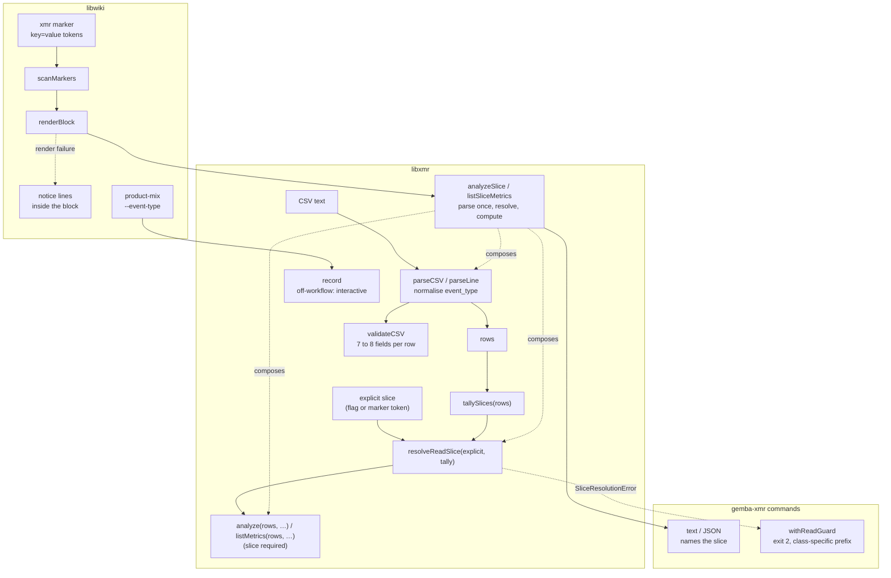
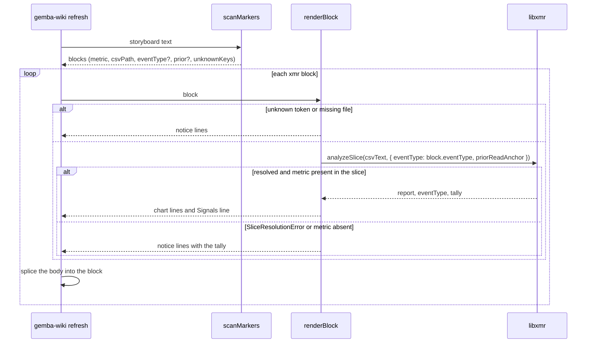

# Design 2370-a: slice resolution at the read seam, a marker token, one writer rule

Spec 2370 removes the built-in `kata-shift` read slice. This design fixes
where the slice resolves, how a storyboard block names its slice, how the two
writers share one rule, and what `validate` checks.

## Component map

## Components

| Component                     | Home                                                                     | Role after this design                                                                                                                                                                                                       |
| ----------------------------- | ------------------------------------------------------------------------ | ---------------------------------------------------------------------------------------------------------------------------------------------------------------------------------------------------------------------------- |
| `parseCSV`, `parseLine`       | `libxmr` CSV module                                                      | Normalise the `event_type` cell once: strip a trailing carriage return from the line and surrounding whitespace from the value. Every later component reads the normalised value. `validateCSV` splits lines through the same path. |
| `tallySlices`                 | `libxmr` slice module (library core, package-root export)                | Maps each value to its row count. Rows with an empty value tally under the key `(none)`.                                                                                                                                     |
| `resolveReadSlice`            | `libxmr` slice module (package-root export)                              | Applies spec § Slice resolution to the explicit value and the tally. Returns the resolved value or throws `SliceResolutionError`.                                                                                             |
| `SliceResolutionError`        | `libxmr` slice module (package-root export)                              | Carries the tally and the explicit value. No remedy text.                                                                                                                                                                    |
| `analyzeSlice`, `listSliceMetrics` | `libxmr` (package-root exports)                                     | Parse once, tally, resolve, compute. Forward the full partition option set (`priorReadAnchor`, `route`, `routesEligibleIncludes`). Return the report, the resolved slice, and the tally. The four read commands, `record`'s summary, and `renderBlock` call only these. |
| `analyze`, `listMetrics`      | `libxmr`                                                                 | Take parsed rows and one options object with a required `eventType` (a value or `*`). An absent slice throws a `TypeError`.                                                                                                  |
| `withReadGuard`               | `libxmr` commands (renames `withIntegrityGuard`)                         | Maps `CSVIntegrityError` and `SliceResolutionError` to the exit-2 envelope. The prefix names the class: `cannot parse CSV` or `cannot resolve slice for`. The slice message lists the tally and names `--event-type <name>` or `'*'`. |
| `validateCSV`                 | `libxmr` CSV module                                                      | Rejects a row with fewer than seven or more than eight fields under either header form.                                                                                                                                      |
| `record`                      | `libxmr` record command                                                  | Resolves the write value as flag, else host workflow filename, else the reserved `interactive`.                                                                                                                              |
| XmR marker grammar            | `libwiki` constants (one home for the scanner and the audit)             | `<!-- xmr:<metric>:<csv> [key=value]... [notice text] -->`. Tokens are the `key=value` words that directly follow the CSV path; the first word without `=` starts the notice text. Known keys: `event_type`, `prior`.         |
| `scanMarkers`                 | `libwiki`                                                                | Parses known keys into the block. Records an unknown key on the block.                                                                                                                                                       |
| `renderBlock`                 | `libwiki`                                                                | Calls `analyzeSlice` with the marker's slice. Returns chart lines, or notice lines that name the cause: unknown token, missing file, metric with no rows in the slice (with the tally), or slice resolution (with the tally and the token to add). `CSVIntegrityError` propagates. |
| `product-mix`                 | `libwiki`                                                                | Gains `--event-type`, forwarded to `record` when given. A non-zero `record` exit becomes a non-zero `product-mix` exit with `record`'s message. The no-labeled-PR and failed-query exits are unchanged.                        |
| Marker-grammar homes          | `gemba-wiki` skill § Marker contract and § Programmatic API (`renderBlock` contract), `libwiki` README, wiki-operations page, predictable-team guide, Kata daily-storyboard page, kata-session storyboard template and team-storyboard reference | Show the `key=value` grammar with both keys.                                                     |
| Slice-rule homes              | Gemba XmR analysis page, predictable-team guide, Gemba overview, `gemba-xmr` skill (rule, `interactive` as reserved, help examples), `libxmr` README, kata-session participant protocol step 2 and team-storyboard Q2, kata-implement route-decision reference, product-manager profile `product-mix` step, wiki-operations page (`product-mix --event-type`) | State the rule. Examples use a neutral workflow name. Every `analyze` invocation names a slice. |

## Data flow: one storyboard refresh

## Key decisions

| Decision                       | Choice                                                                                                                   | Rejected                                                                                                                              | Why                                                                                                                                                                                                                                                 |
| ------------------------------ | ------------------------------------------------------------------------------------------------------------------------ | ------------------------------------------------------------------------------------------------------------------------------------- | --------------------------------------------------------------------------------------------------------------------------------------------------------------------------------------------------------------------------------------------------- |
| Where the slice resolves       | In library core, behind one composed entry point per read shape. Commands and the renderer call the composed function.  | Inference inside `analyze()`. A resolver in the command layer that libwiki imports by path.                                           | A hidden inference inside the library is the same class of defect as the hidden literal. A command-layer resolver is not on the package's public surface, and libwiki depends on the package root.                                              |
| Inference rule                 | A sole value is used. Several values require an explicit choice.                                                         | Default to `*`. Use the value with most rows. Point the literal at another name. Derive the read slice from `$GITHUB_WORKFLOW_REF`. | `*` merges work shapes, which is the contamination spec 1540 exists to prevent. Most-rows is silent and moves over time. Another literal relocates the blind spot. The storyboard workflow is not the slice it renders.                               |
| Zero-match and ambiguous reads | Errors that carry the tally.                                                                                             | A stderr warning with an empty result.                                                                                                | The installation read stdout for a month. A failed measurement must fail.                                                                                                                                                                           |
| Value normalisation            | Once, in the parser. The tally and the row filter read the same normalised value.                                        | Trim in the tally only. Tally the raw cell.                                                                                           | A trim in one place and a raw comparison in another lets a value tally as the sole slice and then drop out of the read. A raw tally reports a single-workflow file as two slices.                                                                   |
| The `(none)` bucket            | Empty values tally under `(none)`. The bucket never counts as a value, and a file with only `(none)` fails a no-flag read. | Treat an all-empty file as header-only. Treat `(none)` as a slice.                                                                    | Header-only has no rows to hide. An all-empty file has rows, and a silent read of them is the class the spec removes. A slice named `(none)` would be a new literal.                                                                                 |
| Where a block names its slice  | A token on the xmr marker.                                                                                               | A `--event-type` flag on `refresh`.                                                                                                   | One board renders files whose rows come from different workflows. The installation's `kata-archive` file alone carries three values. A refresh-wide flag cannot serve them, and it would be a second home for a per-block choice.                    |
| Token grammar                  | `key=value` words directly after the CSV path, in any order. An unknown key renders a notice in the block.               | A fixed position for each key. A stderr warning with inference.                                                                       | The current grammar swallows any trailing text, so a misplaced or misspelt token would fall back to inference. A stderr warning is the invisible channel the spec removes.                                                                        |
| Token key                      | `event_type`. Keys name the thing they set. `prior` stays as it is.                                                      | `slice`, `type`. Renaming `prior` to match.                                                                                           | It names the CSV column it filters. One vocabulary across column, flag, and marker. A `prior` rename is outside this spec.                                                                                                                           |
| Block render failures          | Every XmR render failure renders notice lines inside the block. `BlockRenderError` is removed. `CSVIntegrityError` propagates. | Keep `csv-not-found` and `metric-not-found` as stderr logs that leave the block as found. Turn a conflict-marker CSV into a notice. | The defect was invisibility, and the reader who can act sees the board. A metric that exists only in another slice is the same invisibility. A corrupt CSV is not one block's failure, and a soft exit would hide a merge gone wrong.                |
| Installation-wide default      | None.                                                                                                                    | A `.kata/settings.json` key. An environment variable.                                                                                 | Gemba does not read Kata's settings (spec 2290). An environment variable reintroduces an invisible default. The per-block token is the real unit of choice.                                                                                          |
| Writer rule for `product-mix`  | Forward `--event-type` when given. Otherwise `record` applies its own rule. Propagate `record`'s failure as a failure.  | Keep the literal. Copy the workflow-name parser into `product-mix`. Keep the warn-and-succeed path for `record` failures.             | The literal made `product-mix` the only stream the default saw, by accident. A copied parser is a second home. Warn-and-succeed with no row after a `record` failure is the silent empty the spec removes.                                           |
| Off-workflow write value       | The reserved value `interactive`, written by `record` when no flag and no host workflow exist.                           | Refuse the row (today). Reuse `local`. Derive a name from the user or host.                                                           | A mandatory value with no honest answer produces invented names. `local` is `host_run` vocabulary and would blur the two columns. A user or host name is neither a workflow nor a stable set.                                                        |
| `validate` field count         | Seven or eight fields per row under either header.                                                                       | Match the header's count exactly. Repair in place.                                                                                    | `record` appends eight fields to a legacy seven-column file and never rewrites the header. An exact match would reject rows the CLI wrote. `validate` reports. It never edits.                                                                      |
| Library API shape              | `analyze` and `listMetrics` take parsed rows and one options object with a required `eventType`.                         | Keep CSV text as the input. Keep `listMetrics` positional. Keep a default of `*`.                                                     | Rows as input is what lets the composed functions parse once. One options shape for both. A forgotten caller fails loud at the seam instead of merging silently.                                                                                     |
| Error envelope                 | `SliceResolutionError` through the renamed `withReadGuard`, exit 2, with a class-specific prefix.                        | A new exit code. Reuse the parse prefix verbatim. Keep the `withIntegrityGuard` name.                                                 | It is a usage failure of the same kind as a structural CSV error. The prefix must not call a clean file unparseable. The guard now covers two classes, so its name covers the seam, not one class.                                                   |
| Remedy text                    | The error carries the tally only. The command guard names the flag. `renderBlock` names the token.                       | One message that names both remedies.                                                                                                 | A platform library must not carry a consumer's marker grammar. Each reader sees the remedy for the surface in front of them.                                                                                                                        |

## Removals

| Removed                                                                                                                | Home                                                            |
| ---------------------------------------------------------------------------------------------------------------------- | --------------------------------------------------------------- |
| The `DEFAULT_SHIFT_TYPE` constant and its export                                                                       | `libxmr` constants and index                                    |
| The `EVENT_TYPE_COLUMN` export, which has no importer                                                                  | `libxmr` constants and index                                    |
| The command-layer `resolveSlice` module and the `label` it returned                                                    | `libxmr` commands                                               |
| CSV text as the input of `analyze()` and `listMetrics()`, and their default parameters                                 | `libxmr`                                                        |
| `BlockRenderError` and the refresh catch that logs it                                                                  | `libwiki` block renderer and refresh command                    |
| The `kata-shift` literal in the `product-mix` argument list                                                            | `libwiki`                                                       |
| The `kata-shift.yml` example in the write path's `$GITHUB_WORKFLOW_REF` comment (a neutral name replaces it)           | `libxmr` record command                                         |
| The "requires `--event-type` or `$GITHUB_WORKFLOW_REF`" refusal and its test                                           | `libxmr` record command and tests                               |
| The `--event-type kata-shift` and `--event-type kata-dispatch` help examples (neutral names replace them)              | `products/gemba` bin and help golden                            |
| "Reads default to the `kata-shift` slice" and "default: `kata-shift`" in the `--event-type` row                        | `gemba-xmr` skill                                               |
| The "pass `--event-type` on every read" caveat, and the XmR half of the "two defaults still refer to that tenant" sentence | Gemba XmR analysis page, predictable-team guide, Gemba overview |
| Tests that call `analyze` or `listMetrics` with CSV text or without a slice, and tests that assert the default slice   | `libxmr` tests, `libwiki` tests                                 |
| The tests "throws BlockRenderError for a missing metric" and "missing CSV — block unchanged"                           | `libwiki` tests                                                 |

## Contracts outside the components

- Other `record` refusals (no skill, no metric, no value, unknown route) are
  unchanged.
- The CSV schema and both header forms are unchanged.
- The marker close tag is unchanged.
- `chart` keeps its "no metrics found" exit for an empty report.
- `analyze --metric <name>` and `summarize --metric <name>` keep their
  behaviour for a metric absent from the slice: the caller named a filter,
  and the output names the slice.
- The required slice and the rows input are breaking changes to the `libxmr`
  API. `libxmr` takes a major bump. `libwiki` and `gemba` move their ranges
  in the same release train, so no published `gemba-wiki` resolves a renderer
  and a library from different sides of the change.

## Risks

| Risk                                                                                                              | Mitigation                                                                                                           |
| ----------------------------------------------------------------------------------------------------------------- | -------------------------------------------------------------------------------------------------------------------- |
| A marker over a multi-slice file renders a notice until a participant adds the token.                            | Intended. The notice names the token. The storyboard template seeds it.                                              |
| A script that runs `gemba-xmr analyze <csv>` on a multi-slice file with no flag now exits 2.                     | Every published invocation names a slice. The error names the fix.                                                  |
| A local `gemba-wiki product-mix` with no flag and no host workflow now writes `interactive` instead of `kata-shift`. | Intended. The `product_share` marker names its slice, so the board reads the CI stream.                           |
| A missing CSV now replaces a block's prior chart with a notice.                                                   | Intended. The board shows the current state of its sources.                                                          |
| Test and snapshot churn: `analyze` call sites, the two help examples, the six-field rows in the `validate` golden fixture, the two libwiki tests named above, and new envelope and `product-mix` propagation cases. | One pass in the implementation. The read snapshots over a single-slice fixture are byte-identical after inference. |
