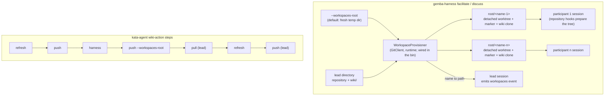

# Design 2380-a: a workspace provisioner in the harness, a multi-clone publish in the wiki

Spec 2380 gives every facilitated-session participant its own workspace. This
design fixes which component creates the workspaces, what each holds, how the
participant wikis publish, and what the two actions pass.

## Component map



## Components

| Component                                 | Home                                                                   | Role after this design                                                                                                                                                                                                                                                              |
| ----------------------------------------- | ---------------------------------------------------------------------- | ----------------------------------------------------------------------------------------------------------------------------------------------------------------------------------------------------------------------------------------------------------------------------------- |
| `WorkspaceProvisioner`                    | `libharness` (new class; the harness bin wires it with `GitClient` and `runtime` and the runners receive it) | Requires a repository at the lead directory and a `root/<name>` that does not exist. For each participant name it adds a detached worktree of the lead's repository at HEAD and writes a workspace marker file at its root. When `<lead>/wiki/.git` exists (the `wiki` convention `resolveWikiRoot` defaults to) it clones that directory into `<workspace>/wiki` on the publish branch and sets `origin` to the lead clone's `origin` URL. Returns name to path. It prepares no toolchain. |
| `GitClient`                               | `libutil`                                                              | Gains `worktreeAdd` (detached, at a ref). Existing verbs cover the rest. The mock client lists the new verb.                                                                                                                                                                       |
| Temp-root helper                          | `libharness` commands                                                  | One module owns `mkdtemp` under the system temp root with the `gemba-harness-` prefix, hoisted from the benchmark module. The two session modes use it for the default root. Other call sites are out of this spec's scope.                                                       |
| `facilitate`, `discuss` command runners   | `libharness` commands                                                  | The option parsers stay pure and return participant configurations without `cwd`. The runner resolves `--workspaces-root`, calls the provisioner with the lead directory (`--facilitator-cwd` in facilitate, the current directory in discuss, passed to the discusser as its lead directory too), fills each configuration's `cwd`, and hands the name-to-path map to the factory. An empty participant list provisions nothing and skips the repository check. One shared builder module keeps the per-mode rule (facilitate requires profiles, discuss does not). |
| `workspaces` trace event                  | `libharness` facilitator and discusser                                 | A new event type with `workspaces_root` and `workspaces` (name to path), emitted by the lead-side component after its opening events (after the discuss `meta` and the loop's `session_start`), through the loop's sequence counter and redactor. The same report goes to stderr as `workspaces: <root>`. The text renderer suppresses it like the other lifecycle events. |
| Facilitator, Discusser                    | `libharness`                                                           | `cwd` becomes required per participant; the fallback to the lead's directory goes. Both keep `settingSources: ["project"]`, so each workspace runs the repository's hooks. Library callers pass `cwd` themselves or call the exported provisioner.                                   |
| `gemba-wiki push --workspaces-root`       | `libwiki` push command; one `WikiSync` factory wired in the `gemba-wiki` bin, which also builds the single-wiki instance | Discovers `root/*/wiki/.git`, builds one `WikiSync` per clone through the factory (`wikiDir`, `parentDir`, the shared `resolveToken`), pins the transport rule with the public clone-ensure call and each clone's own `origin` URL, and runs the same commit-and-push as the bare command. Prints `push[<name>]:` followed by the outcome line the bare command prints, or the failure's own message. The option is exclusive with `--wiki-root` and `--paths`, and the bin skips its no-wiki guard for it. |
| This monorepo's bootstrap                 | `scripts/bootstrap.sh`, `.gitignore`                                   | When the workspace marker is present, links the primary checkout's `node_modules`, `generated`, and per-library `generated` links instead of installing. Worktrees without the marker (the `kata-implement` worktrees) keep their own install. `.gitignore` covers the marker and the linked entries. |
| `gemba-harness` action                    | `products/gemba/actions/gemba-harness`                                 | Drops `agent-cwd` from the `facilitate` and `discuss` invocations, fails when it is set with either mode, and passes `--workspaces-root`. Gains the `workspaces-root` input, defaulted by an always-on step that creates a fresh directory under `runner.temp` for the two modes, and the `workspaces-root` output. Keeps `agent-cwd` for `supervise` and scopes its description so. Its README shows the post-session publish and the removal step. |
| `kata-agent` action                       | `products/kata/actions/kata-agent`                                     | Gains a `workspaces-root` input it passes to the harness action and reads the harness action's `workspaces-root` output for the publish. Pre-run: `refresh`, then `push`. Post-session, every step `if: always()` with wiki on: `push --workspaces-root=<output>` (the two modes only), `pull`, `refresh`, `push`. Each is one wiki-action step with its own token, and each carries the dispatch gate's stood-down guard that the existing wiki steps carry (spec 2350), because a run that stood down at the gate has no checkout and no session. Scopes the `agent-cwd` input description to `supervise`. |
| kata-session skill and dispatch discipline | `.claude/skills/kata-session`                                         | State that each participant has its own HEAD, index, files, and wiki clone, that branches and stash are shared across workspaces of one repository, and that a participant does not stash and does not write outside its workspace. Rename the "Shared-workspace commit discipline" heading and its anchor together. Keep edit-intent and same-surface serialization for shared wiki rows. |
| Docs, skills, and goldens                 | `gemba-harness` skill CLI reference, both action READMEs, `libharness` README (programmatic example gains `cwd`; event list gains `workspaces`), Gemba coordinate-team and prove-changes pages, `gemba-wiki` skill push and pull section and exit-code table, `libwiki` README, Gemba wiki-operations page, `gemba-wiki push --help` golden | Describe the workspace per participant, the root option and output, the publish flag and its exit, the Stop-hook interplay, and the removal step (`rm -rf <root>` then `git worktree prune`). Replace the `--agent-cwd=.` examples in the two modes' invocations. |

## Data flow: one facilitated session in CI

```mermaid
sequenceDiagram
    participant A as kata-agent action
    participant W as gemba-wiki (one step each)
    participant H as gemba-harness facilitate
    participant P as WorkspaceProvisioner
    participant S as participant sessions
    Note over A: the dispatch gate (spec 2350) has let the run through
    A->>W: refresh, then push (lead clone now clean and published)
    A->>H: --workspaces-root=<root> --agent-profiles=a,b,c
    H->>P: provision(lead, root, [a,b,c])
    P-->>H: {a, b, c} → paths
    H->>H: opening events, then the workspaces event
    H->>S: one session per participant, cwd = its workspace
    Note over S: repository hooks prepare the tree and pull the clean clone;<br/>a Stop hook may publish the clone during the session
    S-->>H: answers
    A->>W: push --workspaces-root=<root>
    W-->>A: push[a]: committed and pushed · push[b]: nothing to push · push[c]: <failure>
    A->>W: pull, refresh, push (lead)
```

## Key decisions

| Decision                          | Choice                                                                                                                                  | Rejected                                                                                                                                                 | Why                                                                                                                                                                                                                                                                                                                        |
| --------------------------------- | --------------------------------------------------------------------------------------------------------------------------------------- | -------------------------------------------------------------------------------------------------------------------------------------------------------- | -------------------------------------------------------------------------------------------------------------------------------------------------------------------------------------------------------------------------------------------------------------------------------------------------------------------------- |
| Isolation unit for the project    | A detached git worktree of the lead's repository.                                                                                       | A shared-object clone. An empty temporary directory as in `supervise`. A copy of a non-repository lead directory. Extending the benchmark `WorkdirManager`. | A worktree costs seconds, shares objects, and keeps participant branches visible to the lead. A clone hides them and depends on the source's garbage collection. An empty directory holds no project. Sandbox evaluations run through `supervise`, so a copy path has no caller. `WorkdirManager` seeds benchmark cells from a staging directory and manages ports and process groups. |
| Shared git surfaces               | Objects, branches, remote-tracking refs, and stash stay shared. HEAD, index, and files are not.                                         | A clone per participant to separate refs too.                                                                                                            | The incidents were HEAD, index, and file clobbers. Shared refs let the lead see participant branches. Two workspaces cannot hold one branch, so participants create their own, and a participant does not stash.                                                                                                             |
| Where provisioning runs           | In the CLI command runners. The library API requires `cwd` per participant and exports the provisioner.                                 | Inside `createFacilitator` and `createDiscusser`.                                                                                                        | The factories stay mechanism-free. A library caller chooses its own isolation and passes `cwd`, or calls the provisioner.                                                                                                                                                                                                  |
| Existing workspace path           | Refuse.                                                                                                                                 | Reuse the worktree at that path.                                                                                                                         | A reused worktree is not at the lead's current commit and carries a stale clone. Workspaces are per session; a caller that names a fixed root clears it first.                                                                                                                                                              |
| Default and option shape          | Isolation is the only behaviour. `--agent-cwd` is removed from the two modes. `--workspaces-root` names where workspaces live.          | Keep `--agent-cwd` as an opt-in shared mode. A list-valued `--agent-cwd` aligned with `--agent-profiles` (#2085).                                       | The shared default was the defect. A positional list couples two flags and shares by default. A root is the one thing a caller legitimately chooses.                                                                                                                                                                        |
| Wiki per participant              | A local clone of the lead's wiki clone with the lead's remote, at the lead clone's commit, on the publish branch.                       | A symlink to the lead's wiki. A git worktree of the wiki. A fresh clone from the remote. An overlay of the lead clone's uncommitted state.               | A symlink keeps the shared-tree hazard. libwiki publishes `master` and refuses a detached HEAD, so two worktrees cannot both hold it. A remote clone costs N network clones and a credential in the harness. An overlay would seed every participant's dirty set with foreign content and block its first pull.             |
| The pre-run refresh               | `kata-agent` publishes it before the session.                                                                                           | Leave it uncommitted in the lead clone, as today.                                                                                                        | An uncommitted refresh would be absent from participant clones and would block the lead's post-session pull, which rebases without autostash.                                                                                                                                                                              |
| Toolchain in a workspace          | The repository's own session hooks prepare it, keyed on a marker the provisioner writes. The platform's CLIs sit on `PATH`.             | The provisioner links `node_modules` and `generated`. A full install per workspace. Linking in every worktree.                                           | Linking two directories bakes a FIT layout into the Gemba runtime and still leaves this repository's per-library `generated` links missing. An install per workspace multiplies setup time by N. Linking in every worktree would make `kata-implement` worktrees resolve library edits to the primary checkout's sources.      |
| Who publishes participant wikis   | The caller, after the session, through `gemba-wiki push --workspaces-root`. A repository Stop hook may publish a clone earlier.         | The harness shells out to `gemba-wiki` at session end. Rely on Stop hooks alone. A caller loop over `push --wiki-root <ws>/wiki`. A separate verb.      | A long session outlives the job-start token, and the wiki action mints a fresh one per step. Stop hooks exist only where a repository defines them. A caller loop is N steps, N mints, and no aggregate exit. A mode flag keeps one publish entry point and one set of gates.                                              |
| Post-session order in `kata-agent` | Participant publish, lead pull, refresh, lead publish. One wiki-action step each, all under `always()` and the dispatch gate's stood-down guard.                                 | Refresh before the participant publish. One step that runs two commands. A lead publish first.                                                           | The refresh renders XmR blocks from the lead's CSVs, which receive participant rows only through the remote. The wiki action runs one command per step. The lead holds no write tools, so its clone stays clean after the pre-run publish. A `stand_down` verdict from the lead (spec 2350) changes nothing here: the steps run the same, and a clone with nothing to publish prints its no-change line.                                                                                   |
| Lead directory                    | Unchanged, the caller's directory.                                                                                                      | A workspace for the lead as well.                                                                                                                        | One actor moves HEAD there.                                                                                                                                                                                                                                                                                                |
| Workspace lifetime                | Workspaces persist after the harness exits.                                                                                             | The harness removes workspaces at session end.                                                                                                           | The publish runs after the harness exits. Removal before it loses memory.                                                                                                                                                                                                                                                  |
| Reporting channel                 | A `workspaces` event from the lead-side component after its opening events, plus a stderr line.                                        | A stdout line. A `workspaces.json` manifest. Reusing the discuss `meta` event. Emitting from the provisioner or the shared loop.                        | Stdout is the NDJSON trace when `--output` is absent. The publish discovers clones by layout, so a manifest has no reader. `meta` must stay the first line for the trace reader that keys on it. The loop is shared with `supervise`, which has no workspaces, and the provisioner runs before any sequence counter exists. |
| Publish failure semantics         | Continue past a failing clone. Exit non-zero when any failed. Zero with a notice for an empty root.                                     | Stop at the first failure. Exit zero with per-clone lines only. Fail on an empty root.                                                                   | One participant's conflict must not strand the others' memory. A zero exit would hide the failure. A `discuss` run with no participants has no workspaces.                                                                                                                                                                  |
| Same-surface serialization        | Spec 2010 L2 stays.                                                                                                                     | Drop it, since trees are isolated.                                                                                                                       | Edits to shared wiki rows still collide at the remote. Isolation removes the tree hazard; L2 removes the ordering hazard.                                                                                                                                                                                                  |

## Removals

| Removed                                                                                                                          | Home                                                                                                                                  |
| -------------------------------------------------------------------------------------------------------------------------------- | ------------------------------------------------------------------------------------------------------------------------------------- |
| `--agent-cwd` on `facilitate` and `discuss`, and the "shared by participants" help text                                         | `gemba-harness` CLI definition                                                                                                        |
| The scalar `cwd` parameter and its "shared working directory for all agents" docstring                                          | `libharness` commands                                                                                                                 |
| The optional `cwd` and its fallback to the lead's directory for participants                                                     | `libharness` facilitator and discusser                                                                                                |
| `agent-cwd` from the `facilitate` and `discuss` invocations, and "facilitate, and discuss" from its description                 | `gemba-harness` action, `kata-agent` action, both READMEs                                                                             |
| Every shared-checkout phrase the spec's S13 pattern names, and every `--agent-cwd=.` example in a `facilitate` or `discuss` invocation | kata-session skill and reference, `gemba-harness` skill CLI reference, `libharness` README, Gemba coordinate-team and prove-changes pages |

## Contracts outside the components

- libwiki's commit-and-push semantics in one clone are unchanged. Each
  participant clone is one session under the contract libwiki documents.
- The `gemba-wiki` action is unchanged. Its `command` input carries the flag.
- The dispatch gate (spec 2350) is unchanged. It runs before checkout, so a run
  that stands down there reaches none of the steps this design adds.
- The `supervise` command and its temporary directory are unchanged.
- The repository's worktree hook places a nested worktree under the primary
  checkout. A participant's `kata-implement` worktree lands there and keeps
  its own install.
- `gemba-selfedit` refuses a write on a detached HEAD, so a participant edits
  instruction layers from a nested branch worktree, as `kata-implement` does.
- The release chain: `libutil`, `libharness`, and `libwiki` publish; the
  `gemba` package takes them; a gear release ships the binaries;
  `gemba-bootstrap` repins the gear release; the `gemba-harness` action and
  then the `kata-agent` action repin; consumers repin `kata-agent`.

## Risks

| Risk                                                                                           | Mitigation                                                                                                   |
| ---------------------------------------------------------------------------------------------- | ------------------------------------------------------------------------------------------------------------ |
| N worktrees and N wiki clones cost disk and time on a large repository.                        | A worktree shares objects. The wiki is small. The plan measures this monorepo's seven-participant session.   |
| The lead's wiki clone is shallow in CI, so the participant clones are shallow too.             | libwiki's publish path already handles a shallow clone.                                                      |
| A participant's Stop-hook publish and the post-session publish both touch one clone.            | The second finds nothing to push, or lands what the first left local.                                       |
| Linked `node_modules` resolves workspace packages to the primary checkout's sources.            | Participants in a session do not edit libraries in place. Implementation work runs in a nested worktree with its own install. |
| A downstream repository without a preparing hook gets a bare worktree.                          | The platform's CLIs are on `PATH`. The docs name the hook as the place to prepare more.                      |
| A lead directory whose wiki lives elsewhere than `<lead>/wiki` gets no participant clones.      | The docs state the convention as a precondition.                                                             |
