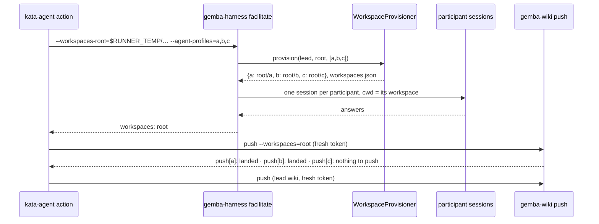

# Design 2380-a: a workspace provisioner in the harness, a multi-clone publish in the wiki

Spec 2380 gives every facilitated-session participant its own workspace. This
design fixes which component creates the workspaces, what each holds, how the
participant wikis publish, and what the two actions pass.

## Component map

```mermaid
graph TD
    subgraph gemba-harness facilitate / discuss
        OPT["--workspaces-root<br/>(default: temp)"] --> PROV["WorkspaceProvisioner"]
        LEAD["lead directory<br/>project checkout + wiki/"] --> PROV
        PROV --> W1["root/&lt;profile-1&gt;<br/>project worktree + wiki clone"]
        PROV --> WN["root/&lt;profile-n&gt;<br/>project worktree + wiki clone"]
        PROV --> MAN["root/workspaces.json"]
        W1 --> P1["participant 1 session"]
        WN --> PN["participant n session"]
        LEAD --> LS["lead session"]
    end
    subgraph post-run (caller)
        MAN --> PUB["gemba-wiki push --workspaces root<br/>fresh token"]
        LEAD --> PUB2["gemba-wiki push<br/>lead wiki"]
    end
```

## Components

| Component                                | Home                                              | Role after this design                                                                                                                                                                                                                                                                      |
| ---------------------------------------- | ------------------------------------------------- | ------------------------------------------------------------------------------------------------------------------------------------------------------------------------------------------------------------------------------------------------------------------------------------------- |
| `WorkspaceProvisioner`                   | `libharness` (new)                                | Takes the lead directory, the root, and the participant names. For each name it adds a detached git worktree of the lead's repository at HEAD under `root/<name>`. When `<lead>/wiki/.git` exists, it clones that directory into `root/<name>/wiki`, sets `origin` to the lead clone's `origin` URL, and copies the clone's `url.*.insteadOf` entries. It writes `root/workspaces.json` (name to path) and returns the map. It runs git as a subprocess and imports nothing from libwiki. |
| `facilitate`, `discuss` commands         | `libharness` commands                             | Resolve `--workspaces-root` (default `$RUNNER_TEMP` or `$TMPDIR` plus `gemba-harness-<pid>`), call the provisioner, and build one participant configuration per name with its own `cwd`. Print `workspaces: <root>` when the session ends. The two commands share one participant-configuration builder. |
| Facilitator, Discusser                   | `libharness`                                      | Unchanged. They already read `config.cwd` per participant.                                                                                                                                                                                                                                  |
| `gemba-wiki push --workspaces <root>`    | `libwiki` push command                            | For each `root/*/wiki/.git`, builds a `WikiSync` over that clone with the workspace as parent, runs the same commit-and-push the bare command runs, and prints `push[<name>]: <outcome>`. It continues past a failure and exits non-zero when any clone failed. Without the flag the command publishes the current directory's wiki as today. |
| `gemba-harness` action                   | `products/gemba/actions/gemba-harness`            | Drops `agent-cwd` from the `facilitate` and `discuss` invocations. Gains a `workspaces-root` input, default `${{ runner.temp }}/gemba-harness-workspaces`, passed to both modes and exposed as an output. Keeps `agent-cwd` for `supervise`.                                               |
| `kata-agent` action                      | `products/kata/actions/kata-agent`                | Passes `workspaces-root` through. Its post-run "Push wiki changes" step runs `push --workspaces=<root>` and then `push`, both under the token that step mints. Documents `agent-cwd` for `supervise` only.                                                                                 |
| kata-session skill and dispatch discipline | `.claude/skills/kata-session`                   | State that each participant has its own HEAD, index, and wiki clone. Keep edit-intent and same-surface serialization for shared wiki rows. Remove the shared-checkout wording.                                                                                                              |
| kata-setup facilitated templates         | `.claude/skills/kata-setup/references`            | Verified to pass no participant directory.                                                                                                                                                                                                                                                  |
| Docs                                     | `gemba-harness` README and action README, `kata-agent` README, Gemba harness page | Describe the workspace per participant, the root option and output, and the two-step publish.                                                                                                                                                              |

## Data flow: one facilitated session in CI



## Key decisions

| Decision                        | Choice                                                                                                      | Rejected                                                                                                                       | Why                                                                                                                                                                                                                                                                            |
| ------------------------------- | ----------------------------------------------------------------------------------------------------------- | ------------------------------------------------------------------------------------------------------------------------------ | ------------------------------------------------------------------------------------------------------------------------------------------------------------------------------------------------------------------------------------------------------------------------------ |
| Isolation unit for the project  | A detached git worktree of the lead's repository.                                                           | A shared-object clone. An empty temporary directory as in `supervise`.                                                         | A worktree costs seconds, shares objects, and keeps participant branches visible to the lead for reconciliation. A shared clone hides those branches and depends on the source's garbage collection. An empty directory holds no project to work in.                           |
| Default and option shape        | Isolation is the only behaviour. `--agent-cwd` is removed from the two modes. `--workspaces-root` names where workspaces live. | Keep `--agent-cwd` as an opt-in shared mode. A list-valued `--agent-cwd` aligned with `--agent-profiles` (#2085).           | The shared default was the defect. A positional list couples two flags and shares by default. A root is the one thing a caller legitimately chooses.                                                                                                                           |
| Wiki per participant            | A local clone of the lead's wiki clone with the lead's remote and transport config.                         | A symlink to the lead's wiki. A git worktree of the wiki. A fresh clone from the remote.                                       | A symlink keeps the shared-tree hazard. libwiki publishes `master` and refuses a detached HEAD, so two worktrees cannot both hold it. A remote clone costs N network clones and needs a credential in the harness. A local clone is instant and inherits the lead's state.       |
| Who publishes participant wikis | The caller, after the session, through `gemba-wiki push --workspaces`.                                      | The harness shells out to `gemba-wiki` at session end. Participant Stop hooks. The harness mints a token.                      | A long session outlives the job-start token, and the post-run step already mints a fresh one. The harness holds no App key. Participant sessions load no project hooks. One home for the publish logic, in libwiki.                                                            |
| Lead directory                  | Unchanged, the caller's directory.                                                                          | A workspace for the lead as well.                                                                                              | One actor moves HEAD there. The lead's wiki is the existing post-run push target.                                                                                                                                                                                              |
| Workspace lifetime              | Workspaces persist after the harness exits. The root is reported.                                           | The harness removes workspaces at session end.                                                                                 | The publish runs after the harness exits. Removal before it loses memory. CI tears the runner down; a local caller removes the root and prunes worktrees.                                                                                                                      |
| Toolchain in a workspace        | The project files and the CLIs on `PATH`. No dependency install.                                            | Run the bootstrap per workspace. Link the lead's dependency tree.                                                              | The participant protocol runs compiled CLIs. A bootstrap per workspace multiplies setup time by N. A link couples every workspace to the lead's install state.                                                                                                                 |
| Same-surface serialization      | Spec 2010 L2 stays.                                                                                         | Drop it, since trees are isolated.                                                                                             | Edits to shared wiki rows still collide at the remote. L2 reduces rebase conflicts and re-apply rounds. Isolation removes the tree hazard; L2 removes the ordering hazard.                                                                                                     |
| Publish failure semantics       | Continue past a failing clone. Exit non-zero when any failed.                                               | Stop at the first failure. Exit zero with per-clone lines only.                                                                | One participant's conflict must not strand the others' memory. A zero exit would hide the refusal in a step no human reads.                                                                                                                                                    |
| Manifest                        | `workspaces.json` in the root, and the directory layout itself.                                             | An action output only.                                                                                                         | Direct CLI callers (the installation in #2084 runs 99 percent of its sessions that way) have no action output. The file and the layout serve every caller.                                                                                                                      |

## Removals

| Removed                                                                     | Home                                                 |
| --------------------------------------------------------------------------- | ---------------------------------------------------- |
| `--agent-cwd` on `facilitate` and `discuss`, and the "shared by participants" help text | `gemba-harness` CLI definition                        |
| The scalar `cwd` parameter and its "shared working directory for all agents" docstring in the participant-configuration builders, and the duplicate builder in `discuss` | `libharness` commands                                |
| `agent-cwd` from the `facilitate` and `discuss` invocations                 | `gemba-harness` action                               |
| The "shared checkout" wording                                               | kata-session skill and dispatch-discipline reference |
| Tests that assert one shared `cwd` across participants                      | `libharness` tests                                   |

## Contracts outside the components

- The facilitator's and discusser's `config.cwd ?? leadCwd` fallback is
  unchanged. It now always receives a value for participants.
- libwiki's commit-and-push semantics in one clone are unchanged. Each
  participant clone is one session under the contract libwiki documents.
- The lead's pre-run and post-run `refresh` and the lead's `push` are
  unchanged.
- The release chain: the `gemba` package carries the CLI change; the
  `gemba-harness` action repins it; the `kata-agent` action repins the
  `gemba-harness` action; consumers repin `kata-agent`.

## Risks

| Risk                                                                                           | Mitigation                                                                                                                       |
| ---------------------------------------------------------------------------------------------- | -------------------------------------------------------------------------------------------------------------------------------- |
| N worktrees and N wiki clones cost disk and time on a large repository.                        | A worktree shares objects, and a local wiki clone hardlinks them. The plan measures this monorepo's seven-participant session.   |
| A participant needs the dependency tree, not only the CLIs.                                    | The participant protocol runs compiled CLIs. A skill that needs more runs the bootstrap in its workspace and says so.            |
| Local worktree registrations accumulate in the lead's repository.                              | The docs name `git worktree prune` after the root is removed.                                                                     |
| A resumed `discuss` run provisions fresh workspaces.                                           | Intended. Every run is a new session, and memory lives in the wiki, not the workspace.                                           |
| A shallow lead checkout.                                                                       | A detached worktree at HEAD needs no history.                                                                                    |
