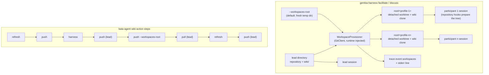

# Design 2380-a: a workspace provisioner in the harness, a multi-clone publish in the wiki

Spec 2380 gives every facilitated-session participant its own workspace. This
design fixes which component creates the workspaces, what each holds, how the
participant wikis publish, and what the two actions pass.

## Component map



## Components

| Component                               | Home                                                                | Role after this design                                                                                                                                                                                                                                                                                      |
| --------------------------------------- | ------------------------------------------------------------------- | ----------------------------------------------------------------------------------------------------------------------------------------------------------------------------------------------------------------------------------------------------------------------------------------------------------- |
| `WorkspaceProvisioner`                  | `libharness` (new class; the harness bin wires it with `GitClient` and `runtime`) | Requires a repository at the lead directory and a `root/<name>` that does not exist. For each participant name it adds a detached worktree of the lead's repository at HEAD. When `<lead>/wiki/.git` exists it clones that directory into `<workspace>/wiki` and sets `origin` to the lead clone's `origin` URL. Returns name to path. It prepares no toolchain. |
| `GitClient`                             | `libutil`                                                           | Gains `worktreeAdd` (detached, at a ref). Existing verbs cover the clone, the URL read, the URL write, and the HEAD read. The mock client lists the new verb.                                                                                                                                                 |
| `facilitate`, `discuss` command runners | `libharness` commands                                               | Resolve `--workspaces-root` (default: the existing `tmpdir(runtime)` helper, hoisted from the benchmark module), call the provisioner with the lead directory (`--facilitator-cwd` in facilitate, the current directory in discuss), and build one participant configuration per name with its own `cwd`. An empty participant list provisions nothing. The exported option parsers stay pure and synchronous. One participant-configuration builder serves both modes and keeps the per-mode rule (facilitate requires profiles, discuss does not). |
| `workspaces` trace event                | `libharness` orchestration loop                                     | A new event type with `workspaces_root` and a name-to-path map, written through the loop's sequence counter and redactor after the loop's opening events, so the discuss `meta` event stays the first line. The same report goes to stderr.                                                                 |
| Facilitator, Discusser                  | `libharness`                                                        | `cwd` becomes required per participant; the fallback to the lead's directory goes. They keep `settingSources: ["project"]`, so each workspace runs the repository's hooks.                                                                                                                                 |
| `gemba-wiki push --workspaces-root`     | `libwiki` push command; one `WikiSync` factory wired in the `gemba-wiki` bin for both the single-wiki and the multi-clone path | Discovers `root/*/wiki/.git` (the `wiki` directory convention the bootstrap and libwiki already share), builds one `WikiSync` per clone through the factory (`wikiDir`, `parentDir`, the shared `resolveToken`), pins the transport rule on each clone, and runs the same commit-and-push as the bare command. Prints `push[<name>]:` followed by the outcome line the bare command prints, or the refusal's own message. Continues past a failure and exits non-zero when any clone failed. An empty or absent root exits zero with `push: no participant workspaces`. The option is exclusive with `--wiki-root`, and the bin skips its no-wiki guard for it. |
| This monorepo's bootstrap               | `scripts/bootstrap.sh`                                              | In a linked worktree, links the primary checkout's `node_modules`, `generated`, and per-library `generated` links instead of installing. Toolchain preparation stays a repository concern, so the Gemba runtime learns nothing about this repository's layout.                                             |
| `gemba-harness` action                  | `products/gemba/actions/gemba-harness`                              | Drops `agent-cwd` from the `facilitate` and `discuss` invocations and passes `--workspaces-root`. Gains the `workspaces-root` input, defaulted in the action's existing temp-path setup step, and the `workspaces-root` output for the two modes. Keeps `agent-cwd` for `supervise` and scopes its description so. Its README shows the post-session publish and the removal step. |
| `kata-agent` action                     | `products/kata/actions/kata-agent`                                  | Passes `workspaces-root` through and adds `gemba-xmr` to the installed CLIs. Pre-run: `refresh`, then `push`. Post-run, every step `if: always()` with wiki on: `push` (lead), `push --workspaces-root=<root>` (the two modes only), `pull`, `refresh`, `push`. Each is one wiki-action step with its own token. Scopes the `agent-cwd` input description to `supervise`. |
| kata-session skill and dispatch discipline | `.claude/skills/kata-session`                                    | State that each participant has its own HEAD, index, files, and wiki clone, and that branches and stash are shared across workspaces of one repository. Keep edit-intent and same-surface serialization for shared wiki rows. Remove every shared-checkout phrase.                                           |
| Docs and skills                         | `gemba-harness` skill CLI reference, both action READMEs, `libharness` README, Gemba coordinate-team and prove-changes pages, `gemba-wiki` skill publish section, `libwiki` README, Gemba wiki-operations page | Describe the workspace per participant, the root option and output, the publish flag, the Stop-hook interplay, and the removal step (`rm -rf <root>` then `git worktree prune`). Replace every `--agent-cwd=.` example for the two modes. |

## Data flow: one facilitated session in CI

```mermaid
sequenceDiagram
    participant A as kata-agent action
    participant W as gemba-wiki (one step each)
    participant H as gemba-harness facilitate
    participant P as WorkspaceProvisioner
    participant S as participant sessions
    A->>W: refresh, then push (lead clone now clean and published)
    A->>H: --workspaces-root=<root> --agent-profiles=a,b,c
    H->>P: provision(lead, root, [a,b,c])
    P-->>H: {a, b, c} → paths; workspaces event emitted
    H->>S: one session per participant, cwd = its workspace
    Note over S: repository hooks prepare the tree and pull the clean clone;<br/>a Stop hook may publish the clone during the session
    S-->>H: answers
    A->>W: push (lead writes, if any)
    A->>W: push --workspaces-root=<root>
    W-->>A: push[a]: committed and pushed · push[b]: nothing to push · push[c]: <refusal>
    A->>W: pull, refresh, push (lead)
```

## Key decisions

| Decision                          | Choice                                                                                                                        | Rejected                                                                                                                                 | Why                                                                                                                                                                                                                                                                                       |
| --------------------------------- | ----------------------------------------------------------------------------------------------------------------------------- | ---------------------------------------------------------------------------------------------------------------------------------------- | ----------------------------------------------------------------------------------------------------------------------------------------------------------------------------------------------------------------------------------------------------------------------------------------- |
| Isolation unit for the project    | A detached git worktree of the lead's repository.                                                                             | A shared-object clone. An empty temporary directory as in `supervise`. A copy of a non-repository lead directory. Extending the benchmark `WorkdirManager`. | A worktree costs seconds, shares objects, and keeps participant branches visible to the lead. A clone hides them and depends on the source's garbage collection. An empty directory holds no project. Sandbox evaluations run through `supervise`, so a copy path has no caller. `WorkdirManager` seeds benchmark cells from a staging directory and manages ports and process groups. |
| Shared git surfaces               | Objects, branches, remote-tracking refs, and stash stay shared. HEAD, index, and files are not.                               | A clone per participant to separate refs too.                                                                                            | The incidents were HEAD, index, and file clobbers. Shared refs let the lead see participant branches. Two workspaces cannot hold one branch, so participants create their own.                                                                                                              |
| Existing workspace path           | Refuse.                                                                                                                       | Reuse the worktree at that path.                                                                                                         | A reused worktree is not at the lead's current commit and carries a stale clone. Workspaces are per session; a caller that names a fixed root clears it first.                                                                                                                             |
| Default and option shape          | Isolation is the only behaviour. `--agent-cwd` is removed from the two modes. `--workspaces-root` names where workspaces live. | Keep `--agent-cwd` as an opt-in shared mode. A list-valued `--agent-cwd` aligned with `--agent-profiles` (#2085).                        | The shared default was the defect. A positional list couples two flags and shares by default. A root is the one thing a caller legitimately chooses.                                                                                                                                       |
| Wiki per participant              | A local clone of the lead's wiki clone with the lead's remote, at the lead clone's commit.                                   | A symlink to the lead's wiki. A git worktree of the wiki. A fresh clone from the remote. An overlay of the lead clone's uncommitted state. | A symlink keeps the shared-tree hazard. libwiki publishes `master` and refuses a detached HEAD, so two worktrees cannot both hold it. A remote clone costs N network clones and a credential in the harness. An overlay would seed every participant's dirty set with foreign content and block its first pull. |
| The pre-run refresh               | `kata-agent` publishes it before the session.                                                                                 | Leave it uncommitted in the lead clone, as today.                                                                                        | An uncommitted refresh would be absent from participant clones and would block the lead's post-session pull, which rebases without autostash.                                                                                                                                             |
| Toolchain in a workspace          | The repository's own session hooks prepare it. This monorepo's bootstrap links the primary checkout's installed and generated trees in a worktree. The platform's CLIs sit on `PATH`. | The provisioner links `node_modules` and `generated`. A full install per workspace.                                       | Linking two directories is a FIT layout baked into the Gemba runtime, and it would still leave this repository's per-library `generated` links missing, so its bootstrap would run codegen N times into one shared tree. An install per workspace multiplies setup time by N. |
| Who publishes participant wikis   | The caller, after the session, through `gemba-wiki push --workspaces-root`. A repository Stop hook may publish a clone earlier. | The harness shells out to `gemba-wiki` at session end. Rely on Stop hooks alone. A caller loop over `push --wiki-root <ws>/wiki`.         | A long session outlives the job-start token, and the wiki action mints a fresh one per step. Stop hooks exist only where a repository defines them and run under the job-start token; the post-session publish is the durable path and is idempotent over clones a hook already pushed. A caller loop is N steps, N mints, and no aggregate exit. |
| Post-session order in `kata-agent` | Lead publish, participant publish, lead pull, refresh, lead publish. One wiki-action step each, all under `always()`.         | Refresh before the participant publish. One step that runs two commands. Skip the first lead publish.                                    | The refresh renders XmR blocks from the lead's CSVs, which receive participant rows only through the remote. The wiki action runs one command per step. A lead that wrote during the session would otherwise block its own pull.                                                            |
| Lead directory                    | Unchanged, the caller's directory.                                                                                            | A workspace for the lead as well.                                                                                                        | One actor moves HEAD there.                                                                                                                                                                                                                                                               |
| Workspace lifetime                | Workspaces persist after the harness exits.                                                                                   | The harness removes workspaces at session end.                                                                                           | The publish runs after the harness exits. Removal before it loses memory.                                                                                                                                                                                                                 |
| Reporting channel                 | A `workspaces` trace event after the loop's opening events, plus a stderr line.                                               | A stdout line. A `workspaces.json` manifest. Reusing the discuss `meta` event.                                                           | Stdout is the NDJSON trace when `--output` is absent. The publish discovers clones by layout, so a manifest has no reader. `meta` exists only in discuss mode and must stay the first line for the trace reader that keys on it.                                                            |
| Publish failure semantics         | Continue past a failing clone. Exit non-zero when any failed. Zero with a notice for an empty root.                           | Stop at the first failure. Exit zero with per-clone lines only. Fail on an empty root.                                                   | One participant's conflict must not strand the others' memory. A zero exit would hide the refusal. A `discuss` run with no participants has no workspaces.                                                                                                                                 |
| Same-surface serialization        | Spec 2010 L2 stays.                                                                                                           | Drop it, since trees are isolated.                                                                                                       | Edits to shared wiki rows still collide at the remote. Isolation removes the tree hazard; L2 removes the ordering hazard.                                                                                                                                                                  |

## Removals

| Removed                                                                                                                      | Home                                                                                                                       |
| ---------------------------------------------------------------------------------------------------------------------------- | -------------------------------------------------------------------------------------------------------------------------- |
| `--agent-cwd` on `facilitate` and `discuss`, and the "shared by participants" help text                                     | `gemba-harness` CLI definition                                                                                             |
| The scalar `cwd` parameter, its "shared working directory for all agents" docstring, and the duplicate builder in `discuss`  | `libharness` commands                                                                                                      |
| The `config.cwd ?? leadCwd` fallback for participants                                                                        | `libharness` facilitator and discusser                                                                                     |
| `agent-cwd` from the `facilitate` and `discuss` invocations, and "facilitate, and discuss" from its description             | `gemba-harness` action, `kata-agent` action, both READMEs                                                                  |
| Every shared-checkout phrase and every `--agent-cwd=.` example the spec's S13 pattern names                                  | kata-session skill and reference, `gemba-harness` skill CLI reference, `libharness` README, Gemba coordinate-team and prove-changes pages |

## Contracts outside the components

- libwiki's commit-and-push semantics in one clone are unchanged. Each
  participant clone is one session under the contract libwiki documents.
- The `gemba-wiki` action is unchanged. Its `command` input carries the flag.
- The `supervise` command and its temporary directory are unchanged.
- The repository's worktree hook places a nested worktree under the primary
  checkout. A participant's `kata-implement` worktree lands there.
- The release chain: `libutil`, `libharness`, and `libwiki` publish; the
  `gemba` package takes them; a gear release ships the binaries;
  `gemba-bootstrap` repins the gear release; the `gemba-harness` action and
  then the `kata-agent` action repin; consumers repin `kata-agent`.

## Risks

| Risk                                                                                                   | Mitigation                                                                                                           |
| ------------------------------------------------------------------------------------------------------ | -------------------------------------------------------------------------------------------------------------------- |
| N worktrees and N wiki clones cost disk and time on a large repository.                                | A worktree shares objects. The wiki is small. The plan measures this monorepo's seven-participant session.           |
| The lead's wiki clone is shallow in CI, so the participant clones are shallow too.                     | libwiki's publish path already handles a shallow clone.                                                              |
| A participant's Stop-hook publish and the post-session publish both touch one clone.                    | The second finds nothing to push, or lands what the first left local.                                               |
| Linked `node_modules` resolves workspace packages to the primary checkout's sources.                    | A participant's in-place library edit is not what `bunx` resolves. Implementation sessions run in a nested worktree with the same property today. |
| A downstream repository without a preparing hook gets a bare worktree.                                  | The platform's CLIs are on `PATH`. The docs name the hook as the place to prepare more.                              |
