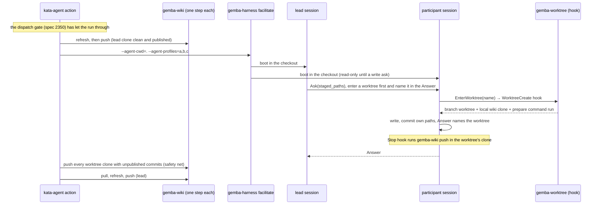

# Design 2380-b: the participant enters its own worktree through a published hook

Alternative to [design-a.md](design-a.md). Same spec, scope, and criteria
([spec.md](spec.md)). Design-a has the harness provision every workspace
before the session and adds a multi-clone publish to the wiki command. This
variant keeps the harness and `gemba-wiki` almost as they are. The participant
creates its workspace with the `EnterWorktree` tool at its first write. The
facilitator tells it to on every write ask. A published `gemba-worktree`
command owns the creation as the repository's `WorktreeCreate` hook, the
repository's own `Stop` hook publishes, and `kata-setup` writes both hooks
downstream. Cost scales with the participants that write, not with the
participant count.

## Component map

```mermaid
graph TD
    subgraph gemba-harness facilitate / discuss
        LEAD["lead directory<br/>repository + wiki/<br/>(--agent-cwd, where all boot)"] --> FAC["lead session<br/>write ask carries<br/>the worktree-first rider"]
        FAC -->|Ask| PART["participant session<br/>EnterWorktree before first write"]
        PART -->|WorktreeCreate hook| GW["gemba-worktree<br/>(gemba bin)"]
        GW --> WT["&lt;primary&gt;/.claude/worktrees/&lt;name&gt;<br/>branch worktree + local wiki clone<br/>+ repository prepare command"]
        WT -->|Stop hook| PUSH["gemba-wiki push<br/>(the worktree's clone)"]
    end
    subgraph kata-agent wiki steps
        PRE1["refresh"] --> PRE2["push"] --> SESSION["harness"] --> POST1["push every worktree clone<br/>with unpublished commits"] --> POST2["pull (lead)"] --> POST3["refresh"] --> POST4["push (lead)"]
    end
```

## Components

| Component | Home | Role after this design |
| --------- | ---- | ---------------------- |
| `gemba-worktree` | `gemba` package bin, plus a `launchers/gemba-worktree` launcher | New command, the generic form of this repository's `scripts/worktree-create.sh`. Hook mode reads the `WorktreeCreate` payload on stdin, prints the worktree path as its only stdout line, and sends every diagnostic to stderr. Command mode takes `create <name> [--base <ref>] [--root <dir>] [--prepare <cmd>]`. Both refuse with a named error outside a repository, find the primary checkout through the common git directory, and hand back a worktree git already registers at that path. Otherwise they create `<primary>/.claude/worktrees/<name>` on branch `<name>` from `--base` (default: the invoking checkout's HEAD), clone `<primary>/wiki` into `<worktree>/wiki` as a local clone with the primary clone's `origin` URL when `<primary>/wiki/.git` exists, run `--prepare` in the worktree last, and tear a half-built worktree down on failure. |
| `GitClient` | `libutil` | Gains `worktreeAdd` (on a new branch, from a ref) and `worktreeList`. The mock client lists the new verbs. |
| Participant tool set | `libharness` agent runner | The default allowed tools gain `EnterWorktree`. `settingSources: ["project"]` stays, so the repository's `WorktreeCreate` and `Stop` hooks fire for a participant. |
| Role prompts | `libharness` profile-prompt trailers | The participant trailer gains one sentence: enter a worktree with `EnterWorktree` before the first write to the project tree or the wiki, and name its path in the Answer. The lead trailer gains one sentence: an ask that has a participant commit tells it to enter a worktree first. These two sentences are Gemba's reinforcement. The rule itself is Kata's. |
| `facilitate`, `discuss` command runners | `libharness` commands | `--agent-cwd` stays as the directory where the lead works and every participant boots. Its help text says so and drops "shared by participants". No provisioner, no root option, no workspaces event. The participant `cwd` fallback to the lead's directory stays. |
| kata-session skill and dispatch discipline | `.claude/skills/kata-session` | Edit-intent gains the worktree-first rule. An ask with a non-empty `staged_paths` tells the receiver to enter a worktree before it stages and to name the worktree path in its Answer. The facilitator treats an Answer to such an ask that names no path as unanswered and re-asks. Receiver side: before its first staged write, `EnterWorktree` with a name unique to the participant and the session (profile name and session date); stage only there; never stash; never write outside it. Rename the "Shared-workspace commit discipline" heading and its anchor together. Same-surface serialization stays. |
| `kata-setup` | `.claude/skills/kata-setup` | Step 1 gains one question: the command that prepares a fresh checkout of the repository (default: none). Step 2 writes `.claude/settings.json` downstream with a `WorktreeCreate` hook (`npx gemba-worktree --prepare '<command>'`) and a `Stop` hook (`npx gemba-wiki push`), and adds `.claude/worktrees/` to `.gitignore`. The facilitated templates are otherwise unchanged. |
| `kata-agent` action | `products/kata/actions/kata-agent` | Pre-run: `refresh`, then `push`. Post-session, every step `if: always()` under the dispatch gate's stood-down guard (spec 2350): one step with its own minted token publishes every `.claude/worktrees/*/wiki` clone that holds unpublished commits through `gemba-wiki push --wiki-root`, continues past a failing clone, prints one line per clone, prints a notice when there is none, and exits non-zero when any failed; then `pull`, `refresh`, `push` as wiki-action steps. `agent-cwd` keeps its default and its description drops "shared". |
| `gemba-harness` action | `products/gemba/actions/gemba-harness` | The `agent-cwd` description names it as the directory where participants boot and the lead works. The README names what a direct caller provides: a `Stop` hook that publishes, or the same post-session worktree publish the `kata-agent` action runs, and the removal step. |
| This repository | `.claude/settings.json`, `scripts/worktree-create.sh` | The `WorktreeCreate` hook becomes `bunx gemba-worktree --prepare 'bash scripts/bootstrap.sh'` and the script goes. `bootstrap.sh` is unchanged: in a worktree it installs as it does for a `kata-implement` worktree today, and its wiki sync finds the clone `gemba-worktree` made. |
| Docs, skills, and goldens | `gemba-harness` skill CLI reference, both action READMEs, `libharness` README, Gemba coordinate-team and prove-changes pages, `gemba-wiki` skill, `libwiki` README, Gemba wiki-operations page, a `gemba-worktree --help` golden | Describe the worktree-first rule, the two hooks, the per-participant wiki clone, the `Stop`-hook publish and the post-session safety net, and the removal step (`git worktree remove <path>` then `git branch -D <name>`). Replace every shared-checkout phrase the spec's S13 pattern names. |

## Data flow: one facilitated session in CI

## Key decisions

| Decision | Choice | Rejected | Why |
| -------- | ------ | -------- | --- |
| Who creates the workspace | The participant, through `EnterWorktree`, served by the repository's `WorktreeCreate` hook. | The harness, before the session (design-a). A participant `git worktree add` plus `cd` from Bash. | The hook is the one place that already knows how to prepare a worktree; design-a adds a marker so the bootstrap behaves differently there. A Bash `cd` leaves Edit, Write, and Glob rooted in the lead's checkout. `EnterWorktree` moves the session. |
| When | Before the participant's first staged write, on the facilitator's write ask. | At boot, for every participant. The participant's own judgment with no dispatch rule. | A storyboard participant that only discusses pays nothing. A participant cannot see a peer's tree, so "do I need isolation" is not its call. The facilitator sees every write it authorises and already classifies asks by edit-intent. |
| Where the rule lives | Kata's dispatch discipline, as a rider on `staged_paths`. Gemba's two role trailers carry one reinforcing sentence each that points at the tool. | The Gemba lead prompt owns the rule. The kata-session skill alone. | Gemba stays agnostic about git topology beyond its own tool. The trailers load at boot, before any skill, so the rule reaches a participant before its inbox triage. A rule the facilitator never reads cannot be checked at dispatch. |
| Enforcement | The facilitator treats a write-ask Answer with no workspace path as unanswered. S7 checks the lead's tree after the session. | No check. A hook that rejects HEAD-moving commands in the lead's checkout. | The check costs one read of an Answer the facilitator reads anyway. The hook is a spec exclusion. |
| Isolation unit | A branch worktree at `<primary>/.claude/worktrees/<name>`. | A detached worktree (design-a). A clone. | `EnterWorktree` and the existing hook create a branch. `gemba-selfedit` refuses a detached HEAD, so a branch lets a participant edit instruction layers in place and push its branch for a change. A clone hides branches from the lead. |
| Base ref | The invoking checkout's HEAD, overridable with `--base`. | `origin/<default>`, as this repository's script does today. | A session participant then lands on the lead's commit (P2) in every environment. An implement session runs from `main`, so `kata-implement` keeps its base. A resumed session on another branch now branches from that branch, which the skill states. |
| Wiki per participant | `gemba-worktree` makes a local clone of the primary checkout's wiki clone, on the publish branch, with the primary's `origin` URL. | A clone from the remote inside the prepare command. A symlink. A git worktree of the wiki. | Same shape and reasons as design-a: no network at creation, no credential in the creator, no shared tree, and libwiki refuses a detached HEAD. The prepare command's `gemba-wiki pull` brings it current. |
| Publish path | The repository's `Stop` hook publishes a participant's clone during the session. One post-session `kata-agent` step lands any worktree clone with unpublished commits. | `gemba-wiki push --workspaces-root` (design-a). The `Stop` hook alone. The harness publishes at session end. | No new `gemba-wiki` surface. The `Stop` hook runs on the session's ambient token, which a long session can outlive, so the post-session step is the safety net with a fresh token. The harness holds no token. |
| Shared-directory option | `--agent-cwd` stays on the two modes as the boot directory. | Remove it (design-a). A list-valued option aligned with `--agent-profiles` (#2085). | The lead works there and participants boot there, so it is a real parameter. A list shares by default. |
| Downstream repositories | `kata-setup` writes the two hooks, the ignore entry, and asks for the prepare command. | Leave `.claude/settings.json` to the operator. | Without the hooks, `EnterWorktree` falls back to a bare worktree with no wiki clone, and participant wiki writes die with the runner. Without the ignore entry, the worktrees show in the lead's `git status` (S7). |
| Toolchain in a worktree | The repository's prepare command, as a `kata-implement` worktree gets today. | Link the primary checkout's trees (design-a). | No marker and no linking rule in the bootstrap. A fresh worktree of this repository installs. The cost is per writing participant, and it is the cost `kata-implement` already pays. |
| Workspace lifetime and names | Worktrees persist. Names carry the profile and the session date. The hook hands back an existing worktree of the same name. | Refuse an existing path (design-a). Remove at session end. | Reuse is what a resumed `kata-implement` session relies on. A same-named worktree from an earlier local session is stale, so the removal step runs after every local session. |
| Same-surface serialization | Spec 2010 L2 stays. | Drop it, since trees are isolated. | Edits to shared wiki rows still collide at the remote. |

## Removals

| Removed | Home |
| ------- | ---- |
| `scripts/worktree-create.sh` | This repository. `gemba-worktree` hook mode replaces it. |
| The "shared by participants" wording on `--agent-cwd` and on the two actions' `agent-cwd` inputs | `gemba-harness` CLI definition, both actions, both READMEs |
| The "Shared-workspace commit discipline" heading and its anchor | kata-session dispatch discipline |
| Every shared-checkout phrase the spec's S13 pattern names | kata-session skill and reference, `gemba-harness` skill CLI reference, `libharness` README, Gemba coordinate-team and prove-changes pages |

## Contracts outside the components

- libwiki's commit-and-push semantics in one clone are unchanged. Each
  participant clone is one session under the contract libwiki documents.
- The `gemba-wiki` action is unchanged.
- The dispatch gate (spec 2350) is unchanged. The new post-session step carries
  its stood-down guard like the steps it joins.
- The `supervise` command and its temporary directory are unchanged.
- The `kata-implement` skill is unchanged. Its `EnterWorktree` now runs through
  `gemba-worktree`, and a participant's implement worktree nests under the
  primary checkout as today.
- The harness keeps `settingSources: ["project"]` for participants. This design
  depends on it.
- The release chain: `libutil` and `libharness` publish; the `gemba` package
  takes them and ships the new bin; the launcher publishes; a gear release ships
  the binaries; `gemba-bootstrap` repins; the `gemba-harness` action and then
  the `kata-agent` action repin; the skills packs ship the kata-session and
  kata-setup changes; consumers repin `kata-agent` and rerun `kata-setup` for
  the hooks.

## Risks

| Risk | Mitigation |
| ---- | ---------- |
| `EnterWorktree` is absent or denied in SDK-driven participant sessions. | The plan's first step verifies it on the pinned SDK. Fallback: the harness calls `gemba-worktree create` per participant before the session, a reduced design-a with no root option, no event, and no multi-clone publish. |
| A participant writes in the lead's checkout before it enters a worktree. | The participant trailer, the write-ask rider, and the Answer check are three independent prompts. S7 makes a lapse visible in the lead's `git status`. The exposure is today's, bounded to that participant. |
| The `Stop` hook's push fails on an expired token. | The post-session step lands the clone with a fresh token. |
| A `Stop` hook fires for a participant still in the lead's checkout. | The lead's clone is clean after the pre-run publish, so the push finds nothing. |
| Local branches and worktrees accumulate. | The removal step names `git worktree remove` and `git branch -D`. |
| A same-named worktree from an earlier local session is reused stale. | Names carry the session date, and the docs run the removal step after every local session. |
| N installs on this repository. | Each writing participant pays one `bootstrap.sh` install, as `kata-implement` does today. The plan measures the seven-participant storyboard. |
