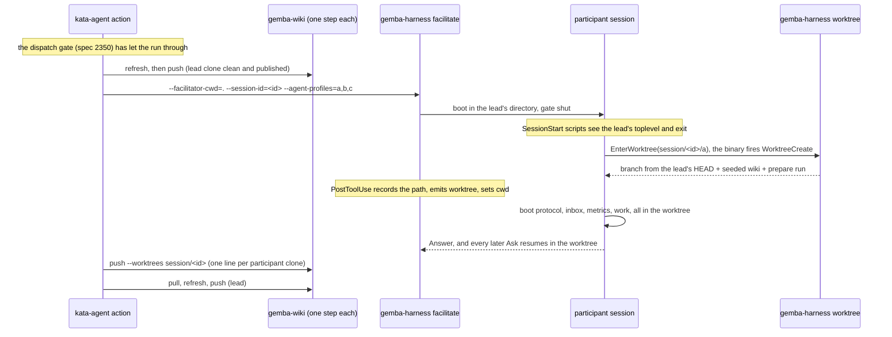

# Design 2380-b: the participant enters its own worktree through the repository's hook

Alternative to [design-a.md](design-a.md). Same spec, scope, and criteria
([spec.md](spec.md)). In design-a the harness provisions every workspace before
the session. In this variant the participant creates its own workspace: its
first action is the `EnterWorktree` tool, which the harness makes available
among the participant's tools, and the Claude binary then fires the
repository's `WorktreeCreate` hook. A `gemba-harness worktree` subcommand serves
that hook and runs the repository's prepare command. The harness records the
worktree the tool returns, resumes every later turn there, and gates writes
until the session sits in it. `gemba-wiki push --worktrees` publishes the
session's participant clones after the session.

## Component map

```mermaid
graph TD
    subgraph gemba-harness facilitate / discuss
        LEAD["lead directory<br/>repository + wiki/<br/>(participants boot here, read-only)"] --> PART["participant session<br/>first action: EnterWorktree"]
        PART -->|binary fires WorktreeCreate| GW["gemba-harness worktree<br/>(reads LIBHARNESS_LEAD_DIR)"]
        GW --> WT["&lt;primary&gt;/.claude/worktrees/session/&lt;id&gt;/&lt;profile&gt;<br/>branch from the lead's HEAD<br/>+ wiki seeded from the lead's clone + prepare"]
        WT -->|PostToolUse: worktreePath| PS["participant session options<br/>record path, resume there,<br/>PreToolUse write gate"]
        PS -.->|cwd on every resume| PART
    end
    subgraph kata-agent wiki steps
        PRE1["refresh"] --> PRE2["push"] --> SESSION["harness --session-id"] --> POST1["push --worktrees session/&lt;id&gt;"] --> POST2["pull (lead)"] --> POST3["refresh"] --> POST4["push (lead)"]
    end
```

## Components

| Component | Home | Role after this design |
| --------- | ---- | ---------------------- |
| `gemba-harness worktree` | `products/gemba` (a module behind the existing `gemba-harness` bin, which already depends on libharness and libwiki) | The generic form of `scripts/worktree-create.sh`. It reads the `WorktreeCreate` payload on stdin, prints the worktree path as its only stdout line, and sends every diagnostic to stderr. Rules, in order: (1) refuse with a named error outside a repository; (2) find the primary checkout through the common git directory; (3) hand back a worktree git already registers at `<primary>/.claude/worktrees/<name>`; (4) attach to branch `<name>` when it exists without a worktree, or create it from the base, retrying once on a git lock error; (5) in a participant session, seed `<worktree>/wiki` from `$LIBHARNESS_LEAD_DIR/wiki` through `WikiSync` in-process; (6) run `--prepare` in the worktree when given; (7) remove a half-built worktree on any failure. |
| Base and seed rule | `gemba-harness worktree` | In a participant session (`LIBHARNESS_LEAD_DIR` set) the base is that directory's HEAD and the seed is its wiki clone, because the binary moves to the primary checkout before it fires the hook. Every other call keeps today's behaviour: `--base` when given, else `origin/main`, then `main`, then `HEAD`, and no seed, so `kata-implement` and agent `isolation: "worktree"` worktrees are unchanged. |
| `GitClient` | `libutil`, mock in `libmock` | Gains `worktreeAdd` (new branch from a ref, or an existing branch), `worktreeList`, `worktreeRemove` (forced), `commonDir`, and `refExists`. The mock lists the five verbs. |
| Local wiki seed | `libwiki` `WikiSync` | `seedFrom(dir)` clones a local wiki clone on the publish branch, sets `origin` to the source clone's `origin` URL, and then runs the `ensureCloned` pin and `inheritIdentity`, as `init` does. No CLI flag: the hook is its one caller. |
| `gemba-wiki push --worktrees <scope>` | `libwiki` `commands/sync.js` | Publishes the `wiki/` clone of each worktree that `git worktree list` registers at a path under `<primary>/.claude/worktrees/<scope>/`, and no other. The path, not the branch, selects, so a participant that switches branch still publishes. It commits pending memory as the bare command does, prints `push[<path>]:` and the outcome line per clone, continues past a failing clone, exits non-zero when any failed, and prints a notice and exits 0 when none matches. It is exclusive with `--wiki-root` and `--paths`. |
| Session id and names | one shared participant builder in `libharness` commands, used by both modes | Replaces the two `parseAgentProfiles` copies. Both modes take `--session-id`, default a fresh `<utc-stamp>-<random>` printed on stderr and in the trace. Each participant's name is `session/<id>/<profile>`. The builder refuses a name over the binary's 64-character limit or a segment outside `[A-Za-z0-9._-]`. |
| `AgentRunner` | `libharness` | Gains two optional deps: `hooks`, passed to every `query()`, and `env`, spread over the process environment so `PATH` and tokens survive. Gains `setCwd(dir)`, which later calls use. `run` and `supervise` pass neither and do not call it. |
| Participant session options | one `libharness` module, used by the facilitator and the discusser | Sets `env` with `LIBHARNESS_AGENT_PROFILE=<profile>` (today participants inherit the lead's value) and `LIBHARNESS_LEAD_DIR=<lead directory>`. Lists `EnterWorktree` in `allowedTools`, so it is pre-approved with the other tools. A `PostToolUse` callback on `EnterWorktree` checks that the returned `worktreePath` is the expected `session/<id>/<profile>` path, records it, emits a `worktree` trace event (S1, S8), and calls `setCwd`. Every later Ask resumes there, because the binary does not restore a worktree on a print-mode resume. |
| Write gate | the same module, as a `PreToolUse` callback | Reads the input's own `cwd`. It denies `Bash`, `Write`, `Edit`, `NotebookEdit`, and `ExitWorktree` until that `cwd` sits in the recorded worktree. After that it denies a file tool whose path leaves the worktree and the system temp directory. The denial names the missing step. When no `WorktreeCreate` hook served the call, the path does not match, so the gate stays shut and names the missing hook. The gate guarantees that nothing writes before entry. `Bash` after entry relies on the protocol. |
| Participant trailers | `libharness` `FACILITATED_AGENT_SYSTEM_PROMPT`, `DISCUSS_AGENT_SYSTEM_PROMPT` | One shared builder replaces both constants. It carries only L0 mechanics: the worktree name, and "call `EnterWorktree` with it before any other tool, after `ToolSearch` loads it when the binary defers it". The lead trailers are unchanged. |
| `facilitate`, `discuss` command runners | `libharness` commands | `--agent-cwd` goes from the two modes, with the scalar `cwd` of profile parsing and its "shared working directory" docstring. Participants boot in the lead's directory through the existing `cwd` fallback. |
| kata-session skill and dispatch discipline | `.claude/skills/kata-session` | The Participant Protocol states the rule and its reason: enter the session worktree first, stage only there, never stash (the stash stack is shared across worktrees), never write outside it, and report a failed entry. The dispatch discipline states that HEAD, index, and files are per participant. Rename "Shared-workspace commit discipline" to "Commit discipline" with its anchor. Edit-intent and same-surface serialization stay. |
| `kata-implement` skill | `.claude/skills/kata-implement` | One sentence: a session already in its worktree creates the implementation branch there (`git switch -c <branch> origin/<default>`), because the binary refuses a second `EnterWorktree`. The worktree mandate is unchanged. |
| `kata-setup` | `.claude/skills/kata-setup` | The parameter sheet gains the prepare command, default `npx apm install` when `.claude/skills/` is untracked, otherwise none. Step 2 writes `.claude/settings.json` with the `WorktreeCreate` entry (`npx gemba-harness worktree`, plus `--prepare` when set) when the file is absent. Otherwise Step 5 merges it: it replaces a `gemba-wiki init` entry and stops with a named conflict on any other. Both paths add `.claude/worktrees/` to `.gitignore`. |
| monorepo-setup wiki reference | `.claude/skills/monorepo-setup/references/wiki-init.md` | Its `WorktreeCreate` default becomes the `gemba-harness worktree` entry, and its `bootstrap.sh` template gains the stand-down guard below, so a new install starts consistent with `kata-setup`. |
| SessionStart stand-down | `scripts/bootstrap.sh`, `products/gemba/actions/gemba-bootstrap/fit-install.sh` | Each exits at once when `LIBHARNESS_LEAD_DIR` is set and `git rev-parse --show-toplevel` equals it, so a participant's boot never syncs or installs in the lead's checkout, whether that checkout is primary or linked. In the participant's worktree both run as usual. |
| `gemba-harness` action | `products/gemba/actions/gemba-harness` | `agent-cwd` defaults to empty, `supervise` falls back to `.`, and the two modes no longer forward it. Gains a `session-id` input (default `<run id>-<run attempt>`) and output. The README shows `push --worktrees session/<id>` through the `gemba-wiki` action, and the removal step. |
| `kata-agent` action | `products/kata/actions/kata-agent` | `agent-cwd` defaults to empty and its description names `supervise` only. It reads the harness action's `session-id` output. Pre-run: `refresh`, then `push`. Post-session, each a `gemba-wiki` action step under `if: always()` and the dispatch gate's stood-down guard (spec 2350): `push --worktrees session/<id>`, `pull`, `refresh`, `push`. |
| This repository | `.claude/settings.json`, `scripts/worktree-create.sh` | The `WorktreeCreate` hook becomes `bunx gemba-harness worktree --prepare 'bash scripts/bootstrap.sh'`, and the script goes. In a participant worktree the prepare step's `gemba-wiki init` finds the seeded clone and its `pull` brings it current. |
| Docs, skills, and goldens | `gemba-harness` skill CLI reference, both action READMEs, `libharness` README, Gemba coordinate-team and prove-changes pages (including their `--agent-cwd=.` examples), `gemba-wiki` skill and exit-code table, `libwiki` README, Gemba wiki-operations page, `gemba-harness worktree --help` and `gemba-wiki push --help` goldens | Describe the first-action rule, the gate and its limit, the hook, the stand-down variable for downstream `SessionStart` hooks, `push --worktrees`, and the removal step (`git worktree remove <path>` then `git branch -D <name>`). Replace every shared-checkout phrase the spec's S13 pattern names. |

## Data flow: one facilitated session in CI

## Key decisions

| Decision | Choice | Rejected | Why |
| -------- | ------ | -------- | --- |
| Who creates the workspace | The participant, through `EnterWorktree`, served by the repository's `WorktreeCreate` hook. | The harness, before the session (design-a). An SDK callback `WorktreeCreate` hook. A Bash `git worktree add` plus `cd`. | The repository hook owns preparation for sessions and `kata-implement` alike. A callback would bypass the repository's prepare command. A Bash `cd` leaves the file tools in the lead's checkout. |
| Where the session works after entry | The harness records the returned path and passes it as `cwd` on every resume. | Trust the binary to restore the worktree. | The binary's print-mode resume does not restore it, and the runner passes the boot directory today. |
| Enforcement | A `PreToolUse` gate keyed on the input's own `cwd` and the recorded path. | A `CwdChanged` callback. The trailer alone. A facilitator check. | `CwdChanged` does not fire for SDK callbacks or for `EnterWorktree`. P1 needs a guarantee, not a prompt. The facilitator holds no trace. |
| When | The first action, before the boot protocol. | The first write ask. | Inbox triage and the storyboard metrics append write before any ask. |
| Where the rule lives | kata-session states it. The trailer carries the name and the call. The gate enforces it. | The trailer states the rule. | Trailers are L0 mechanics. The spec puts the rule in kata-session. |
| Lead directory signal | `LIBHARNESS_LEAD_DIR`, beside the existing `LIBHARNESS_AGENT_PROFILE`. | A `session/` name prefix the hook interprets. The payload's `cwd`. A new `GEMBA_*` family. | The binary moves to the primary checkout before the hook, so the payload's `cwd` is not the lead. An environment value cannot drift from a constant, and a manual `EnterWorktree` outside a session gets today's behaviour. |
| Boot in the lead's checkout | SessionStart scripts stand down when their toplevel is the lead's. | Accept N concurrent syncs there. Stand down in any non-linked checkout. | The first is a shared-surface writer. The second misses a lead that runs in a linked worktree. |
| Isolation unit | A branch worktree under `session/<id>/<profile>`. | A detached worktree (design-a). A clone. | `gemba-selfedit` refuses a detached HEAD. A clone hides branches from the lead. |
| Names | `session/<id>/<profile>`, one id per session. | Profile and date. | Two sessions on one day would reuse a stale tree, and the publish needs a per-session scope. |
| Wiki per participant | Seeded in-process from the lead's clone. | A clone from the remote. A symlink. Seeding every worktree. | A local seed needs no credential at creation. A symlink shares the tree. Seeding only participant worktrees leaves `kata-implement` as it is. |
| Publish selection | Worktree path under `session/<id>/`, through the `gemba-wiki` action. | Branch prefix. Every registered worktree. An inline action loop. | A participant that switches branch keeps its path. Every worktree would publish unrelated sessions' memory. An inline loop mints its own token and is copied by every direct caller. |
| Hook command home | A `worktree` subcommand behind `gemba-harness`, in the `gemba` package. | A new CLI. libharness. | No new bin, launcher, or tool entry. The `gemba` package already depends on libwiki, so the seed runs in-process with no cycle. |
| Shared-directory option | Removed from the two modes, with an empty action default. | Keep `--agent-cwd` as the boot directory. | In `facilitate` the lead runs at `--facilitator-cwd`, so a kept option names only a directory participants share (P8). |
| Same-surface serialization | Spec 2010 L2 stays. | Drop it. | Edits to shared wiki rows still collide at the remote. |

## Removals

| Removed | Home |
| ------- | ---- |
| `scripts/worktree-create.sh` | This repository. `gemba-harness worktree` replaces it. |
| `--agent-cwd` on `facilitate` and `discuss`, its "shared by participants" help text, and the two `parseAgentProfiles` copies with their scalar `cwd` | `gemba-harness` CLI definition, `libharness` commands, `gemba-harness` skill CLI reference |
| The `FACILITATED_AGENT_SYSTEM_PROMPT` and `DISCUSS_AGENT_SYSTEM_PROMPT` constant exports | `libharness` index; the shared trailer builder replaces them |
| The `.` default of `agent-cwd`, and the two modes from its description | `gemba-harness` action, `kata-agent` action, both READMEs |
| The "Shared-workspace commit discipline" heading and its anchor | kata-session dispatch discipline |
| Every shared-checkout phrase the spec's S13 pattern names, and every `--agent-cwd=.` example in a `facilitate` or `discuss` invocation | kata-session skill and reference, `gemba-harness` skill CLI reference, `libharness` README, Gemba coordinate-team and prove-changes pages |

## Contracts outside the components

- libwiki's commit-and-push semantics in one clone are unchanged. Each
  participant clone is one session under the contract libwiki documents.
- The `gemba-wiki` action is unchanged. Its `command` input carries the flag.
- The dispatch gate (spec 2350) is unchanged. The new step carries its
  stood-down guard like the steps it joins.
- The `supervise` command and its temporary directory are unchanged.
- The `shared-workspace-staging` invariant stays. L1's path-scoped staging is
  still the rule inside each worktree.
- The release chain: `libutil`, `libmock`, `libwiki`, and `libharness`
  publish; the `gemba` package takes them; a gear release ships the binaries;
  `gemba-bootstrap` repins; the `gemba-harness` action and then the
  `kata-agent` action repin; the skill packs ship the kata-session,
  kata-implement, kata-setup, and monorepo-setup changes; consumers repin
  `kata-agent` and rerun `kata-setup`.

## Risks

| Risk | Mitigation |
| ---- | ---------- |
| The pinned binary differs from what this design reads in it: `EnterWorktree` is withheld, the hook does not fire under the SDK, `PostToolUse` omits `worktreePath`, a resume rejects a moved `cwd`, or the hook times out during an install. | The plan's first step probes each on the pinned SDK. A failed probe selects design-a. This design has no hybrid fallback. |
| `Bash` after entry can still reach the lead's checkout (`git -C`, `cd ..`). | The gate guarantees no write before entry and bounds the file tools. kata-session states the rule, and S7 makes a lapse visible. |
| Seven concurrent installs on this repository. | Each participant pays one `bootstrap.sh` install, as `kata-implement` does. The plan measures the storyboard against the hook timeout. |
| Concurrent hooks contend on the shared git directory. | Distinct branches and paths, and one retry on a lock error. |
| A downstream `SessionStart` hook that predates the guard writes in the lead's checkout. | `kata-setup` and monorepo-setup ship the guard, and the docs name the variable. The gate holds the participant's own tools meanwhile. |
| The CI lead wiki clone is shallow, so each seed is shallow. | libwiki's publish path already handles a shallow clone. |
| Local branches and worktrees accumulate. | The docs name the removal step. Session ids never repeat, so no stale tree is reused. |
