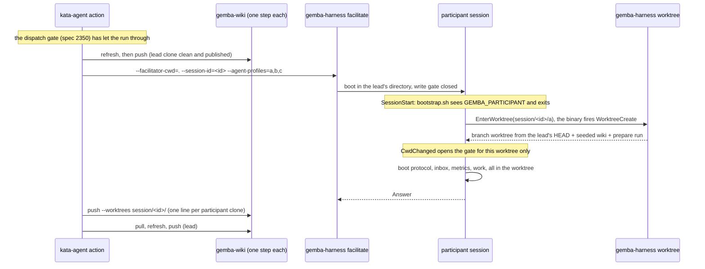

# Design 2380-b: the participant enters its own worktree through the repository's hook

Alternative to [design-a.md](design-a.md). Same spec, scope, and criteria
([spec.md](spec.md)). In design-a the harness provisions every workspace before
the session. In this variant the participant creates its own workspace: its
first action is the `EnterWorktree` tool, which the harness makes available
among the participant's tools, and the Claude binary then fires the
repository's `WorktreeCreate` hook. A `gemba-harness worktree` subcommand serves
that hook and runs the repository's prepare command. A harness-owned write gate
holds every write tool until the session sits in its own worktree, so isolation
does not rest on the model's compliance. `gemba-wiki push --worktrees` publishes
the session's participant clones after the session.

## Component map

```mermaid
graph TD
    subgraph gemba-harness facilitate / discuss
        LEAD["lead directory<br/>repository + wiki/<br/>(participants boot here, read-only)"] --> PART["participant session<br/>first action: EnterWorktree"]
        GATE["write gate<br/>(SDK PreToolUse + CwdChanged callbacks)"] -.->|holds Bash, Write, Edit| PART
        PART -->|binary fires WorktreeCreate| GW["gemba-harness worktree"]
        GW --> WT["&lt;primary&gt;/.claude/worktrees/session/&lt;id&gt;/&lt;profile&gt;<br/>branch worktree from the lead's HEAD<br/>+ wiki seeded from the lead's clone + prepare"]
        WT -->|CwdChanged| GATE
    end
    subgraph kata-agent wiki steps
        PRE1["refresh"] --> PRE2["push"] --> SESSION["harness --session-id"] --> POST1["push --worktrees session/&lt;id&gt;/"] --> POST2["pull (lead)"] --> POST3["refresh"] --> POST4["push (lead)"]
    end
```

## Components

| Component | Home | Role after this design |
| --------- | ---- | ---------------------- |
| `gemba-harness worktree` | `libharness` `commands/worktree.js`, behind the existing `gemba-harness` bin | The generic form of `scripts/worktree-create.sh`. It reads the `WorktreeCreate` payload on stdin, prints the worktree path as its only stdout line, and sends every diagnostic to stderr. Rules, in order: (1) refuse with a named error outside a repository; (2) find the primary checkout through the common git directory; (3) hand back a worktree git already registers at `<primary>/.claude/worktrees/<name>`; (4) attach to branch `<name>` when it exists without a worktree, or create it from the base, retrying once on a git lock error; (5) when the payload's `cwd` holds `wiki/.git`, seed `<worktree>/wiki` by running `gemba-wiki init --from <cwd>/wiki`; (6) run `--prepare` in the worktree when given; (7) remove a half-built worktree on any failure. |
| Base ref rule | `gemba-harness worktree` | A name under the exported `SESSION_WORKTREE_PREFIX` (`session/`) branches from the HEAD of the payload's `cwd`, which is the lead's commit (P2). Every other name keeps today's chain: `--base` when given, else `origin/main`, then `main`, then `HEAD`. `kata-implement` worktrees keep their base. |
| Session id and names | `facilitate`, `discuss` command runners | Both modes take `--session-id`, default a fresh time-and-random id printed on stderr. Each participant's worktree name is `session/<id>/<profile>`, built from the one prefix constant the hook reads. |
| `GitClient` | `libutil`, mock in `libmock` | Gains `worktreeAdd` (new branch from a ref, or an existing branch), `worktreeList`, `worktreeRemove` (forced), and `commonDir`. The mock lists the four verbs. |
| Local wiki seed | `libwiki` `WikiSync`, `gemba-wiki init --from <dir>` | Clones a local wiki clone on the publish branch and sets `origin` to the source clone's `origin` URL. Then it runs the same `ensureCloned` pin and `inheritIdentity` step as `init`. The hook is its caller. libharness takes no libwiki dependency, because libwiki already depends on libharness. |
| `gemba-wiki push --worktrees <prefix>` | `libwiki` push command | Publishes the `wiki/` clone of each worktree that `git worktree list` registers on a branch under `<prefix>`, and no other. It commits pending memory as the bare command does. It prints `push[<branch>]:` and the outcome line per clone, continues past a failing clone, exits non-zero when any failed, and prints a notice and exits 0 when no worktree matches. It is exclusive with `--wiki-root` and `--paths`. |
| Participant session options | `libharness` facilitator and discusser (not the shared `AgentRunner` defaults) | `allowedTools` gains `EnterWorktree` and `ExitWorktree`, so the binary offers and pre-approves them with the other tools. `env` gains `GEMBA_PARTICIPANT=<profile>`. `settingSources: ["project"]` stays, so the binary fires the repository's hooks. `run` and `supervise` are untouched. |
| Write gate | `libharness`, passed as SDK `hooks` callbacks on each participant query | A `CwdChanged` callback records the session's directory. A `PreToolUse` callback denies `Bash`, `Write`, `Edit`, and `NotebookEdit` until that directory is the participant's own `session/<id>/<profile>` worktree, and after that denies a file tool whose path leaves it. The denial names the `EnterWorktree` call. Read tools, `ToolSearch`, the worktree tools, and the orchestration tools pass. A participant whose `EnterWorktree` fails stays read-only and answers with the error. |
| Participant trailers | `libharness` `FACILITATED_AGENT_SYSTEM_PROMPT` and `DISCUSS_AGENT_SYSTEM_PROMPT`, each becoming a builder | L0 mechanics only: the session's worktree name, and "call `EnterWorktree` with it before any other tool, after `ToolSearch` loads it when the binary defers it". The lead trailers are unchanged. |
| `facilitate`, `discuss` command runners | `libharness` commands | `--agent-cwd` goes from the two modes, with the scalar `cwd` of `parseAgentProfiles` and its "shared working directory" docstring. Participants boot in the lead's directory through the existing `cwd` fallback. The binary restores the worktree session on every resume. |
| kata-session skill and dispatch discipline | `.claude/skills/kata-session` | The Participant Protocol states the rule and its reason: enter the session worktree first, stage only there, never stash, never write outside it, and report a failed entry rather than work around it. The dispatch discipline states that HEAD, index, and files are per participant. Rename "Shared-workspace commit discipline" to "Commit discipline" with its anchor; edit-intent and same-surface serialization stay in it. |
| `kata-implement` skill | `.claude/skills/kata-implement` | One sentence: a session already in its worktree creates the implementation branch there (`git switch -c <branch> origin/<default>`) instead of a second `EnterWorktree`, which the binary refuses. One participant then holds one tree and one wiki clone. The worktree mandate is unchanged. |
| `kata-setup` | `.claude/skills/kata-setup` | The parameter sheet gains the prepare command, default `npx apm install` when `.claude/skills/` is untracked, otherwise none. Step 2 writes `.claude/settings.json` with the `WorktreeCreate` entry (`npx gemba-harness worktree`, plus `--prepare` when set) when the file is absent. Otherwise Step 5 merges it: it replaces a `gemba-wiki init` entry (the monorepo-setup default), stops with a named conflict on any other, and adds `.claude/worktrees/` to `.gitignore`. |
| `gemba-harness` action | `products/gemba/actions/gemba-harness` | `agent-cwd` defaults to empty, and `supervise` falls back to `.`. The action fails when `agent-cwd` is non-empty with the two modes and passes `--session-id`. The README shows the `push --worktrees session/<id>/` step through the `gemba-wiki` action and the removal step. |
| `kata-agent` action | `products/kata/actions/kata-agent` | `agent-cwd` defaults to empty and its description names `supervise` only. It passes `<run id>-<run attempt>` as the session id. Pre-run: `refresh`, then `push`. Post-session, each a `gemba-wiki` action step under `if: always()` and the dispatch gate's stood-down guard (spec 2350): `push --worktrees session/<id>/`, `pull`, `refresh`, `push`. |
| This repository | `.claude/settings.json`, `scripts/worktree-create.sh`, `scripts/bootstrap.sh` | The `WorktreeCreate` hook becomes `bunx gemba-harness worktree --prepare 'bash scripts/bootstrap.sh'`, and the script goes. `bootstrap.sh` exits at once when `GEMBA_PARTICIPANT` is set and the checkout is not a linked worktree, so a participant's boot never syncs or installs in the lead's checkout. In its worktree it installs as a `kata-implement` worktree does today. |
| Docs, skills, and goldens | `gemba-harness` skill CLI reference, both action READMEs, `libharness` README, Gemba coordinate-team and prove-changes pages, `gemba-wiki` skill and exit-code table, `libwiki` README, Gemba wiki-operations page, `gemba-harness worktree --help` and `gemba-wiki push --help` goldens | Describe the first-action rule, the write gate, the hook, `GEMBA_PARTICIPANT` for downstream `SessionStart` hooks, `push --worktrees`, and the removal step (`git worktree remove <path>` then `git branch -D <name>`). Replace every shared-checkout phrase the spec's S13 pattern names. |

## Data flow: one facilitated session in CI

## Key decisions

| Decision | Choice | Rejected | Why |
| -------- | ------ | -------- | --- |
| Who creates the workspace | The participant, through `EnterWorktree`, served by the repository's `WorktreeCreate` hook. | The harness, before the session (design-a). A Bash `git worktree add` plus `cd`. | The hook is the repository's one owner of worktree preparation, for sessions and `kata-implement` alike. A Bash `cd` leaves the file tools rooted in the lead's checkout. `EnterWorktree` moves the whole session. |
| Enforcement | A write gate in SDK hook callbacks the harness owns. | The trailer alone. A facilitator check of each Answer. | P1 requires the workspace before the first write, and a prompt cannot guarantee that. The facilitator holds no trace and no Bash, so it cannot check. Callbacks run under `bypassPermissions` and outside the model. |
| When | The first action, before the boot protocol. | The facilitator's first write ask. | Inbox triage and the storyboard metrics append write before any ask. |
| Where the rule lives | kata-session states it. The trailer carries only the name and the call. The gate enforces it. | The trailer states the rule. | Trailers are L0 mechanics. The spec puts the rule in kata-session. |
| Boot in the lead's checkout | `GEMBA_PARTICIPANT` lets `SessionStart` hooks stand down there. | Accept N concurrent syncs and installs in the lead's tree. | That is a shared-surface writer. The variable is the one signal a repository hook can read before the first action. |
| Resume | The binary restores the worktree session from the transcript. | The runner tracks `cwd` from tool results. | The binary already persists and restores it, and the runner keeps one option set per session. The gate's `CwdChanged` record covers a lapse. |
| Isolation unit | A branch worktree under `session/<id>/<profile>`. | A detached worktree (design-a). A clone. | `gemba-selfedit` refuses a detached HEAD, so a branch lets a participant edit instruction layers in place. A clone hides branches from the lead. |
| Base ref | The lead's HEAD for `session/` names, today's chain for every other name. | The lead's HEAD for every name. | The payload carries only a name and a `cwd`. One exported prefix keeps `kata-implement` on its base. |
| Names | `session/<id>/<profile>`, with one id per session (the run id in CI). | Profile and date. | Two sessions on one day would reuse a stale tree, and the publish needs a per-session scope. |
| Wiki per participant | Seeded from the lead directory's clone through `gemba-wiki init --from`. | Seed from the primary checkout's clone. A clone from the remote. A symlink. | A lead in a linked worktree holds its own clone (S3). A local seed needs no network and no credential. libwiki owns branch, origin, and the transport pin. A symlink shares the tree. |
| Publish path | `gemba-wiki push --worktrees <session prefix>` through the `gemba-wiki` action. | Every registered worktree. An inline action loop. A root-based flag (design-a). | Every worktree would publish unrelated sessions' memory, which is the sweep spec 2010 L1 removed. An inline loop mints its own token and is copied by every direct caller. |
| Hook command home | A `worktree` subcommand of `gemba-harness`. | A new `gemba-worktree` CLI. | It ships on links that already exist: no new bin, launcher, or bootstrap tool entry. |
| Shared-directory option | Removed from the two modes, with an empty action default. | Keep `--agent-cwd` as the boot directory. | In `facilitate` the lead runs at `--facilitator-cwd`, so a kept option names only a directory participants share (P8). |
| Downstream repositories | `kata-setup` merges one `WorktreeCreate` entry and the ignore entry. No `Stop` hook. | Also write a `Stop` publish hook. | `push --worktrees` lands every participant clone. The ignore entry keeps worktrees out of the lead's `git status` (S7). |
| Same-surface serialization | Spec 2010 L2 stays. | Drop it. | Edits to shared wiki rows still collide at the remote. |

## Removals

| Removed | Home |
| ------- | ---- |
| `scripts/worktree-create.sh` | This repository. `gemba-harness worktree` replaces it. |
| `--agent-cwd` on `facilitate` and `discuss`, its "shared by participants" help text, and the scalar `cwd` of `parseAgentProfiles` | `gemba-harness` CLI definition, `libharness` commands, `gemba-harness` skill CLI reference |
| The `.` default of `agent-cwd`, and the two modes from its description | `gemba-harness` action, `kata-agent` action, both READMEs |
| The "Shared-workspace commit discipline" heading and its anchor | kata-session dispatch discipline |
| Every shared-checkout phrase the spec's S13 pattern names | kata-session skill and reference, `gemba-harness` skill CLI reference, `libharness` README, Gemba coordinate-team and prove-changes pages |

## Contracts outside the components

- libwiki's commit-and-push semantics in one clone are unchanged. Each
  participant clone is one session under the contract libwiki documents.
- The `gemba-wiki` action is unchanged. Its `command` input carries the flag.
- The dispatch gate (spec 2350) is unchanged. The new step carries its
  stood-down guard like the steps it joins.
- The `supervise` command and its temporary directory are unchanged.
- The `shared-workspace-staging` invariant stays. L1's path-scoped staging is
  still the rule inside each worktree.
- The release chain: `libutil`, `libmock`, `libwiki`, and `libharness`
  publish; the `gemba` package takes them; a gear release ships the binaries;
  `gemba-bootstrap` repins; the `gemba-harness` action and then the
  `kata-agent` action repin; the skill packs ship the kata-session,
  kata-implement, and kata-setup changes; consumers repin `kata-agent` and
  rerun `kata-setup`.

## Risks

| Risk | Mitigation |
| ---- | ---------- |
| The binary behaves differently under the SDK: it defers or withholds `EnterWorktree`, skips the hook, needs workspace trust, does not restore the worktree on resume, prompts to keep or remove at exit, does not fire `CwdChanged`, or times the hook out during an install. | The plan's first step probes each on the pinned SDK before other work. A failed probe selects design-a. This design has no hybrid fallback. |
| Seven concurrent installs on this repository. | Each participant pays one `bootstrap.sh` install, as `kata-implement` does. The plan measures the seven-participant storyboard against the hook timeout. |
| Concurrent hooks contend on the shared git directory. | Distinct branches and paths, and one retry on a lock error. |
| A downstream `SessionStart` hook writes in the lead's checkout. | The docs name `GEMBA_PARTICIPANT` as the signal to stand down. The write gate holds the participant's own tools meanwhile. |
| The CI lead wiki clone is shallow, so each seed is shallow. | libwiki's publish path already handles a shallow clone. |
| Local branches and worktrees accumulate. | The docs name the removal step. Session ids never repeat, so no stale tree is reused. |
