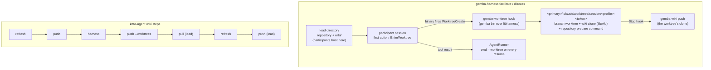
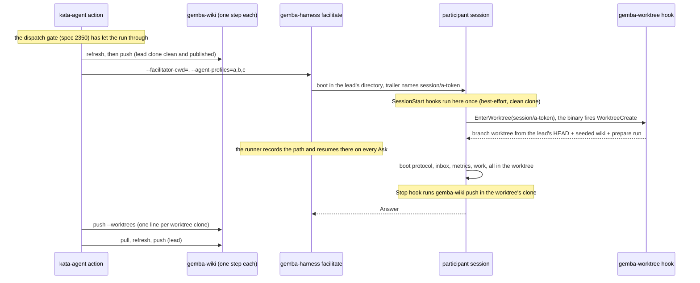

# Design 2380-b: the participant enters its own worktree through a published hook

Alternative to [design-a.md](design-a.md). Same spec, scope, and criteria
([spec.md](spec.md)). In design-a the harness provisions every workspace before
the session. In this variant the participant creates its own workspace. The
harness offers the `EnterWorktree` tool among the participant's tools, and the
participant trailer makes that call the participant's first action, before the
boot protocol reads or writes anything. The Claude binary then fires the
repository's `WorktreeCreate` hook. A published `gemba-worktree` command serves
that hook, and the repository's prepare command readies the tree. The runner
keeps the session in the worktree on every resume. The repository's `Stop` hook
publishes the worktree's wiki during the session, and `gemba-wiki push
--worktrees` lands the rest after it. `kata-setup` writes both hooks
downstream.

## Component map

## Components

| Component | Home | Role after this design |
| --------- | ---- | ---------------------- |
| `gemba-worktree hook` | `libharness` `commands/worktree.js`, a thin `gemba` package bin, a `launchers/gemba-worktree` launcher, and gemba-bootstrap's default tool set | The generic form of `scripts/worktree-create.sh`. It reads the `WorktreeCreate` payload on stdin, prints the worktree path as its only stdout line, and sends every diagnostic to stderr. Rules, in order: (1) refuse with a named error outside a repository; (2) find the primary checkout through the common git directory; (3) hand back a worktree git already registers at `<primary>/.claude/worktrees/<name>`; (4) attach to branch `<name>` when the branch exists without a worktree, or create it from the base; (5) seed `<worktree>/wiki` from `<primary>/wiki` through libwiki when `<primary>/wiki/.git` exists; (6) run `--prepare` in the worktree when given; (7) remove a half-built worktree on any failure. |
| Base ref rule | `gemba-worktree hook` | A name under `session/` branches from the invoking checkout's HEAD, so a participant lands on the lead's commit (P2). Every other name branches from `--base`, default `origin/<default branch>`, which is this repository's rule today. `kata-implement` worktrees keep their base. |
| `GitClient` | `libutil`, mock in `libmock` | Gains `worktreeAdd` (new branch from a ref, or an existing branch), `worktreeList`, and `worktreeRemove` (forced). The mock lists the three verbs. |
| Local wiki seed | `libwiki` `WikiSync`, `gemba-wiki init --from <dir>` | Clones a local wiki clone on the publish branch, sets `origin` to the source clone's `origin` URL, and writes the identity `insteadOf` pin and the committer identity that `ensureCloned` writes. `gemba-worktree` calls it in-process. Wiki layout and transport stay in libwiki. |
| `gemba-wiki push --worktrees` | `libwiki` push command | Publishes the `wiki/` clone of every worktree that `git worktree list` registers for the checkout, at any depth, the lead's own checkout excluded. It commits pending memory as the bare command does. It prints `push[<name>]:` and the outcome line per clone, continues past a failing clone, exits non-zero when any failed, and prints a notice and exits 0 when no worktree holds a clone. It is exclusive with `--wiki-root` and `--paths`. |
| Participant tool set | `libharness` agent runner | The default participant tools list `EnterWorktree` and `ExitWorktree`, so the binary offers them with the other tools. No participant disallow list removes them. `settingSources: ["project"]` stays, so the binary fires the repository's hooks. |
| Worktree tracking | `libharness` `AgentRunner` | The runner reads its own stream for a successful `EnterWorktree` or `ExitWorktree` result and passes the resulting directory as `cwd` on the next resume, so a later Ask resumes in the worktree. The tool call and its result are in the trace and name the workspace (S1, S8). |
| Role trailers | `libharness` `FACILITATED_AGENT_SYSTEM_PROMPT` and its discuss counterpart | Both participant trailers share one sentence constant: the first action is `EnterWorktree` with the name `session/<profile>-<token>`. The harness fills `<token>` once per session. The trailer forbids `stash` and writes outside the worktree. The lead trailers are unchanged. |
| `facilitate`, `discuss` command runners | `libharness` commands | `--agent-cwd` goes from the two modes. Participants boot in the lead's directory (`--facilitator-cwd` in facilitate, the current directory in discuss) through the existing `cwd` fallback. No provisioner, no root option, no workspaces event. |
| kata-session dispatch discipline | `.claude/skills/kata-session` | Owns one check and points at the trailer for the rule: the facilitator treats an Answer from a participant whose trace has no worktree entry as unanswered and re-asks. Rename the "Shared-workspace commit discipline" heading to "Per-participant worktree discipline" and retarget its anchor and every inbound link together. Same-surface serialization stays. |
| `kata-implement` skill | `.claude/skills/kata-implement` | One sentence: a session already in a worktree calls `ExitWorktree` with `keep` before its `EnterWorktree`, because the binary refuses a nested entry. The worktree mandate is unchanged. |
| `kata-setup` | `.claude/skills/kata-setup` | Step 1 gains one question: the command that prepares a fresh checkout (default: none). Step 2 merges two hook entries into `.claude/settings.json`: `WorktreeCreate` runs `npx gemba-worktree hook`, plus `--prepare '<command>'` only when one is given, and `Stop` runs `npx gemba-wiki push`. It creates the file when absent, keeps every other key and hook, and stops with a named conflict when a different `WorktreeCreate` hook exists. It adds `.claude/worktrees/` to `.gitignore`. |
| `kata-agent` action | `products/kata/actions/kata-agent` | Pre-run: `refresh`, then `push`. Post-session, each a `gemba-wiki` action step under `if: always()` and the dispatch gate's stood-down guard (spec 2350): `push --worktrees`, then `pull`, `refresh`, `push`. `agent-cwd` stays for `supervise` and its description says so. |
| `gemba-harness` action | `products/gemba/actions/gemba-harness` | Drops `agent-cwd` from the `facilitate` and `discuss` invocations and fails when it is set with either mode. The README shows the `push --worktrees` step through the `gemba-wiki` action and the removal step. |
| This repository | `.claude/settings.json`, `scripts/worktree-create.sh` | The `WorktreeCreate` hook becomes `bunx gemba-worktree hook --prepare 'bash scripts/bootstrap.sh'`, and the script goes. `bootstrap.sh` is unchanged. In a worktree it installs as it does for a `kata-implement` worktree today, and its wiki sync finds the seeded clone. |
| Docs, skills, and goldens | `gemba-harness` skill CLI reference, both action READMEs, `libharness` README, Gemba coordinate-team and prove-changes pages, `gemba-wiki` skill and exit-code table, `libwiki` README, Gemba wiki-operations page, `gemba-worktree --help` and `gemba-wiki push --help` goldens | Describe the first-action rule, the two hooks, the per-participant wiki clone, the `Stop`-hook publish, `push --worktrees`, and the removal step (`git worktree remove <path>` then `git branch -D <name>`). Replace every shared-checkout phrase the spec's S13 pattern names. |

## Data flow: one facilitated session in CI

## Key decisions

| Decision | Choice | Rejected | Why |
| -------- | ------ | -------- | --- |
| Who creates the workspace | The participant, through `EnterWorktree`, which the binary serves with the repository's `WorktreeCreate` hook. | The harness, before the session (design-a). A participant `git worktree add` plus `cd` from Bash. | The hook is the repository's one owner of worktree preparation, for sessions and for `kata-implement` alike. A Bash `cd` leaves Edit, Write, and Glob rooted in the lead's checkout. `EnterWorktree` moves the whole session. |
| When | The participant's first action, before the boot protocol. | On the facilitator's first write ask. | Boot writes before any ask: inbox triage writes `MEMORY.md`, and every storyboard participant appends a metrics CSV before it answers. |
| Where the rule lives | The participant trailer, which loads before any skill. kata-session owns only the facilitator's check. | The kata-session skill. A rider on every write ask. | A skill loads after boot. One home for the rule and one for its check keeps the four trailers and the skill from drifting. |
| Enforcement | The facilitator's check reads the trace, not Answer prose. S7 checks the lead's tree after the session. | No check. A hook that rejects HEAD-moving commands. | The tool result is a structured trace entry. The hook is a spec exclusion. |
| Resume | The runner resumes in the directory the last worktree tool result named. | Trust the binary to restore the worktree on resume. | Every resume passes `cwd`, and the runner passes the boot directory today. |
| Isolation unit | A branch worktree at `<primary>/.claude/worktrees/session/<profile>-<token>`. | A detached worktree (design-a). A clone. | `gemba-selfedit` refuses a detached HEAD, so a branch lets a participant edit instruction layers in place and push for a change. A clone hides branches from the lead. |
| Base ref | Invoking HEAD for `session/` names, `origin/<default>` for every other name. | Invoking HEAD for every name. | One hook serves both callers, and the payload carries only a name. The prefix keeps `kata-implement` on its base. |
| Names | `session/<profile>-<token>`, with the token minted once per session by the harness. | Profile and date. | Two sessions on one day would share a branch on the remote and reuse a stale tree. |
| Wiki per participant | Seeded from the primary checkout's clone through libwiki. | A clone from the remote. A symlink. A git worktree of the wiki. | A local seed needs no network and no credential. libwiki owns layout, branch, and the transport pin, so a downstream repository with no prepare command still pushes. A symlink shares the tree. libwiki refuses a detached HEAD, so two worktrees cannot both hold its branch. |
| Publish path | The `Stop` hook during the session. `gemba-wiki push --worktrees` after it, through the `gemba-wiki` action. | An inline loop in `kata-agent`. A root-based flag (design-a). The `Stop` hook alone. | An inline loop would mint its own token and be copied by every direct caller. Discovery through `git worktree list` needs no root and no glob. A long session can outlive the `Stop` hook's token. |
| Shared-directory option | Removed from the two modes. Participants boot in the lead's directory. | Keep `--agent-cwd` as the boot directory. | In `facilitate` the lead runs at `--facilitator-cwd`, so a kept option would name only a directory the participants share (P8). |
| Toolchain in a worktree | The repository's prepare command, as a `kata-implement` worktree gets today. | Link the primary checkout's trees (design-a). | No marker and no linking rule in the bootstrap. The cost is one install per participant, the cost `kata-implement` already pays. |
| Downstream repositories | `kata-setup` merges the two hooks and the ignore entry. | Leave `.claude/settings.json` to the operator. | Without the hook, `EnterWorktree` makes a bare worktree with no wiki clone. Without the ignore entry, worktrees show in the lead's `git status` (S7). |
| Same-surface serialization | Spec 2010 L2 stays. | Drop it. | Edits to shared wiki rows still collide at the remote. |

## Removals

| Removed | Home |
| ------- | ---- |
| `scripts/worktree-create.sh` | This repository. `gemba-worktree hook` replaces it. |
| `--agent-cwd` on `facilitate` and `discuss`, and its "shared by participants" help text | `gemba-harness` CLI definition, `gemba-harness` skill CLI reference |
| `agent-cwd` from the two modes' invocations, and the two modes from its description | `gemba-harness` action, `kata-agent` action, both READMEs |
| The "Shared-workspace commit discipline" heading and its anchor | kata-session dispatch discipline |
| Every shared-checkout phrase the spec's S13 pattern names | kata-session skill and reference, `gemba-harness` skill CLI reference, `libharness` README, Gemba coordinate-team and prove-changes pages |

## Contracts outside the components

- libwiki's commit-and-push semantics in one clone are unchanged. Each
  participant clone is one session under the contract libwiki documents.
- The `gemba-wiki` action is unchanged. Its `command` input carries the flag.
- The dispatch gate (spec 2350) is unchanged. The new step carries its
  stood-down guard like the steps it joins.
- The `supervise` command and its temporary directory are unchanged.
- The harness keeps `settingSources: ["project"]` for participants. This design
  depends on it.
- The release chain: `libutil`, `libmock`, `libwiki`, and `libharness`
  publish; the `gemba` package ships the new bin; the launcher publishes; a gear
  release ships the binaries; `gemba-bootstrap` adds `gemba-worktree` to its
  default tools and repins; the `gemba-harness` action and then the
  `kata-agent` action repin; the skill packs ship the kata-session,
  kata-implement, and kata-setup changes; consumers repin `kata-agent` and
  rerun `kata-setup`.

## Risks

| Risk | Mitigation |
| ---- | ---------- |
| The binary behaves differently under the SDK: the tool is not offered, the hook does not fire, the result has no path, `ExitWorktree` prompts, or the `Stop` hook runs outside the worktree. | The plan's first step probes each on the pinned SDK before any other work. Fallback: the harness runs `gemba-worktree` per participant before boot, which reduces to design-a with this design's hook and publish. |
| `SessionStart` hooks run once per participant in the lead's checkout, before the first action. | In this repository that run installs nothing and its wiki sync fast-forwards a clean, published clone, and both steps are best-effort. The plan measures concurrent boots on the storyboard. |
| A participant writes before it enters a worktree. | The trailer orders the call first, the facilitator's check re-asks, and S7 makes a lapse visible. The exposure is today's, bounded to that participant. |
| Concurrent `WorktreeCreate` hooks contend on the shared git directory. | Each hook adds a distinct branch and path. The hook retries a lock failure once before it tears down. |
| The `Stop` hook's push fails on an expired token. | `push --worktrees` lands the clone with a fresh token. |
| The `Stop` hook now runs in every downstream session, matrix shifts included. | A clone with nothing to publish prints its no-change line. |
| N installs on this repository. | One `bootstrap.sh` install per participant, as `kata-implement` pays today. The plan measures the seven-participant storyboard. |
| Local branches and worktrees accumulate. | The docs name the removal step. Session names never repeat, so no stale tree is reused. |
