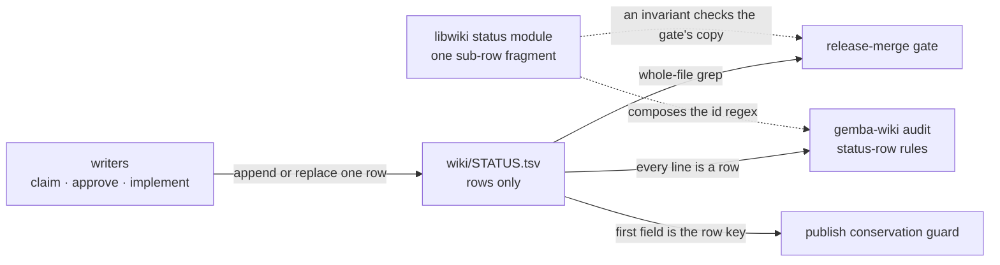
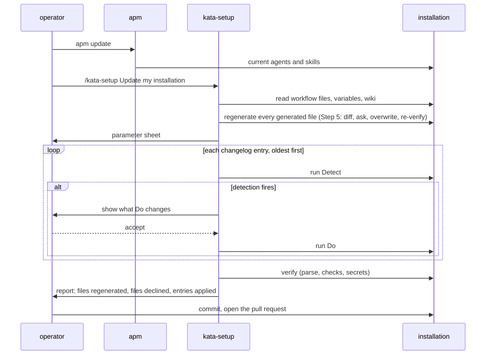

# Design 2390-a: the ledger joins the data path, and the update procedure runs on detections

Spec 2390 makes the approval ledger a rows-only file with one grammar home, and
gives an installation one procedure for taking a convention change. This design
fixes the components, the two data flows, the budgets each instruction change
must meet, and what each change removes.

## Components

| Component                   | Home                                                                                                                       | Role after this design                                                                                                                                                                                                                                                                                                                                                                              |
| --------------------------- | -------------------------------------------------------------------------------------------------------------------------- | --------------------------------------------------------------------------------------------------------------------------------------------------------------------------------------------------------------------------------------------------------------------------------------------------------------------------------------------------------------------------------------------------- |
| Ledger file                 | `wiki/STATUS.tsv`                                                                                                          | Rows only. A newline ends a row, the final newline opens no row, a final line without one is a row, and empty text holds no rows. The scaffold and the first changelog entry are the only creators. A writer appends the row it does not find and replaces the row it finds. The ledger stays off the publish path's singleton set, so a conflicting row is a conflict refusal.                       |
| Ledger name                 | `libwiki` constants module                                                                                                 | One exported constant holds the approval ledger's file name, beside the memory ledger's constant. The admission grammar's named-ledger set and the audit's ledger load read it. No module spells the approval ledger's name otherwise. The other ledgers' literals are not this spec's.                                                                                                              |
| Row grammar                 | `libwiki` status module and the audit's `status-row` rules                                                                 | The one home. The module exports the sub-row fragment `(/\d{2})?` as a string, composes the id regex `^(\d{4}<fragment>\|exp:\d+)$` from it, and exports a gate-pattern string composed from the same fragment. The parser becomes a kind classifier that validates the id and exposes no fields, because the rules read cells. The `id-format` message and hint derive from the fragment. The loader takes every line as a row, so an empty line is a `status-row.shape` finding. |
| Gate-pattern check          | `.jidoka/invariants`                                                                                                       | A rule that imports the library's gate-pattern string and asserts the release-merge skill's Step 6 carries it, as the model-defaults rule does for model ids. It lands with the instruction change, since it passes only when both sides agree.                                                                                                                                                      |
| Admission and publish path  | `libwiki` audit scopes and publish module                                                                                  | The admission grammar admits the ledger by the name constant. One non-markdown predicate serves the publish path and the audit's conflict subject, so the per-file classifier skip, the publish rule's ledger clause, and the subject's hard-coded fence flag go. The conservation row key stays the first tab field. Every comment that spells the old name goes with it.                            |
| `gemba-wiki push --remove`  | `libwiki` push command                                                                                                     | A repeatable `--remove=<path>`, wiki-relative like `--paths`. It deletes the path from the clone when present, joins it to the write-set, and declares the removal through the publish object's removal-intent method, so the conservation guard lets the deletion land. A path absent from the clone and from the remote tip is a usage error, as a pathspec that matches nothing is. It combines with `--paths`. |
| Merge gate read             | `kata-release-merge` Step 6, the experiment path, and Step 9                                                               | Step 6 reads `grep -P "^${spec_id}(/\d{2})?\t" wiki/STATUS.tsv`, and any non-zero exit, including the exit an absent file produces, is an absent row. The experiment path reads `exp:{issue}` the same way, and its state table stays as the writers' rules it is. The roll-up sentence moves from Step 6 to Step 9, which writes the master row's terminal transition.                             |
| Writer surfaces             | Team protocol § Approval; the work-trackers reference; `kata-spec`, `kata-design`, `kata-plan`, `kata-release-merge` and its comment-gate, metrics, and templates references, `kata-archive`, `kata-session`, `ship-it`; product-manager and archivist profiles | Name the file. Show the literal row each writes. The protocol keeps the writers' rules and points at the audit for the id forms and the row kinds. `kata-spec` stops on an absent ledger. `kata-archive` names `--remove`. The templates reference and the work-trackers reference sit at their word caps and take a word-neutral rename. |
| Scaffold                    | `monorepo-setup` skill, wiki-init and repo-skeleton references                                                             | Scaffold an empty `STATUS.tsv`. The scaffolded index page links it by file name, because a `.tsv` is not a page the hosted wiki lists; the memory page stays a bold name. The wiki-init reference sits at its line cap, and the old scaffold block pays for the new one.                                                                                                                          |
| Docs                        | KATA.md § Shared Memory, § Trust Boundary, § Approval Signal; `www.kata.team` approval-gates, continuous-improvement, spec-to-shipped, findings-to-action, team-memory, getting-started; `references/CLAUDE.md`; `gemba-wiki` skill, CLI help golden, `www.gemba.team` wiki-operations | Name the file and its shape. The approval-gates page drops the fence sentence and keeps its lifecycle legend. The getting-started page gains the two update commands and the pack-manager floor. The `gemba-wiki` skill sits at its line cap; its pathspec paragraph takes the `--remove` sentence and gives up its rationale clause. The help golden and the wiki-operations page gain the option. |
| Update procedure            | `kata-setup` skill                                                                                                         | The frontmatter description and `## When to Use` gain the update. One step, triggered by the `Update my installation` prompt, in the order the diagram shows. A fresh setup runs the detection loop last. Step 5's own rerun covers verification during regeneration; Step 3 runs once more after the loop because entries change files.                                                              |
| Changelog                   | `kata-setup` `references/changelog.md`                                                                                     | A header line that states the shape, then one table, newest first, columns Change, Detect, Do. No dates and no versions. Detect is a file test or a command run in the installation. Do is `gemba-*` commands, file edits, and questions to the operator. At most eight entries of at most eighty words. The first entry is spec item 11, with `--remove` for the old file and `--paths` for the index page, the memory page, and the new file. |
| Obligation                  | `.claude/skills/CLAUDE.md`, `libraries/CLAUDE.md`                                                                          | The skills CLAUDE.md gains the section that defines a convention an installation carries and states the same-change rule, idempotence, the cap, and retirement. The libraries CLAUDE.md gains one sentence that points at it, so a library change meets the rule.                                                                                                                                  |

## Data flow: readers of the ledger

## Data flow: the update procedure

## Key decisions

| Decision                                            | Choice                                                                                                   | Rejected                                                                                                | Why                                                                                                                                                                                                                                                                              |
| --------------------------------------------------- | -------------------------------------------------------------------------------------------------------- | ------------------------------------------------------------------------------------------------------- | -------------------------------------------------------------------------------------------------------------------------------------------------------------------------------------------------------------------------------------------------------------------------------- |
| Comments in the ledger                              | None. Every line is a row.                                                                               | `#` comment lines for a header.                                                                         | A comment line is prose again, and every reader must skip it. The grammar home documents the file.                                                                                                                                                                               |
| File name                                           | `STATUS.tsv`, spelled once in the library.                                                               | `STATUS.md` with the prose removed. The name spelled in each module that needs it.                      | A `.md` stays markdown to the publish path and the hosted wiki. One constant keeps the admission and the load in step.                                                                                                                                                           |
| Row shapes                                          | Unchanged: three cells for a spec row, four for an experiment row.                                       | Four columns for every row with a `-` placeholder.                                                      | The id namespace selects the kind, and every reader already splits on tab and keys on the first cell. A fixed width rewrites 266 rows and every writer instruction for no reader.                                                                                                |
| Sub-row grammar                                     | `NNNN/NN`, the plan part number, as one exported fragment.                                               | Keep the named unit the parser accepts. Two literals, one in the id regex and one in a gate string.      | The live ledger holds numeric parts only, and the part file `plan-a-NN.md` is the referent. Two literals in the library would drift as the four prose homes did.                                                                                                                 |
| Parser shape                                        | A kind classifier that validates the id.                                                                 | Keep the structured fields.                                                                             | No module reads a field. The audit rules read cells, and the only caller reads the kind.                                                                                                                                                                                         |
| Gate-pattern parity                                 | A repository invariant compares the skill's text with the library's export.                              | A library test that holds its own copy. A library test that reads the skill file.                       | A test's copy checks the copy, not the gate. A library test that reads an instruction file crosses layers. The invariant kit already compares instruction text with library constants.                                                                                           |
| Ledger creation                                     | The scaffold and the first changelog entry only. The entry also fires on a wiki clone with no ledger. A writer that finds none stops and names the update procedure. | A writer creates the file with its first row.                                                           | Claims live in the ledger before their spec directories exist, so no writer can derive a safe id from an empty ledger. A stop that names the procedure closes the window the cutover opens. A wiki made by `gemba-wiki init` holds no ledger, so the entry's second condition gives a fresh installation its empty ledger.                                                                                       |
| Fallback read                                       | None.                                                                                                    | Read the old file when the new one is absent.                                                           | A fallback keeps the fence code the spec removes. An absent ledger blocks every gated merge, which is loud, and the conversion is one changelog entry.                                                                                                                             |
| Removing the old file                               | `gemba-wiki push --remove`, the CLI face of the publish object's removal-intent method.                  | Raw git in the wiki. A rename commit. Leave an empty old file.                                          | The guard refuses a whole-file deletion unless declared, and nothing exposes the declaration today. Raw git bypasses every guard. A rename passes only when git pairs the delete with the add, which this repository's ledger does and a three-row installation's does not. An empty file fails S1. |
| Update detection                                    | Each entry detects its own state in the installation.                                                    | A version marker the procedure compares against.                                                        | A marker is a second home for state and is wrong after a hand edit. A detection reads the installation and is idempotent by construction, so the procedure keeps no record.                                                                                                        |
| First entry's detection and collision rule          | The old file exists, or the wiki clone exists without the new file. An id in both ledgers keeps the rows-only row and is reported. | Detect only when the new file is absent. The markdown row wins.                                         | A write between the pack update and the procedure could create the new file with a row, and the narrower detection would never fire. The rows-only row is the newer write.                                                                                                      |
| Changelog ordering and retention                    | Newest first by position, applied oldest first, no dates or versions, at most eight entries of eighty words. | A date column. A count cap alone. Newest-first application.                                          | The genericity invariant rejects a literal date in a published skill. The reference budget is words, so the entry bound is what keeps the file inside it. An older entry can be a newer one's precondition.                                                                       |
| Regeneration in the update                          | Step 5's rule with every generated file named.                                                           | A second regeneration rule in the update step.                                                          | Step 5 already overwrites an existing file after a read-back diff and an ask. The update supplies the trigger, not a new rule.                                                                                                                                                   |
| Making room in `kata-setup`                         | Delete the Killswitch paragraph outright and move the Timezone rule to the schedules reference.          | Trim the new step. Move both paragraphs into references.                                                | Every killswitch sentence already has a home: the checklist, Step 6, the guard-parameter rows, the watchdog skill, the `kata-agent` action docs, and the team protocol. The timezone rule has none, and the schedules and agent-parameter references already point at it, so the move flips two pointers with one token each. |
| Making room in the skills CLAUDE.md                 | Fold the two link-policy sections into one pointer that keeps the same-commit rule.                      | Trim the obligation. Drop the sections without a pointer.                                               | The products and libraries CLAUDE.md files own the link policy and the root CLAUDE.md the host map, so the fold loses nothing. The same-commit rule has no other home, so the pointer carries it.                                                                                 |
| Making room in the `gemba-wiki` skill               | The pathspec paragraph's rationale clause goes.                                                          | Drop a line elsewhere in the skill.                                                                     | The clause explains a rule the sentence before it already states. Every other line of the skill carries a command or an exit code.                                                                                                                                                |

## Removals

| Removed                                                                                                      | Replaced by                                                              |
| ------------------------------------------------------------------------------------------------------------ | ------------------------------------------------------------------------ |
| `wiki/STATUS.md`: the header prose, the merge-gate notes, and the fence                                      | `wiki/STATUS.tsv`                                                        |
| The fence-aware loop in the audit's ledger loader                                                            | Every line is a row                                                      |
| The ledger's per-file classifier skip, the ledger clause of the publish fence rule, and the audit subject's hard-coded fence flag | One non-markdown predicate                                     |
| `STATUS.md` in the admission grammar's named-ledger set, every old-name spelling in the library's comments, and the singleton-set promise for the ledger | The name constant, and the conflict-refusal decision   |
| The named-unit branch of the id regex, the parser's structured fields, and the literal id spelling in the `id-format` message and hint | The exported fragment and a kind classifier               |
| The `(/[a-z0-9-]+)?` pattern in the gate, and the roll-up sentence in Step 6                                  | `(/\d{2})?` under the invariant, and the roll-up sentence in Step 9      |
| The grammar sentences in the team protocol, the fence sentence on the approval-gates page, and the old ledger's header | The audit, and the writers' rules the protocol keeps           |
| The `STATUS.md` scaffold block in the wiki-init reference, and the bold name on the scaffolded index page    | An empty `STATUS.tsv` and a link                                         |
| The Timezone and Killswitch paragraphs of `kata-setup` Step 2                                                | The timezone rule in the schedules reference; nothing for the killswitch |
| The `## Documentation section` and `## Parity with CLIs` sections of the skills CLAUDE.md                   | One pointer sentence that keeps the same-commit rule                     |
| The rationale clause of the `gemba-wiki` skill's pathspec paragraph                                          | The `--remove` sentence                                                  |
| `scripts/spec-1060-migrate-wiki.mjs`                                                                         | Nothing. It has no caller.                                               |

## Contracts outside the components

| Contract                | What it needs                                                                                                                                                                                                                                                                                                                                                         |
| ----------------------- | --------------------------------------------------------------------------------------------------------------------------------------------------------------------------------------------------------------------------------------------------------------------------------------------------------------------------------------------------------------------- |
| Instruction budgets     | `kata-setup` `SKILL.md`, the skills CLAUDE.md, the `gemba-wiki` skill, and the wiki-init reference sit at or within a few words of their caps, and the agent-parameter reference within six words. The removals above make room, the pointer flip there is one token, and `jidoka instructions` is the proof. The libraries CLAUDE.md has room for its sentence.      |
| Skill genericity        | The changelog names `wiki/` paths and `gemba-*` commands only. No entry names this repository, a spec number, an issue, a date, or a version.                                                                                                                                                                                                                         |
| Spec 2360               | Its setup part is on `main`. The update step reuses its Step 2 read-back and its Step 5 rule.                                                                                                                                                                                                                                                                         |
| Release chain           | Two merges. The first: `libwiki` publishes, the `gemba` package takes it, a gear release ships the binary, `gemba-bootstrap` and `kata-agent` repin, and this repository's workflows repin `kata-agent`. The second: the instructions, the pack, and the invariant. The operator's own `gemba-wiki` resolves from npm; an installation's CI binary follows its action pin. |
| Conservation            | The first entry's publish declares the old file's removal and lands the two pages and the new file under `--paths`. A pull before the conversion keeps the clone current. On a refusal, the operator resets the clone to the remote tip, which restores the old file, and re-runs the entry.                                                                           |
| Cutover here            | This repository's wiki is untracked. The second merge's pull request carries the first entry's steps, and the release engineer that merges it runs them after the merge. Between the two, the gate blocks and nothing is wrong.                                                                                                                                        |
| PR #2180                | Open and human-authored. The implementation comments on it and on the two issues. Closing it is the author's call.                                                                                                                                                                                                                                                    |
| Enumeration             | No sibling-action fence, topic, or workflow name changes.                                                                                                                                                                                                                                                                                                              |

## Risks

| Risk                                                                                   | Mitigation                                                                                                                                         |
| -------------------------------------------------------------------------------------- | ------------------------------------------------------------------------------------------------------------------------------------------------- |
| The hosted wiki renders no page for a `.tsv`.                                          | The index page links the file by its relative name, which the hosted wiki redirects to the raw file, as it does for the metrics CSVs today.      |
| An operator edits the ledger by hand and leaves an empty or malformed line.            | The audit reports the line. The gate's anchored read ignores it.                                                                                   |
| The new library is silent on an unconverted ledger.                                    | The gate's block names the absent file, and the first changelog entry's Detect names the old one.                                                  |
| An installation's CI binary rejects the new file until its regenerated workflows merge. | The operator's one pull request carries the repin. The window is the operator's review.                                                           |
| A convention moves under `.claude/agents` or a library.                                | The obligation names the agent files, and the libraries CLAUDE.md points at it.                                                                    |
| An installation is older than the changelog window.                                    | The oldest entry's detection firing makes the procedure say so and name the pack's history.                                                        |
| A changelog entry's Do is wrong for one installation.                                  | Entries are idempotent, so a corrected entry in the next pack re-runs cleanly. The report names every entry applied.                               |
