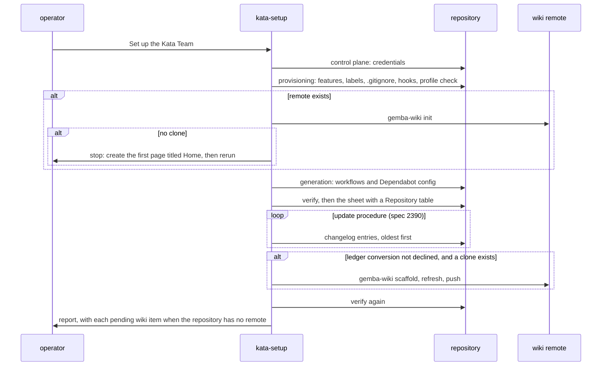
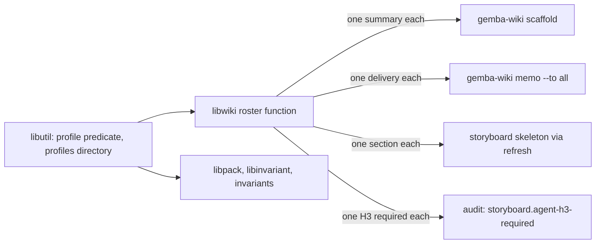

# Design 2400-a: the library scaffolds, setup provisions, and the packs cite only what exists

Spec 2400 makes the two setup skills the creators of every surface a pack reads,
and strips the packs of every surface they do not create. This design fixes the
components, the two data flows, the budgets, and the removals. It lands after
both merges of spec 2390 and rebases onto them. It names `kata-setup` steps by
their titles, because both specs renumber them.

## Components

| Component           | Home                                                                                                                                                                                    | Role after this design                                                                                                                                                                                                                                                                                                                                                                                                                                                                                                                                                                                                                                                                                                                                                                                                                                                                                                                                                                                                                                                                                                                                                                                                                                                                                                                              |
| ------------------- | --------------------------------------------------------------------------------------------------------------------------------------------------------------------------------------- | --------------------------------------------------------------------------------------------------------------------------------------------------------------------------------------------------------------------------------------------------------------------------------------------------------------------------------------------------------------------------------------------------------------------------------------------------------------------------------------------------------------------------------------------------------------------------------------------------------------------------------------------------------------------------------------------------------------------------------------------------------------------------------------------------------------------------------------------------------------------------------------------------------------------------------------------------------------------------------------------------------------------------------------------------------------------------------------------------------------------------------------------------------------------------------------------------------------------------------------------------------------------------------------------------------------------------------------------------- |
| Profile predicate   | `@forwardimpact/libutil`                                                                                                                                                                | One exported predicate: a `.md` file whose frontmatter carries `name` and `description` is a profile. One exported constant names the runtime profiles directory. `libpack`, `libinvariant`, and the two `.jidoka` invariants that test profiles import the predicate, and their private copies go. `libwiki` and `libharness` import the directory constant, and every spelling of it in those libraries and the invariants goes. The pack install target stays `libpack`'s own.                                                                                                                                                                                                                                                                                                                                                                                                                                                                                                                                                                                                                                                                                                                                                                                                                                                                   |
| Roster              | `libwiki` agent-roster module                                                                                                                                                           | One function lists the profiles under the directory with the predicate. The roster key is the file stem with any `.agent` suffix removed, and a profile whose `name` differs from its key is reported. An absent directory is an empty roster. `memo`, the audit context, the marker migrator, and the scaffold read the roster. Every context builder resolves the directory from the project root the audit already finds.                                                                                                                                                                                                                                                                                                                                                                                                                                                                                                                                                                                                                                                                                                                                                                                                                                                                                                                        |
| Scaffold            | `libwiki` scaffold command                                                                                                                                                              | Create each absent named ledger from a constant template: the index page, the memory ledger, and the approval ledger under the name 2390 exports. Append each absent block the library owns: the surface list and ledger link on the index page, the priorities table and Active Claims block on the memory ledger. Create one absent summary per roster agent from a template that passes every `summary.*` rule and carries the memo marker: the summary-class H1 in Title Case of the key, the last-run line, `## Message Inbox` first with the marker under it, `## Open Blockers` last. Never change a line the scaffold did not write. Report each write.                                                                                                                                                                                                                                                                                                                                                                                                                                                                                                                                                                                                                                                                                     |
| Init                | `libwiki` init command                                                                                                                                                                  | Clone the wiki when absent, with exit 0 and a message that names the cause when it cannot. Nothing else. The metrics loop, the skills option, the skill-roster module, the Active Claims append, the merge-attribute write, and the help and hint texts that name them go; the publish path keeps writing that attribute.                                                                                                                                                                                                                                                                                                                                                                                                                                                                                                                                                                                                                                                                                                                                                                                                                                                                                                                                                                                                                           |
| Admitted names      | `libwiki` constants, audit grammar, audit scopes                                                                                                                                        | One exported set holds the root names the library writes outside the summary class: the index page, the memory ledger, the approval ledger 2390 exports, the merge-attribute file, and the secret-overrides log. The grammar admits the set. The scopes module's excluded-bases set reads its markdown members. The collision ledger keeps its summary-class admission.                                                                                                                                                                                                                                                                                                                                                                                                                                                                                                                                                                                                                                                                                                                                                                                                                                                                                                                                                                             |
| Storyboard skeleton | `libwiki` storyboard skeleton and `refresh`; the `kata-session` storyboard template and team-storyboard reference                                                                       | The skeleton takes the roster and renders one `### <agent>` section per profile under Current Condition. Its placeholder prose names no agent. `refresh` passes the roster when it creates the month's board. Both references say, in a line-neutral edit, that `refresh` seeds the agent sections and participants seed metric blocks under their own. The current-month audit hint names `refresh`.                                                                                                                                                                                                                                                                                                                                                                                                                                                                                                                                                                                                                                                                                                                                                                                                                                                                                                                                               |
| Storyboard rule     | `libwiki` audit rule builders                                                                                                                                                           | The H3 requirement is built from the roster the audit context carries. The literal list and the facilitator exemption go. An empty roster requires no section, and the audit's checked line shows zero sections.                                                                                                                                                                                                                                                                                                                                                                                                                                                                                                                                                                                                                                                                                                                                                                                                                                                                                                                                                                                                                                                                                                                                    |
| Provisioning        | `kata-setup`: a provisioning step after the control-plane step; references `labels.md`, `gitignore.md`, `settings-hooks.md`; `parameters-guard.md § Repository`; the Prerequisites list | The prerequisites name `jidoka-setup` for the root layers. The step is two sentences that point at the references. The references hold the label table with its idempotence rule, the ignore block and the hooks block under the Dependabot merge rule. The hooks are SessionStart (the pinned toolchain installer, `scripts/bootstrap.sh` when present, `gemba-wiki init`, `gemba-wiki pull`), WorktreeCreate (`gemba-wiki init`), and Stop (`gemba-wiki push`), bare commands after the installer, with the installer pin a `derived:` row that every setup run re-resolves. The step enables the wiki and Discussions, creates each absent label from the vocabulary plus `agent:<name>` per agent on the sheet, merges the ignore entry and the hooks, confirms each agent on the sheet has a profile under the profiles directory (this check replaces the verify step's profile bullet), and, when a remote exists, runs `gemba-wiki init` and tests for the clone; no clone stops the run with the first-page instruction. The guard-parameter reference gains one sheet row per item with Home `repository · <field>`, `.gitignore · wiki/`, `.claude/settings.json · hooks`, or `label · *`, and the "change no other existing file" sentence, the sheet step's table rule, and the Value checklist item each gain the repository objects. |
| Update and scaffold | `kata-setup` update procedure (from 2390) and report step                                                                                                                               | After the changelog loop, unless the ledger-conversion entry was declined, the scaffold, `gemba-wiki refresh`, and `gemba-wiki push` run, then the verify step runs once more. The changelog gains one entry: Detect a board that lacks a profile's section, Do append the sections.                                                                                                                                                                                                                                                                                                                                                                                                                                                                                                                                                                                                                                                                                                                                                                                                                                                                                                                                                                                                                                                                |
| Bootstrap guard     | `gemba-bootstrap` action and README, the `kata-agent` action comment, MONOREPO.md                                                                                                       | The bootstrap step runs only when `scripts/bootstrap.sh` exists, as the pack steps guard on `apm.yml`. The three documents call the script optional and name both runners.                                                                                                                                                                                                                                                                                                                                                                                                                                                                                                                                                                                                                                                                                                                                                                                                                                                                                                                                                                                                                                                                                                                                                                          |
| Check homes         | `jidoka-setup` Step 4 and a new `references/check-ci.md`                                                                                                                                | When the repository has no manifest for its package manager, the step writes one that holds the check task and the CLI dependency, and nothing else. When no workflow runs the check task, the step writes one from the reference: push and pull request triggers, SHA-pinned actions, the check task, and the same `github-actions` Dependabot entry `kata-setup` merges, under the same rule, so a repository with both packs holds one entry.                                                                                                                                                                                                                                                                                                                                                                                                                                                                                                                                                                                                                                                                                                                                                                                                                                                                                                    |
| Topic pool          | `kata-documentation` SKILL.md and its standards and source-of-truth references                                                                                                          | The topic table names each topic's surface and a presence rule. Root instruction layers are always in the pool; READMEs, further root markdown, and site topics join when their surface exists. A site surface is a directory named `docs` at the root or up to two levels below it. The build step becomes the repository's check command. The cross-page rule re-runs the shell examples the pages carry. The writing section names page kinds by audience, not this repository's tiers, and the commit scope is `docs`. The standards reference keeps the audience and writing rules and drops this repository's tier list, product vocabulary, layouts, and page names. The source-of-truth table names kinds of source. The metrics reference names the running agent's summary.                                                                                                                                                                                                                                                                                                                                                                                                                                                                                                                                                               |
| Metrics citation    | 14 `references/metrics.md`, 14 `## Memory` sections, the team-storyboard and source-of-truth references                                                                                 | The header reads: record with `gemba-xmr record`, at the cadence each reference already states. Every other `KATA.md` sentence goes.                                                                                                                                                                                                                                                                                                                                                                                                                                                                                                                                                                                                                                                                                                                                                                                                                                                                                                                                                                                                                                                                                                                                                                                                                |
| Genericity contract | `.claude/skills/CLAUDE.md` and the genericity invariant                                                                                                                                 | The surface list holds five names and the placeholder list drops `websites/<site>`. The invariant gains a deny pattern for `KATA.md` and widens its site pattern to any `websites/` path. Its header comment names the five surfaces and drops the stale profile note.                                                                                                                                                                                                                                                                                                                                                                                                                                                                                                                                                                                                                                                                                                                                                                                                                                                                                                                                                                                                                                                                              |
| Pack matrix         | `publish-skills.yml`, the instruction-scripts allowlist and test, the skill-template invariant                                                                                          | The `monorepo` matrix entry and path trigger go. The allowlist row re-keys to the hooks reference, which carries the bootstrap hook. The test case keeps its coverage under a path that names no skill. The template invariant's `monorepo-*` globs, pack regex alternative, and header comments go.                                                                                                                                                                                                                                                                                                                                                                                                                                                                                                                                                                                                                                                                                                                                                                                                                                                                                                                                                                                                                                                |
| Docs                | `www.kata.team` getting-started; `www.gemba.team` overview, predictable-team, wiki-operations, wiki-integrity; the `gemba-wiki` skill; the library README                               | The getting-started page drops the manual `init` section and names setup. The gemba pages drop the seeding and the manual `init` as a setup step, and the overview drops the `kata-` directory rule from its tenant-default sentence. The skill's `init` bullet and section shrink to the clone, a `### scaffold` section joins, and the skill's Programmatic API copy goes; the README's own section is reconciled and its `init` section loses the option and the seeding.                                                                                                                                                                                                                                                                                                                                                                                                                                                                                                                                                                                                                                                                                                                                                                                                                                                                        |

## Data flow: provisioning

## Data flow: the roster

## Key decisions

| Decision                       | Choice                                                                                                                                                                                                                                                             | Rejected                                                                                   | Why                                                                                                                                                                                                                                                                                                                                                                                            |
| ------------------------------ | ------------------------------------------------------------------------------------------------------------------------------------------------------------------------------------------------------------------------------------------------------------------ | ------------------------------------------------------------------------------------------ | ---------------------------------------------------------------------------------------------------------------------------------------------------------------------------------------------------------------------------------------------------------------------------------------------------------------------------------------------------------------------------------------------- |
| Scaffold command               | A command of its own that only setup runs, after the update loop and not after a declined ledger conversion.                                                                                                                                                       | Seed inside `init` on every run. Each reader creates its file on first use.                | `init` runs in every session here, and a seed on every run creates an empty ledger beside an unconverted one, which defeats 2390's writer stop. The declined-conversion skip keeps that rule when the operator says no. A writer in every reader is a writer in every skill.                                                                                                                   |
| Scaffold write rule            | Create absent files, append absent owned blocks, never change a foreign line.                                                                                                                                                                                      | Never touch a present file. Rewrite a present file from the template.                      | GitHub creates the index page with the operator's content, and 2390 needs the ledger link on it. An append-only rule serves that and the claims block with one idempotent rule, and S5 still holds.                                                                                                                                                                                            |
| Profile predicate home         | `libutil`, imported everywhere.                                                                                                                                                                                                                                    | A copy per package. A frontmatter-presence test.                                           | Four copies exist today and drift. Every consumer already depends on `libutil`. A looser test admits a reference with a stray fence.                                                                                                                                                                                                                                                           |
| Two rosters                    | The library's roster is the installed profiles. Setup's agent list is the sheet.                                                                                                                                                                                   | One list for both.                                                                         | The sheet is a schedule in generated YAML the library must not read. The two meet at setup's profile check. A profile installed but not scheduled gets a summary and a section and no routing label, which is visible and harmless.                                                                                                                                                            |
| Storyboard sections            | One per profile, the facilitator included, seeded by the skeleton.                                                                                                                                                                                                 | Keep the facilitator exemption. Sections seeded by participants.                           | The exemption was a literal with one home and no reader. A board born with its sections passes the rule it was created under, every month. The facilitator's section stays as seeded.                                                                                                                                                                                                          |
| Metrics directories            | None.                                                                                                                                                                                                                                                              | Seed one per installed skill.                                                              | Git publishes no empty directory, and `record` creates the directory it writes.                                                                                                                                                                                                                                                                                                                |
| Admitted names                 | One constant set, read by the grammar and the scopes exclusion.                                                                                                                                                                                                    | Exempt every dotfile. Keep the two spellings.                                              | The library already names each file it writes. A dotfile exemption admits any name. Two spellings drift. The other ledger literals stay a later cleanup, as 2390 left them.                                                                                                                                                                                                                    |
| Metrics rule home              | The `record` command.                                                                                                                                                                                                                                              | Ship a standards file in the pack. Cite the standard's page by URL.                        | `record` fills the run field and the path itself, so the rule is the command. A shipped file is a second copy of the website. A URL for one sentence is indirection.                                                                                                                                                                                                                           |
| Documentation surface          | A presence-derived pool with a `docs` directory within two levels as the site surface, and the check command as the build.                                                                                                                                         | A declared docs root in settings. Keep the site paths. Keep a site build step.             | Absent surfaces drop out with no configuration. A `docs` directory is the one convention every documentation tool shares, and two levels covers a site directory under a sites directory. The check command is the repository's, and a site build is one of its concerns.                                                                                                                      |
| Provisioning step              | A step of its own before generation, with one stop condition.                                                                                                                                                                                                      | Rows in the generation step's file table. A question per feature.                          | The file table holds files with templates. Features and labels are repository state. The one stop is the absent wiki repository, which no command can create. A feature is reversible in settings, and the sheet shows it.                                                                                                                                                                     |
| Clone before the update loop   | `init` runs in the provisioning step when a remote exists.                                                                                                                                                                                                         | Clone beside the scaffold.                                                                 | The changelog detections read the wiki, and a fresh checkout has none. Without a remote the wiki items are pending, not failed.                                                                                                                                                                                                                                                                |
| Label vocabulary home          | The labels reference.                                                                                                                                                                                                                                              | The team protocol. Each skill creates its label on first use. An invariant over the packs. | Setup is the one writer of repository state. First-use creation puts a write in every skill. An invariant cannot tell a label literal from a word in prose, so a renamed label is a review finding.                                                                                                                                                                                            |
| Session hooks                  | Setup merges three hooks into the editor settings file, bare commands after the installer.                                                                                                                                                                         | Leave them to the operator. Use `npx` forms.                                               | Two phase skills and the gate rely on the Stop hook, so the hooks are a pack surface. The installer hook puts the toolchain on the path, so the hooks and CI run the same bare commands, and the invariant needs no loosening.                                                                                                                                                                 |
| Discussions                    | Setup enables the feature.                                                                                                                                                                                                                                         | An issue fallback in the tracker matrix.                                                   | A fallback is a second channel every reader must check. Enabling is one call, and the matrix keeps one cell.                                                                                                                                                                                                                                                                                   |
| Bootstrap script               | The action guards on the file.                                                                                                                                                                                                                                     | Setup writes a stub script.                                                                | A stub that runs nothing is a file to review and a credential-adjacent write path. The pack steps already guard.                                                                                                                                                                                                                                                                               |
| Check homes                    | `jidoka-setup` writes the manifest and the check workflow when absent.                                                                                                                                                                                             | Keep assuming them. Move them to `kata-setup`.                                             | The check needs a command home and a CI home, and the Jidoka skill already requires both. Kata does not own the repository's checks.                                                                                                                                                                                                                                                           |
| `monorepo-setup`               | Retire the skill and the pack.                                                                                                                                                                                                                                     | Trim it to the remaining seams.                                                            | Every seam has a new owner or no reason. A pack with one skill is noise in the install list.                                                                                                                                                                                                                                                                                                   |
| Room in `kata-setup`           | The report step drops its watchdog-tuning and site-reading bullets, the ghbridge sentence goes, the apply step drops the two template-row sentences the parameter reference already states, and the verify step's profile bullet moves into the provisioning step. | Reuse the room 2390 frees. Drop checklist items.                                           | 2390 spends the Timezone and Killswitch room. The bullets have homes in the guard-parameter Why cells and the pack README. The checklist items are the only gate on the generated shapes and stay. The removals free about eighty words, and the additions are capped at that count: a two-sentence step, one verify bullet, one report sentence, one rerun sentence, and three short clauses. |
| Room in the `gemba-wiki` skill | The Programmatic API copy goes.                                                                                                                                                                                                                                    | Fold `scaffold` into the `init` section.                                                   | The skill is a CLI skill at its line cap. The import list is library documentation the README already carries. Each command keeps its own section.                                                                                                                                                                                                                                             |

## Removals

| Removed                                                                                                                                                                                                                                                      | Replaced by                                                   |
| ------------------------------------------------------------------------------------------------------------------------------------------------------------------------------------------------------------------------------------------------------------ | ------------------------------------------------------------- |
| `monorepo-setup` skill, its three references, its matrix entry and path trigger, the template invariant's globs, regex alternative, and comments                                                                                                             | `kata-setup` provisioning and `jidoka-setup` Step 4           |
| The metrics loop, the skills option, the Active Claims append, and the merge-attribute write in `init`; the help text and audit hints that name them; the skill-roster module and its export                                                                 | `scaffold`. `record` creates its directory.                   |
| The four private copies of the profile predicate and every spelling of the runtime profiles directory in the libraries and invariants                                                                                                                        | The `libutil` exports                                         |
| The literal five-name list and the facilitator exemption, the agent name in the skeleton's placeholder, the reference files the roster function admits today                                                                                                 | The roster function and the profile predicate                 |
| The excluded-bases spelling in the scopes module                                                                                                                                                                                                             | The admitted-names constant                                   |
| `KATA.md` and `websites/` in the guaranteed-surface list, the `websites/<site>` placeholder, the invariant's surface and profile comments                                                                                                                    | Five surfaces and two deny patterns                           |
| Every `KATA.md` sentence in the packs                                                                                                                                                                                                                        | One sentence that names `gemba-xmr record`                    |
| `websites/<site>` in the documentation skill's frontmatter, When to Use, topic table, checklists, steps, Coordination Channels, and references; the site build step; the `docs(website)` scope; this repository's tiers, vocabulary, layouts, and page names | The surface rule, the check command, kinds of source and page |
| The manual `init` instructions on the kata and gemba pages, the seeding sentences on the gemba pages and in the skill and README, the Programmatic API copy in the skill                                                                                     | One sentence that names setup, and the `scaffold` section     |
| The two report bullets, the ghbridge sentence, the two template-row sentences, and the verify step's profile bullet of `kata-setup`                                                                                                                          | Their existing homes and the provisioning step                |

## Contracts outside the components

| Contract            | What it needs                                                                                                                                                                                                                                                                                                                                                                             |
| ------------------- | ----------------------------------------------------------------------------------------------------------------------------------------------------------------------------------------------------------------------------------------------------------------------------------------------------------------------------------------------------------------------------------------- |
| Instruction budgets | `kata-setup` sits at its word cap and takes additions capped at its removals. The `gemba-wiki` skill sits at its line cap and the API copy frees a dozen lines. The team-storyboard reference has one word of headroom, the storyboard template sits at its line cap, and the documentation skill has seven lines; each takes a neutral edit. `jidoka instructions` is the proof.         |
| Spec 2390           | Both merges land first, as designed. This design rebases onto its ledger constant, its grammar edit, its CLAUDE.md fold, its getting-started edit, and its update step, then deletes the wiki-init reference it wrote into. Its ledger-creation rule holds: the scaffold and the first changelog entry stay the only creators, and the scaffold runs only after an undeclined conversion. |
| Spec 2370           | The read slice and the `gemba-xmr` skill are untouched. Both specs edit the gemba pages, the `gemba-wiki` skill, and the storyboard references, and the later merge rebases.                                                                                                                                                                                                              |
| Release chain       | Two merges of this design's own. The first: `libutil`, `libwiki`, `libpack`, and `libinvariant` publish, the `gemba` and `jidoka` packages take them, a gear release ships the binaries, `gemba-bootstrap` and `kata-agent` repin with the action guard, and this repository's workflows repin `kata-agent`. The second: the packs, the invariants, the pages.                            |
| Skill genericity    | The three provisioning references name `wiki/`, `.gitignore`, `.claude/settings.json`, `scripts/bootstrap.sh`, label names, `gh` calls, bare `gemba-wiki` commands, and the installer's release URL, which the action-refs reference already names. No entry names this repository's tree.                                                                                                |
| Admin rights        | Enabling a feature and creating a label need repository admin or maintain rights. Setup reports each refusal in the report and continues.                                                                                                                                                                                                                                                 |
| This repository     | The wiki is a separate repository. After the second merge the release engineer runs the scaffold and the board-sections entry on this wiki by hand, as the 2390 cutover row does for the ledger. Every later board is born with its sections. CONTRIBUTING.md names the site build the technical writer runs here.                                                                        |

## Risks

| Risk                                                              | Mitigation                                                                                                                                                  |
| ----------------------------------------------------------------- | ----------------------------------------------------------------------------------------------------------------------------------------------------------- |
| The wiki git repository does not exist until a first page exists. | Provisioning stops with one instruction: create the first page titled `Home`, then rerun. An auth or network failure shows the clone's own message instead. |
| The operator titles the first page something else.                | The scaffold then creates `Home.md` beside a summary-class page, and the audit reports that page. The instruction names the title to prevent it.            |
| An existing installation has hand-written summaries.              | `scaffold` writes only absent files and absent owned blocks. A foreign line is never changed.                                                               |
| A profile lacks `name` or `description`.                          | It is not on the roster, and the publisher stages it as a reference. The profile template carries both.                                                     |
| The audit runs where the profiles directory is absent.            | The roster is empty, the rule requires no section, and the checked line shows it.                                                                           |
| The operator declines Discussions by policy.                      | The sheet shows the feature off. The protocol's Unsettled route then fails loudly at `create-discussion`, which is the correct signal.                      |
| A skill renames a label without the reference.                    | The reference is the one home, and the sheet shows the repository's labels beside it. The mismatch is a review finding.                                     |
| A repository keeps its documentation deeper than two levels.      | The site topics stay out of the pool, and the root and README topics still rotate. A `docs` directory within two levels is the common shape.                |
