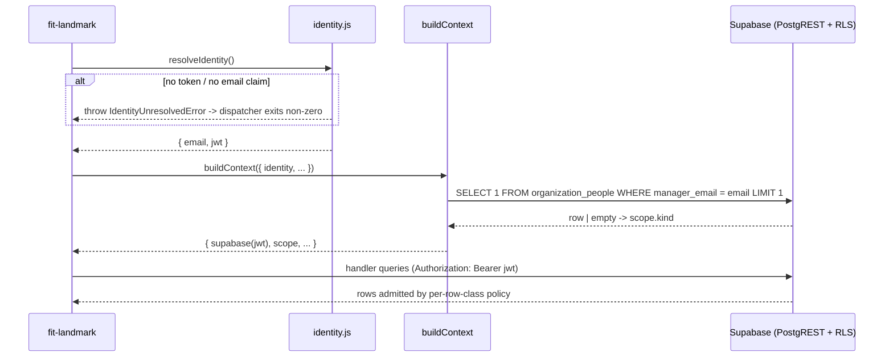

# Design 840-a — Landmark privacy substrate

## Components

| Component | Where | Role |
| --- | --- | --- |
| RLS migration | `products/map/supabase/migrations/<new>_landmark_rls.sql` | Enables RLS on the six tables; revokes the blanket DML grants to `anon`/`authenticated` from `20250101000000` and re-grants `SELECT` on the six tables to `authenticated` (so policies have something to gate); declares one `FOR SELECT TO authenticated` policy per table; encodes retention as per-table `COMMENT`. `service_role` grants are unchanged. |
| Identity resolver | `products/landmark/src/lib/identity.js` (new) | Reads a Supabase Auth JWT from `LANDMARK_AUTH_TOKEN` and verifies the `email` claim is present. Throws `IdentityUnresolvedError` (code `LANDMARK_IDENTITY_UNRESOLVED`) when no token or no `email`. The JWT itself is opaque to JS — Supabase verifies the signature on the wire. |
| JWT issuer | `fit-landmark login --email <e>` (new dispatcher row) and `signTestToken({email})` test helper under `products/landmark/test/lib/` | Production: `login` POSTs to Supabase Auth's `/token?grant_type=password` (or magic-link, design choice deferred to plan) and writes the resulting JWT to `~/.config/fit-landmark/token`; the resolver reads from that path if `LANDMARK_AUTH_TOKEN` is unset. Tests/CI: `signTestToken({email})` HMAC-signs a JWT with the local Supabase `JWT_SECRET` (printed by `supabase start`); `MAP_SUPABASE_JWT_SECRET` carries it in CI. No production code path can mint a token without a server round-trip. |
| Authenticated client | `products/landmark/src/lib/supabase.js` (rewrite) | `createLandmarkClient(token)` builds a Supabase client with `Authorization: Bearer <jwt>` and the `MAP_SUPABASE_ANON_KEY` transport key. No reference to `MAP_SUPABASE_SERVICE_ROLE_KEY` survives in `products/landmark/src/`. The service-role client lives only under `products/map/src/` for ingestion. |
| Scope contract | `products/landmark/src/lib/scope.js` (new) | Frozen value `{ kind: "engineer" \| "manager", email }`. Built once in `buildContext`. Used only for empty-state copy selection and source-inventory output framing — RLS is the enforcement floor and `kind` is informational. |
| Source-inventory command | `products/landmark/src/commands/sources.js` (new) + dispatcher row in `bin/fit-landmark.js` | Implements `fit-landmark sources --email <e>`. Iterates a static `SOURCE_CLASSES` registry (one row per RLS'd table, naming the table, its `clock` column, and a label). |
| Retention reader | `products/map/src/activity/retention.js` (new) | Reads the per-table `COMMENT` blob via `pg_class`/`pg_description` and parses it into `{ window: <ISO 8601 duration> \| null, clock: <column name> \| null }`. Cached for the duration of one CLI invocation. |
| Identity-error message | `products/landmark/src/lib/identity.js` carries one constant `IDENTITY_UNRESOLVED_MESSAGE`; the dispatcher's existing `cli.error(error.message)` path renders it to stderr with non-zero exit. **Not** an empty-state. | Spec criterion 3b requires non-zero exit + an authentication-named error before any query — error path, not empty-state path. |
| Empty-state extension | `products/landmark/src/lib/empty-state.js` | One new key: `NO_SOURCES_FOR_PERSON(email)` — used by the source-inventory command when RLS clamps every class to zero rows. |
| Documentation | new task slug `engineering-data-sources` under `websites/fit/docs/products/`; added to skill `## Documentation` and CLI `documentation[]` per `products/CLAUDE.md` | Audience: engineers reading their own row inventory. Slug is task-shaped, not product-name-shaped. |

## Interfaces

```
identity.js   resolveIdentity(): { email, jwt }   throws IdentityUnresolvedError
supabase.js   createLandmarkClient(token): SupabaseClient
scope.js      buildScope({ identity, supabase }): Promise<Scope>   // probes manager-bit via authenticated client
retention.js  readRetention(supabase, table): { window, clock }
sources.js    runSourcesCommand({ args, options, supabase, scope }): { meta, items[] }
```

## Data flow



## RLS policy shape

Each row class has one `FOR SELECT TO authenticated` policy. `service_role`
keeps full access via its `BYPASSRLS` attribute (Supabase default). `anon` is
denied two ways: (a) blanket grant revoked, so the role cannot reach the
table at all; (b) no policy admits it.

| Row class | `USING` clause |
| --- | --- |
| `organization_people` | `email = (SELECT auth.email()) OR manager_email = (SELECT auth.email())` |
| `evidence` | `EXISTS (SELECT 1 FROM activity.github_artifacts ga WHERE ga.artifact_id = evidence.artifact_id AND (ga.email = (SELECT auth.email()) OR EXISTS (SELECT 1 FROM activity.organization_people op WHERE op.email = ga.email AND op.manager_email = (SELECT auth.email()))))` |
| `github_artifacts` | `email = (SELECT auth.email()) OR EXISTS (SELECT 1 FROM activity.organization_people op WHERE op.email = github_artifacts.email AND op.manager_email = (SELECT auth.email()))` |
| `getdx_snapshot_comments` | `email = (SELECT auth.email()) OR EXISTS (SELECT 1 FROM activity.organization_people op WHERE op.email = getdx_snapshot_comments.email AND op.manager_email = (SELECT auth.email()))` |
| `getdx_snapshot_team_scores` | `getdx_team_id IN (SELECT getdx_team_id FROM activity.organization_people WHERE email = (SELECT auth.email()) OR manager_email = (SELECT auth.email()))` |
| `getdx_snapshots` | `true` |

`(SELECT auth.email())` (subselect form) is the Supabase
[performance-tuning idiom](https://supabase.com/docs/guides/database/postgres/row-level-security)
— forces one JWT-claim evaluation per query, not per row. Per-row `EXISTS`
subqueries on `evidence`, `github_artifacts`, `getdx_snapshot_comments` are
the residual cost; the migration adds `idx_github_artifacts_email` and relies
on existing PKs (`organization_people.email`, `github_artifacts.artifact_id`)
to keep the join below sequential-scan thresholds at expected cardinalities.

The `evidence` and `github_artifacts` policies recurse into
`organization_people` whose own policy admits a row when `email = caller OR
manager_email = caller`. For Manager M querying report A's evidence, the
`org_people` row for A is admitted via the `manager_email` branch, so the
outer `EXISTS` resolves cleanly without privilege escalation. For grand-
report G, no `org_people` row is admitted, so the outer `EXISTS` is false —
recursion terminates at depth 1 by design.

## Tier derivation and behavior changes

Tier is derived inline by the policy expressions; no `is_manager()` helper,
no `tier` column, no JS-side resolver. The single source of truth stays
`organization_people.manager_email`. JS-side `scope.kind` is a one-row probe
through the authenticated client (so subject to RLS, which is fine — the
`org_people` policy admits the caller's own row + reports' rows; `kind =
"manager"` iff any row with `manager_email = caller` comes back).

**Manager-scope behavior changes** (intentional per spec criterion 4):

| Surface | Pre-change | Post-change |
| --- | --- | --- |
| `org show` (no flag) | full directory | self only (engineer) / self + direct reports (manager) |
| `org team --manager M` | full subtree (transitive) | M + direct reports only |
| `practice` / `practiced` / `health` `--manager M` | aggregates over full subtree | aggregates over self + direct reports |
| `voice --manager M` | comments across full subtree | comments across self + direct reports |
| `--manager <other>` (caller ≠ subject) | other manager's subtree | zero rows + `NO_SOURCES_FOR_PERSON` |
| `--email <out-of-scope>` | requested engineer's rows | zero rows + existing empty-state |

Spec criterion 9 covers `--email <self>` parity for the five engineer-scope
commands; the `evidence` parity case depends on every retained evidence row
having a `github_artifacts` row with `email = self`, which is an invariant
of the existing ingestion path (Guide writes evidence keyed by artifact, and
artifacts are populated with `email` via the `github_username → email`
lookup). Evidence orphaned from a person row was already invisible to
`evidence --email <self>` pre-change.

## Retention metadata

Per-table `COMMENT` carrying two keys parsed by `retention.js`:

```sql
COMMENT ON TABLE activity.evidence IS
  'retention.window=P180D retention.clock=created_at';
```

Grammar: `retention.<key>=<value>` tokens whitespace-separated, values are
ISO 8601 durations (`P180D`, `P730D`) or column names (`[a-z_][a-z0-9_]*`);
no quoting needed because both value shapes exclude whitespace and `=`. A
`window` of `null` (omitted) means "while employed" and the source-inventory
column renders as such with no projected fall-off date.

Windows: `organization_people` ⇒ null; `evidence`/`github_artifacts` ⇒ P180D
from `created_at`/`occurred_at`; the three GetDX tables ⇒ P730D from
`imported_at`/`timestamp`. Exact values land in the migration.

## Source-inventory output

For each `SOURCE_CLASSES` entry the command issues two queries through the
authenticated client (RLS clamps both to the caller's view):

1. `select(clock, { count: "exact" }).eq("email", e).order(clock).limit(1)` —
   row count + oldest timestamp (for engineer-attributed tables; team/org
   tables substitute the appropriate join key from `SOURCE_CLASSES`).
2. The same with `.order(clock, { ascending: false })` — newest timestamp.

Output fields per row class: `count`, `oldest`, `newest`, `window` (from
retention reader), `falloff = oldest + window` (omitted when window is
null). Classes whose `count` is zero are filtered out before render. Counts
reflect the **caller's view** post-RLS, not absolute totals — the rendered
header names "rows visible to you" so a Manager M running `sources --email
<report>` sees the same numbers `<report>` would see for themselves.

## `get_team` interaction

The recursive function (`20250101000001_get_team_function.sql`) is `LANGUAGE
sql STABLE` with `SET search_path = ''` — implicit `SECURITY INVOKER`. The
planner inlines `STABLE sql` functions into the calling statement; RLS on
`organization_people` is then applied inside the recursive CTE. Under
Manager M, the recursion bottoms out at depth 1 (direct reports admitted via
`manager_email = caller`; their reports not admitted, so the iteration adds
no new rows and terminates). **No change to the function.**

## Key decisions

| Decision | Choice | Rejected | Why |
| --- | --- | --- | --- |
| Caller identity carrier | Supabase Auth JWT, `auth.email()` in RLS | (a) Per-engineer Postgres role + `SET ROLE`; (b) trusted application header; (c) Supabase anonymous sign-in | (a) role explosion; (b) bypassable; (c) anonymous sign-in produces no `email` claim — defeats RLS expressions |
| JWT issuance | `fit-landmark login` (production) + `signTestToken({email})` against `MAP_SUPABASE_JWT_SECRET` (tests/CI) | (a) Bearer-token-from-stdin only; (b) shared CI service token | (a) leaves CI without a path; (b) re-introduces the bypass the spec is closing |
| Tier source | RLS expression branch on `manager_email` | (a) `tier` column on `organization_people`; (b) recursive walk; (c) JS-side resolver | (a) duplicates state; (b) over-scoped (only direct reports needed); (c) bypassable |
| `scope.kind` source | One-row probe via authenticated client at context build | (a) Decode JWT custom claim in JS; (b) omit kind, branch copy server-side | (a) JWT claims would need a sync surface against `org_people`; (b) every empty-state-copy site would need a probe — context-build is the single chokepoint |
| Retention storage | Per-table `COMMENT` with `retention.<key>=<value>` blob | (a) `activity.retention_policies` table; (b) JS-side constant map | (a) sync surface; (b) decouples retention from the schema it constrains |
| `anon` lockout | Revoke blanket grants + omit any `anon` policy | Explicit `FOR SELECT TO anon USING (false)` policies on each table | Two-belt approach (no grant + no policy) is shorter than per-table deny policies and matches Supabase's default-deny posture |
| Evidence scope shape | RLS subquery joins to `github_artifacts` | Add `email` column to `evidence` | Adding the column broadens write-path scope (every Guide writer must populate it); PK join + new `idx_github_artifacts_email` covers the read path |
| Source-inventory cross-tier | RLS does the filter; out-of-scope `--email` returns zero rows | App-layer pre-check via `getPerson` | Single enforcement point; double-checking risks divergence |
| `get_team` security mode | Keep `SECURITY INVOKER` (default) so RLS applies inside the CTE | `SECURITY DEFINER` + explicit scope check inside the function | DEFINER re-implements RLS in PL/SQL — two enforcement points drift |
| Auth failure UX | Throw `IdentityUnresolvedError` at dispatcher boundary; non-zero exit, error message, no Supabase query issued | (a) Per-handler check; (b) treat as empty-state | (a) duplicates the chokepoint; (b) violates criterion 3b's exit-code requirement |

## Out of scope (restated)

Issue #829 slices 2–4, retention enforcement (deletion daemon), web UI,
ingestion-path rewrites, higher-than-Manager tiers, the `services/map` gRPC
scope conventions, the synthetic-data pipeline, and cross-product scope. The
schema declaration this design lands is the substrate the deletion daemon
will read from in a future spec.

## Dismissed singletons

- `--email`/`--manager` ⇒ explicit error vs silent zero: silent zero with
  `NO_SOURCES_FOR_PERSON` empty-state — the existing nine commands already
  render empty-states for missing-data cases; an extra error path adds copy
  surface without changing observable user behavior.
- Service-role import lint under `products/landmark/src/`: plan-level
  concern (test or biome rule), not architectural.
- `getdx_snapshot_team_scores` "team a report sits in" vs "team they
  manage": the design admits team-via-direct-report by intent — the report
  is the join key `getdx_teams.manager_email` would otherwise duplicate. If
  a report sits in a team M does not manage, M sees that team's score
  through them; this is consistent with the spec's "scores for teams they
  manage" reading because reports' team membership is the canonical signal
  of management responsibility in `organization_people`.

**Supabase Auth user provisioning.** RLS reads `auth.email()`, which requires
a Supabase Auth user whose email matches the corresponding
`organization_people.email`. This slice assumes that pairing exists at
runtime; the operator-facing flow (Supabase invite, SSO bridge, or reuse of
an existing identity provider) and the issuance path that lands a JWT in
`LANDMARK_AUTH_TOKEN` for an engineer are deferred. Without them, RLS will
be correct but unreachable for engineers whose Auth user has not been
created. Spec § Scope-out names "Authentication mechanism" as a design
choice; this design names the carrier (Supabase Auth JWT) and leaves the
issuance and Auth-user/`organization_people` keep-in-sync rules to a
follow-up spec sequenced before any production rollout. `organization_people`
itself continues to be provisioned by the existing `bunx fit-map people push`
write path under the service-role key — not modified here.

— Staff Engineer 🛠️
