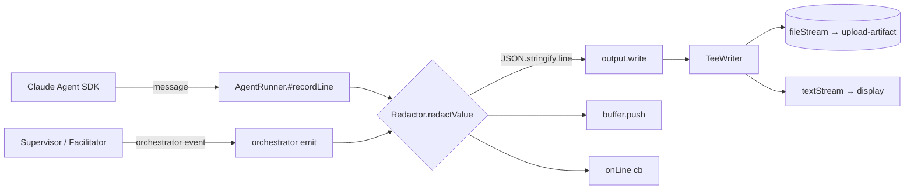

# Design 850-a — libeval Trace Artifact Secret Redaction

## Components

| Component | Where | Role |
| --- | --- | --- |
| `Redactor` | `libraries/libeval/src/redaction.js` (new) | Pure module. Recursively walks any JSON-serialisable value and replaces strings that match either redaction source with the corresponding placeholder. Stateless once constructed; safe to share across producers. |
| `createRedactor` | same | Factory. Reads `{ env, allowlist, patterns, enabled }` and returns `{ redactValue(v), redactLine(s), enabled }`. `env` is a snapshot — captured once at command entry — so a tool that mutates `process.env` mid-run cannot smuggle a value past the redactor. |
| `AgentRunner` redactor seam | `agent-runner.js` constructor + `#recordLine` | Constructor accepts `redactor` (required, never optional). `#recordLine` calls `redactor.redactValue(message)` before `JSON.stringify` — every consumer (`output.write`, `buffer.push`, `onLine`, `onBatch`) sees the redacted shape. |
| `commands/run.js` wiring | `commands/run.js` | Builds the default redactor at command entry from `LIBEVAL_REDACTION_ENV_VARS` (or the documented default set), passes into `createAgentRunner({ redactor })`, and applies it to the `{source, seq, event}` envelope before writing in `onLine`. |
| `Supervisor` / `Facilitator` redactor seams | `supervisor.js`, `facilitator.js` | Same constructor injection; orchestrator-emitted events (system inits, summary verdicts, mid-turn supervisor commentary) pass through `redactor.redactValue` before serialisation. |
| `TeeWriter` (no API change) | `tee-writer.js` | Already receives pre-redacted lines; the `fileStream` and `textStream` paths inherit redaction by construction. The `TraceCollector` it embeds for `toText()` replay also operates on redacted turn shapes — placeholders survive offline replay byte-for-byte (criterion 5). |
| Default env-var allowlist | `redaction.js` constant | `["ANTHROPIC_API_KEY", "GH_TOKEN", "GITHUB_TOKEN"]` — the set workflows export today (`agent-react.yml:180-181`). Override with `LIBEVAL_REDACTION_ENV_VARS=NAME1,NAME2,…`. |
| Default credential patterns | `redaction.js` constant | Anthropic API key (`sk-ant-` + ≥80 url-safe chars), GitHub PAT (`ghp_` + 36 chars), GitHub installation token (`ghs_` + 36 chars), GitHub OAuth token (`gho_` + 36 chars). Anchored character classes; documented prefixes per [GitHub auth-token formats](https://github.blog/security/application-security/behind-githubs-new-authentication-token-formats/). |
| Documentation | `libraries/libeval/README.md`, `.github/actions/kata-action-eval/action.yml` README block | Both state redaction is on by default, list the allowlist + patterns, document `LIBEVAL_REDACTION_DISABLED=1` opt-out and its CI-on-public-repo prohibition. |

## Component graph



The redactor is the only edge that crosses from in-memory event objects to
serialised wire bytes. Every persistent sink — file, stdout, line buffer used
by `Supervisor.drainOutput`, mid-turn `onBatch` callback — receives lines that
already passed it.

## Interfaces

```
redaction.js
  createRedactor({ env, allowlist, patterns, enabled }): Redactor
  Redactor.redactValue(value: unknown): unknown   // structure-preserving deep-walk
  Redactor.redactLine(line: string): string       // parse → redactValue → stringify
  Redactor.enabled: boolean

agent-runner.js  AgentRunner({ ..., redactor })   // redactor required
supervisor.js    Supervisor({ ..., redactor })
facilitator.js   Facilitator({ ..., redactor })
```

`redactValue` walks objects and arrays; on every primitive string it applies
`redactString` (allowlist substring replace, then pattern regex replace) and
returns the result. Non-string primitives pass through unchanged.

## Placeholders

Two stable, non-collidable forms — fixed in this design and treated as a
contract once shipped:

| Source | Placeholder | Example match |
| --- | --- | --- |
| Env-var value hit | `[REDACTED:env:NAME]` | `ANTHROPIC_API_KEY=sk-ant-abc…` &rarr; `[REDACTED:env:ANTHROPIC_API_KEY]` |
| Credential-pattern hit | `[REDACTED:pattern:KIND]` | `ghp_AbCd…` (36) &rarr; `[REDACTED:pattern:gh-pat]` |

Placeholders are bracketed with `[…]` so a substring scan against the unredacted
secret value can never produce them, and they survive `JSON.stringify` and
`toText()` rendering unchanged.

## Opt-out surface

| Channel | Form | Reason |
| --- | --- | --- |
| Env var | `LIBEVAL_REDACTION_DISABLED=1` | One channel, one name, no CLI surface to tunnel through. CI workflows must edit `agent-react.yml` to set it — that diff is reviewable and visible in PR. Documented prohibition: never set in CI on a public repo. |
| Warning | One-line stderr write per run when disabled: `libeval: trace redaction DISABLED via LIBEVAL_REDACTION_DISABLED — secrets may appear in trace artifact` | Stderr is captured by the workflow log; reviewers and post-hoc auditors can grep for the string. |

## Key Decisions

| # | Decision | Rejected alternative | Why |
| --- | --- | --- | --- |
| 1 | Redact in-process at the JSON-serialisable value boundary, before `JSON.stringify`. | Post-hoc CLI step (`fit-trace redact`) inserted between `Split trace` and `Upload trace bundle` in `kata-action-eval/action.yml`. | The producer-side edge is structural: the trace file never exists on disk in unredacted form, and a workflow author cannot accidentally remove or reorder the step. Post-hoc redaction also leaves the `Split trace` artifact briefly unredacted on the runner filesystem. |
| 2 | Single `Redactor` instance built at command entry, injected into every producer (`AgentRunner`, `Supervisor`, `Facilitator`) via constructor. | Implicit module-level singleton accessed via `import`. | Constructor injection keeps the env snapshot deterministic per session, makes test isolation trivial (pass a stub redactor), and forces every new producer to declare the dependency rather than silently inheriting it. |
| 3 | Compose value-based (env allowlist) and pattern-based redaction; both run on every string. | Patterns only, or allowlist only. | The two layers fail in different directions. Patterns miss tokens that adopt new prefixes before libeval ships an update; values miss secrets the agent reads from disk that never appeared in `process.env`. The defence-in-depth gap the spec calls out is closed only by having both. |
| 4 | Allowlist sourced from an explicit named list; default = the three vars exported by current workflows. Override via `LIBEVAL_REDACTION_ENV_VARS`. | `process.env` enumeration, or glob (`*_KEY`, `*_TOKEN`). | Enumeration would redact `RUNNER_TEMP`, `HOME`, `CI`, etc. — strings that legitimately appear in tool outputs and would produce false-positive redaction that breaks trace replay. Globs share the same false-positive risk while signalling false completeness. The named list forces every addition to be a deliberate audit. |
| 5 | Two stable placeholders: `[REDACTED:env:NAME]` and `[REDACTED:pattern:KIND]`. | Single `[REDACTED]` token. | When a leak slips through (e.g. an unredacted occurrence next to a redacted one), the placeholder shape tells the auditor which redactor fired and which did not. The naming cost is one token per hit; the diagnostic value when investigating a real incident is large. |
| 6 | Walk-then-serialise: redact the JS value, then `JSON.stringify`. | Regex over the already-serialised JSON line. | A base64 secret containing `"` is JSON-escaped to `\"` mid-secret; substring or regex match over the JSON string can split a credential across the escape and miss it. Walking the structure operates on the original string before encoding and is correct by construction. |
| 7 | Env snapshot captured once at command entry. | Live `process.env` read per redaction call. | A tool the agent runs (`Bash`) can mutate `process.env` of the libeval process; reading live would let a compromised step drop a sentinel from the allowlist mid-run. Snapshotting freezes the allowlist values for the session. |
| 8 | Opt-out via env var; no CLI flag. | `--no-redact` flag on every libeval subcommand. | One channel reduces the surface area to audit. The env-var form puts the disable signal in the workflow YAML where it is reviewable in PR, rather than buried in a long CLI invocation in a shell script. |

## Test surfaces

The design names two surfaces; the plan picks the layering.

| Surface | What it covers |
| --- | --- |
| `redaction.js` unit | Deep walk over fixtures: nested objects, arrays, mixed primitives, the carrier shapes named in spec criterion 1 (`tool_use.input.*`, `tool_result.content`, assistant `text`, orchestrator `summary`, system payloads). False-positive cases from criterion 3 (prose, Markdown, URLs, git SHAs, UUIDs, quoted shell commands). Pattern hits at canonical length (criterion 2). |
| Producer-side integration | A `TraceCollector` + `TeeWriter` pipeline fed pre-fabricated SDK messages; assert the bytes that reach `fileStream` contain no sentinel substring (criterion 1) and that `toText()` over the captured trace preserves both placeholder forms (criterion 5). |

## Out of scope (carried from spec)

Bash hardening of `agent-react.yml`, GitHub artifact ACL changes, removing
`bypassPermissions`, actor gating, prompt-injected user content, retroactive
scrubbing, and other libraries' shell-exec usage are unchanged from spec § Out
of scope, deferred. The redaction layer alone closes the producer-side leak
path; the deferred items remain worthwhile but separable.

— Staff Engineer 🛠️
