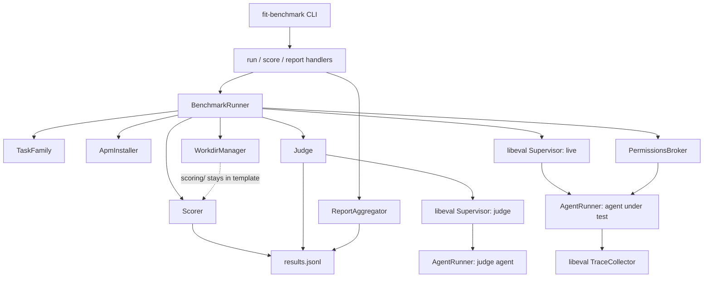

# Design 870-a — fit-benchmark Coding Agent Task Families

## Components

| Component | Where | Role |
| --- | --- | --- |
| `fit-benchmark` CLI | `libraries/libeval/bin/fit-benchmark.js` (new) | Entry point. Parses subcommand (`run`/`score`/`report`), wires real dependencies, delegates to the matching command handler. Mirrors `bin/fit-eval.js` shape. Same `@forwardimpact/libeval` package; separate bin. |
| `BenchmarkRunner` | `libraries/libeval/src/benchmark/runner.js` (new) | Sole orchestrator. Owns phase ordering for a family run: invokes `install` once, then drives each `(task, runIndex)` through the lifecycle by directly calling the named subsystems. Composes libeval primitives. Emits `ResultRecord`s as an async iterable. There is no separate `LifecycleDriver` — the runner is the driver. |
| `TaskFamily` | `libraries/libeval/src/benchmark/task-family.js` (new) | Loaded family: `rootPath`, `apm.lock.yaml` bytes, `familyRevision`, iterable of `Task`. Loaded once at family `install`; immutable thereafter. |
| `Task` | same module | One task: `id` = METR-style `task_family_name/task_name`, paths to `instructions.md`, `supervisor.task.md`, `judge.task.md`, `specs/`, `workdir/`, `scoring/`; declared `permissions` array. |
| `ApmInstaller` | `libraries/libeval/src/benchmark/apm-installer.js` (new) | Reads family `apm.yaml`/`apm.lock.yaml` (extensions match libpack at `libraries/libpack/src/stager.js:126`), materialises declared skills/agents into a per-task temp CWD's `.claude/`. Produces `skillSetHash` (sha256 over `apm.lock.yaml` bytes after LF normalisation — prevents cross-OS hash drift). |
| `WorkdirManager` | `libraries/libeval/src/benchmark/workdir.js` (new) | Per-task: creates a temp CWD, copies `workdir/` and `specs/` into it (never `scoring/`), runs the pre-flight smoke probe, owns process-group cleanup at teardown (port free, processes reaped via process-group SIGTERM then SIGKILL after a 5 s grace). |
| `Scorer` | `libraries/libeval/src/benchmark/scorer.js` (new) | Invokes `<template>/tasks/<task>/scoring/run.sh` from the **template** path with `$WORKDIR` = post-run agent CWD, `$RESULTS_FD` = a captured file descriptor receiving NDJSON `{ test, pass, message? }` rows. Returns `{ verdict, details, exitCode }`; `verdict` derived from exit code (`0` → `pass`, non-zero → `fail`). |
| `Judge` | `libraries/libeval/src/benchmark/judge.js` (new) | Wraps a libeval `Supervisor` over a single `AgentRunner`. Supervisor task = the family's `judge.task.md`; agent task = a structured "produce a verdict" prompt with `scoringPath` and `tracePath` exposed via env. The supervisor's `Conclude` summary becomes `judgeVerdict`. A bare `AgentRunner` cannot emit `Conclude` (registered only on supervisor/facilitator tool servers — `orchestration-toolkit.js:207,283`); the wrapper is required. |
| `PermissionsBroker` | `libraries/libeval/src/benchmark/permissions.js` (new) | Translates METR-aligned permission strings into `AgentRunner` `allowedTools`/`disallowedTools` only. v1 closed set: `["full_internet"]`. Mapping: `"full_internet"` → include `WebFetch`; absent → exclude `WebFetch` and apply a Bash command-prefix disallowlist (`curl`, `wget`, `nc`, `ssh`). OS-level network gating is the deferred containerised-isolation work. |
| `ResultRecord` | `libraries/libeval/src/benchmark/result.js` (new) | JSON shape per task-run, written one-per-line as JSONL to `<run-output>/results.jsonl`. Schema declared in § Result-record schema below; the same schema is consumed by `ReportAggregator` and exposed for fixture validation. |
| `ReportAggregator` | `libraries/libeval/src/benchmark/report.js` (new) | `report` subcommand backend. Walks a run directory, groups records by `taskId`, computes pass@k via OpenAI HumanEval `1 - C(n-c, k) / C(n, k)`. |
| Subcommand handlers | `libraries/libeval/src/commands/benchmark-{run,score,report}.js` (new) | Parse CLI args, validate paths, build `BenchmarkRunner` or `ReportAggregator`, write output. Mirrors existing `commands/run.js` shape. |

## Component graph



## Lifecycle sequence

```mermaid
sequenceDiagram
  participant CLI as fit-benchmark run
  participant BR as BenchmarkRunner
  participant WM as WorkdirManager
  participant AR as Supervisor+AgentRunner
  participant SC as Scorer
  participant JD as Judge
  CLI->>BR: family + runs=N
  BR->>BR: install(family)
  loop task × runIndex
    BR->>WM: start(task, i)
    WM-->>BR: Workdir (workdir/+specs/ copied; scoring/ excluded)
    BR->>AR: runAgent(task, workdir)
    AR-->>BR: tracePath, submission
    BR->>SC: score(task, workdir)
    SC-->>BR: { verdict, details, exitCode }
    BR->>JD: judge(scoring, trace)
    JD-->>BR: judge verdict
    BR->>WM: teardown(workdir)
    BR-->>CLI: ResultRecord (JSONL append)
  end
```

## Result-record schema

| Field | Type | Notes |
|---|---|---|
| `taskId` | string | `task_family_name/task_name` (METR-style) |
| `runIndex` | integer | 0-based |
| `verdict` | `"pass" \| "fail"` | combined gate: pass iff `scoring.verdict === "pass"` AND `judgeVerdict.verdict === "pass"` |
| `scoring` | `{ verdict, details, exitCode }` | nested; `details` is the parsed NDJSON from `$RESULTS_FD` |
| `submission` | string | METR `submission` — the agent's final assistant text |
| `judgeVerdict` | `{ verdict, summary }` | from the judge supervisor's `Conclude` call |
| `costUsd` | number | total agent cost from the trace |
| `turns` | integer | total turns from the trace |
| `tracePath` | string | absolute path to the run-output NDJSON trace |
| `profiles` | `{ agent, supervisor, judge }` | profile names used for each role |
| `model` | string | model id (e.g. `claude-opus-4-7`) |
| `skillSetHash` | string | `sha256:` over `apm.lock.yaml` bytes after LF normalisation |
| `familyRevision` | string | git SHA when family is sourced from a repo, else `sha256:` per algorithm below |
| `permissions` | `string[]` | METR permission strings; v1 closed set: `["full_internet"]` |
| `durationMs` | integer | wall-clock from `start` to `teardown` |

`familyRevision` for non-git families: list tracked files (`tasks/**`,
`apm.yaml`, `apm.lock.yaml`, root scaffolding), sort by relative path, hash
each file with sha256, concatenate `<path>\0<sha256-hex>\n` rows in order,
sha256 the concatenation, prefix `sha256:`.

## Pre-flight contract

Each task's `workdir/scripts/preflight.sh` (executable) is invoked by
`WorkdirManager` after the copy step. Exit `0` = scaffolding boots; non-zero
= broken template. If the file is absent, the harness boots the scaffold via
`npm run start` (resolved from `workdir/package.json`) with `$PORT` set, polls
`http://localhost:$PORT/health` for up to 30 s, and treats a 2xx response as
success. Either path failing surfaces as a structured `preflightError` field
on the result record with `costUsd: 0`.

## Interfaces

```js
// runner.js
class BenchmarkRunner {
  constructor({ family, runs, output, model, redactor, ...opts });
  async *run(): AsyncIterable<ResultRecord>;
}

// task-family.js
loadTaskFamily(rootPathOrGitUrl): Promise<TaskFamily>
TaskFamily: { rootPath, familyRevision, apmLockBytes, tasks(): Iterable<Task> }
Task: {
  id,                            // "task_family_name/task_name"
  paths: { instructions, supervisor, judge, specs, workdir, scoring },
  permissions: string[],         // v1 closed set: ["full_internet"]
}

// scorer.js
runScoring(task, workdir): Promise<{
  verdict: "pass" | "fail",
  details: object[],             // NDJSON parsed from $RESULTS_FD
  exitCode: number,
}>
```

## Key Decisions

| # | Decision | Rejected alternative | Why |
| --- | --- | --- | --- |
| 1 | Separate CLI `fit-benchmark` rather than a `fit-eval bench` subcommand. Same package. | Add `bench` to `fit-eval`. | Keeps `fit-eval` a low-level generic tool with stable surface. The benchmark layer carries opinionated semantics (lifecycle, scoring, judge, aggregation) that don't belong in the generic CLI. |
| 2 | Adopt METR task-standard vocabulary (`task family`, `instructions`, `permissions`, lifecycle hook names, `submission`, `task_family_name/task_name` ids). | Invent monorepo-specific names. | Portability — METR's standard is in production at multiple orgs. Vocabulary alignment lets the format absorb existing METR families and lets ours flow outward without renaming. |
| 3 | Hidden `scoring/` directory lives only in the template; never copied into the agent's CWD. The Scorer invokes scripts from the template path with `$WORKDIR` as an argument. | Copy `scoring/` to a sibling dir in the temp CWD; rely on the supervisor to keep the agent away. | Structural beats procedural. If `scoring/` is never on disk in the agent's CWD, peeking is impossible. |
| 4 | Skill-set lockfile at family root is `apm.lock.yaml` (matching libpack); `skillSetHash` is sha256 over its bytes after LF normalisation. | `apm.lock.yml`; raw byte hash without normalisation. | `.yaml` matches `libraries/libpack/src/stager.js:126`; `.yml` would silently miss the file. LF normalisation prevents Windows/Unix CRLF flipping the hash on the same lockfile. |
| 5 | Compose libeval primitives (`AgentRunner`, `Supervisor`, `TraceCollector`); do not fork. | New `BenchmarkAgentRunner` subclass. | One source of truth for agent execution; libeval improvements (redaction, profiles, trace shape) flow through automatically. |
| 6 | `BenchmarkRunner` is the sole orchestrator. No separate `LifecycleDriver`. | Two-tier orchestrator with `LifecycleDriver` wrapping phases. | Fewer indirection layers; phase ordering lives in one place. v1 has one orchestrator shape. |
| 7 | Judge runs through a libeval `Supervisor` over a single `AgentRunner` — not a bare `AgentRunner`. | Bare `AgentRunner` parsing final assistant text; reuse the live supervisor. | `Conclude` is registered only on supervisor/facilitator tool servers (`orchestration-toolkit.js:207,283`); a bare `AgentRunner` cannot emit it. Reusing the live supervisor conflates help-incentives with grade-incentives. |
| 8 | Permissions enforced by `AgentRunner` `allowedTools`/`disallowedTools` only. v1 closed set: `["full_internet"]`. | OS-level network gating; per-monorepo permission vocabulary; default-on internet. | `AgentRunner` exposes only tool allow/deny; OS-level gating is the deferred containerised-isolation work. Default-deny aligns with METR. |
| 9 | One result record per task-run, JSONL-appended to `<run-output>/results.jsonl`. | Aggregated JSON per run. | Append-only writes survive partial failures and concurrent runs. Per-record format makes individual results easy to grep and diff. |
| 10 | `familyRevision` is the git SHA when the family is a git repo, else the canonical sorted-tree hash defined above. | Always content-hash; always require git. | Git source is the cheap common path; non-git is a real local-development case the harness must support, with a defined hash algorithm. |
| 11 | Pre-flight contract: `workdir/scripts/preflight.sh` if present, else default `npm run start` + HTTP 2xx on `/health`. | Require every task to provide its own probe; or skip pre-flight. | A default keeps simple HTTP-service tasks zero-config; the override hook supports anything else. Skipping pre-flight makes broken-template failures attributable to the agent. |

## Test surfaces

The design names two surfaces; the plan picks the layering and fixture composition.

| Surface | What it covers |
| --- | --- |
| `benchmark/*.js` unit | `WorkdirManager` excludes `scoring/` from the copy. `ApmInstaller` produces a stable `skillSetHash` across runs and changes on a one-byte lockfile edit. `Scorer` parses `$RESULTS_FD` NDJSON and exit codes. `PermissionsBroker` maps METR strings to `allowedTools`/`disallowedTools`. `ReportAggregator` computes pass@k. |
| End-to-end fixture | A minimal task family driving the full lifecycle, asserting result-record schema validation, scoring isolation (sentinel-filename property), pre-flight failure path, network-policy enforcement, and JSONL append integrity. |

## Out of scope (carried from spec)

Containerised isolation, library/CLI test surfaces beyond HTTP, cross-model
leaderboards, live PR-gate integration, retroactive grading of historical
traces, family-level cost caps, replay-from-trace, and intermediate scoring
are unchanged from spec § Out of scope, deferred.

— Staff Engineer 🛠️
