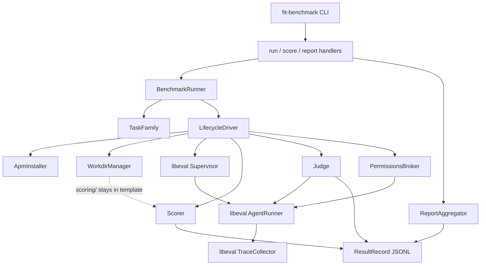

# Design 870-a — fit-benchmark Coding Agent Task Families

## Components

| Component | Where | Role |
| --- | --- | --- |
| `fit-benchmark` CLI | `libraries/libeval/bin/fit-benchmark.js` (new) | Entry point. Parses subcommand (`run`/`score`/`report`), wires real dependencies, delegates to the matching command handler. Mirrors `bin/fit-eval.js` shape for parity. |
| `BenchmarkRunner` | `libraries/libeval/src/benchmark/runner.js` (new) | Orchestrates a family run: `install` once, then for each `task × runIndex` drive the lifecycle. Composes libeval primitives rather than wrapping them. Emits `ResultRecord`s as an async iterable. |
| `TaskFamily` | `libraries/libeval/src/benchmark/task-family.js` (new) | In-memory representation of a loaded family: `rootPath`, `apm.lock.yml` content, `familySha` (git SHA when sourced from a repo, else content hash of the family root), iterable of `Task`. Loaded once at family `install`; immutable thereafter. |
| `Task` | same module | One task: `id` (METR-style `task_family/task_name`), paths to `instructions.md`, `supervisor.task.md`, `judge.task.md`, `specs/`, `workdir/`, `scoring/`; declared `permissions`. |
| `LifecycleDriver` | `libraries/libeval/src/benchmark/lifecycle.js` (new) | Sequences the per-task hooks (`start`, run, `score`, `judge`, `teardown`) with explicit per-phase error boundaries. Hook names borrowed from METR's `TaskFamily` to keep the format portable. The driver is the only owner of phase ordering. |
| `ApmInstaller` | `libraries/libeval/src/benchmark/apm-installer.js` (new) | Reads family `apm.yml`/`apm.lock.yml`, materialises declared skills/agents into a per-task temp CWD's `.claude/`. Produces `skillSetHash` (sha256 over `apm.lock.yml` bytes) for the result record. |
| `WorkdirManager` | `libraries/libeval/src/benchmark/workdir.js` (new) | Per-task: creates a temp CWD, copies `workdir/` and `specs/` into it (never `scoring/`), runs the family-conventional pre-flight smoke probe. Returns a `Workdir` handle threaded through later phases. Also owns final cleanup (`teardown`). |
| `Scorer` | `libraries/libeval/src/benchmark/scorer.js` (new) | Invokes the task's `scoring/run.sh` from the **template** path with the post-run workdir as `$WORKDIR` and a structured-output channel. Captures NDJSON results and exit-code-derived verdict. Does not interpret semantics. |
| `Judge` | `libraries/libeval/src/benchmark/judge.js` (new) | Spawns one libeval `AgentRunner` session with `judge.task.md` as the prompt and `{scoringPath, tracePath}` exposed via env. Reads the final `Conclude` summary as `judgeVerdict`. Distinct from the live supervisor. |
| `PermissionsBroker` | `libraries/libeval/src/benchmark/permissions.js` (new) | Translates METR-aligned permission strings (`"full_internet"`) into `AgentRunner` constructor options (allowed-tools, network policy). Default-deny. |
| `ResultRecord` | `libraries/libeval/src/benchmark/result.js` (new) | Pure JSON shape per task-run; written one-per-line as JSONL to the run-output directory. |
| `ReportAggregator` | `libraries/libeval/src/benchmark/report.js` (new) | `report` subcommand backend. Walks a run directory, groups records by `taskId`, computes pass@k, totals cost and turns. |
| Subcommand handlers | `libraries/libeval/src/commands/benchmark-{run,score,report}.js` (new) | Parse CLI args, validate paths, build `BenchmarkRunner` or `ReportAggregator`, write output. Mirrors existing `commands/run.js` shape. |
| `fit-benchmark` skill | `.claude/skills/fit-benchmark/SKILL.md` (new) | User-facing skill matching the published CLI per the parity rule in `.claude/skills/CLAUDE.md`. |

## Component graph



## Interfaces

```js
// runner.js
class BenchmarkRunner {
  constructor({ family, runs, output, model, redactor, ...opts });
  async *run(): AsyncIterable<ResultRecord>;
}

// task-family.js
loadTaskFamily(rootPathOrGitUrl): Promise<TaskFamily>
TaskFamily: { rootPath, familySha, apmLockBytes, tasks(): Iterable<Task> }
Task: {
  id,                          // "task_family/task_name"
  paths: { instructions, supervisor, judge, specs, workdir, scoring },
  permissions: string[],       // METR vocabulary; default []
}

// lifecycle.js
class LifecycleDriver {
  async install(family): Promise<InstallContext>;
  async start(task, runIndex, ctx): Promise<Workdir>;
  async runAgent(task, workdir, ctx): Promise<{ tracePath, submission }>;
  async score(task, workdir, ctx): Promise<ScoringResult>;
  async judge(task, scoring, trace, ctx): Promise<JudgeVerdict>;
  async teardown(workdir, ctx): Promise<void>;
}

// scorer.js
runScoring(task, workdir): Promise<{
  verdict: "pass" | "fail",
  details: object[],     // NDJSON parsed
  exitCode: number,
}>

// result.js
ResultRecord: {
  taskId, runIndex,
  verdict,                                  // pass|fail (combined gate)
  scoring: { verdict, details, exitCode },
  submission,                               // METR: agent's final string
  judgeVerdict: { verdict, summary },
  costUsd, turns, tracePath,
  profiles: { agent, supervisor, judge },
  model, skillSetHash, familySha,
  permissions, durationMs,
}
```

`runAgent` runs a libeval `Supervisor` over an `AgentRunner` against the
task's `instructions.md` (agent prompt) and `supervisor.task.md` (supervisor
prompt). Final assistant text is captured as `submission` (METR vocabulary).

## Lifecycle sequence

```mermaid
sequenceDiagram
  participant CLI as fit-benchmark run
  participant BR as BenchmarkRunner
  participant LD as LifecycleDriver
  participant AR as AgentRunner+Supervisor
  participant SC as Scorer
  participant JD as Judge
  CLI->>BR: family + runs=N
  BR->>LD: install(family)
  loop task × runIndex
    BR->>LD: start(task, i)
    LD-->>BR: Workdir (workdir/+specs/ copied; scoring/ excluded)
    BR->>AR: runAgent(task, workdir)
    AR-->>BR: tracePath, submission
    BR->>SC: score(task, workdir)
    SC-->>BR: scoring result
    BR->>JD: judge(task, scoring, trace)
    JD-->>BR: judge verdict
    BR->>LD: teardown(workdir)
    BR-->>CLI: ResultRecord (JSONL append)
  end
```

## Key Decisions

| # | Decision | Rejected alternative | Why |
| --- | --- | --- | --- |
| 1 | New CLI `fit-benchmark` rather than a `fit-eval bench` subcommand. | Add `bench` to `fit-eval`. | Keeps `fit-eval` a low-level generic tool with stable surface. The benchmark layer carries opinionated semantics (lifecycle, scoring, judge, aggregation) that don't belong in the generic CLI. Independent versioning is also valuable — benchmark-format breaking changes shouldn't bump `fit-eval`. |
| 2 | Adopt METR task-standard vocabulary (`task family`, `instructions`, `permissions`, hook names `install`/`start`/`score`/`teardown`, METR-style `task_family/task_name` ids, `submission`). | Invent monorepo-specific names. | Portability — METR's standard is in production at the UK AISI and other orgs. Borrowing the vocabulary lets the format absorb existing METR families and lets ours flow outward without renaming. The cost is one constraint on naming. |
| 3 | Hidden `scoring/` directory lives only in the template; never copied into the agent's CWD. The Scorer invokes scripts from the **template** path with the post-run workdir as an argument. | Copy `scoring/` to a sibling dir in the temp CWD; rely on the supervisor to keep the agent away. | Structural beats procedural. If `scoring/` is never on disk in the agent's CWD, peeking is impossible. Reviewers cannot weaken the property without changing `WorkdirManager` itself; the supervisor cannot regress it. |
| 4 | Skill set under test declared at family root via `apm.yml`/`apm.lock.yml`; reproducibility hash is sha256 over `apm.lock.yml` bytes. | Per-task skill declarations; or runtime-detected from the host repo. | Family-level declaration matches the unit of measurement (skills are evaluated as a set). Lockfile-based hashing makes "same skill set" a verifiable property of the result record without resolving versions at report time. Per-task duplication would be noisy and easy to drift. |
| 5 | Compose libeval primitives (`AgentRunner`, `Supervisor`, `TraceCollector`, `MessageBus`); do not fork or wrap. | New `BenchmarkAgentRunner` subclass with benchmark-specific behaviour. | One source of truth for agent execution. Behaviour changes in libeval (redaction, profiles, trace shape) flow through automatically. Composition leaves the benchmark layer focused on lifecycle and scoring. |
| 6 | Outside-in test surface only in v1 (HTTP probes, file existence, exit codes). | Library-import probes; CLI subprocess probes. | The contract is enforced by skills under test (the agent learns to start an HTTP service via the skill being evaluated). HTTP-only keeps scaffolding simple and the contract surface narrow; other surfaces are mechanically straightforward to add later when a concrete task needs them. |
| 7 | Judge runs as a separate libeval session (`AgentRunner` only) after scoring. | Reuse the live supervisor as the judge. | The supervisor's job during the run is to help the agent finish; using it to also grade conflicts those incentives. A fresh judge sees trace and scoring as artifacts and issues an independent verdict. The cost is one extra session per task-run; the gain is role-separation. |
| 8 | METR-aligned permissions: default empty; `permissions: ["full_internet"]` opts in to network. | Per-monorepo permission vocabulary, or default-on internet. | Portability with METR families. Default-deny matches the "fresh engineer in a sandboxed env" mental model and prevents the agent from incidentally using paid APIs or external services to game tests. |
| 9 | One result record per task-run, JSONL-appended to the run-output directory. | One aggregated JSON per run. | Append-only writes survive partial failures and concurrent runs. The aggregator can be re-run cheaply. JSON-per-record makes individual results easy to grep and diff. |
| 10 | Pre-flight smoke probe runs unmodified `workdir/` before the agent starts. | Skip pre-flight; trust template authors. | Template breakage and harness breakage look identical from the result record. Catching it before agent cost is spent makes failures attributable and avoids spending tokens on a broken scaffold. |

## Test surfaces

The design names two surfaces; the plan picks the layering.

| Surface | What it covers |
| --- | --- |
| `benchmark/*.js` unit | `WorkdirManager` excludes `scoring/` (criterion: scoring isolation). `ApmInstaller` produces stable `skillSetHash`. `Scorer` parses NDJSON output and exit codes correctly. `PermissionsBroker` maps METR strings to libeval options. `ReportAggregator` computes pass@k from a fixture record set. |
| End-to-end fixture | A minimal task family (`fixtures/task-family/`) with two tasks: one passing, one failing. Stub agent (a deterministic libeval `AgentRunner` mock) drives the full lifecycle; assertions cover record schema, scoring isolation (sentinel filename never appears in trace), pre-flight failure path, network policy enforcement, and JSONL append integrity. |

## Out of scope (carried from spec)

Containerised isolation, library/CLI test surfaces beyond HTTP, cross-model
leaderboards, live PR-gate integration, retroactive grading of historical
traces, family-level cost caps, replay-from-trace, and intermediate scoring
are unchanged from spec § Out of scope, deferred. The lifecycle and scoring
surface alone gives Platform Builders reproducible coding-agent evaluation;
the deferred items remain worthwhile but separable.

— Staff Engineer 🛠️
