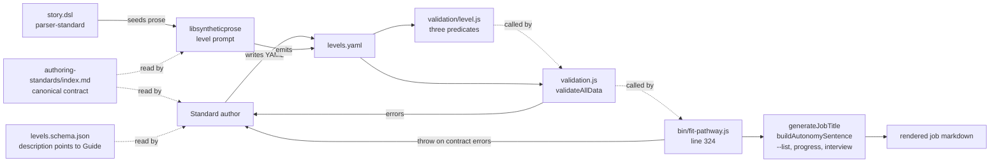
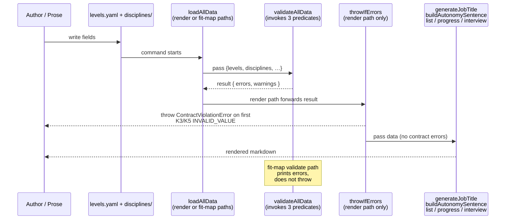

# Design 900 — Pathway Job Formatter Data Conventions

## Restate the problem

Two of #874's rendering bugs are symptoms of a contract the pathway job
formatter relies on but never writes down. `generateJobTitle`
(`libraries/libskill/src/derivation.js:264`) silently assumes
`professionalTitle` is a rank prefix; `buildAutonomySentence`
(`products/pathway/src/formatters/job/description.js:32`) silently assumes
`autonomyExpectation` opens with a base-form verb. The starter happens to
satisfy both; BioNova does not. v1 must (a) name the contract for these two
fields in one canonical location, (b) bring every emitter into alignment,
(c) catch violations before render — at the render path itself, not only at
opt-in `fit-map validate`.

## Components

One canonical contract document is read by authors and the prose prompt and
pointed at by the schema. One module owns the rule predicates
(`validation/level.js`). One orchestrator — `validateAllData` in
`products/map/src/validation.js:65` — calls them; it already receives the
full `{ levels, disciplines, … }` bundle and already loops levels (line 126),
so the K3(b) cross-check fits naturally. The render path already calls
`validateAllData` at `products/pathway/bin/fit-pathway.js:324`, but
**discards the return value**; closing the gate is a one-line change there
plus an equivalent enforcement at the second loader entrypoint
(`products/pathway/src/lib/yaml-loader.js:248`, used by `main.js`,
`slide-main.js`, `handout-main.js`). See K6 for the substrate detail.

## Key Decisions

| Decision                                  | Chosen                                                                                                                                                                                                                                                                                                                                                                                                                                                                                                                                                                                                                                                  | Rejected                                                                                                                                                                                                                                                                                                                                                                                                            |
| ----------------------------------------- | ------------------------------------------------------------------------------------------------------------------------------------------------------------------------------------------------------------------------------------------------------------------------------------------------------------------------------------------------------------------------------------------------------------------------------------------------------------------------------------------------------------------------------------------------------------------------------------------------------------------------------------------------------- | ------------------------------------------------------------------------------------------------------------------------------------------------------------------------------------------------------------------------------------------------------------------------------------------------------------------------------------------------------------------------------------------------------------------- |
| **K1. Canonical home**                    | `websites/fit/docs/products/authoring-standards/index.md` — a new `## Level field conventions` subsection after Step 1, with one compliant + one non-compliant example for each field and a stable anchor `#level-field-conventions` the schema and validator point at.                                                                                                                                                                                                                                                                                                                                                                              | Schema `description` strings — too cramped for compliant/non-compliant pairs and rationale. Starter YAML inline comments — can't carry a non-compliant example without confusing the example.                                                                                                                                                                                                                          |
| **K2. `professionalTitle` shape**         | **Rank token** — a single capitalised seniority word (`Associate`, `Senior`, `Staff`) or the form `Level <numeral>`. The formatter composes it with the discipline's `roleTitle`.                                                                                                                                                                                                                                                                                                                                                                                                                                                                       | **Role-complete** (`Senior Engineer`) — drops the `{roleTitle}` join; obsoletes the starter shape and the existing else-branch in `generateJobTitle`. **Marker-distinguished** — adds a per-level flag for an inconsistency we are removing.                                                                                                                                                                            |
| **K3. `professionalTitle` rule**          | Two predicate checks, both required. **(a) Shape:** `^(?:Level [IVX]+\|Level \d+\|[A-Z][a-z]+)$` — `Level <roman>`, `Level <digit>`, or one capitalised word (no spaces). Rejects `"Senior Engineer"` (two words) and `"engineer"` (lower-case). **(b) Disjointness:** the case-folded, whitespace-split token set of `professionalTitle` (excluding the literal `Level`) must be disjoint from the token set of **every** discipline's `roleTitle` in the same standard, where tokenisation splits on `\s+` after stripping `[^A-Za-z0-9]+`. Rejects `"Engineer"` when any discipline carries `roleTitle: "Software Engineer"` — `{engineer}` ∩ `{software, engineer}` ≠ ∅. The cross-check needs all disciplines; (a) and (b) live as two separate exports, and the validator surfaces them through orchestration (see Interfaces).                                                                                                            | Shape-only — a single word like `"Engineer"` passes a shape regex but still ships the bug. Allow-list of exact rank words — couples the rule to a closed vocabulary the author cannot extend. Cross-check skipping `Level` literal — `Level I` versus discipline `roleTitle: "Software Engineer Level"` is contrived; excluding `Level` keeps the rule's surface small.                                                  |
| **K4. `autonomyExpectation` shape**       | **Base/imperative verb** — opens with an infinitive (`Work…`, `Lead…`, `Define…`). Composes into `"You will " + lowercase(value)` without normalisation.                                                                                                                                                                                                                                                                                                                                                                                                                                                                                              | **Third-person** (`Works…`) — requires verb-form normalisation in the formatter, hiding the bug. **Either, formatter normalises** — normalisation across irregulars and elided subjects is brittle; the contract is cheaper.                                                                                                                                                                                            |
| **K5. `autonomyExpectation` rule**        | One regex check on the first whitespace-delimited token. Reject when the token matches `^[A-Z][a-z]*[^s]s$` — a capitalised word ending in lowercase `s` preceded by a non-`s` letter (catches `Works`, `Owns`, `Drives`, `Leads`, `Defines`, `Manages`, `Coordinates`, `Builds`, `Develops`, `Implements`, `Architects`, `Reviews`, `Runs`, `Tests`, `Steers`, `Directs`, …; also catches `Has`). Also reject the exact two-character token `Is` (copular subject-omission too short for the regex). Subject-led sentences (`The team…`, `You…`) pass the first-token check; spec scope does not include subject detection. | Closed verb stop-list — incomplete by construction; reviewers had to grow it ad-hoc. JSON-schema `pattern` — cannot express "not -s after non-s" cleanly across all third-person verbs. Allow-list of permitted verbs — couples the rule to a closed vocabulary.                                                                                                                                                       |
| **K6. Enforcement substrate**             | `validation/level.js` exports three predicates (`checkProfessionalTitleShape`, `checkProfessionalTitleDisjoint`, `checkAutonomyExpectation`). `validateAllData` in `validation.js:65` is the only orchestrator; it already receives `{ levels, disciplines, … }` and already iterates levels, so calling the predicates there gives the cross-check (K3(b)) the disciplines array it needs without a signature change. Errors surface through the existing `INVALID_VALUE` mechanism. The render-path gate is closed by **(i)** changing `products/pathway/bin/fit-pathway.js:324` from `validateAllData(data);` (discarded) to `throwIfErrors(validateAllData(data));`, where the new helper raises a `ContractViolationError` with `{ field, value, reason, contractUrl }` own properties on the first `INVALID_VALUE` from the K3/K5 predicates; **(ii)** the parallel loader at `products/pathway/src/lib/yaml-loader.js:248` is migrated to re-export `loadAllData` from `@forwardimpact/map/loader` (or call `throwIfErrors` itself if migration is deferred), closing the bypass for `main.js`/`slide-main.js`/`handout-main.js`. `dev.js`/`build.js`'s `try { loadStandardConfig } catch { fallback }` blocks are unaffected — `loadStandardConfig` reads only brand metadata (`standard.yaml`), not levels. | **Validator-only at `fit-map validate`** — render commands don't invoke it. **Inside `loadStandardConfig`** — that function reads only `standard.yaml`; it never sees levels (R3 panel). **Inside `deriveJob` or each leaf formatter** — multiplies the gate into ~5 call sites and misses `--list`. **Schema `pattern`** — cannot express disjointness. **Formatter-side normalisation** — spec forbids. |
| **K7. Synthetic-prose prompt**            | `libraries/libsyntheticprose/src/prompts/pathway/level.js` is the single emitter of these fields. The "use the provided title or generate one" instruction (line 49) is replaced by two explicit branches: (a) when the DSL skeleton supplies `professionalTitle`, the prompt passes it through verbatim; (b) when it does not, the prompt instructs `Level <roman>` derived from `rank`. `autonomyExpectation` instructions inline the contract: "one sentence opening with a base-form verb (`Work…`, `Lead…`, `Define…`); never third-person (`Works…`)."                                                                                                | Post-processing pass — parallel enforcement path that drifts. Schema-driven generation — overkill for two fields. Leaving the prompt unchanged — drops the contract on the LLM with no instruction.                                                                                                                                                                                                                  |
| **K8. DSL seed alignment**                | `data/synthetic/story.dsl` levels block (lines 570–576) rewrites the six `title` strings as single-word rank tokens, one per level: **`J040: Associate, J060: Mid, J070: Senior, J080: Staff, J090: Principal, J100: Distinguished`**. The DSL `title` field semantically becomes "rank token" only; the existing `rank` integer remains the schema's `ordinalRank`. A comment in `story.dsl` above `levels {` names the contract and links to the canonical home. The parser at `libraries/libsyntheticgen/src/dsl/parser-standard.js:66` is unchanged — it still maps DSL `title` → `professionalTitle` verbatim; only the *values* the DSL writes change.                                                                                                                       | Derive `professionalTitle` from `rank` only — locks every standard to `Level <N>` and drops named seniority words the spec admits. Leave DSL role-complete and reshape downstream — keeps the bug source alive; any future regen reintroduces "Engineer Engineer".                                                                                                                                                     |
| **K9. BioNova regeneration command**      | `bunx fit-terrain build --only=pathway` against `data/synthetic/story.dsl` at the `seed 42` directive embedded in the DSL (line 6). No separate pin file; the seed is in the DSL the command consumes.                                                                                                                                                                                                                                                                                                                                                                                                                                                | Separate seed-pin file — duplicates the DSL's own `seed` directive. Regenerating the entire terrain — slow; only `pathway` output is needed for the spec's BioNova parity test.                                                                                                                                                                                                                                       |
| **K10. Starter migration**                | `products/map/starter/levels.yaml` already uses rank-only (`Level I`, `Level II`) and base-verb (`Work with supervision`, `Work independently…`) — no data change. Starter is the reference exemplar in the contract document; additional examples in the contract (`Senior`, `Staff`) come from the DSL's new tokens (K8), not the starter.                                                                                                                                                                                                                                                                                                          | Add more levels to the starter to cover non-`Level` rank tokens — out of spec scope (starter is the introductory exemplar; new levels need their own design).                                                                                                                                                                                                                                                          |
| **K11. Schema description update**        | Both descriptions become a **pointer only**, not a restatement. `professionalTitle.description: "Rank token; see https://www.forwardimpact.team/docs/products/authoring-standards/index.md#level-field-conventions"`. `autonomyExpectation.description: "Base-form verb opener; see <same anchor>"`. The misleading existing examples (`Engineer I, Senior Engineer`) are removed. The canonical home owns the rule prose; the schema only points.                                                                                                                                                                                                                              | Keep the existing description prose unchanged and append a link — leaves the misleading examples in place. Restate the rule in the schema — creates a second normative home that drifts (contradicts K1's rejection rationale for schema descriptions). Use schema `pattern` instead — covered by K6.                                                                                                                                                                                                                                                                  |

## Data Flow

The render-path gate is `throwIfErrors(validateAllData(data))` at
`bin/fit-pathway.js:324` (where `validateAllData(data);` already runs but
discards its result today) plus the same call inside the parallel
`yaml-loader.js`. `fit-map validate` keeps its existing collect-and-print
behaviour by skipping the helper.

## Interfaces

**Predicates** (`products/map/src/validation/level.js`)

Three exported pure functions:

- `checkProfessionalTitleShape(value): { ok, reason? }` — K3(a)
- `checkProfessionalTitleDisjoint(level, disciplines): { ok, reason? }` — K3(b)
- `checkAutonomyExpectation(value): { ok, reason? }` — K5

**Orchestrator** (`products/map/src/validation.js`)

`validateAllData` (existing function, line 65) gains three call sites inside
its level-walk: K3(a) and K5 per level, K3(b) per level against the
`disciplines` array it already holds. Failures convert to `INVALID_VALUE`
errors with `path` and a `hint` pointing at the canonical-home anchor. The
function's signature and return shape (`{ valid, errors, warnings }`) do not
change; consumers that already inspect `errors` (e.g. `fit-map validate`)
see the new entries automatically.

**Render-path gate**

A new helper `throwIfErrors(result, { ruleCodes: ["INVALID_VALUE"], paths: [/professionalTitle$/, /autonomyExpectation$/] })` lives next to `validateAllData`. It throws a `ContractViolationError extends Error` with own properties `{ field, value, reason, contractUrl }` set from the first matching error. `products/pathway/bin/fit-pathway.js:324` changes from `validateAllData(data);` to `throwIfErrors(validateAllData(data));`; the existing outer `try { … } catch (error) { cli.error(error.message); process.exit(1); }` at lines 319/334 already prints and exits non-zero. The same call is added to `products/pathway/src/lib/yaml-loader.js`'s `loadAllData` consumers, or — preferred — that file is migrated to re-export from `@forwardimpact/map/loader` and the gate then lives once.

**Schema** — `description` strings updated per K11. No `pattern` added.

**Formatter** — no interface change. Inputs are pre-validated.

**Prompt** — `buildLevelPrompt` keeps its signature; prompt body updated per K7.

## Out of Scope (named in spec)

`impactScope`, `complexityHandled`, `influenceScope`, `managementTitle`, and
`qualificationSummary` are not covered. The two new predicates are namespaced
in the same module so a follow-up spec can add parallel rules cleanly.

## Risks

- **Render-path gate changes user-visible behaviour.** Today `validateAllData`'s
  result is discarded at the CLI entry; this design makes contract violations
  fatal at startup with a `ContractViolationError`. **Mitigation:** the error
  carries the field path and the contract URL — clearer than the current "job
  renders garbage" silent failure. Non-contract validation errors continue to
  collect and print as today (they don't match the gate's `paths` filter).
- **K5 regex false positives.** A rare base-form imperative ending in
  lowercase `s` after a non-`s` letter (`Focus on…`, `Bias toward…`,
  `Process incidents…`) would be rejected. **Mitigation:** the contract
  document carries the English rule for novel cases; the regex lives behind
  one named export — a future revision can add an allow-list head without
  changing call sites.
- **K8 ladder reshuffle is observable.** Renaming `J080 Lead Engineer` →
  `J080 Staff` (and so on) changes the seniority words the BioNova-derived
  pathway artifacts emit, including any cached prose. **Mitigation:** the
  DSL is internal; `fit-terrain build --only=pathway` is fast; consumers that
  hold prior outputs (kata-interview corpora) regenerate as a routine part
  of the spec's BioNova parity test (K9). The plan names a cache-invalidation
  step.
- **Parallel loader consolidation may surface unrelated breakage.** Migrating
  `products/pathway/src/lib/yaml-loader.js:248` to re-export from
  `@forwardimpact/map/loader` is the preferred K6 step (ii). **Mitigation:**
  if the migration uncovers a behaviour difference, the design's fallback —
  adding `throwIfErrors` directly inside the pathway loader — keeps the gate
  in place while the migration is deferred to a follow-up.

— Staff Engineer 🛠️
