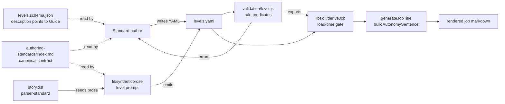
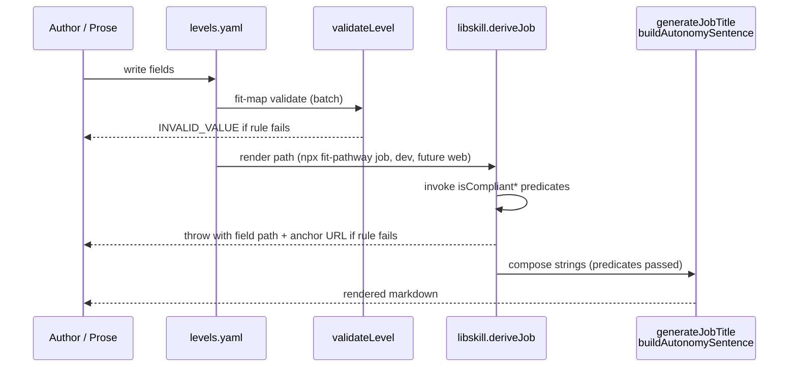

# Design 900 — Pathway Job Formatter Data Conventions

## Restate the problem

Two of #874's rendering bugs are symptoms of a contract the pathway job
formatter relies on but never writes down. `generateJobTitle`
(`libraries/libskill/src/derivation.js:264`) silently assumes
`professionalTitle` is a rank prefix; `buildAutonomySentence`
(`products/pathway/src/formatters/job/description.js:32`) silently assumes
`autonomyExpectation` opens with a base-form verb. The starter happens to
satisfy both; BioNova does not. v1 must (a) name the contract for these two
fields in one canonical location, (b) bring every emitter into alignment,
(c) catch violations before render — at the render path itself, not only at
opt-in `fit-map validate`.

## Components

One canonical contract document is read by authors and the prose prompt and
pointed at by the schema. One module owns the rule predicates
(`validation/level.js`). Two call sites invoke them: `fit-map validate` for the
batch path, and `deriveJob` in `libskill` for the render path — every product
that renders a job (Pathway CLI, `fit-pathway dev`, planned Pathway web)
already routes through `deriveJob`, so the render gate is automatic and
cannot be bypassed by a caller that forgets to pre-validate.

## Key Decisions

| Decision                                  | Chosen                                                                                                                                                                                                                                                                                                                                                                                                                                                                                                                                                                                                                                                  | Rejected                                                                                                                                                                                                                                                                                                                                                                                                            |
| ----------------------------------------- | ------------------------------------------------------------------------------------------------------------------------------------------------------------------------------------------------------------------------------------------------------------------------------------------------------------------------------------------------------------------------------------------------------------------------------------------------------------------------------------------------------------------------------------------------------------------------------------------------------------------------------------------------------- | ------------------------------------------------------------------------------------------------------------------------------------------------------------------------------------------------------------------------------------------------------------------------------------------------------------------------------------------------------------------------------------------------------------------- |
| **K1. Canonical home**                    | `websites/fit/docs/products/authoring-standards/index.md` — a new `## Level field conventions` subsection after Step 1, with one compliant + one non-compliant example for each field and a stable anchor `#level-field-conventions` the schema and validator point at.                                                                                                                                                                                                                                                                                                                                                                              | Schema `description` strings — too cramped for compliant/non-compliant pairs and rationale. Starter YAML inline comments — can't carry a non-compliant example without confusing the example.                                                                                                                                                                                                                          |
| **K2. `professionalTitle` shape**         | **Rank token** — a single capitalised seniority word (`Associate`, `Senior`, `Staff`) or the form `Level <numeral>`. The formatter composes it with the discipline's `roleTitle`.                                                                                                                                                                                                                                                                                                                                                                                                                                                                       | **Role-complete** (`Senior Engineer`) — drops the `{roleTitle}` join; obsoletes the starter shape and the existing else-branch in `generateJobTitle`. **Marker-distinguished** — adds a per-level flag for an inconsistency we are removing.                                                                                                                                                                            |
| **K3. `professionalTitle` rule**          | Two validator checks, both required. **(a) Shape:** `^(?:Level [IVX]+\|Level \d+\|[A-Z][a-z]+)$` — `Level <roman>`, `Level <digit>`, or one capitalised word (no spaces). Rejects `"Senior Engineer"` (two words) and `"engineer"` (lower-case). **(b) Disjointness:** every token in `professionalTitle` must be absent from every discipline's `roleTitle` token set in the same standard. Rejects `"Engineer"` when any discipline carries `roleTitle: "Software Engineer"` — `Engineer` ∈ {Software, Engineer}.                                                                                                                                       | Shape-only — a single word like `"Engineer"` passes a shape regex but still ships the bug. Allow-list of exact rank words — couples the rule to a closed vocabulary the author cannot extend. Cross-check disabled by default — the cross-check is what makes the rule catch the spec's exact repro.                                                                                                                  |
| **K4. `autonomyExpectation` shape**       | **Base/imperative verb** — opens with an infinitive (`Work…`, `Lead…`, `Define…`). Composes into `"You will " + lowercase(value)` without normalisation.                                                                                                                                                                                                                                                                                                                                                                                                                                                                                              | **Third-person** (`Works…`) — requires verb-form normalisation in the formatter, hiding the bug. **Either, formatter normalises** — normalisation across irregulars and elided subjects is brittle; the contract is cheaper.                                                                                                                                                                                            |
| **K5. `autonomyExpectation` rule**        | One regex check on the first token. The first token must not match `^[A-Z][a-z]*[^s]s$` — a capitalised word ending in lowercase `s` preceded by a non-`s` letter (catches `Works`, `Owns`, `Drives`, `Leads`, `Defines`, `Manages`, `Coordinates`, `Builds`, `Develops`, `Implements`, `Architects`, `Reviews`, `Runs`, `Tests`, `Steers`, `Directs`, …). And must not exactly equal `Is` or `Has` (copular subject-omission). Subject-led sentences (`The team…`, `You…`) pass the first-token check; spec scope does not include subject detection. | Closed verb stop-list — incomplete by construction; reviewers had to grow it ad-hoc. JSON-schema `pattern` — cannot express "not -s after non-s" cleanly across all third-person verbs. Allow-list of permitted verbs — couples the rule to a closed vocabulary.                                                                                                                                                       |
| **K6. Enforcement substrate**             | Validator owns the **rule predicates**; two call sites invoke them. (1) `validateLevel` in `products/map/src/validation/level.js` for `fit-map validate`. (2) `deriveJob` in `libraries/libskill/src/derivation.js` calls the same predicates and throws a structured `Error` keyed by field path before composing strings. The validator exports `isCompliantProfessionalTitle(level, disciplines)` and `isCompliantAutonomyExpectation(level)` so the second call site cannot drift.                                                                                                                                                                  | **Validator-only** — `fit-pathway job` does not invoke `fit-map validate` today (see `products/pathway/src/commands/job.js`); the render path bypasses the gate and ships the bug. **Formatter-side normalisation** — spec forbids ("contract is the contract"). **Schema `pattern`** — cannot express disjointness; "one home per decision" is preserved because both call sites import the same exported predicate. |
| **K7. Synthetic-prose prompt**            | `libraries/libsyntheticprose/src/prompts/pathway/level.js` is the single emitter of these fields. The "use the provided title or generate one" instruction (line 49) is replaced by two explicit branches: (a) when the DSL skeleton supplies `professionalTitle`, the prompt passes it through verbatim; (b) when it does not, the prompt instructs `Level <roman>` derived from `rank`. `autonomyExpectation` instructions inline the contract: "one sentence opening with a base-form verb (`Work…`, `Lead…`, `Define…`); never third-person (`Works…`)."                                                                                                | Post-processing pass — parallel enforcement path that drifts. Schema-driven generation — overkill for two fields. Leaving the prompt unchanged — drops the contract on the LLM with no instruction.                                                                                                                                                                                                                  |
| **K8. DSL seed alignment**                | `data/synthetic/story.dsl` levels block (lines 570–576) rewrites the six `title` strings as single-word rank tokens, one per level: **`J040: Associate, J060: Mid, J070: Senior, J080: Staff, J090: Principal, J100: Distinguished`**. The DSL `title` field semantically becomes "rank token" only; the existing `rank` integer remains the schema's `ordinalRank`. A comment in `story.dsl` above `levels {` names the contract and links to the canonical home. The parser at `libraries/libsyntheticgen/src/dsl/parser-standard.js:66` is unchanged — it still maps DSL `title` → `professionalTitle` verbatim; only the *values* the DSL writes change.                                                                                                                       | Derive `professionalTitle` from `rank` only — locks every standard to `Level <N>` and drops named seniority words the spec admits. Leave DSL role-complete and reshape downstream — keeps the bug source alive; any future regen reintroduces "Engineer Engineer".                                                                                                                                                     |
| **K9. BioNova regeneration command**      | `bunx fit-terrain build --only=pathway` against `data/synthetic/story.dsl` at the `seed 42` directive embedded in the DSL (line 6). No separate pin file; the seed is in the DSL the command consumes.                                                                                                                                                                                                                                                                                                                                                                                                                                                | Separate seed-pin file — duplicates the DSL's own `seed` directive. Regenerating the entire terrain — slow; only `pathway` output is needed for the spec's BioNova parity test.                                                                                                                                                                                                                                       |
| **K10. Starter migration**                | `products/map/starter/levels.yaml` already uses rank-only (`Level I`, `Level II`) and base-verb (`Work with supervision`, `Work independently…`) — no data change. Starter is the reference exemplar in the contract document; additional examples in the contract (`Senior`, `Staff`) come from the DSL's new tokens (K8), not the starter.                                                                                                                                                                                                                                                                                                          | Add more levels to the starter to cover non-`Level` rank tokens — out of spec scope (starter is the introductory exemplar; new levels need their own design).                                                                                                                                                                                                                                                          |
| **K11. Schema description update**        | `professionalTitle.description` becomes `"Rank token for the professional/IC track. Must be 'Level <numeral>' or a single seniority word (e.g. 'Senior'); see <https://www.forwardimpact.team/docs/products/authoring-standards/index.md#level-field-conventions>."`. `autonomyExpectation.description` becomes `"One sentence opening with a base-form verb (e.g. 'Work…', 'Lead…'); see <same anchor>."`. The misleading existing examples (`Engineer I, Senior Engineer`) are removed.                                                                                                                                                                | Keep the existing description prose unchanged and append a link — leaves the misleading examples in place. Use schema `pattern` instead of description — covered by K6.                                                                                                                                                                                                                                               |

## Data Flow

The render-path gate is what makes the spec's "caught before render" claim
true. `deriveJob` is the single function every render surface calls; failing
fast there is structurally cheaper than persuading every consumer to opt into
`fit-map validate`.

## Interfaces

**Validator** (`products/map/src/validation/level.js`)

Exports two pure predicates plus their wrappers:

- `isCompliantProfessionalTitle(value, disciplines): { ok, reason? }`
- `isCompliantAutonomyExpectation(value): { ok, reason? }`

`validateLevel` keeps its signature; the predicate output is converted into
`INVALID_VALUE` errors with `path` and a `hint` pointing at the canonical-home
anchor. The cross-check signature accepts `disciplines` because K3(b) needs the
roleTitle token set; the loader passes them through.

**Render path** (`libraries/libskill/src/derivation.js`)

`deriveJob` calls the predicates near its top (after the existing
`_isValidJobCombination` check at line 293) and throws an `Error` with shape
`{ field: "level.professionalTitle" | "level.expectations.autonomyExpectation", value, reason, contractUrl }`. Callers handle or surface the error; `fit-pathway job` surfaces it as a non-zero exit.

**Schema** — `description` strings updated per K11. No `pattern` added.

**Formatter** — no interface change. Inputs are pre-validated.

**Prompt** — `buildLevelPrompt` keeps its signature; prompt body updated per K7.

## Out of Scope (named in spec)

`impactScope`, `complexityHandled`, `influenceScope`, `managementTitle`, and
`qualificationSummary` are not covered. The two new predicates are namespaced
in the same module so a follow-up spec can add parallel rules cleanly.

## Risks

- **K3(b) cross-check assumes the loader can pass disciplines.** `deriveJob`
  already receives `discipline` (one), not all disciplines. **Mitigation:**
  K3(b) is checked at validator-level (which has the full data set) and at
  render-level with only the `discipline` being rendered against. Both
  catch the spec's repro; the validator catches cross-discipline collisions
  the render path can't see.
- **K5 regex false positives.** A base-form verb ending in single `s`
  (`Focus`, `Cross`) would pass; one ending in `-s` after `-s`-less letter
  is rare in English imperatives but possible. **Mitigation:** the contract
  document carries the English rule for novel cases; the validator predicate
  is one regex in one file — swap-in cost is low; the rule lives behind a
  named export so call sites do not change.

— Staff Engineer 🛠️
