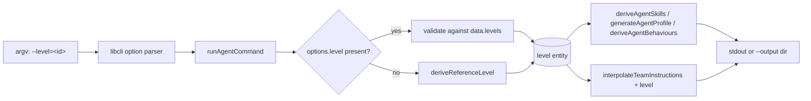
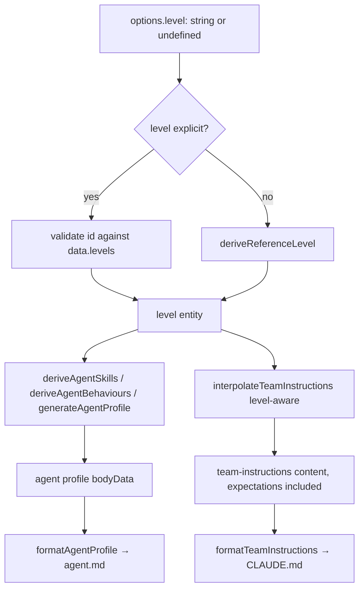

# Design 910-a — Pathway `agent` `--level` Flag

## Architectural Intent

Surface a single calibration knob — the engineering level — on the
`fit-pathway agent` command. Two of the three downstream effects are already
plumbed: `deriveAgentSkills` and `deriveAgentBehaviours` already accept a
`level` argument and already shape skill proficiencies and behaviour maturity
end-to-end. The third effect — the rendered team-instructions surface
reflecting `level.expectations` — is **not** plumbed today and is the seam this
design opens. The CLI surface is the entry point; an `expectations` thread
through the team-instructions interpolation is the new architectural element.

Validation and default resolution reuse existing library shapes verbatim.

## Components

| Component                    | Module                                   | Change                                                                                                                          |
| ---------------------------- | ---------------------------------------- | ------------------------------------------------------------------------------------------------------------------------------- |
| `agent` CLI definition       | `products/pathway/bin/fit-pathway.js`    | Add a `--level` option entry symmetric in shape with the existing `--track` entry on the same command                           |
| `runAgentCommand`            | `products/pathway/src/commands/agent.js` | Read `options.level`; when present, resolve against `data.levels`; when absent, fall through to the existing default-resolve    |
| Level validation             | same module                              | Reuse the existing `requireEntity` helper with `data.levels` and an "Available levels:" header — same shape as `--track`        |
| `deriveReferenceLevel`       | `libraries/libskill/src/agent.js`        | **Unchanged.** Remains the default path when `--level` is absent                                                                |
| Skills + behaviours threading| `libraries/libskill/src/agent.js`        | **Unchanged.** `generateAgentProfile`, `deriveAgentSkills`, `deriveAgentBehaviours` already accept and consume `level`          |
| Expectations threading       | `libraries/libskill/src/agent.js`        | **New.** `interpolateTeamInstructions` accepts `level` and emits `level.expectations` content alongside the existing template-var output |
| Help reflection              | libcli rendering                         | Implicit — adding the option entry surfaces it in `--help` automatically, in the same slot/shape as `--track`                   |
| Test fixture                 | `products/pathway/test/`                 | Pinned baseline anchoring SC2 byte-identity; the plan owns location and capture mechanics                                       |
| Guide cascade                | `agent-teams` + `organizational-context` | Each documents `--level` once in its profile-generation section with one invocation answering "when do I set this?"             |

Out of scope per spec: the `build-packs` command and the `agent-builder` web
page continue to call `deriveReferenceLevel` directly without a `--level`
surface.

## Data Flow

The skills/behaviours/proficiencies path remains as it is today; the new arrow
is `level → interpolateTeamInstructions → content`, which carries
`level.expectations` into the rendered CLAUDE.md.

## Key Decisions

| #  | Decision                                                                       | Alternative rejected                                                          | Why                                                                                                                                                              |
| -- | ------------------------------------------------------------------------------ | ----------------------------------------------------------------------------- | ---------------------------------------------------------------------------------------------------------------------------------------------------------------- |
| D1 | Option form `--level=<id>` symmetric with `--track`                            | Positional `<level>` matching sibling `job`/`interview`/`progress`            | Spec § Coherence note rejects positional: required-positional breaks today's invocation; sibling unification is a separate spec                                  |
| D2 | Resolve level inline in `runAgentCommand`; no new library export               | Extract `resolveAgentLevel(levels, idOrNull)` into `libskill/agent.js`        | Spec defers `build-packs` and the web surface; a library extraction would tempt callers the spec says to leave alone                                            |
| D3 | `deriveReferenceLevel` unchanged                                               | Refactor the default-resolution heuristic while touching the surface          | Spec § Out of scope: refactoring the default-resolution heuristic                                                                                               |
| D4 | Validate via existing `requireEntity`; `--level` lives in the same options block as `--track` | New level-specific validator; ad-hoc help-line emission                       | The shared helper produces the exact error shape SC3 specifies; colocation places `--level` in the same `--help` slot as `--track` (SC6)                       |
| D5 | Thread `level` into `interpolateTeamInstructions`; library composes expectations text into team-instructions content | Add an `expectations` field to `buildProfileBodyData` and extend `agent.template.md` | Spec § In scope names the **team-instructions / CLAUDE.md** as the surface that must reflect `level.expectations`; the persona's failure was byte-identical CLAUDE.md. Putting it in the agent profile body would solve a different surface |
| D6 | Two guides updated; no new guide created                                       | A single new "level calibration" guide                                        | Spec names those two guides as the documentation surface; a new guide would orphan the JTBD entry point                                                          |

## Error Shape Contract (SC3 / SC6)

`--level` rejection follows the same contract `--track` already produces:

- exit code: `1`
- stderr: `error: Unknown level: <value>`, blank line, `Available levels:`, one bulleted line per `data.levels[*].id`

D4 records the call-site decision; this section records the externally visible shape.

## Risks

- **Risk 1 — Default vs. explicit divergence.** If the default-resolution path
  ever returned a level whose `id` failed the explicit-path validation, the
  two branches would diverge. The risk is structurally absent: the default
  branch consumes the resolved entity directly, bypassing the id-based
  validation seam. The plan owns the verification.
- **Risk 2 — Expectations content shape.** `level.expectations` is an object
  whose key set is data-defined; the team-instructions output must remain
  stable when `expectations` is empty (older standards without the field) and
  reasonable when populated. The plan owns the rendering rules and a baseline
  fixture for the empty case.
- **Risk 3 — `agent --list` ambiguity.** Spec § In scope: `agent --list` does
  not prompt for a level. The architectural commitment is that the `--list`
  path is level-independent — `options.level` has no effect when `options.list`
  is set. The plan owns ordering.

— Staff Engineer 🛠️
