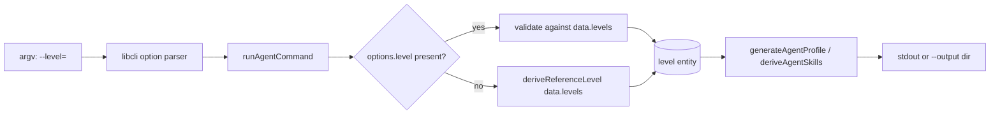

# Design 910-a — Pathway `agent` `--level` Flag

## Architectural Intent

Surface a single calibration knob — the engineering level — on the
`fit-pathway agent` command. The level already flows end-to-end inside
`libskill` (`deriveAgentSkills`, `generateAgentProfile`, `deriveAgentBehaviours`
all accept a `level` argument); the missing piece is a CLI binding that lets
the caller name which level to pass in. No new derivation logic, no new data
schema, no new threading paths.

The change lives at the **CLI/library boundary** — the seam between argv
parsing and the library's existing `level`-aware functions. Validation reuses
the same shape `--track` already uses; default resolution reuses the existing
`deriveReferenceLevel` library function unchanged.

## Components



| Component | Location | Change |
|---|---|---|
| `agent` CLI definition | `products/pathway/bin/fit-pathway.js` (options block, ~line 141) | Add `level: { type: "string", description: ... }` adjacent to existing `track:` entry |
| `runAgentCommand` | `products/pathway/src/commands/agent.js` (~line 254) | Read `options.level`; when present, resolve against `data.levels`; when absent, fall through to existing `deriveReferenceLevel(data.levels)` call (~line 306) |
| Level validation | `products/pathway/src/commands/agent.js` | Reuse existing `requireEntity` helper (~line 62) with `data.levels` and "Available levels:" header — same error shape as `--track` rejection |
| `deriveReferenceLevel` | `libraries/libskill/src/agent.js` (~line 37) | **Unchanged.** Default-resolution heuristic stays; only invoked when `--level` is absent |
| Library threading | `generateAgentProfile`, `deriveAgentSkills`, `deriveAgentBehaviours` | **Unchanged.** Already accept `level` as a parameter |
| Help reflection | libcli rendering from the options block | Implicit — adding the option entry surfaces it in `--help` automatically, same slot/shape as `--track` |
| Test fixture | `products/pathway/test/` (new fixture file) | Pinned baseline of today's output for a fixed `(discipline, track)` against `products/map/starter/` — anchors SC2 byte-identity |
| Guide cascade | `websites/fit/docs/products/agent-teams/index.md`, `.../organizational-context/index.md` | Each documents `--level` once in the profile-generation section with one invocation answering "when do I set this explicitly?" |

Out of scope per spec § Out of scope: `build-packs.js:219` and
`agent-builder.js:396` continue to call `deriveReferenceLevel` directly; this
design leaves both untouched.

## Data Flow

The level argument enters the existing pipeline at exactly one point — the
`level` local in `runAgentCommand` — and reaches everything else through the
existing call sites unchanged.

```
options.level (string|undefined)
        │
        ▼
  resolveAgentLevel  ◄── inline in runAgentCommand
        │            (no new module, no new export)
        ▼
   level entity ─────► deriveAgentSkills    ─► derived skills
                  └──► generateAgentProfile ─► profile + bodyData
                                                  │
                                                  └─► level.expectations
                                                      flows into bodyData
                                                      (derivation.js:336)
```

`interpolateTeamInstructions` does not take `level` — but the rendered
`CLAUDE.md` carries `level.expectations` via the profile body, satisfying SC1's
"`expectations` block of the rendered `CLAUDE.md`" condition through the
existing `buildProfileBodyData` path. No change needed in
`team-instructions.js`.

## Key Decisions

| # | Decision | Alternative rejected | Why |
|---|---|---|---|
| D1 | Option form `--level=<id>` symmetric with `--track` | Positional `<level>` matching sibling `job`/`interview`/`progress` | Spec § Coherence note explicitly rejects positional: required-positional breaks today's `agent <discipline> --track=<track>` invocation; sibling unification is a separate spec |
| D2 | Resolve level inline in `runAgentCommand`; no new library export | Extract `resolveAgentLevel(levels, idOrNull)` into `libskill/agent.js` | Spec defers `build-packs` and web (`agent-builder.js`); a library extraction would tempt callers that the spec says to leave alone. Inline keeps the change at one seam |
| D3 | `deriveReferenceLevel` unchanged | Refactor the default-resolution heuristic while touching the surface | Spec § Out of scope: "Refactoring the default-resolution heuristic" — its design is not under review here |
| D4 | Validate via existing `requireEntity` helper with `data.levels` | New level-specific validator | The helper already produces the exact error shape SC3 specifies (one error line, bulleted "Available …:" list, exit 1). Reusing it makes the `--track` / `--level` rejection paths byte-symmetric, supporting SC6 |
| D5 | Baseline fixture committed alongside test for SC2 | Compute today's output dynamically in the test | A pinned text file makes the byte-identity claim auditable across refactors and survives future starter-standard edits without silent baseline drift. The fixture pins the standard version at capture time |
| D6 | Two guides updated; no new guide created | A single new "level calibration" guide | Spec lists the two existing guides as the documentation surface. Both already speak to profile generation; a new guide would orphan the JTBD context |

## Error Shapes (mechanical contract for SC3 / SC6)

Both `--track` and `--level` rejection share one function. The contract is:

- exit code: `1`
- stderr line 1: `error: Unknown <field>: <value>`
- stderr blank line
- stderr line: `Available <field>s:` (one per item, bulleted)

For `--level`, `<field> = "level"` and items are `data.levels[*].id`.
This is what `requireEntity` already produces for `--track` and disciplines —
the design adds one call site, not one error shape.

## Help Output Slot (SC6)

The libcli command definition renders options under a single "Options:" block.
Placing `level:` in the same `options:` object as `track:` puts both under the
same heading with the same `--name=<type>` shape and a one-line description
each. No formatter change is needed; the slot is achieved by colocation in the
definition.

## Risks

- **Risk 1 — Hidden default-resolution mismatch.** If `deriveReferenceLevel`
  ever returned a level whose `id` is rejected by the new validation path, the
  default and explicit branches would diverge. Mitigation: the default branch
  bypasses validation entirely (it consumes the entity directly, not the id),
  so the divergence cannot happen by construction. The plan will assert this in
  a test that runs the default and the explicit-equivalent invocation and
  compares output byte-for-byte.
- **Risk 2 — `agent --list` ambiguity.** `--list` enumerates valid
  `(discipline, track)` pairs. Spec § In scope: `agent --list` does not prompt
  for a level. The design leaves the `listAgentCombinations` call path
  unchanged; `options.level` is simply ignored when `options.list` is present
  (the existing `if (options.list)` branch returns before any level resolution).

## Open Questions

None. The spec fixes scope tightly (one flag, one command); the design
adds exactly one CLI binding and one validation call.

— Staff Engineer 🛠️
