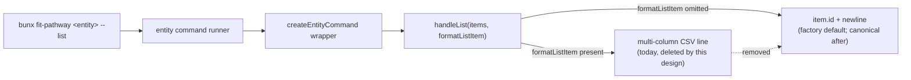

# Design 930 — Pathway `--list` Id-Only Normalisation

## Architecture

The factory `createEntityCommand` in
`products/pathway/src/commands/command-factory.js` already encodes the desired
behaviour as its **default** — `handleList` writes `item.id + "\n"` per item
whenever the optional `formatListItem` config is omitted. The published JSDoc
contract says exactly that: "Clean newline-separated list of IDs (for piping)".

Every entity command (level, discipline, track, behaviour, driver, skill)
overrides that default with a multi-column `formatListItem` and passes it
into the factory. The implementation diverges from the contract by **opt-in**,
not by accident — six explicit overrides, one per command.

This design **removes the six opt-ins**. The factory contract, its default
branch, and `handleList` stay exactly as they are. The change is deletion-led:
delete each `formatListItem` function and its `createEntityCommand` reference,
let the default win, then realign the surrounding summary-hint copy and the
guide example blocks to the new shape.



## Components

| Component | Where | Change |
|---|---|---|
| **Factory contract & default** | `products/pathway/src/commands/command-factory.js` — `createEntityCommand`, `handleList` | **No change.** The JSDoc already documents id-only output; the default branch already produces it. The optional `formatListItem` config stays available for future entities that legitimately want a different list shape (e.g. debug). |
| **`level.js` list override** | `products/pathway/src/commands/level.js` — `formatListItem` + factory reference | **Delete both.** The default `item.id` takes over. |
| **`discipline.js` list override** | `products/pathway/src/commands/discipline.js` — `formatListItem` (the lone in-tree caller of `isProfessional`/`validTracks` for list output) + factory reference | **Delete both.** |
| **`track.js` list override** | `products/pathway/src/commands/track.js` — `formatListItem` + factory reference | **Delete both.** |
| **`behaviour.js` list override** | `products/pathway/src/commands/behaviour.js` — `formatListItem` + factory reference | **Delete both.** |
| **`driver.js` list override** | `products/pathway/src/commands/driver.js` — `formatListItem` + factory reference | **Delete both.** |
| **`skill.js` list override** | `products/pathway/src/commands/skill.js` — `formatListItem` + factory reference | **Delete both.** (Skill's override returned `id, name, capability`; the surrounding `--agent` discovery hint at `skill.js:92` already shows the canonical `xargs … skill {} --json` idiom, which keeps working after the change.) |
| **Summary-hint copy (×5)** | `formatSummary` in `level.js`, `discipline.js`, `track.js`, `behaviour.js`, `driver.js` | Update the bullet that today reads "Run 'npx fit-pathway &lt;entity&gt; --list' for IDs and titles/names" so it advertises **"IDs"** only. `skill.js` already reads "for IDs" — leave it. |
| **Career Paths guide** | `websites/fit/docs/products/career-paths/index.md` (`level`, `discipline`, `track` example blocks at L29/L48/L66) | Replace the multi-column example output with the id-only shape. |
| **Define Role authoring guide** | `websites/fit/docs/products/authoring-standards/define-role/index.md` | Same: align `--list` example blocks to id-only. |
| **Agent Teams guide** | `websites/fit/docs/products/agent-teams/index.md` | Same. |
| **Derive Profile library guide** | `websites/fit/docs/libraries/integrate-standard/derive-profile/index.md` | Same. |
| **Engineers Getting Started** | `websites/fit/docs/getting-started/engineers/pathway/index.md` | Same. |
| **Site landing** | `websites/fit/index.md` | Same — single inline example. |
| **Breaking-change surfacing** | Implementation PR title + body | This repo uses GitHub Releases (auto-generated from merged PR titles) as its changelog — Pathway has no per-product `CHANGELOG.md`. The implementation PR title carries a Conventional-Commit `feat(pathway)!:` (the `!` marks the contract break) so it lands in the next `pathway@v0.x.y` release notes pre-formatted as a breaking change. The spec's "released CHANGELOG entry" requirement is satisfied by that PR title + body. |

## Interfaces

The factory contract is unchanged — same signature, same default behaviour:

```js
createEntityCommand({
  entityName, pluralName, findEntity, presentDetail,
  formatSummary, formatDetail,
  formatListItem,   // optional; omit to get id-only (now the convention)
  sortItems, validate, emojiIcon,
})
```

`handleList(items, formatListItem)` keeps its signature. The only behavioural
shift is at the **call site**: every entity command now omits `formatListItem`
rather than passing one in.

Test contract: `products/pathway/test/cli-command.test.js` currently asserts
the dispatch string (`level --list` routes to the level handler), not the
output shape. The id-only shape is observable through the command runner;
plan-level test scaffolding (kata-plan's responsibility) will assert one id
per line and zero commas, per the spec's verifiable criteria.

## Key Decisions

| Decision | Choice | Rejected alternative & why |
|---|---|---|
| **Where to make the change** | Delete the six `formatListItem` overrides; let the factory default win. | Rewrite each override body to `return item.id` — adds a one-line indirection that hides the contract behind six redundant functions. Deletion is the architecturally honest expression of "implementation diverged from contract; collapse the divergence." |
| **Whether to remove `formatListItem` from the factory** | **Keep it**, optional, default `item.id`. | Remove the option entirely. Rejected: closes the door on legitimate future variants (e.g. a hidden debug column for `--list --verbose`), and removing an exported config key is a wider API break than the spec scopes. The option being unused after this change is the desired state, not dead weight. |
| **Where descriptive columns live after** | The default (non-`--list`) `formatSummary` table — already the canonical human surface for every entity. | Add `--json`/`--format` for structured output. Rejected: explicit out-of-scope in the spec; a separate spec when programmatic consumers need (id, title) pairs. |
| **How summary-hint copy moves** | Per-command edit to each `formatSummary` bullet, naming "IDs" only. | Extract a shared `formatListHint(entityName)` helper. Rejected: one-line copy change in five files, factoring would obscure rather than clarify. |
| **Breaking-change surfacing channel** | Conventional-Commit `feat(pathway)!:` on the implementation PR title; the `!` flows into GitHub Release notes. | Add a `products/pathway/CHANGELOG.md` ad-hoc for this spec. Rejected: no product currently carries one (release notes are the channel); introducing a new convention for one spec is scope expansion. |
| **Whether to migrate `skill.js`'s `--agent`-discovery hint** | Leave as-is. | Update it. Rejected: the hint already uses the canonical `--list \| xargs … --json` idiom that works under both the current and new shapes — it never depended on column data. |

## Out of Scope (mirroring spec)

- Synthetic-data ordering observation from #875 (J060 → "Senior Manager"
  reading as inverted) — starter-data concern, not CLI architecture.
- `job/interview/progress/agent --list` — parameterised flow listings, not
  entity listings; their `createCompositeCommand` path is untouched.
- `--json` / `--format` for structured output — separate spec if needed.

## Risk & Mitigation

The single external risk is shell-script or agent scrapers that today parse
the comma-separated shape. The spec triaged the in-repo surface; for external
consumers, the breaking-change marker on the implementation PR title is the
only mitigation channel available pre-publication. Post-publication, the
factory contract that has always said "id-only" is the consumer's anchor —
the design closes the gap between published contract and shipped behaviour,
which is the only durable form of compatibility this CLI can offer.
