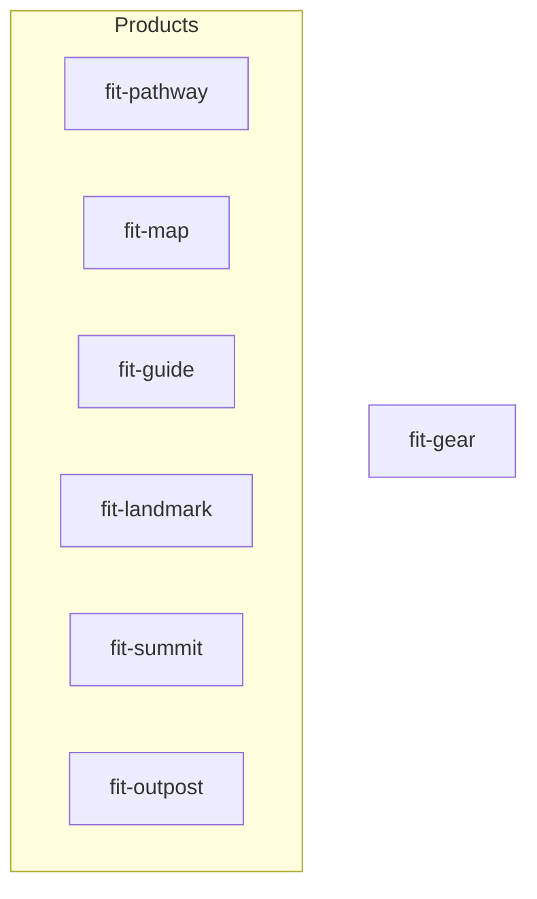

## Overview

The `forwardimpact/homebrew-tap` repository holds two package families: seven
Homebrew casks under `Casks/` — one per product and one shared `fit-gear`
bundle, installed on macOS — and seven matching formulae under `Formula/`,
installed on Linux. The `publish-binaries.yml` workflow's `tap` job builds and
uploads the release assets, then updates the affected cask and formula and
pushes the change directly to the tap's `main` — no pull request. Every other
field is human-edited in the tap repo and survives releases unchanged.

## Sed contract

Each release rewrites exactly two lines in the cask file (the formula's
per-arch contract is separate — see below). The `tap` job's
"Update cask and formula, push to tap main" step runs:

```sh
sed -i \
  -e "s|^  version \".*\"|  version \"${VERSION}\"|" \
  -e "s|^  sha256 \".*\"|  sha256 \"${SHA256}\"|" \
  "tap/Casks/${CASK}.rb"
```

The two-space indent and double-quoted value shape are load-bearing — the `sed`
patterns anchor on `^  version "` and `^  sha256 "`. Cask authors must preserve
this shape or the workflow's substitutions will silently miss.

All other authored fields — `url`, `name`, `desc`, `homepage`, `depends_on`,
`app`, `binary`, `livecheck`, `zap` — are never touched by the workflow.

## Linux formulae

Linux has no cask — Homebrew ignores casks there — so each bundle ships a
formula under `Formula/<token>.rb` beside its cask, in the same tap and under
the same token. A formula installs the bundle's per-architecture tarball
(`fit-<bundle>-linux-<arch>.tar.gz`), and its `install` runs
`bin.install Dir["*"]` because the tarball holds only the self-contained CLIs:

```ruby
class FitGear < Formula
  desc "Gear CLIs"
  homepage "https://www.forwardimpact.team"
  version "X.Y.Z"
  on_linux do
    on_intel do
      url ".../gear@v#{version}/fit-gear-linux-x64.tar.gz"
      sha256 "<x64>"
    end
    on_arm do
      url ".../gear@v#{version}/fit-gear-linux-arm64.tar.gz"
      sha256 "<arm64>"
    end
  end

  def install
    bin.install Dir["*"]
  end
end
```

The install command differs by platform. On macOS the documented command
installs the cask; on Linux it installs the formula:

```sh
brew install --cask <tap>/<bundle>   # macOS — unchanged
brew install <tap>/<bundle>          # Linux
```

The macOS `--cask` path is unchanged by this addition, and the formula is
`on_linux`-only. A bare `brew install <tap>/<bundle>` on macOS resolves to the
formula, which loads no macOS artifact and installs nothing — a fail-safe, not
a wrong install.

### Formula checksum contract

A cask carries one `sha256`, rewritten by the flat two-line `sed` above. A
formula carries two — one per architecture — identical in shape, so
`build/update-formula.sh` keys each `sha256` to the arch token (`linux-x64` or
`linux-arm64`) in the `url` line above it; the `on_intel` and `on_arm` stanzas
never cross-assign. The top-level `version` is rewritten in the same pass, and
each `url` picks up the new version through `#{version}` interpolation.

## Cask topology

Six product casks and one shared bundle. No `depends_on cask:` between them —
each is independently installable.



## Binary stanza mapping

Each cask exposes only the executables bundled in its own `.app`. This table is
the authoritative mapping between casks and the CLIs they place on `PATH`.

| Cask | Executables on PATH | Count |
| --- | --- | --- |
| `fit-pathway` | `fit-pathway` | 1 |
| `fit-map` | `fit-map` | 1 |
| `fit-guide` | `fit-guide` | 1 |
| `fit-landmark` | `fit-landmark` | 1 |
| `fit-summit` | `fit-summit` | 1 |
| `fit-outpost` | `fit-outpost` | 1 |
| `fit-gear` | `fit-svcgraph`, `fit-svcmcp`, `fit-svcpathway`, `fit-svctrace`, `fit-svcvector`, `fit-codegen`, `fit-terrain`, `fit-harness`, `fit-doc`, `fit-rc`, `fit-xmr`, `fit-storage`, `fit-logger`, `fit-svscan`, `fit-trace`, `fit-visualize`, `fit-query`, `fit-subjects`, `fit-process-graphs`, `fit-process-resources`, `fit-process-vectors`, `fit-search`, `fit-unary`, `fit-tiktoken`, `fit-download-bundle`, `fit-wiki` | 26 |

When a library or service CLI is added or removed, update
`build/cli-manifest.json` (the single source of truth for the build set, from
which `build-app-gear` now derives the gear bundle's membership) and the
`binary` stanzas in `Casks/fit-gear.rb` in the tap repo. Mark a long-running
service CLI — one whose `bin` starts a server rather than printing `--help` and
exiting — with `"server": true` so the native build still compiles, checksums,
uploads, and bundles it but its per-binary smoke gate skips execution (running
it would hang).

## Livecheck regex pattern

Each cask uses the `:github_releases` strategy with the cask's own download URL
as the source. A per-cask regex anchors to its tag prefix so that only matching
releases trigger a version bump:

```ruby
livecheck do
  url :url
  strategy :github_releases
  regex(/^pathway@v(\d+(?:\.\d+)+)$/i)
end
```

Each cask substitutes its own tag prefix (`pathway`, `map`, `guide`,
`landmark`, `summit`, `outpost`, `gear`).

The `^...$` anchors are essential — without them, a `map@v2.0.0` release would
also match `landmark@v2.0.0` on the shared monorepo releases page.

## App install path

All casks install their `.app` to a `Forward Impact/` subdirectory under
`/Applications/` rather than the top-level folder:

```ruby
app "fit-pathway.app", target: "Forward Impact/fit-pathway.app"
```

Binary stanzas reference this subdirectory:

```ruby
binary "#{appdir}/Forward Impact/fit-pathway.app/Contents/MacOS/fit-pathway"
```

Grouping keeps seven `.app` bundles visually together in Finder instead of
scattered among unrelated applications.

## Zap and uninstall paths

Each cask declares a `zap trash:` stanza that removes its preferences plist on
`brew zap`:

| Cask | Zap path |
| --- | --- |
| `fit-pathway` | `~/Library/Preferences/team.forwardimpact.pathway.plist` |
| `fit-map` | `~/Library/Preferences/team.forwardimpact.map.plist` |
| `fit-guide` | `~/Library/Preferences/team.forwardimpact.guide.plist` |
| `fit-landmark` | `~/Library/Preferences/team.forwardimpact.landmark.plist` |
| `fit-summit` | `~/Library/Preferences/team.forwardimpact.summit.plist` |
| `fit-outpost` | `~/Library/Preferences/team.forwardimpact.outpost.plist` |
| `fit-gear` | `~/Library/Preferences/team.forwardimpact.gear.plist` |

## Verification commands

Before merging a tap PR that modifies cask or formula structure (not the
automated version/sha256 updates), run:

```sh
brew style Casks/*.rb
brew audit --new-cask Casks/{cask}.rb
brew audit Formula/{token}.rb
```

To dry-run the workflow's sed contract locally against a cask:

```sh
sed -i \
  -e "s|^  version \".*\"|  version \"9.9.9\"|" \
  -e "s|^  sha256 \".*\"|  sha256 \"$(printf 'test' | shasum -a 256 | awk '{print $1}')\"|" \
  "Casks/fit-pathway.rb"
```

On macOS, use `gsed` (GNU sed) instead of the default BSD `sed`, which requires
a backup suffix with `-i`.

## What's next

<div class="grid">

<!-- part:card:../operations -->

</div>
