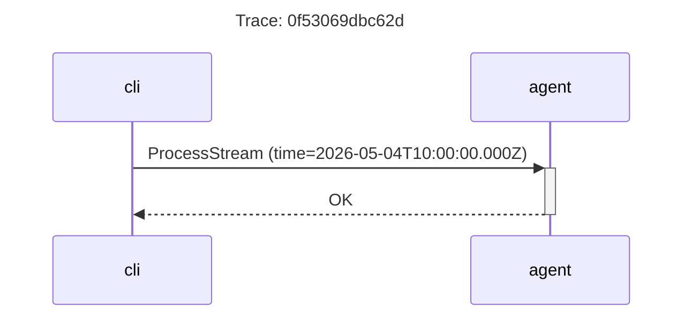

You need to log what a service is doing and trace operations across service
boundaries, but you do not want to configure a logging framework, pick a format,
or wire up an export pipeline. `@forwardimpact/libtelemetry` provides three
tools that work out of the box: a `Logger` that produces RFC 5424-formatted
lines, a `Tracer` that records spans to a trace service, and an `Observer` that
unifies both for gRPC operations. This page covers the bounded task of adding
observability to a service. For the full lifecycle setup, see
[Service Lifecycle](/docs/libraries/service-lifecycle/).

## Prerequisites

- Node.js 22+
- Install the library:

```sh
npm install @forwardimpact/libtelemetry
```

## Add a log line

Create a logger with a domain name and call `info`, `error`, or `debug`:

```js
import { createLogger } from "@forwardimpact/libtelemetry";
import { createDefaultRuntime } from "@forwardimpact/libutil/runtime";

const logger = createLogger("my-service", createDefaultRuntime());

logger.info("startup", "Server listening", { port: "3000" });
```

Expected output on stderr:

```text
INFO 2026-05-04T10:00:00.000Z my-service startup 42001 MSG001 [port="3000"] Server listening
```

The format follows RFC 5424:

```text
LEVEL TIMESTAMP DOMAIN APP_ID PROC_ID MSG_ID [ATTRIBUTES] MESSAGE
```

Each field is space-separated, making lines greppable. Attributes appear as
key-value pairs inside square brackets. When no attributes are provided, the
field is a single dash (`-`).

### Log levels

Control which methods print with the `LOG_LEVEL` environment variable:

| `LOG_LEVEL` | Methods that print                     |
| ----------- | -------------------------------------- |
| `error`     | `error`, `exception`                   |
| `info`      | `error`, `exception`, `info` (default) |
| `debug`     | all methods                            |

### Domain-scoped debug output

Enable debug output for specific domains without changing the global level:

```sh
DEBUG=my-service node server.js
```

Use comma-separated patterns and wildcards:

```sh
DEBUG=my-service,grpc:* node server.js
```

Use `DEBUG=*` to enable debug output for all domains.

### Log errors

Use `logger.exception` for caught errors — it logs the message at all levels
and appends the stack trace when debug output is enabled:

```js
logger.exception("db", err, { host: "localhost" });
```

## Add a trace span

The `Tracer` requires a trace service client and a gRPC metadata constructor.
Once configured, creating a span is a single call:

```js
import { Tracer } from "@forwardimpact/libtelemetry/tracer.js";

const tracer = new Tracer({
  serviceName: "my-service",
  traceClient,      // gRPC client for the trace service
  grpcMetadata,     // gRPC Metadata constructor
});

const span = tracer.startSpan("processRequest", {
  kind: "SERVER",
  attributes: { endpoint: "/api/data" },
});

try {
  const result = await handleRequest();
  span.addEvent("processing_complete", { items: String(result.count) });
  span.setOk();
} catch (err) {
  span.setError(err);
  throw err;
} finally {
  await span.end();
}
```

### Trace context propagation

When one service calls another, use `startClientSpan` for outgoing calls -- it
returns both the span and populated metadata:

```js
const { span, metadata } = tracer.startClientSpan("Vector", "QueryItems", {
  resource_id: "doc-123",
});

try {
  const response = await vectorClient.queryItems(request, metadata);
  span.setOk();
} catch (err) {
  span.setError(err);
  throw err;
} finally {
  await span.end();
}
```

For incoming calls, `startServerSpan` extracts trace context from the request
metadata:

```js
const span = tracer.startServerSpan(
  "Agent",
  "ProcessStream",
  call.request,
  call.metadata,
);
```

## Observe gRPC operations

The `Observer` class unifies logging and tracing for gRPC handlers:

```js
import { createObserver, createLogger } from "@forwardimpact/libtelemetry";
import { createDefaultRuntime } from "@forwardimpact/libutil/runtime";

const logger = createLogger("agent", createDefaultRuntime());
const observer = createObserver("Agent", logger, tracer);
```

Observe a server-side unary call:

```js
const response = await observer.observeServerUnaryCall(
  "ProcessRequest",
  call,
  async (call) => {
    // Your business logic here
    return { result: "done" };
  },
);
```

The observer:

1. Logs the incoming request at debug level.
2. Starts a `SERVER` span with trace context from gRPC metadata.
3. Runs your handler within the span context (for automatic parent propagation).
4. Logs the response and sets the span status to `OK`.
5. On error, logs the exception, sets the span status to `ERROR`, and enriches
   the error object with `trace_id` and `span_id` for correlation.

The same pattern works for streaming calls
(`observeServerStreamingCall`), outgoing unary calls
(`observeClientUnaryCall`), and outgoing streaming calls
(`observeClientStreamingCall`).

When no tracer is configured, the observer falls back to logging only -- no
spans are created, and the gRPC calls proceed without trace context. This means
you can add the observer first and wire up tracing later without changing your
handler code.

## Query and visualize recorded traces

Once spans are flowing into the trace index, `fit-visualize` reads them back and
renders them as Mermaid sequence diagrams. It is a filter-and-query tool: pipe a
[JMESPath](https://jmespath.org/) expression on stdin to select spans, and it
emits a diagram of the service interactions in those traces.

```sh
echo "[?name=='ProcessStream']" | npx fit-visualize
```

Pass an empty list expression to select every span, then narrow with a filter
flag:

```sh
echo "[]" | npx fit-visualize --trace 0f53069dbc62d
```

| Flag         | Effect                                                          |
| ------------ | -------------------------------------------------------------- |
| `--trace`    | Restrict to spans whose trace ID matches.                      |
| `--resource` | Restrict to spans whose resource ID matches.                   |

The JMESPath expression and the flags compose: the expression filters span
fields (`name`, `kind`, attributes), and the flags scope the query to a single
trace or resource. For example, select only client spans for one resource:

```sh
echo "[?kind==\`2\`]" | npx fit-visualize --resource common.Conversation.abc123
```

When `--resource` is set, every matching trace is combined into one diagram
titled by resource ID, with a note marking each trace boundary -- useful for
following one conversation across several requests. Without it, each trace
renders as its own diagram titled by trace ID.

The output is a fenced Mermaid block ready to paste into any Markdown renderer:



When no spans match the filter, the command prints
`No spans found matching the filter criteria.` instead of a diagram, so an empty
result is unambiguous rather than a blank diagram.

## What's next

<div class="grid">

<!-- part:card:.. -->
<!-- part:card:../manage-service -->

</div>
